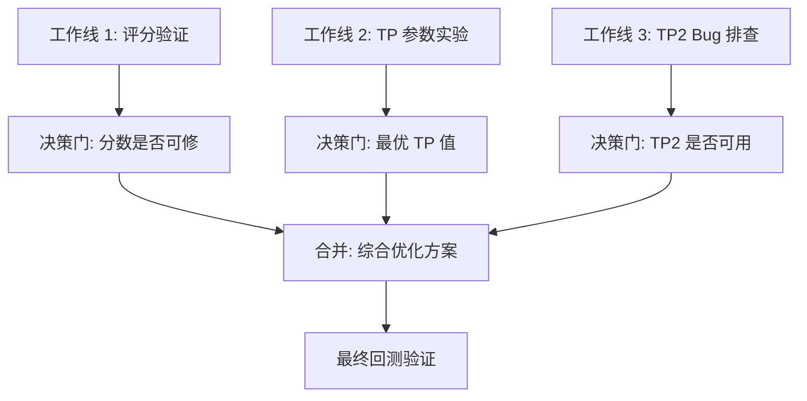

# 🎯 回测优化任务计划

> **范围**：BTC/ETH/SOL/BNB × 1h/4h（放弃 15m）
> **原则**：先诊断后改药，每步有数据验证

---

## 三条并行工作线



---

## 工作线 1：评分公式验证（诊断，不改代码）

### 目标
确认当前分数是否"反向指标"，以及新公式能否修复。

### 步骤

**1.1 从数据库提取原始数据**

从 `signals` 表提取 source='backtest' 的信号：

| 需要字段 | 来源 |
|----------|------|
| `pattern_score` | signals.pattern_score |
| `score` | signals.score |
| `pnl_ratio` | signals.pnl_ratio |
| `direction` | signals.direction |
| `symbol` | signals.symbol |
| `timeframe` | signals.timeframe |
| `entry_price` | signals.entry_price |
| `stop_loss` | signals.stop_loss |
| `tags_json` | signals.tags_json（含 EMA trend 信息）|

> [!NOTE]
> `signals` 表有 `pnl_ratio` 字段，可以直接做 score→pnl 相关性分析，不需要反推。

**1.2 精细分组分析**

把 score 按 0.05 间隔分成 20 档（0.50-0.55, 0.55-0.60, ... , 0.95-1.00），每档统计：
- 信号数量
- 胜率（pnl_ratio > 0 的比例）
- 平均 pnl_ratio
- 中位数 pnl_ratio

**期望看到的结果**：
- 如果是反向指标：高分组胜率持续 < 低分组 → 评分公式有害
- 如果是噪音：各分组胜率随机波动 → 评分公式无用
- 如果是正向指标：高分组胜率 > 低分组 → 之前的聚合统计有误

**1.3 拆解评分成分**

从 `tags_json` 或 `position_close_events` 中提取 wick_ratio、body_ratio 等原始数据（如果存储了），单独分析每个成分与胜率的关系：

| 成分 | 假设 | 验证方法 |
|------|------|---------|
| wick_ratio | 0.65-0.75 最优 | 分组胜率 |
| body_ratio | 越小越好？ | 分组胜率 |
| atr_ratio | 0.5-1.5x 最优 | 分组胜率 |
| body_position | 越极端越好 | 分组胜率 |

> [!IMPORTANT]
> 如果 wick_ratio 和 body_ratio 没存在 signals 表中（大概率没有），则需要从 K 线数据反推。
> 方法：用 signals.kline_timestamp + symbol + timeframe 关联 klines 表，从 OHLC 重算。

**1.4 模拟新评分公式**

用 Python 脚本对每条历史信号重新打分（v2 公式），然后：
- 新分数与 pnl_ratio 的皮尔逊相关系数
- 新分数分组后的胜率分布
- 对比：v1 分数相关性 vs v2 分数相关性

**决策门**：
- 如果 v2 相关性 > 0.1 且方向正确 → 值得替换
- 如果 v2 相关性 ≈ 0 → 评分公式本身不是关键问题，聚焦 TP/SL
- 如果 v2 相关性 < 0 → v2 也不行，需要更深入研究

---

## 工作线 2：TP 参数实验（改参数，跑回测）

### 目标
找到当前策略的最优 TP 值。

### 实验矩阵

| 实验 | TP 目标 | tp_levels | tp_ratios | 假设 |
|------|---------|-----------|-----------|------|
| A（基准）| 1.5R | 1 | [1.0] | 当前配置，作为对比基准 |
| B | 1.2R | 1 | [1.0] | 提高触发率 |
| C | 1.0R | 1 | [1.0] | 激进提高触发率 |
| D | 1.0R + 2.5R | 2 | [0.6, 0.4] | 部分止盈 + trailing |

每个实验跑 **4 币种 × 2 周期 = 8 次回测**，共 32 次回测。

### 对比指标

| 指标 | 权重 | 为什么重要 |
|------|------|-----------|
| 总 PnL | 最高 | 直接反映盈利能力 |
| 胜率 | 高 | 交易者心理承受能力 |
| 最大回撤 | 高 | 风险控制 |
| 夏普比率 | 中 | 风险调整后收益 |
| 平均盈亏比 | 中 | 单笔质量 |

### 预期

| 实验 | 预期胜率 | 预期 EV | 理由 |
|------|---------|---------|------|
| A (1.5R) | ~38% | 负 | 当前数据已验证 |
| B (1.2R) | ~48% | 微正 | 降低 TP 提高触发率 |
| C (1.0R) | ~55% | 待验证 | 更高触发率但盈利空间小 |
| D (部分) | ~55% | 待验证 | TP1 提高胜率，TP2 贡献超额收益 |

> [!WARNING]
> 实验 D 依赖 TP2 能正常工作。如果工作线 3 发现 TP2 有 bug，D 的结果不可信。
> **建议先跑 A/B/C，等工作线 3 完成后再跑 D。**

---

## 工作线 3：TP2 Bug 排查

### 目标
确认 TP2 不触发是配置问题还是代码 bug。

### 排查路径

```
TP2 从未触发
├── 可能 1: tp_levels=1，根本没创建 TP2 订单 → 配置问题 ✅ (最可能)
├── 可能 2: TP2 订单创建了但价格太远永远不触发 → 配置问题
├── 可能 3: TP2 订单创建了但撮合逻辑有 bug → 代码问题
└── 可能 4: TP1 100% 平仓后 TP2 被 OCO 取消 → 逻辑正确
```

### 排查步骤

**3.1 确认 OrderManager.create_order_chain() 行为**

检查点：
- 当 `tp_levels=1, tp_ratios=[1.0]` 时，是否创建 TP2 订单？
  - 预期：不创建 → 当前行为正确，TP2=0 是正常的
- 当 `tp_levels=2, tp_ratios=[0.6, 0.4]` 时，是否创建 TP2 订单？

**3.2 检查 OCO 逻辑**

检查点：
- TP1 成交后，如果 `tp_ratios=[1.0]`（100% 平仓），TP2 是否被自动取消？
- OCO（One Cancels Other）逻辑在 `handle_order_filled()` 中是否正确？

**3.3 检查 MockMatchingEngine 对 LIMIT 订单的撮合**

检查点：
- TP 订单是 LIMIT 还是 MARKET？
- LIMIT 订单的撮合条件：`kline.high >= tp_price`（LONG）还是 `kline.low <= tp_price`（SHORT）？
- 是否有撮合价格计算 bug（如使用 open 而非 high/low）？

**3.4 构造最小复现**

用一个已知会触发 TP2 的 K 线序列，手动跟踪订单生命周期：
```
信号 → ENTRY 订单 → ENTRY 成交 → TP1/TP2/SL 创建 → K 线撮合 → TP1 成交 → TP2 状态？
```

**决策门**：
- 如果是配置问题（可能 1）→ 实验 D 需要手动设置 tp_levels=2
- 如果是代码 bug → 先修 bug 再跑实验 D
- 如果是 OCO 正确取消 → 只在双 TP 配置下有意义

---

## 依赖关系与执行顺序

```
                    ┌──────────────┐
                    │  工作线 1     │
                    │  评分验证     │  ← 可立即开始，纯分析
                    └──────┬───────┘
                           │ 结论
                           ▼
              ┌────────────────────────┐
              │ 是否需要改评分公式？      │
              │ 是 → 加入合并方案        │
              │ 否 → 跳过，聚焦 TP/SL   │
              └────────────────────────┘

   ┌──────────────┐          ┌──────────────┐
   │  工作线 2     │          │  工作线 3     │
   │  TP 实验 A/B/C│ ← 并行 → │  TP2 排查     │
   └──────┬───────┘          └──────┬───────┘
          │                         │
          │  ┌──────────────────────┘
          │  │ TP2 可用？
          ▼  ▼
   ┌──────────────┐
   │  实验 D       │ ← 依赖工作线 3
   │  部分止盈回测   │
   └──────┬───────┘
          │
          ▼
   ┌──────────────┐
   │  合并决策     │
   │  最优方案确定   │
   └──────────────┘
```

### 建议执行顺序

| 阶段 | 内容 | 耗时估计 |
|------|------|---------|
| **Phase 1** | 工作线 1（评分验证）+ 工作线 3（TP2 排查）并行 | 1-2h |
| **Phase 2** | 工作线 2 实验 A/B/C（TP 参数回测） | 30-60min（回测时间）|
| **Phase 3** | 根据 Phase 1 结果决定是否跑实验 D | 15min |
| **Phase 4** | 合并所有结论，输出最终优化方案 | 30min |

---

## ⏸️ 需要你确认

1. **这个计划 OK 吗？** 我准备按 Phase 1 → 4 的顺序执行
2. **回测执行方式**：是通过 API 触发回测，还是直接跑 Python 脚本？
3. **实验 C (TP=1.0R) 要不要做？** 1.0R 盈亏比 = 1:1，有些交易者觉得没意义，你怎么看？
