# 盯盘狗交易核心业务流程图

> **最后更新**: 2026-04-23
> **文档目的**: 梳理从交易所数据接收到订单执行的完整业务流程

---

## 📊 核心业务流程总览

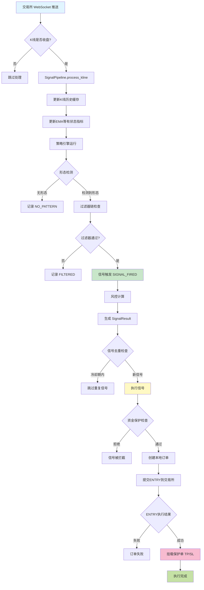

---

## 🔄 详细业务流程分解

### 1️⃣ 交易所数据接入层

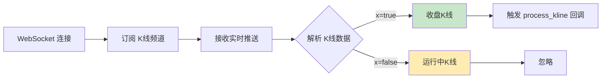

**关键逻辑**:
- **P0-1修复**: 优先使用交易所 `x` 字段判断收盘状态
- **时间戳推断**: 后备方案，检测时间戳变化
- **数据质量校验**: high ≥ open/close ≥ low

---

### 2️⃣ 信号处理管道 (SignalPipeline)

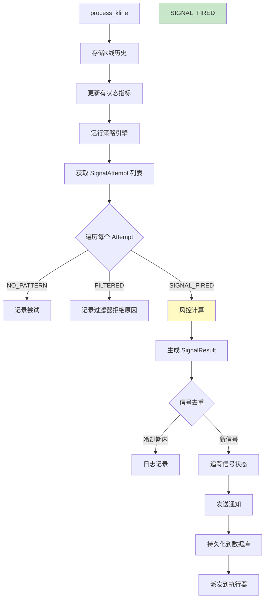

**核心职责**:
- **K线历史管理**: 缓存最近200根K线，用于多周期分析
- **热重载支持**: 配置更新时重建策略引擎
- **异步队列**: 批量持久化 SignalAttempt，避免阻塞
- **信号去重**: 基于时间窗口 + 评分覆盖机制

---

### 3️⃣ 策略引擎层 (StrategyEngine)

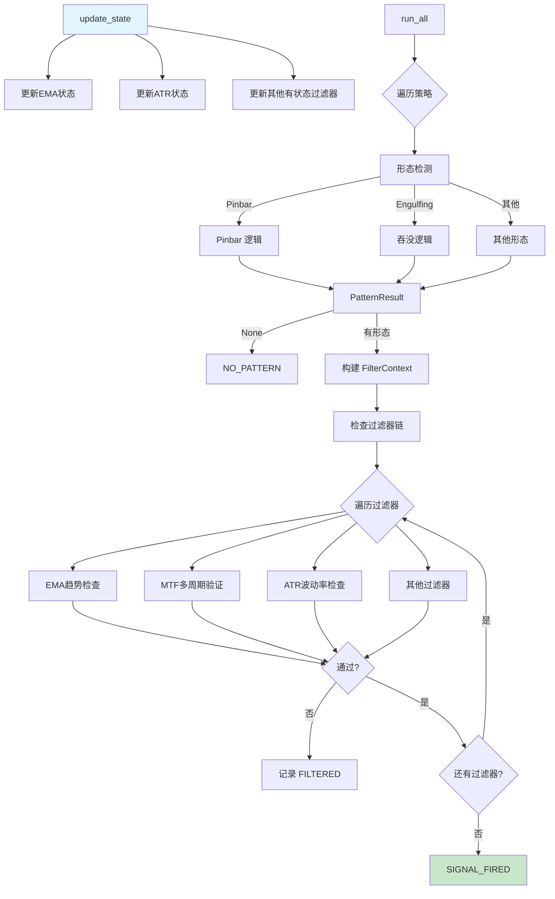

**核心组件**:
- **形态策略**: Pinbar, Engulfing, Doji 等
- **过滤器链**: EMA, MTF, ATR, Volume 等
- **短路评估**: 首个过滤器失败立即返回
- **统一评分**: `score = pattern_ratio × 0.7 + min(atr_ratio, 2.0) × 0.3`

---

### 4️⃣ 过滤器链 (Filter Chain)

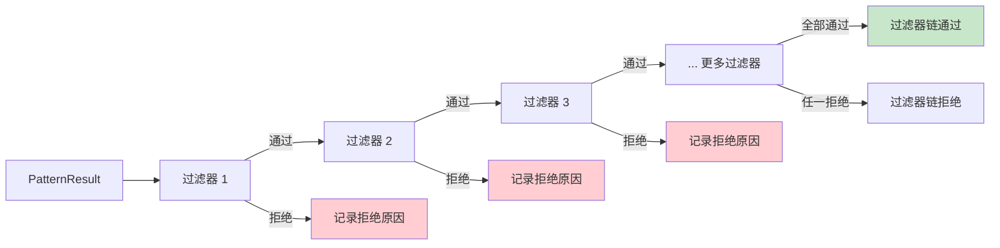

**常用过滤器**:
| 过滤器 | 作用 | 关键参数 |
|--------|------|----------|
| **EMA Trend** | 趋势方向过滤 | `period=60`, `min_distance_pct` |
| **MTF** | 多周期趋势确认 | `mtf_mapping={15m:1h, 1h:4h}` |
| **ATR** | 波动率过滤 | `min_atr_multiple=0.5` |
| **Volume** | 成交量放大检查 | `volume_threshold=1.5` |
| **Time** | 交易时段过滤 | `trading_hours` |

---

### 5️⃣ 风控计算层 (RiskCalculator)

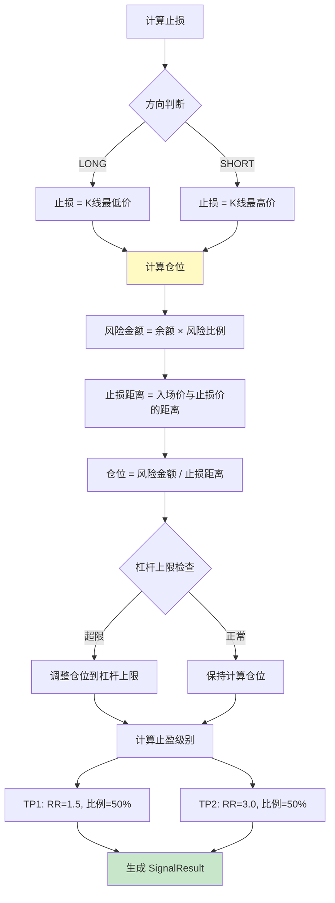

**核心公式**:
```
Position_Size = (Available_Balance × Max_Loss_Percent) / |Entry - Stop|

Leverage = ⌈(Position_Size × Entry_Price) / Available_Balance⌉

TP_Price = Entry ± (|Entry - Stop| × Risk_Reward)
```

**动态敞口控制**:
- 当前敞口 = Σ(持仓数量 × 入场价)
- 敞口比例 = 当前敞口 / 总余额
- 可用敞口 = max(0, max_total_exposure - 敞口比例)
- 风险金额 = min(基础风险, 可用敞口 × 余额)

---

### 6️⃣ 执行编排层 (ExecutionOrchestrator)

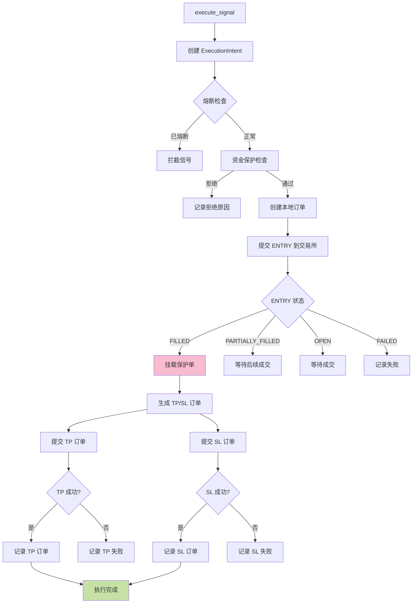

**关键状态**:
- **PENDING**: 初始状态
- **SUBMITTED**: 已提交交易所
- **PROTECTING**: ENTRY 成交，正在挂载保护单
- **COMPLETED**: 全部订单成功
- **FAILED**: 执行失败
- **BLOCKED**: 被拦截（资金保护/熔断）

---

### 7️⃣ 撮合引擎层 (MockMatchingEngine)

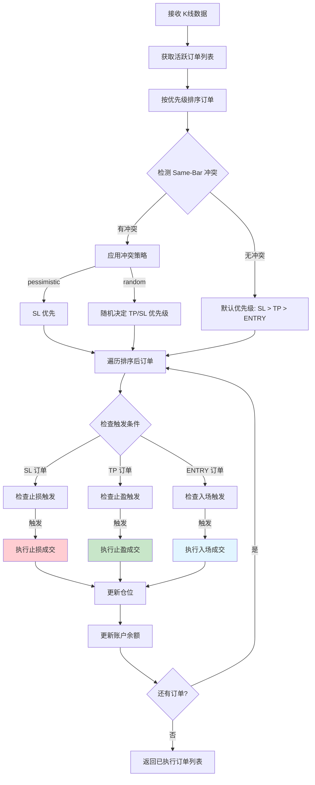

**撮合优先级规则**:
| 优先级 | 订单类型 | 说明 |
|--------|----------|------|
| **1 (最高)** | SL (止损) | 防守至上，止损单优先判定 |
| **2 (中等)** | TP (止盈) | 止盈单次优先级 |
| **3 (最低)** | ENTRY (入场) | 入场单最低优先级 |

**Same-Bar 冲突策略**:
- **pessimistic (悲观)**: SL 优先（默认，与旧行为一致）
- **random (随机)**: 随机决定 TP/SL 优先级，可配置 TP 优先概率

**滑点计算**:
```python
# ENTRY 滑点（市价单）
LONG:  exec_price = kline.open × (1 + slippage_rate)
SHORT: exec_price = kline.open × (1 - slippage_rate)

# TP 滑点（限价单）
LONG:  exec_price = tp_price × (1 - tp_slippage_rate)
SHORT: exec_price = tp_price × (1 + tp_slippage_rate)

# SL 滑点（止损单）
LONG:  exec_price = sl_price × (1 - slippage_rate)
SHORT: exec_price = sl_price × (1 + slippage_rate)
```

**盈亏计算**:
```python
# LONG 盈亏
gross_pnl = (exec_price - entry_price) × filled_qty

# SHORT 盈亏
gross_pnl = (entry_price - exec_price) × filled_qty

# 净盈亏
net_pnl = gross_pnl - fee_paid
```

---

### 8️⃣ 订单生命周期管理 (OrderLifecycleService)

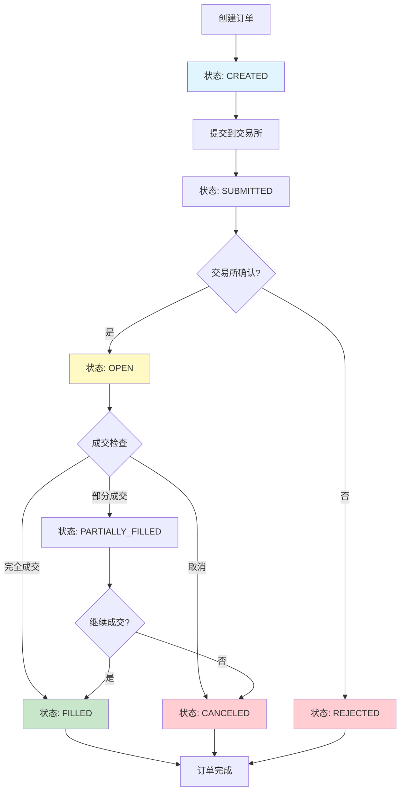

**状态转换规则**:
| 当前状态 | 允许转换 | 触发条件 |
|----------|----------|----------|
| CREATED | SUBMITTED, CANCELED | 提交交易所 / 用户取消 |
| SUBMITTED | OPEN, REJECTED, CANCELED | 交易所确认 / 拒绝 / 超时 |
| OPEN | PARTIALLY_FILLED, FILLED, CANCELED | 部分成交 / 完全成交 / 用户取消 |
| PARTIALLY_FILLED | FILLED, CANCELED | 剩余成交 / 用户取消 |

**审计日志记录**:
- 每次状态转换自动记录审计日志
- 包含：订单 ID、旧状态、新状态、事件类型、触发源、时间戳

---

### 9️⃣ 订单编排管理 (OrderManager)

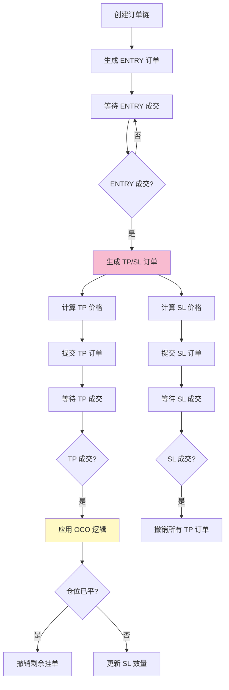

**TP/SL 价格计算**:
```python
# 止损价格（基于入场价和 RR 倍数）
LONG:  sl_price = entry_price × (1 - |rr_multiple| × 0.01)
SHORT: sl_price = entry_price × (1 + |rr_multiple| × 0.01)

# 止盈价格（基于入场价和止损价）
LONG:  tp_price = entry_price + rr_multiple × (entry_price - sl_price)
SHORT: tp_price = entry_price - rr_multiple × (sl_price - entry_price)
```

**OCO (One-Cancels-Other) 逻辑**:
- **TP 成交**:
  - 如果仓位已平（current_qty = 0）: 撤销所有剩余挂单
  - 如果仓位未平: 更新 SL 数量 = current_qty
- **SL 成交**: 撤销所有 TP 订单

---

### 🔟 保护单挂载机制

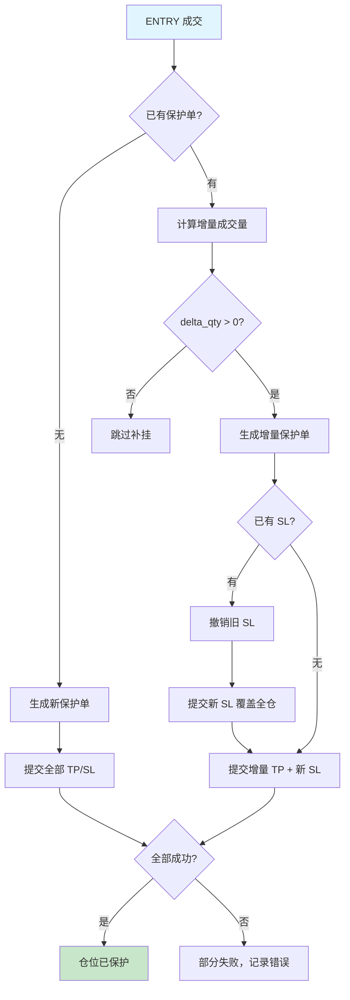

**保护单策略**:
- **TP 订单**: 分批止盈，按 `position_ratio` 分配数量
- **SL 订单**: 单一止损，覆盖全仓
- **增量补挂**: ENTRY 部分成交时，只为新增成交量补挂 TP
- **SL 替换**: 撤销旧 SL，创建新 SL 覆盖全仓

---

## 🔐 资金保护机制 (CapitalProtection)

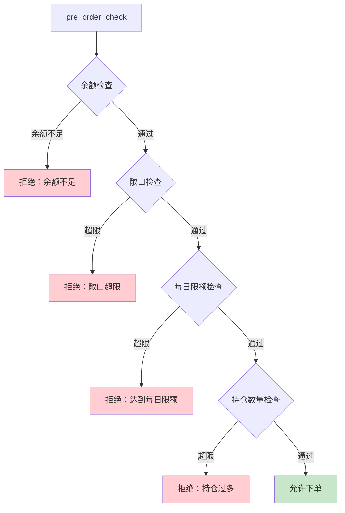

**保护规则**:
| 检查项 | 规则 | 错误码 |
|--------|------|--------|
| **余额检查** | `available_balance >= min_notional` | `INSUFFICIENT_BALANCE` |
| **敞口检查** | `total_exposure <= max_total_exposure` | `EXPOSURE_LIMIT_EXCEEDED` |
| **每日限额** | `daily_orders < max_daily_orders` | `DAILY_LIMIT_EXCEEDED` |
| **持仓数量** | `active_positions < max_positions` | `POSITION_LIMIT_EXCEEDED` |

---

## 🚨 熔断与恢复机制

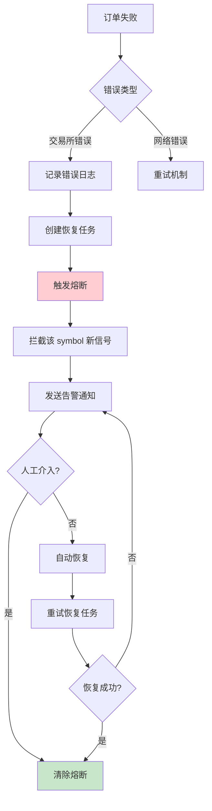

**熔断触发条件**:
- 撤销交易所 SL 订单失败
- 保护单挂载失败
- 连续订单失败次数超限

**恢复机制**:
- **PG 恢复表**: 记录待恢复任务
- **启动重建**: 从 PG 加载活跃恢复任务
- **自动重试**: 定时任务重试失败操作

---

## 📈 性能追踪与监控

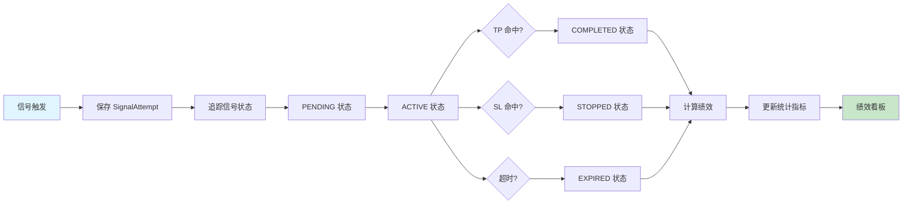

**绩效指标**:
- **胜率**: 盈利信号数 / 总信号数
- **盈亏比**: 平均盈利 / 平均亏损
- **最大回撤**: 历史最高点后的最大跌幅
- **夏普比率**: (收益率 - 无风险利率) / 波动率

---

## 🔧 关键技术细节

### Decimal 精度控制
```python
# ✅ 正确：使用 Decimal 进行金融计算
position_size = risk_amount / stop_distance
price = Decimal("42150.50")

# ❌ 错误：使用 float 导致精度丢失
position_size = float(risk_amount) / float(stop_distance)  # 禁止！
```

### asyncio 并发保护
```python
# 热重载时使用锁保护
async with self._runner_lock:
    self._runner = self._build_and_warmup_runner()
```

### WebSocket 去重机制
```python
# 基于 filled_qty 推进判断，避免重复处理
if filled_qty <= local_filled_qty and status == local_status:
    return None  # 跳过重复推送
```

---

## 📚 相关文档

- [系统架构规范](./arch/系统开发规范与红线.md)
- [v3.0 演进路线图](./v3/v3-evolution-roadmap.md)
- [订单生命周期管理](./arch/order-lifecycle.md)
- [风控系统设计](./arch/risk-management.md)

---

### 🔍 潜在隐患与优化建议

**1. K线驱动与时效性延迟**

- **现状**：流程图显示在 `1️⃣ 交易所数据接入层`，仅处理收盘 K 线（`x=true`）来触发后续流程。
- **隐患**：这意味着系统是一个纯粹的 Bar-On-Close 框架。在极端行情的加密货币市场中，等待 15 分钟或 1 小时线收盘再进场，可能会面临巨大的点差和滑点。
- **建议**：可以考虑在架构中预留“Tick 级内部触发”机制。即 K 线用于更新指标（EMA/ATR），但价格 Tick 变动可以用于内部的动态追踪止损（Trailing Stop）或特定极端形态的提前突破。

**2. 异步执行与数据库瓶颈**

- **现状**：`2️⃣ 信号处理管道` 中提到“异步队列：批量持久化 SignalAttempt，避免阻塞”。
- **隐患**：如果在极端波动下，信号量激增，PG（PostgreSQL）的并发写入可能会造成背压（Backpressure），导致 `DispatchExecutor` 获取信号的延迟。
- **建议**：在 `SendNotify` 和 `PersistSignal` 之间，引入类似 Redis 的内存中间件作为高频交易状态的缓冲，持久化操作可以完全退化为旁路后台任务。

**3. 热重载的锁粒度**

- **现状**：`async with self._runner_lock:` 保护热重载。
- **隐患**：如果在等待锁释放的期间，WebSocket 积压了大量数据包，解锁后可能会引发瞬间的计算洪峰。
- **建议**：可以采用双缓冲（Double Buffering）或指针切换的方式：在后台线程/协程中构建新的 `_runner`，构建完成后，只用原子操作（或极短的锁）切换引用，做到几乎零阻塞。

**4. 固化的信号评分公式**

- **现状**：`score = pattern_ratio * 0.7 + min(atr_ratio, 2.0) * 0.3`。
- **隐患**：这种硬编码的权重在长期回测中容易出现过拟合。
- **建议**：作为 PMS 系统的下一阶段演进，可以将这些权重参数提取到单独的配置文件或动态策略池中，便于后续引入机器学习模型或参数寻优算法来动态调整权重。

*本文档由 Claude Code 自动生成，基于代码分析整理*
