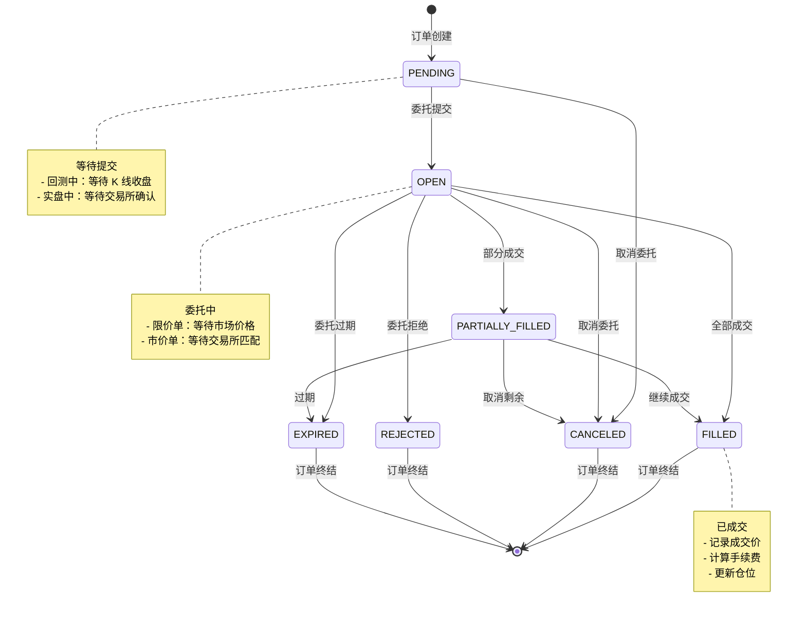
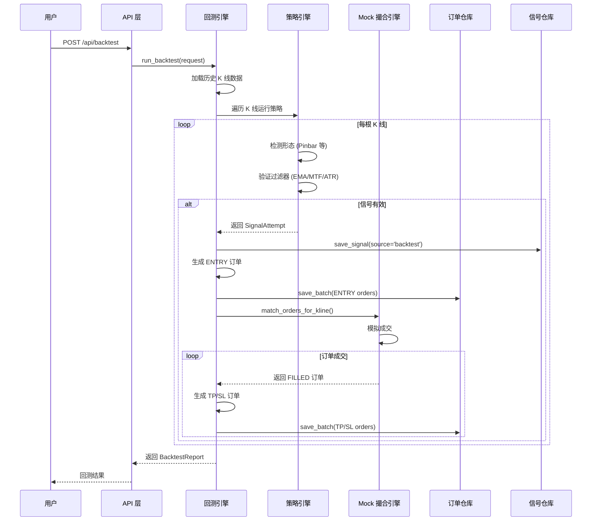
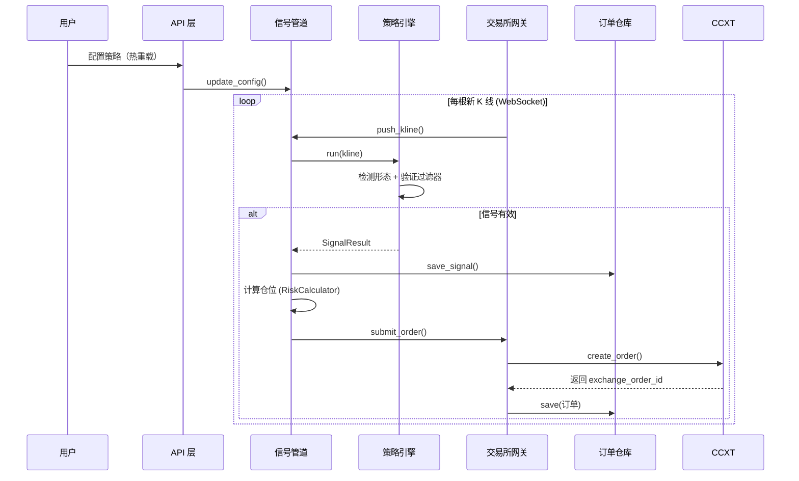

# 回测订单生命周期流程图

**文档版本**: v1.0  
**创建日期**: 2026-04-02  
**状态**: 已完成

---

## 一、订单状态流转图



---

## 二、订单创建时序图（回测模式）



---

## 三、订单创建时序图（实盘模式）



---

## 四、回测订单 vs 实盘订单对比

| 维度 | 回测订单 | 实盘订单 |
|------|----------|----------|
| **撮合方式** | MockMatchingEngine 模拟 | CCXT → 交易所真实撮合 |
| **成交价格** | K 线 OHLC 推算 | 交易所真实成交价 |
| **滑点模拟** | 固定比例 (默认 0.1%) | 实际市场滑点 |
| **成交速度** | 即时（本地计算） | 网络延迟 (50-500ms) |
| **数据源** | 本地 SQLite (已导入) | 交易所 WebSocket/REST |
| **订单 ID** | 本地生成 (ord_xxx) | 交易所订单号 + 本地 ID |
| **手续费** | 固定费率 (默认 0.04%) | 真实交易所费率 |
| **可回滚** | ✅ 可删除重测 | ❌ 真实交易不可逆 |
| **并发保护** | 无需 | 需要 (Asyncio Lock + DB 行锁) |

---

## 五、MTF 数据对齐说明

### 5.1 MTF 映射关系

| 主周期 | 高层周期 | 换算比例 |
|--------|----------|----------|
| 15m | 1h | 4:1 |
| 1h | 4h | 4:1 |
| 4h | 1d | 6:1 |
| 1d | 1w | 7:1 |

### 5.2 对齐算法

```
主周期 K 线: k15m_1, k15m_2, k15m_3, k15m_4, k15m_5, ...
高层周期 K 线: k1h_1,          k1h_2,          k1h_3, ...

对齐关系:
- k15m_1 ~ k15m_4 → k1h_1 (开盘时间 <= 15m K 线时间戳)
- k15m_5 ~ k15m_8 → k1h_2
- ...
```

### 5.3 代码示例

```python
# 获取对齐的 MTF 数据
main_klines, higher_tf_map = await data_repo.get_klines_aligned(
    symbol="BTC/USDT:USDT",
    main_tf="15m",
    higher_tf="1h",
    start_time=1704067200000,
    end_time=1706745600000,
)

# 在策略中使用
for kline in main_klines:
    higher_k = higher_tf_map.get(kline.timestamp)
    if higher_k:
        # 使用高层周期数据进行过滤
        ema_higher = ema_calculator.get_trend(higher_k)
```

---

## 六、订单生命周期节点详解

### 6.1 回测订单生命周期

| 节点 | 说明 | 记录字段 |
|------|------|----------|
| **1. 信号触发** | 策略在某根 K 线检测到形态 | `signal_id`, `strategy_name`, `kline_timestamp` |
| **2. 订单创建** | 生成 ENTRY 订单 | `order_id`, `order_role=ENTRY`, `requested_qty` |
| **3. 订单提交** | 提交给 Mock 撮合引擎 | `status=OPEN` |
| **4. 订单成交** | 模拟撮合成功 | `status=FILLED`, `filled_qty`, `average_exec_price`, `filled_at` |
| **5. TP/SL 生成** | 根据策略配置生成止盈止损单 | `parent_order_id`, `order_role=TP1/SL` |
| **6. TP/SL 成交** | 价格触发止盈或止损 | `status=FILLED`, `exit_reason=TP/SL` |
| **7. 订单终结** | 所有关联订单完成 | `is_closed=True` |

### 6.2 实盘订单生命周期

| 节点 | 说明 | 记录字段 |
|------|------|----------|
| **1. 信号触发** | 策略在实时 K 线检测到形态 | `signal_id`, `source='live'` |
| **2. 订单创建** | 计算仓位并生成订单 | `order_id`, `price`, `qty` |
| **3. 订单提交** | 调用 CCXT 提交到交易所 | `exchange_order_id` |
| **4. 订单确认** | 交易所返回确认 | `status=OPEN` |
| **5. 订单成交** | 交易所撮合成功 | `status=FILLED`, `average_exec_price` |
| **6. TP/SL 提交** | 设置真实止盈止损单 | `oco_group_id` |
| **7. 订单终结** | 仓位关闭 | `is_closed=True` |

---

## 七、API 端点索引

| 端点 | 方法 | 说明 |
|------|------|------|
| `/api/v3/backtest/reports` | GET | 回测报告列表 |
| `/api/v3/backtest/reports/{id}` | GET | 回测报告详情 |
| `/api/v3/backtest/reports/{id}` | DELETE | 删除回测报告 |
| `/api/v3/backtest/reports/{id}/orders` | GET | **回测订单列表** (新增) |
| `/api/v3/backtest/reports/{id}/orders/{order_id}` | GET | **订单详情** (新增) |
| `/api/v3/backtest/reports/{id}/orders/{order_id}` | DELETE | **删除订单** (新增) |

---

## 八、数据库表关系

```
┌─────────────────────┐
│ backtest_reports    │
│─────────────────────│
│ id (PK)             │◄────┐
│ strategy_id         │     │ (通过 strategy_id + 时间范围关联)
│ strategy_name       │     │
│ backtest_start      │     │
│ backtest_end        │     │
│ ...                 │     │
└─────────────────────┘     │
                            │
┌─────────────────────┐     │
│ signals             │     │
│─────────────────────│     │
│ id (PK)             │     │
│ signal_id (UNIQ)    │◄────┼────┐
│ strategy_name       │     │    │
│ created_at          │     │    │
│ source              │     │    │
│ ...                 │     │    │
└─────────────────────┘     │    │
                            │    │
┌─────────────────────┐     │    │
│ orders              │     │    │
│─────────────────────│     │    │
│ id (PK)             │     │    │
│ signal_id (FK)      │◄────┴────┘
│ order_role          │
│ order_type          │
│ status              │
│ ...                 │
└─────────────────────┘
```

---

*文档创建时间：2026-04-02*
