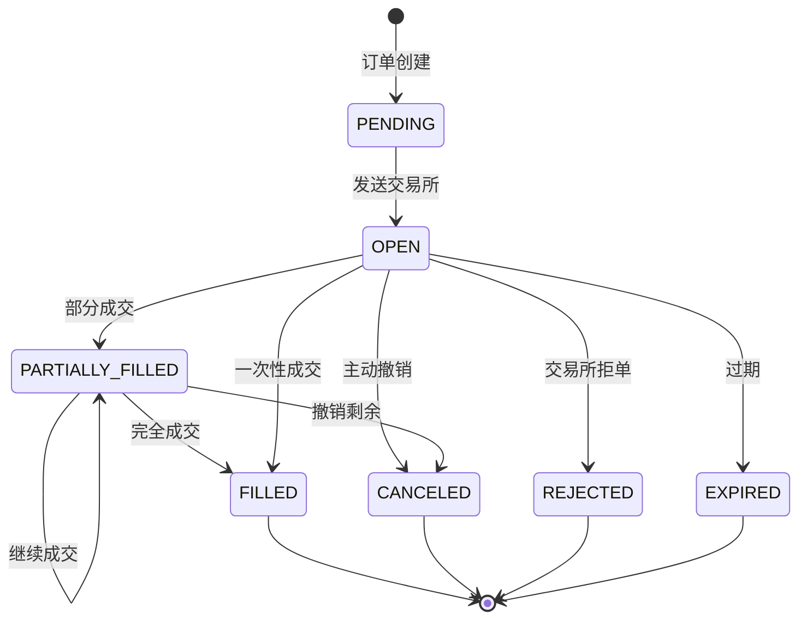
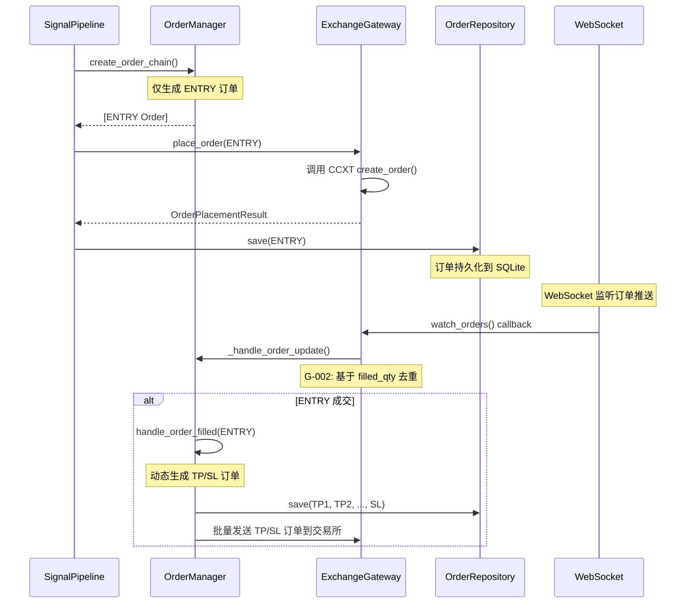
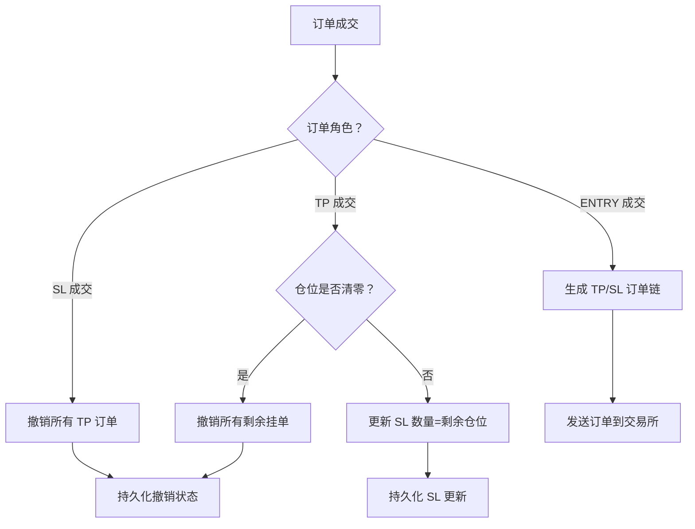
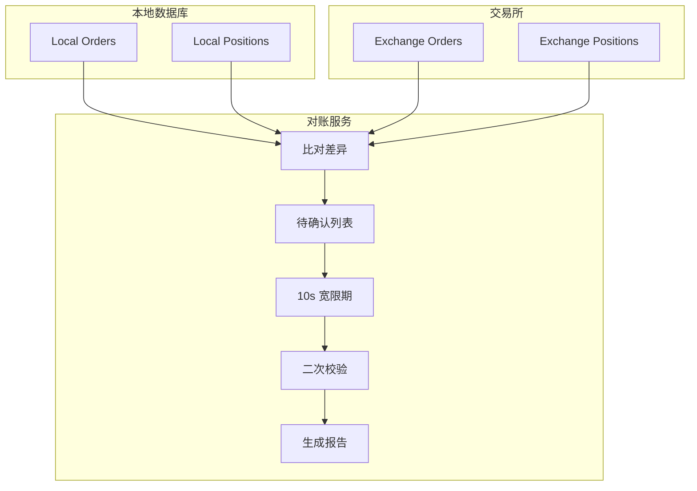

# 订单完整生命周期文档

> **版本**: v3.0 Phase 5
> **最后更新**: 2026-04-01
> **适用系统**: 盯盘狗 🐶 - 加密货币量化交易自动化系统

---

## 1. 订单状态流转图 (State Diagram)



### 1.1 状态枚举定义

**代码位置**: `src/domain/models.py:606-615`

```python
class OrderStatus(str, Enum):
    """订单状态（与 CCXT 对齐）"""
    PENDING = "PENDING"           # 尚未发送到交易所
    OPEN = "OPEN"                 # 挂单中
    PARTIALLY_FILLED = "PARTIALLY_FILLED"  # 部分成交
    FILLED = "FILLED"             # 完全成交
    CANCELED = "CANCELED"         # 已撤销
    REJECTED = "REJECTED"         # 交易所拒单
    EXPIRED = "EXPIRED"           # 已过期
```

### 1.2 状态流转触发条件

| 当前状态 | 目标状态 | 触发条件 |
|----------|----------|----------|
| PENDING | OPEN | `ExchangeGateway.place_order()` 成功调用 |
| OPEN | PARTIALLY_FILLED | WebSocket 推送 `filled > 0 && filled < amount` |
| OPEN | FILLED | WebSocket 推送 `filled == amount` |
| OPEN | CANCELED | `ExchangeGateway.cancel_order()` 成功调用 |
| OPEN | REJECTED | 交易所返回 `status='rejected'` |
| PARTIALLY_FILLED | FILLED | WebSocket 推送 `filled == amount` |
| PARTIALLY_FILLED | CANCELED | OCO 逻辑触发 / 用户主动撤销剩余 |

---

## 2. 订单创建流程

### 2.1 订单角色 (OrderRole)

**代码位置**: `src/domain/models.py:626-634`

```python
class OrderRole(str, Enum):
    """订单角色"""
    ENTRY = "ENTRY"               # 入场开仓
    TP1 = "TP1"                   # 第一目标位止盈
    TP2 = "TP2"                   # 第二目标位止盈
    TP3 = "TP3"                   # 第三目标位止盈
    TP4 = "TP4"                   # 第四目标位止盈
    TP5 = "TP5"                   # 第五目标位止盈
    SL = "SL"                     # 止损单
```

### 2.2 订单创建时序图



### 2.3 ENTRY 订单创建核心代码

**代码位置**: `src/domain/order_manager.py:93-143`

```python
def create_order_chain(
    self,
    strategy: OrderStrategy,
    signal_id: str,
    symbol: str,
    direction: Direction,
    total_qty: Decimal,
    initial_sl_rr: Decimal,
    tp_targets: List[Decimal],
) -> List[Order]:
    """
    创建订单链 - 仅生成 ENTRY 订单

    注意：TP/SL 订单将在 ENTRY 成交后，由 handle_order_filled() 动态生成
    理由：实盘场景中，ENTRY 订单由于滑点会导致实际开仓价 (average_exec_price) 偏离预期
         必须在 ENTRY 成交后，以实际开仓价为锚点计算 TP/SL 价格
    """
    current_time = int(datetime.now(timezone.utc).timestamp() * 1000)

    # 仅生成 ENTRY 订单
    entry_order = Order(
        id=f"ord_{uuid.uuid4().hex[:8]}",
        signal_id=signal_id,
        symbol=symbol,
        direction=direction,
        order_type=OrderType.MARKET,
        order_role=OrderRole.ENTRY,
        requested_qty=total_qty,
        status=OrderStatus.OPEN,
        created_at=current_time,
        updated_at=current_time,
        reduce_only=False,
    )

    return [entry_order]
```

### 2.4 关键决策点：为何 TP/SL 延迟生成？

| 原因 | 说明 |
|------|------|
| **滑点处理** | 实盘市价单成交价可能与预期价有偏差 |
| **价格锚点** | TP/SL 价格计算需要以 `average_exec_price` 为基准 |
| **RR 精度** | 止损 RR 倍数需要基于真实开仓价计算 |

---

## 3. WebSocket 订单推送处理

### 3.1 订单监听架构图

```mermaid
flowchart TD
    subgraph Exchange["交易所 (Binance/Bybit)"]
        WS[WebSocket Server]
    end

    subgraph Gateway["ExchangeGateway"]
        watch[watch_orders()]
        dedup[G-002 去重逻辑]
        callback[回调触发]
    end

    subgraph App["应用层"]
        OM[OrderManager]
        PM[PositionManager]
        OR[OrderRepository]
    end

    WS --> watch
    watch --> dedup
    dedup --> callback
    callback --> OM
    callback --> PM
    callback --> OR
```

### 3.2 G-002 去重逻辑

**问题描述**: 同一毫秒内多次 Partial Fill 推送会导致重复处理

**解决方案**: 基于 `filled_qty` 推进判断，而非时间戳

**代码位置**: `src/infrastructure/exchange_gateway.py:1226-1287`

```python
async def _handle_order_update(self, raw_order: Dict[str, Any]) -> Optional[Order]:
    """
    处理订单更新 - G-002 修复核心

    规则:
    - 基于 filled_qty 去重
    - 避免同一毫秒多次 Partial Fill 导致重复处理
    """
    order_id = str(raw_order.get('id', uuid.uuid4()))
    filled_qty = Decimal(str(raw_order.get('filled', 0)))

    # 检查本地状态
    local_state = self._order_local_state.get(order_id)
    if local_state:
        local_filled_qty = local_state.get('filled_qty', Decimal('0'))
        local_status = local_state.get('status', 'open')

        # 如果成交量未增加且状态未变化，跳过重复推送
        if filled_qty <= local_filled_qty and status == local_status:
            logger.debug(f"订单 {order_id} 重复更新：filled_qty={filled_qty}")
            return None  # 关键：返回 None 表示跳过

        # 异常情况：成交量减少
        if filled_qty < local_filled_qty:
            logger.warning(f"订单 {order_id} filled_qty 异常减少")

    # 更新本地状态
    self._order_local_state[order_id] = {
        'filled_qty': filled_qty,
        'status': status,
        'updated_at': timestamp,
    }

    # 构建 Order 对象
    return Order(...)
```

### 3.3 订单推送回调处理

**代码位置**: `src/domain/order_manager.py:182-239`

```python
async def handle_order_filled(
    self,
    filled_order: Order,
    active_orders: List[Order],
    positions_map: Dict[str, Position],
    strategy: Optional[OrderStrategy] = None,
    tp_targets: Optional[List[Decimal]] = None,
) -> List[Order]:
    """
    处理订单成交事件

    副作用:
    - ENTRY 成交：动态生成 TP 和 SL 订单
    - TP 成交：更新 SL 数量，执行 OCO 逻辑
    - SL 成交：撤销所有 TP 订单
    """
    new_orders = []

    if filled_order.order_role == OrderRole.ENTRY:
        # ENTRY 成交：动态生成 TP/SL 订单
        new_orders = self._generate_tp_sl_orders(
            filled_order, positions_map, strategy, tp_targets
        )
        for order in new_orders:
            await self._save_order(order)  # P5-011: 持久化

    elif filled_order.order_role in [OrderRole.TP1, ..., OrderRole.TP5]:
        # TP 成交：更新 SL 数量
        position = positions_map.get(filled_order.signal_id)
        if position:
            self._apply_oco_logic_for_tp(filled_order, active_orders, position)
        await self._save_order(filled_order)

    elif filled_order.order_role == OrderRole.SL:
        # SL 成交：撤销所有 TP 订单
        self._cancel_all_tp_orders(filled_order.signal_id, active_orders)
        await self._save_order(filled_order)

    return new_orders
```

---

## 4. 订单持久化时机

### 4.1 持久化触发点

| 时机 | 操作 | 代码位置 |
|------|------|----------|
| 订单创建 | `save(ENTRY)` | OrderManager.create_order_chain() |
| TP/SL 生成 | `save_batch([TP1, ..., SL])` | OrderManager.handle_order_filled() |
| 订单成交 | `save(filled_order)` | OrderManager.handle_order_filled() |
| 订单撤销 | `save(canceled_order)` | OrderManager._apply_oco_logic_for_tp() |
| 状态更新 | `update_status()` | OrderRepository.update_status() |

### 4.2 订单仓库实现

**代码位置**: `src/infrastructure/order_repository.py:128-169`

```python
async def save(self, order: Order) -> None:
    """
    保存或更新订单到数据库

    使用 INSERT OR REPLACE 实现 upsert
    """
    async with self._lock:
        await self._db.execute(
            """
            INSERT OR REPLACE INTO orders (
                id, signal_id, symbol, direction, order_type, order_role,
                price, trigger_price, requested_qty, filled_qty,
                average_exec_price, status, reduce_only, parent_order_id,
                oco_group_id, exit_reason, exchange_order_id,
                created_at, updated_at
            ) VALUES (?, ?, ?, ?, ?, ?, ?, ?, ?, ?, ?, ?, ?, ?, ?, ?, ?, ?, ?)
            """,
            (
                order.id, order.signal_id, order.symbol,
                order.direction.value, order.order_type.value,
                order.order_role.value,
                str(order.price) if order.price else None,
                str(order.trigger_price) if order.trigger_price else None,
                str(order.requested_qty), str(order.filled_qty),
                str(order.average_exec_price) if order.average_exec_price else None,
                order.status.value,
                1 if order.reduce_only else 0,
                order.parent_order_id, order.oco_group_id,
                order.exit_reason, order.exchange_order_id,
                order.created_at, order.updated_at,
            )
        )
        await self._db.commit()
```

### 4.3 数据库表结构

**代码位置**: `src/infrastructure/order_repository.py:66-88`

```sql
CREATE TABLE IF NOT EXISTS orders (
    id                  TEXT PRIMARY KEY,
    signal_id           TEXT NOT NULL,
    symbol              TEXT NOT NULL,
    direction           TEXT NOT NULL,
    order_type          TEXT NOT NULL,
    order_role          TEXT NOT NULL,
    price               TEXT,                    -- Decimal 精度
    trigger_price       TEXT,                    -- 条件单触发价
    requested_qty       TEXT NOT NULL,
    filled_qty          TEXT NOT NULL DEFAULT '0',
    average_exec_price  TEXT,                    -- 真实成交均价
    status              TEXT NOT NULL DEFAULT 'PENDING',
    reduce_only         INTEGER NOT NULL DEFAULT 0,
    parent_order_id     TEXT,                    -- 父订单 ID
    oco_group_id        TEXT,                    -- OCO 组 ID
    exit_reason         TEXT,                    -- 平仓原因
    exchange_order_id   TEXT,
    created_at          INTEGER NOT NULL,
    updated_at          INTEGER NOT NULL
);

-- 索引优化
CREATE INDEX idx_orders_signal_id ON orders(signal_id);
CREATE INDEX idx_orders_symbol ON orders(symbol);
CREATE INDEX idx_orders_status ON orders(status);
CREATE INDEX idx_orders_order_role ON orders(order_role);
CREATE INDEX idx_orders_parent_order_id ON orders(parent_order_id);
CREATE INDEX idx_orders_oco_group_id ON orders(oco_group_id);
```

---

## 5. OCO (One-Cancels-Other) 逻辑处理

### 5.1 OCO 规则说明

```
OCO 组：同一组的订单共享一个 oco_group_id

规则:
1. TP 和 SL 属于同一 OCO 组
2. 任一订单成交后，其他订单自动撤销
3. 部分成交后，SL 数量需要与剩余仓位对齐
```

### 5.2 OCO 执行流程图



### 5.3 TP 成交 OCO 逻辑

**代码位置**: `src/domain/order_manager.py:440-481`

```python
async def _apply_oco_logic_for_tp(
    self,
    filled_tp: Order,
    active_orders: List[Order],
    position: Position,
) -> None:
    """
    TP 成交后执行 OCO 逻辑

    规则:
    1. 如果 position.current_qty == 0: 撤销所有剩余挂单
    2. 如果 position.current_qty > 0: 更新 SL 数量 = current_qty
    """
    signal_id = filled_tp.signal_id
    current_time = int(datetime.now(timezone.utc).timestamp() * 1000)

    # 核心判定：基于仓位剩余数量
    if position.current_qty <= Decimal('0'):
        # 完全平仓：撤销所有剩余挂单
        for order in active_orders:
            if (
                order.signal_id == signal_id
                and order.status == OrderStatus.OPEN
                and order.order_role in [
                    OrderRole.TP1, ..., OrderRole.TP5, OrderRole.SL
                ]
            ):
                order.status = OrderStatus.CANCELED
                order.updated_at = current_time
                await self._save_order(order)  # 持久化
    else:
        # 部分平仓：更新 SL 数量与剩余仓位对齐
        sl_order = self._find_order_by_role(active_orders, OrderRole.SL, signal_id)
        if sl_order:
            sl_order.requested_qty = position.current_qty
            sl_order.updated_at = current_time
            await self._save_order(sl_order)  # 持久化
```

### 5.4 SL 成交 OCO 逻辑

**代码位置**: `src/domain/order_manager.py:483-507`

```python
async def _cancel_all_tp_orders(
    self,
    signal_id: str,
    active_orders: List[Order],
) -> None:
    """SL 成交后撤销所有 TP 订单"""
    current_time = int(datetime.now(timezone.utc).timestamp() * 1000)

    tp_roles = [OrderRole.TP1, ..., OrderRole.TP5]
    for order in active_orders:
        if (
            order.signal_id == signal_id
            and order.status == OrderStatus.OPEN
            and order.order_role in tp_roles
        ):
            order.status = OrderStatus.CANCELED
            order.updated_at = current_time
            await self._save_order(order)  # 持久化
```

---

## 6. 对账与孤儿订单处理

### 6.1 对账服务架构图



### 6.2 G-004 幽灵偏差修复

**问题描述**: REST API 和 WebSocket 之间存在时差，导致对账时出现临时差异

**解决方案**:
1. 发现差异后不立即判定为异常
2. 加入待确认列表 (pending)
3. 等待 10 秒宽限期
4. 二次校验差异是否仍然存在
5. 确认的差异才计入正式报告

**代码位置**: `src/application/reconciliation.py:96-110`

```python
async def run_reconciliation(self, symbol: str) -> ReconciliationReport:
    """
    启动对账服务 - G-004 修复

    流程:
    1. 获取本地仓位/订单列表
    2. 获取交易所仓位/订单列表
    3. 比对差异 → 加入 pending 列表（未确认）
    4. 等待 10 秒 Grace Period
    5. 二次校验 pending 列表
    6. 确认的差异 → 移动到正式列表
    7. 消失的差异 → 记录日志（WebSocket 延迟）
    """
    # 阶段 1: 获取状态
    local_positions = await self._get_local_positions(symbol)
    exchange_positions = await self._get_exchange_positions(symbol)
    local_orders = await self._get_local_open_orders(symbol)
    exchange_orders = await self._get_exchange_open_orders(symbol)

    # 阶段 2: 比对差异，加入待确认列表
    pending_missing_positions = []
    pending_orphan_orders = []

    for ex_pos in exchange_positions:
        local_pos = self._find_position(local_positions, ex_pos.symbol)
        if local_pos is None:
            pending_missing_positions.append({
                "position": ex_pos,
                "found_at": int(time.time() * 1000),
                "confirmed": False
            })

    # 阶段 3: 宽限期后二次校验
    await self._verify_pending_items(pending_missing_positions, ...)

    # 阶段 4: 将确认的差异移动到正式列表
    missing_positions = [
        item["position"] for item in pending_missing_positions
        if item["confirmed"]
    ]

    # 阶段 5: 生成对账报告
    return ReconciliationReport(...)
```

### 6.3 孤儿订单处理策略

**代码位置**: `src/application/reconciliation.py:402-447`

```python
async def handle_orphan_orders(self, orphan_orders: List[OrderResponse]) -> None:
    """
    处理孤儿订单

    策略:
    - 如果是 TP/SL 订单且仓位不存在 → 取消
    - 如果是入场订单 → 保留并创建关联 Signal
    """
    for order in orphan_orders:
        if order.reduce_only:
            # 平仓单但没有对应仓位 → 取消
            logger.info(f"Canceling orphan TP/SL order: {order.order_id}")
            result = await self._gateway.cancel_order(
                order_id=order.exchange_order_id or order.order_id,
                symbol=order.symbol,
            )
        else:
            # 入场订单 → 保留，创建关联 Signal
            logger.info(f"Keeping orphan entry order: {order.order_id}")
            await self._create_missing_signal(order)
```

### 6.4 对账报告模型

**代码位置**: `src/domain/models.py:984-1019`

```python
class ReconciliationReport(FinancialModel):
    """对账报告响应"""
    symbol: str
    reconciliation_time: int
    grace_period_seconds: int

    # 仓位差异
    position_mismatches: List[PositionMismatch]
    missing_positions: List[PositionInfo]

    # 订单差异
    order_mismatches: List[OrderMismatch]
    orphan_orders: List[OrderResponse]

    # 对账结论
    is_consistent: bool
    total_discrepancies: int
    requires_attention: bool
    summary: str
```

---

## 7. 核心代码路径索引

| 功能模块 | 文件路径 | 关键类/方法 |
|----------|----------|-------------|
| 订单模型 | `src/domain/models.py` | `Order`, `OrderStatus`, `OrderRole`, `OrderType` |
| 订单编排 | `src/domain/order_manager.py` | `OrderManager.create_order_chain()`, `handle_order_filled()` |
| 订单执行 | `src/infrastructure/exchange_gateway.py` | `ExchangeGateway.place_order()`, `watch_orders()` |
| 订单去重 | `src/infrastructure/exchange_gateway.py` | `_handle_order_update()` (G-002 修复) |
| 订单持久化 | `src/infrastructure/order_repository.py` | `OrderRepository.save()`, `update_status()` |
| 对账服务 | `src/application/reconciliation.py` | `ReconciliationService.run_reconciliation()` |
| 孤儿订单 | `src/application/reconciliation.py` | `handle_orphan_orders()` |

---

## 8. 关键设计决策总结

### 8.1 订单链设计

| 特性 | 说明 |
|------|------|
| **延迟生成** | TP/SL 订单在 ENTRY 成交后动态生成，确保价格计算准确 |
| **关联追踪** | 通过 `parent_order_id` 追踪订单链关系 |
| **OCO 分组** | 通过 `oco_group_id` 实现互斥撤销 |

### 8.2 去重机制 (G-002)

| 问题 | 方案 |
|------|------|
| 同毫秒多次推送 | 基于 `filled_qty` 而非时间戳判断 |
| 状态重复更新 | 维护 `_order_local_state` 缓存 |
| 异常情况 | 成交量减少时记录警告日志 |

### 8.3 对账宽限期 (G-004)

| 问题 | 方案 |
|------|------|
| REST 与 WebSocket 时差 | 10 秒宽限期 + 二次校验 |
| 临时差异误报 | 差异消失记录为"WebSocket 延迟" |
| 真实异常确认 | 宽限期后差异仍存在才计入报告 |

### 8.4 精度保障

| 字段 | 类型 | 说明 |
|------|------|------|
| 价格 | `Decimal` | 避免浮点数精度误差 |
| 数量 | `Decimal` | 仓位计算精度保障 |
| 数据库存储 | `TEXT` | SQLite 存储 Decimal 字符串 |

---

## 9. 附录：完整订单生命周期示例

### 9.1 典型交易场景时序

```
时间线:
T0     → 策略检测到 Pinbar 形态，生成 Signal
T0+1ms → OrderManager.create_order_chain() 创建 ENTRY 订单
T0+2ms → ExchangeGateway.place_order() 发送市价单到交易所
T0+50ms → WebSocket 推送：ENTRY 订单 OPEN
T0+100ms → WebSocket 推送：ENTRY 订单 FILLED (average_exec_price=65000)
T0+101ms → OrderManager.handle_order_filled() 触发
T0+102ms → 基于实际开仓价 65000 计算 TP/SL 价格
T0+103ms → 生成 TP1 (66500), TP2 (68000), SL (64000) 订单
T0+104ms → 批量发送 TP/SL 订单到交易所
T0+105ms → 订单链持久化到 SQLite
... (持仓监控中) ...
T1     → WebSocket 推送：TP1 成交 50%
T1+1ms → OrderManager 更新 SL 数量 = 剩余 50%
T1+2ms → SL 订单持久化更新
... (继续监控) ...
T2     → WebSocket 推送：TP2 成交 50%
T2+1ms → 仓位清零，OCO 触发
T2+2ms → 撤销 SL 订单
T2+3ms → 订单链终结
```

### 9.2 数据库订单链示例

```sql
-- 查询完整订单链
SELECT id, order_role, status, requested_qty, filled_qty,
       price, trigger_price, average_exec_price,
       parent_order_id, oco_group_id
FROM orders
WHERE signal_id = 'sig_xxxxx'
ORDER BY created_at ASC;

-- 预期结果:
-- id          | order_role | status  | requested_qty | filled_qty | average_exec_price | parent_order_id | oco_group_id
-- ord_abc123  | ENTRY      | FILLED  | 1.0           | 1.0        | 65000              | NULL            | NULL
-- ord_tp1_xyz | TP1        | FILLED  | 0.5           | 0.5        | NULL               | ord_abc123      | oco_sig_xxxxx
-- ord_tp2_xyz | TP2        | FILLED  | 0.5           | 0.5        | NULL               | ord_abc123      | oco_sig_xxxxx
-- ord_sl_xyz  | SL         | CANCELED| 0.5           | 0.0        | NULL               | ord_abc123      | oco_sig_xxxxx
```

---

*文档结束*
