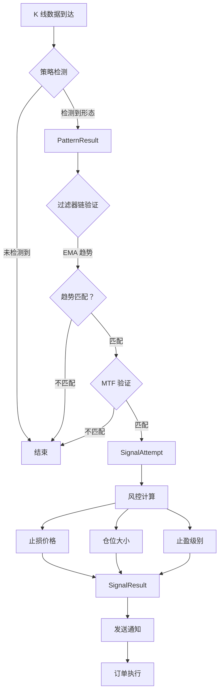
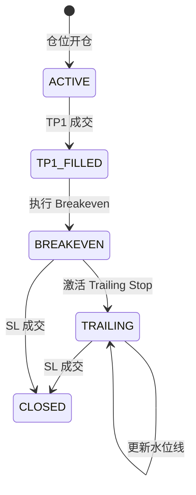

# 策略与风控完整文档

> **版本**: v3.0 Phase 5
> **最后更新**: 2026-04-01
> **适用系统**: 盯盘狗 🐶 - 加密货币量化交易自动化系统

---

## 目录

1. [策略引擎架构](#1-策略引擎架构)
2. [形态检测策略](#2-形态检测策略)
3. [过滤器系统](#3-过滤器系统)
4. [风控计算器](#4-风控计算器)
5. [动态风控管理器](#5-动态风控管理器)
6. [资金保护机制](#6-资金保护机制)
7. [配置管理](#7-配置管理)
8. [核心代码路径](#8-核心代码路径)

---

## 1. 策略引擎架构

### 1.1 系统分层

```
┌─────────────────────────────────────────────────────────────┐
│                    SignalPipeline (应用层)                    │
│  - 接收 K 线数据流                                            │
│  - 调用策略引擎检测形态                                        │
│  - 执行过滤器链验证                                           │
│  - 调用风控计算器计算仓位                                     │
│  - 生成 SignalResult                                         │
└─────────────────────────────────────────────────────────────┘
                              ↓
┌─────────────────────────────────────────────────────────────┐
│                   StrategyEngine (领域层)                    │
│  ┌─────────────────┐  ┌─────────────────┐                  │
│  │  PatternStrategy│  │   FilterBase    │                  │
│  │  (形态检测)      │  │   (过滤器)       │                  │
│  └────────┬────────┘  └────────┬────────┘                  │
│           ↓                     ↓                            │
│  ┌─────────────────┐  ┌─────────────────┐                  │
│  │   Pinbar        │  │  EmaTrendFilter │                  │
│  │   Engulfing     │  │  MtfFilter      │                  │
│  │   ...           │  │  AtrFilter      │                  │
│  └─────────────────┘  └─────────────────┘                  │
└─────────────────────────────────────────────────────────────┘
                              ↓
┌─────────────────────────────────────────────────────────────┐
│                  RiskCalculator (领域层)                     │
│  - 计算止损价格 (Stop Loss)                                  │
│  - 计算仓位大小 (Position Size)                              │
│  - 计算多级别止盈 (Take Profit Levels)                       │
│  - 生成风控报告 (Risk Info)                                  │
└─────────────────────────────────────────────────────────────┘
```

### 1.2 策略执行流程



### 1.3 统一评分公式

所有形态策略使用统一的评分公式，确保公平比较：

```python
score = pattern_ratio × 0.7 + min(atr_ratio, 2.0) × 0.3
```

| 参数 | 说明 | 范围 |
|------|------|------|
| `pattern_ratio` | 形态质量比例 | 0 ~ 1 |
| `atr_ratio` | K 线波幅 / ATR 值 | 0 ~ 2+ |

**评分解读**:
- `score < 0.5`: 低质量形态，建议忽略
- `0.5 ≤ score < 0.7`: 中等质量
- `score ≥ 0.7`: 高质量形态

---

## 2. 形态检测策略

### 2.1 Pinbar 策略

**代码位置**: `src/domain/strategy_engine.py:174-276`

#### 形态定义

| 类型 | 特征 | 方向 |
|------|------|------|
| 看涨 Pinbar | 长下影线，实体在顶部 | LONG |
| 看跌 Pinbar | 长上影线，实体在底部 | SHORT |

#### 检测参数

```python
PinbarConfig:
  - min_wick_ratio: 0.6       # 影线占比下限 (60%)
  - max_body_ratio: 0.3       # 实体占比上限 (30%)
  - body_position_tolerance: 0.1  # 实体位置容差
```

#### 检测逻辑

```python
# 1. 计算影线占比
wick_ratio = dominant_wick / candle_range

# 2. 计算实体占比
body_ratio = body_size / candle_range

# 3. 判定 Pinbar
is_pinbar = (wick_ratio >= 0.6) and (body_ratio <= 0.3)

# 4. 确定方向 (基于影线位置)
if dominant_wick == lower_wick and body_at_top:
    direction = Direction.LONG
else:
    direction = Direction.SHORT
```

#### 评分计算

```python
# Pinbar 使用影线占比作为形态质量
pattern_ratio = wick_ratio

# 如果有 ATR 值，加入波幅调整
if atr_value:
    atr_ratio = candle_range / atr_value
    score = (wick_ratio × 0.7) + (min(atr_ratio, 2.0) × 0.3)
else:
    score = wick_ratio
```

### 2.2 Engulfing 策略

**代码位置**: `src/domain/strategies/engulfing_strategy.py`

#### 形态定义

| 类型 | 前一根 K 线 | 当前 K 线 | 包覆条件 |
|------|------------|----------|----------|
| 看涨吞没 | 阴线 | 阳线 | `curr.open ≤ prev.close` 且 `curr.close ≥ prev.open` |
| 看跌吞没 | 阳线 | 阴线 | `curr.open ≥ prev.close` 且 `curr.close ≤ prev.open` |

#### 检测参数

```python
EngulfingStrategy:
  - max_wick_ratio: 0.6  # 最大影线比例 (过滤十字星)
```

#### 吞没比率计算

```python
engulfing_ratio = curr_body / prev_body

# 归一化到 0~1
pattern_ratio = 1.0 - 1.0 / (engulfing_ratio + 1.0)

# engulfing_ratio = 1 时，pattern_ratio = 0.5
# engulfing_ratio 越大，pattern_ratio 越接近 1
```

#### 过滤条件

```python
# 过滤零实体 (十字星)
if curr_body == 0 or prev_body == 0:
    return None

# 过滤影线过大的伪吞没
if curr_wick_ratio > max_wick_ratio:
    return None
```

---

## 3. 过滤器系统

### 3.1 过滤器接口

**代码位置**: `src/domain/filter_factory.py`

```python
class FilterBase(ABC):
    @property
    @abstractmethod
    def name(self) -> str:
        pass

    @property
    @abstractmethod
    def is_stateful(self) -> bool:
        pass

    @abstractmethod
    def update_state(self, kline, symbol, timeframe) -> None:
        """每根 K 线都调用，更新内部状态"""
        pass

    @abstractmethod
    def check(self, pattern, context) -> TraceEvent:
        """检测到形态后调用，返回验证结果"""
        pass
```

### 3.2 EMA 趋势过滤器

**代码位置**: `src/domain/filter_factory.py:127-200`

#### 状态管理

```python
EmaTrendFilterDynamic:
  - _ema_calculators: Dict[str, EMACalculator]  # key: "symbol:timeframe"
  - _period: int  # EMA 周期 (默认 60)
```

#### 趋势判定

```python
# bullish: K 线收盘价 > EMA 值
# bearish: K 线收盘价 < EMA 值

def check(self, pattern, context):
    if pattern.direction == Direction.LONG:
        # 看涨形态需要 EMA 趋势为 bullish
        if self.current_trend == TrendDirection.BULLISH:
            return TraceEvent(passed=True, reason="trend_match")
        else:
            return TraceEvent(passed=False, reason="trend_conflict")
    else:
        # 看跌形态需要 EMA 趋势为 bearish
        if self.current_trend == TrendDirection.BEARISH:
            return TraceEvent(passed=True, reason="trend_match")
        else:
            return TraceEvent(passed=False, reason="trend_conflict")
```

### 3.3 MTF (多周期) 过滤器

**代码位置**: `src/domain/filter_factory.py:203-280`

#### MTF 映射关系

| 当前周期 | 高一级周期 |
|----------|-----------|
| 15m | 1h |
| 1h | 4h |
| 4h | 1d |
| 1d | 1w |

#### 验证逻辑

```python
def check(self, pattern, context):
    higher_tf = self._get_higher_timeframe(context.current_timeframe)
    higher_trend = context.higher_tf_trends.get(higher_tf)

    if higher_trend is None:
        return TraceEvent(
            passed=True,
            reason="mtf_unavailable",
            metadata={"status": MtfStatus.UNAVAILABLE}
        )

    if higher_trend matches pattern.direction:
        return TraceEvent(
            passed=True,
            reason="mtf_confirmed",
            metadata={"status": MtfStatus.CONFIRMED}
        )
    else:
        return TraceEvent(
            passed=False,
            reason="mtf_rejected",
            metadata={"status": MtfStatus.REJECTED}
        )
```

### 3.4 ATR 动态过滤器

**代码位置**: `src/domain/filter_factory.py:283-350`

#### ATR 计算

```python
ATR = EMA(high - low, period=14)
```

#### 过滤逻辑

```python
def check(self, pattern, context):
    candle_range = kline.high - kline.low
    atr_ratio = candle_range / atr_value

    # K 线波幅至少达到 ATR 的 50%
    if atr_ratio < Decimal("0.5"):
        return TraceEvent(
            passed=False,
            reason="atr_filtered",
            expected="≥0.5 × ATR",
            actual=f"{atr_ratio:.2f} × ATR"
        )

    return TraceEvent(passed=True, reason="atr_confirmed")
```

---

## 4. 风控计算器

**代码位置**: `src/domain/risk_calculator.py`

### 4.1 核心公式

```
Position_Size = Risk_Amount / Stop_Distance

其中:
- Risk_Amount = Available_Balance × Max_Loss_Percent
- Stop_Distance = |Entry_Price - Stop_Loss| / Entry_Price
```

### 4.2 止损计算

```python
def calculate_stop_loss(kline, direction):
    if direction == Direction.LONG:
        # 看涨信号：止损设在 Pinbar 最低价
        stop_loss = kline.low
    else:
        # 看跌信号：止损设在 Pinbar 最高价
        stop_loss = kline.high

    return quantize_price(stop_loss)
```

### 4.3 仓位计算

**代码位置**: `src/domain/risk_calculator.py:80-171`

```python
def calculate_position_size(account, entry_price, stop_loss, direction):
    # Step 1: 计算当前总仓位暴露
    total_position_value = sum(
        pos.size * pos.entry_price for pos in account.positions
    )

    # Step 2: 计算当前暴露比率
    current_exposure_ratio = total_position_value / account.total_balance

    # Step 3: 计算可用暴露空间
    available_exposure = max(0, max_total_exposure - current_exposure_ratio)

    # Step 4: 计算基础风险金额
    base_risk_amount = account.available_balance * max_loss_percent

    # Step 5: 应用暴露限制（动态风险调整）
    exposure_limited_risk = account.available_balance * available_exposure
    risk_amount = min(base_risk_amount, exposure_limited_risk)

    # Step 6: 计算止损距离
    stop_distance = abs(entry_price - stop_loss)

    # Step 7: 计算仓位大小
    position_size = risk_amount / stop_distance

    # Step 8: 应用杠杆上限
    max_position_value = account.available_balance * max_leverage
    position_size = min(position_size, max_position_value / entry_price)

    return position_size, leverage_to_use
```

### 4.4 多级别止盈计算

**代码位置**: `src/domain/risk_calculator.py:209-258`

#### 止盈配置

```python
TakeProfitConfig:
  - enabled: True
  - levels: [
      TakeProfitLevel(id="TP1", position_ratio=0.5, risk_reward=1.5),
      TakeProfitLevel(id="TP2", position_ratio=0.5, risk_reward=3.0),
    ]
```

#### 计算公式

```python
def calculate_take_profit_levels(entry_price, stop_loss, direction):
    stop_distance = abs(entry_price - stop_loss)

    for level in levels:
        if direction == Direction.LONG:
            tp_price = entry_price + (stop_distance × level.risk_reward)
        else:  # SHORT
            tp_price = entry_price - (stop_distance × level.risk_reward)

        levels.append({
            "id": level.id,
            "position_ratio": str(level.position_ratio),
            "risk_reward": str(level.risk_reward),
            "price": str(quantized_price),
        })

    return levels
```

### 4.5 配置参数

**代码位置**: `src/domain/models.py:137-169`

```python
RiskConfig:
  - max_loss_percent: Decimal    # 单笔最大损失 (默认 1%)
  - max_leverage: int            # 最大杠杆倍数 (默认 10)
  - max_total_exposure: Decimal  # 最大总暴露 (默认 0.8 = 80%)
```

---

## 5. 动态风控管理器

**代码位置**: `src/domain/risk_manager.py`

### 5.1 核心职责

1. **Breakeven 推保护损**: TP1 成交后，将止损移至开仓价
2. **Trailing Stop**: 追踪高水位线，执行移动止盈
3. **阶梯频控**: 防止频繁更新止损单导致 API 限流

### 5.2 状态机流转



### 5.3 Breakeven 逻辑

**代码位置**: `src/domain/risk_manager.py:91-123`

```python
def _apply_breakeven(position, sl_order):
    # 触发条件：TP1 订单成交 AND SL 订单尚未变为 TRAILING_STOP

    # 1. 数量对齐：与剩余仓位对齐
    sl_order.requested_qty = position.current_qty

    # 2. 上移止损至开仓价
    sl_order.trigger_price = position.entry_price

    # 3. 激活移动追踪
    sl_order.order_type = OrderType.TRAILING_STOP

    # 4. 设置退出原因标记
    sl_order.exit_reason = "BREAKEVEN_STOP"
```

### 5.4 Trailing Stop 逻辑

**代码位置**: `src/domain/risk_manager.py:149-200`

#### 水位线更新

```python
def _update_watermark(kline, position):
    if position.direction == Direction.LONG:
        # LONG: 追踪最高价
        if kline.high > position.watermark_price:
            position.watermark_price = kline.high
    else:
        # SHORT: 追踪最低价
        if kline.low < position.watermark_price:
            position.watermark_price = kline.low
```

#### 移动止损计算

```python
def _apply_trailing_logic(position, sl_order):
    if position.direction == Direction.LONG:
        # LONG 仓位
        theoretical_trigger = watermark_price × (1 - trailing_percent)
        min_required_price = current_trigger × (1 + step_threshold)

        if theoretical_trigger >= min_required_price:
            sl_order.trigger_price = max(entry_price, theoretical_trigger)
    else:
        # SHORT 仓位
        theoretical_trigger = watermark_price × (1 + trailing_percent)
        min_required_price = current_trigger × (1 - step_threshold)

        if theoretical_trigger <= min_required_price:
            sl_order.trigger_price = min(entry_price, theoretical_trigger)
```

#### 配置参数

```python
DynamicRiskManager:
  - trailing_percent: Decimal('0.02')    # 默认 2% 回撤容忍
  - step_threshold: Decimal('0.005')     # 默认 0.5% 阶梯阈值
```

---

## 6. 资金保护机制

**代码位置**: `src/domain/models.py:1265-1340`

### 6.1 保护层级

| 层级 | 限制项 | 默认值 |
|------|--------|--------|
| 单笔交易 | 最大损失 | 2% of balance |
| 单笔交易 | 最大仓位 | 20% of balance |
| 每日 | 最大回撤 | 5% of balance |
| 每日 | 最大交易次数 | 50 次 |
| 账户 | 最低余额保留 | 100 USDT |
| 账户 | 最大杠杆 | 10x |

### 6.2 检查流程

```python
CapitalProtectionConfig:
  - enabled: True
  - single_trade: {
      "max_loss_percent": Decimal("2.0"),
      "max_position_percent": Decimal("20"),
    }
  - daily: {
      "max_loss_percent": Decimal("5.0"),
      "max_trade_count": 50,
    }
  - account: {
      "min_balance": Decimal("100"),
      "max_leverage": 10,
    }
```

### 6.3 检查结果

```python
OrderCheckResult:
  - allowed: bool               # 是否允许下单
  - reason: Optional[str]       # 拒绝原因代码
  - reason_message: Optional[str]  # 拒绝原因人类可读描述
  - single_trade_check: Optional[bool]
  - position_limit_check: Optional[bool]
  - daily_loss_check: Optional[bool]
  - daily_count_check: Optional[bool]
  - balance_check: Optional[bool]
```

---

## 7. 配置管理

### 7.1 策略配置

```python
StrategyConfig:
  - pinbar_config: PinbarConfig
  - trend_filter_enabled: bool
  - mtf_validation_enabled: bool
  - ema_period: int  # 默认 60
```

### 7.2 止盈配置

```python
TakeProfitConfig:
  - enabled: bool
  - levels: List[TakeProfitLevel]
    - id: str  # "TP1", "TP2", ...
    - position_ratio: Decimal  # 仓位比例
    - risk_reward: Decimal  # 盈亏比
```

### 7.3 风控配置

```python
RiskConfig:
  - max_loss_percent: Decimal  # 单笔最大损失
  - max_leverage: int  # 最大杠杆
  - max_total_exposure: Decimal  # 最大总暴露
```

---

## 8. 核心代码路径

### 8.1 策略引擎

| 组件 | 文件路径 |
|------|----------|
| 策略基类 | `src/domain/strategy_engine.py` |
| Pinbar 策略 | `src/domain/strategy_engine.py:174-276` |
| Engulfing 策略 | `src/domain/strategies/engulfing_strategy.py` |
| 指标计算 | `src/domain/indicators.py` |

### 8.2 过滤器系统

| 组件 | 文件路径 |
|------|----------|
| 过滤器基类 | `src/domain/filter_factory.py` |
| EMA 趋势过滤器 | `src/domain/filter_factory.py:127-200` |
| MTF 过滤器 | `src/domain/filter_factory.py:203-280` |
| ATR 过滤器 | `src/domain/filter_factory.py:283-350` |

### 8.3 风控系统

| 组件 | 文件路径 |
|------|----------|
| 风控计算器 | `src/domain/risk_calculator.py` |
| 动态风控管理器 | `src/domain/risk_manager.py` |
| 资金保护配置 | `src/domain/models.py:1265-1340` |
| 配置模型 | `src/domain/models.py:137-183` |

### 8.4 数据模型

| 模型 | 文件路径 |
|------|----------|
| SignalResult | `src/domain/models.py:92-113` |
| RiskConfig | `src/domain/models.py:137-169` |
| TakeProfitConfig | `src/domain/models.py:174-183` |
| PatternResult | `src/domain/models.py:193-198` |
| FilterResult | `src/domain/models.py:202-210` |

---

## 附录 A: 完整信号流程示例

### A.1 输入数据

```python
KlineData:
  - symbol: "BTC/USDT:USDT"
  - timeframe: "15m"
  - timestamp: 1712012400000
  - open: 70000
  - high: 70500
  - low: 69800
  - close: 70400
  - volume: 1234.56
```

### A.2 策略检测

```python
# Pinbar 检测结果
PatternResult:
  - strategy_name: "pinbar"
  - direction: Direction.LONG
  - score: 0.75
  - details: {
      "wick_ratio": 0.72,
      "body_ratio": 0.18,
      "body_position": 0.85,
    }
```

### A.3 过滤器验证

```python
# EMA 趋势过滤器
TraceEvent:
  - node_name: "ema_trend"
  - passed: True
  - reason: "trend_match"
  - expected: "bullish"
  - actual: "bullish"

# MTF 过滤器
TraceEvent:
  - node_name: "mtf"
  - passed: True
  - reason: "mtf_confirmed"
  - metadata: {"status": MtfStatus.CONFIRMED}
```

### A.4 风控计算

```python
SignalResult:
  - symbol: "BTC/USDT:USDT"
  - timeframe: "15m"
  - direction: Direction.LONG
  - entry_price: 70400
  - suggested_stop_loss: 69800
  - suggested_position_size: 0.25
  - current_leverage: 5
  - tags: [
      {"name": "EMA", "value": "Bullish"},
      {"name": "MTF", "value": "Confirmed"},
    ]
  - risk_reward_info: "Risk 1.00% = 176.00 USDT"
  - take_profit_levels: [
      {"id": "TP1", "position_ratio": "0.5", "risk_reward": "1.5", "price": 71300},
      {"id": "TP2", "position_ratio": "0.5", "risk_reward": "3.0", "price": 72200},
    ]
```

---

## 附录 B: 动态配置示例

### B.1 用户配置 (YAML)

```yaml
strategies:
  - id: "pinbar_ema_mtf"
    name: "Pinbar + EMA + MTF"
    type: "pinbar"
    triggers:
      - type: "pinbar"
        params:
          min_wick_ratio: 0.6
          max_body_ratio: 0.3
    filters:
      - type: "ema_trend"
        params:
          period: 60
          enabled: true
      - type: "mtf"
        params:
          enabled: true
    apply_to:
      - "BTC/USDT:USDT:15m"
      - "ETH/USDT:USDT:15m"

risk:
  max_loss_percent: 1.0
  max_leverage: 10
  max_total_exposure: 0.8

take_profit:
  enabled: true
  levels:
    - id: TP1
      position_ratio: 0.5
      risk_reward: 1.5
    - id: TP2
      position_ratio: 0.5
      risk_reward: 3.0

capital_protection:
  enabled: true
  single_trade:
    max_loss_percent: 2.0
    max_position_percent: 20
  daily:
    max_loss_percent: 5.0
    max_trade_count: 50
  account:
    min_balance: 100
    max_leverage: 10
```

---

*本系统仅为量化交易自动化工具，不构成任何投资建议。交易有风险，投资需谨慎。*
