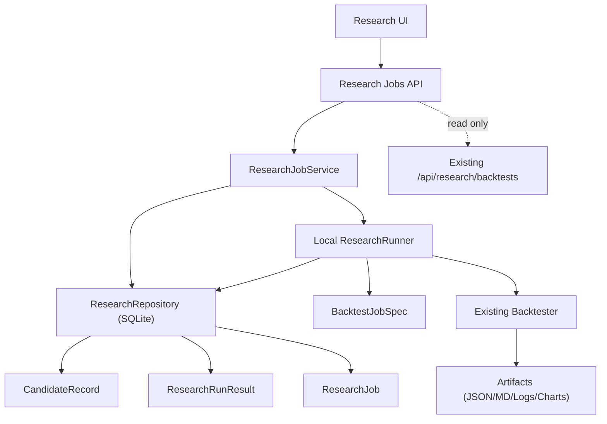

# 2026-04-27 Research Control Plane v1 详细设计

> 状态：设计封板中
> 范围：Research Control Plane v1
> 原则：research 独立于 runtime；candidate 独立于 runtime；研究输入是 spec，不是 runtime 配置入口

---

## 1. 设计目标

Research Control Plane v1 需要解决的问题：

1. 让用户可以从前端发起研究任务
2. 让研究任务有正式的 job 状态与结果对象
3. 让 research 结果能沉淀为 candidate
4. 保持 runtime / config / research 三条线不互相污染

---

## 2. 非目标

v1 不解决以下问题：

1. 不实现自动 promote runtime
2. 不实现全量 Optuna UI
3. 不实现复杂的策略可视化编排
4. 不重构现有全部回测脚本
5. 不要求 research 元数据必须上 PG
6. 不重写现有 `/api/backtest/*` 兼容端点
7. 不迁移 `signal_attempts`
8. 不把旧 `config_profiles` 重新包装成 research/runtime 配置入口

---

## 2.1 与现有回测链路的关系

当前代码中已有多条回测入口：

1. `POST /api/backtest/signals`
2. `POST /api/backtest/orders`
3. deprecated `POST /api/backtest`
4. `GET /api/research/backtests`
5. v3 backtest report 查询/归因端点

这些入口不直接承担 Research Control Plane v1 的产品职责。它们继续作为：

1. 历史兼容入口
2. engine/tooling 层 API
3. 测试与脚本复用入口

Research Control Plane v1 新增的 `/api/research/jobs/*` 是前端研究台主入口，负责：

1. job 生命周期
2. 状态查询
3. result/candidate 关联
4. research/runtime 边界保护

---

## 2.2 已校准的 Claude 回测链路报告

有效输入：

1. research list/readmodel 必须容忍历史脏数据
2. 同步阻塞式回测不适合作为研究台主入口
3. 研究台需要 job/status/result/candidate 工作流

过期输入：

1. 当前没有 `/api/backtest/run` 主入口
2. `BacktestRequest` 不是只有 `strategy_id`，已支持 `strategies / risk_overrides / order_strategy / fee_rate / slippage_rate`
3. 研究台 v1 不以“扩写旧 `/api/backtest/*`”为第一入口

---

## 3. 现有资产复用

### 可直接复用

1. `/Users/jiangwei/Documents/final/src/application/research_specs.py`
   - `BacktestJobSpec`
   - `OptunaStudySpec`
2. `/Users/jiangwei/Documents/final/src/application/backtester.py`
3. `/Users/jiangwei/Documents/final/src/application/readmodels/candidate_service.py`
4. `/Users/jiangwei/Documents/final/src/application/readmodels/runtime_backtests.py`
5. `/Users/jiangwei/Documents/final/src/interfaces/api_console_research.py`
6. `/Users/jiangwei/Documents/final/src/domain/models.py`
   - `BacktestRequest`
   - `BacktestReport`
   - `PMSBacktestReport`

### 需要新建

1. `ResearchJob` 元数据模型
2. `ResearchRunResult` 元数据模型
3. `CandidateRecord` 持久化模型
4. `ResearchJobService`
5. `ResearchRunner`
6. `ResearchRepository`（可用 SQLite）

### 核心骨架文件建议

| 文件 | 职责 | 是否 Codex 亲自实施 |
| --- | --- | --- |
| `src/domain/research_models.py` | Research control plane domain models | 是 |
| `src/application/research_control_plane.py` | Job service / runner contract / lifecycle | 是 |
| `src/infrastructure/research_repository.py` | SQLite metadata adapter | 是 |
| `src/interfaces/api_research_jobs.py` | `/api/research/jobs/*` API shell | 是 |
| `tests/unit/test_research_control_plane_*.py` | 边界和生命周期测试 | 可交 Claude 补齐 |

---

## 4. 逻辑架构



---

## 5. 数据边界

### Runtime 边界

以下对象不允许被 research control plane 写入：

1. `runtime_profiles`
2. `ResolvedRuntimeConfig`
3. `orders`
4. `execution_intents`
5. `positions`
6. `execution_recovery_tasks`

### Research 边界

research control plane 只允许写：

1. `research_jobs`
2. `research_run_results`
3. `candidate_records`
4. artifacts

并且这些写入必须发生在独立 research store 中，不写 runtime PG execution schema。

### Candidate 边界

candidate 的语义是：

1. 候选研究结果
2. 可比较
3. 可人工 review
4. 不会自动变成 runtime

---

## 6. 对象模型

### 6.1 ResearchSpec

统一抽象研究输入。

```python
class ResearchSpec(BaseModel):
    kind: Literal["backtest", "optuna"]
    name: str
    profile_name: str
    symbol: str
    timeframe: str
    start_time_ms: int
    end_time_ms: int
    limit: int = 9000
    mode: Literal["v3_pms"] = "v3_pms"
    costs: EngineCostSpec = Field(default_factory=EngineCostSpec)
    runtime_overrides: Optional[BacktestRuntimeOverrides] = None
    notes: Optional[str] = None
```

#### 说明

1. v1 只要求 `backtest`
2. `optuna` 不在 v1 API 开放，只在未来设计中预留
3. spec 只表达研究输入，不表达 runtime 切换
4. `runtime_overrides` 是 candidate-only override，不写 runtime DB

### 6.2 ResearchJob

```python
class ResearchJobStatus(str, Enum):
    PENDING = "PENDING"
    RUNNING = "RUNNING"
    SUCCEEDED = "SUCCEEDED"
    FAILED = "FAILED"
    CANCELED = "CANCELED"


class ResearchJob(BaseModel):
    id: str
    kind: Literal["backtest"]
    name: str
    spec_ref: str
    status: ResearchJobStatus
    run_result_id: Optional[str] = None
    created_at: str
    started_at: Optional[str] = None
    finished_at: Optional[str] = None
    requested_by: str = "local"
    error_code: Optional[str] = None
    error_message: Optional[str] = None
    progress_pct: Optional[int] = None
```

### 6.3 ResearchRunResult

```python
class ResearchRunResult(BaseModel):
    id: str
    job_id: str
    kind: Literal["backtest"]
    spec_snapshot: dict[str, Any]
    summary_metrics: dict[str, Any]
    artifact_index: dict[str, str]
    source_profile: Optional[str] = None
    generated_at: str
```

#### summary_metrics 最小字段

1. `total_return`
2. `max_drawdown`
3. `win_rate`
4. `total_trades`
5. `sharpe_ratio`
6. `sortino_ratio`

### 6.4 CandidateRecord

```python
class CandidateStatus(str, Enum):
    DRAFT = "DRAFT"
    REVIEWED = "REVIEWED"
    REJECTED = "REJECTED"
    RECOMMENDED = "RECOMMENDED"


class CandidateRecord(BaseModel):
    id: str
    run_result_id: str
    candidate_name: str
    status: CandidateStatus = CandidateStatus.DRAFT
    review_notes: str = ""
    applicable_market: Optional[str] = None
    risks: list[str] = []
    recommendation: Optional[str] = None
    created_at: str
    updated_at: str
```

### 6.5 PromoteDecision（预留）

```python
class PromoteDecision(BaseModel):
    id: str
    candidate_id: str
    decision: Literal["APPROVED", "REJECTED"]
    decided_at: str
    decided_by: str
    note: str = ""
```

> v1 只设计，不实现 UI/写路径。

---

## 7. 存储设计

### 7.1 元数据存储

推荐使用独立 SQLite，例如：

`data/research_control_plane.db`

原因：

1. 当前单机够用
2. 与 runtime PG 主线解耦
3. 方便快速落地

### 7.1.1 表结构草案

```sql
CREATE TABLE research_jobs (
    id TEXT PRIMARY KEY,
    kind TEXT NOT NULL CHECK (kind IN ('backtest')),
    name TEXT NOT NULL,
    spec_ref TEXT NOT NULL,
    status TEXT NOT NULL CHECK (status IN ('PENDING', 'RUNNING', 'SUCCEEDED', 'FAILED', 'CANCELED')),
    run_result_id TEXT,
    created_at TEXT NOT NULL,
    started_at TEXT,
    finished_at TEXT,
    requested_by TEXT NOT NULL DEFAULT 'local',
    error_code TEXT,
    error_message TEXT,
    progress_pct INTEGER,
    spec_json TEXT NOT NULL
);

CREATE TABLE research_run_results (
    id TEXT PRIMARY KEY,
    job_id TEXT NOT NULL,
    kind TEXT NOT NULL CHECK (kind IN ('backtest')),
    spec_snapshot_json TEXT NOT NULL,
    summary_metrics_json TEXT NOT NULL,
    artifact_index_json TEXT NOT NULL,
    source_profile TEXT,
    generated_at TEXT NOT NULL,
    FOREIGN KEY(job_id) REFERENCES research_jobs(id)
);

CREATE TABLE candidate_records (
    id TEXT PRIMARY KEY,
    run_result_id TEXT NOT NULL,
    candidate_name TEXT NOT NULL,
    status TEXT NOT NULL CHECK (status IN ('DRAFT', 'REVIEWED', 'REJECTED', 'RECOMMENDED')),
    review_notes TEXT NOT NULL DEFAULT '',
    applicable_market TEXT,
    risks_json TEXT NOT NULL DEFAULT '[]',
    recommendation TEXT,
    created_at TEXT NOT NULL,
    updated_at TEXT NOT NULL,
    FOREIGN KEY(run_result_id) REFERENCES research_run_results(id)
);
```

### 7.2 Artifact 存储

目录建议：

```text
reports/research_runs/
  {job_id}/
    spec.json
    result.json
    metrics.json
    stdout.log
    summary.md
    chart_*.png
```

### 7.3 不建议

1. v1 把 artifacts 全塞进数据库
2. v1 把 research job 直接写到 execution PG schema

---

## 8. API 设计

### 8.1 创建 backtest job

`POST /api/research/jobs/backtest`

请求：

```json
{
  "name": "eth-baseline-window-a",
  "profile_name": "backtest_eth_baseline",
  "symbol": "ETH/USDT:USDT",
  "timeframe": "1h",
  "start_time_ms": 1704067200000,
  "end_time_ms": 1711929600000,
  "runtime_overrides": {
    "strategy": {
      "allowed_directions": ["LONG"]
    }
  },
  "notes": "baseline verify"
}
```

响应：

```json
{
  "status": "accepted",
  "job_id": "rj_20260427_001",
  "job_status": "PENDING"
}
```

### 8.2 查询 jobs

`GET /api/research/jobs`

支持：

1. `status`
2. `kind`
3. `limit`
4. `offset`
5. `limit`

### 8.3 查询单个 job

`GET /api/research/jobs/{id}`

返回：

1. job 基本信息
2. 若已完成，附 `run_result_id`
3. 若失败，附 `error_code / error_message`

### 8.4 查询 run result

`GET /api/research/runs/{id}`

返回：

1. summary metrics
2. spec snapshot
3. artifacts index
4. baseline / source profile 信息

### 8.5 创建 candidate

`POST /api/research/candidates`

请求：

```json
{
  "run_result_id": "rr_20260427_001",
  "candidate_name": "eth-pinbar-candidate-a",
  "review_notes": "candidate for trend regime only"
}
```

### 8.6 查询 candidates

`GET /api/research/candidates`

### 8.7 查询 candidate detail

`GET /api/research/candidates/{id}`

### 8.8 更新 candidate review

`POST /api/research/candidates/{id}/review`

请求：

```json
{
  "status": "RECOMMENDED",
  "review_notes": "Only valid in trend continuation regime.",
  "risks": ["Fails in chop regime"],
  "recommendation": "Keep as candidate, do not promote before Sim-1 comparison."
}
```

### 8.9 禁止接口

v1 不提供：

1. `POST /api/research/candidates/{id}/promote`
2. 任何 runtime profile write endpoint
3. 任何 execution order/signal write endpoint

---

## 9. 执行模型

### 9.1 v1 任务调度

推荐：

1. API 创建 job
2. JobService 记录 `PENDING`
3. 本机 runner 启动任务
4. 更新 `RUNNING`
5. 调用现有 `BacktestJobSpec -> BacktestRequest -> Backtester`
6. 生成 result + artifacts
7. 更新 `SUCCEEDED / FAILED`

### 9.2 状态机约束

允许转移：

1. `PENDING -> RUNNING`
2. `PENDING -> CANCELED`
3. `RUNNING -> SUCCEEDED`
4. `RUNNING -> FAILED`
5. `RUNNING -> CANCELED`（v1 可预留，不强求）

禁止转移：

1. `SUCCEEDED -> RUNNING`
2. `FAILED -> RUNNING`
3. `CANCELED -> RUNNING`

### 9.3 Runner 错误语义

最小错误码：

| 错误码 | 含义 |
| --- | --- |
| `R-001` | spec validation failed |
| `R-002` | historical data unavailable |
| `R-003` | backtest engine failed |
| `R-004` | artifact write failed |
| `R-005` | unexpected runner error |

### 9.2 Runner 形式

v1 可选：

#### 方案 1：进程内 asyncio task

优点：

1. 简单
2. 开发快

缺点：

1. 长任务和 API 进程耦合

#### 方案 2：subprocess runner（推荐）

优点：

1. 更符合当前脚本化研究现状
2. 更容易隔离失败和日志
3. 后续升级成独立 worker 容易

缺点：

1. 需要多一层序列化和日志管理

### 9.3 推荐结论

> v1 优先采用 **subprocess runner**。

---

## 10. 前端模块设计

### 10.1 Research Home

显示：

1. 最近 runs
2. 最近 candidates
3. baseline 快捷入口
4. 新建回测按钮

### 10.2 New Backtest

表单包含：

1. strategy/spec 名称
2. symbol
3. timeframe
4. time window
5. runtime overrides
6. notes

### 10.3 Runs

列表显示：

1. job status
2. symbol / timeframe
3. time window
4. key metrics
5. created_at

### 10.4 Run Detail

显示：

1. spec snapshot
2. metrics summary
3. artifact links
4. create candidate 按钮

### 10.5 Candidates

列表显示：

1. candidate name
2. source run
3. review status
4. recommendation

### 10.6 Candidate Detail

显示：

1. metrics
2. review notes
3. risks
4. applicable market
5. reproduce info

---

## 11. 边界防护

### 必须保证

1. 研究输入不会写 runtime profile
2. job runner 不会触发 live execution
3. candidate 创建不会影响 runtime
4. research 页面不会调用 config profile 切换作为研究入口

### API 级防护建议

1. 研究写接口全部放在 `/api/research/*`
2. 禁止研究接口复用 `/api/config/profiles/*` 作为快捷入口
3. 响应体里加 source-of-truth hints：
   - `research_spec`
   - `source_profile`
   - `candidate_only`

---

## 12. 实施重点关注

### 12.1 可复现性

每次 run 必须能回答：

1. 用了哪个 profile
2. 用了哪些 overrides
3. 使用了哪个 commit
4. 生成了哪些 artifacts

### 12.2 错误可读性

失败任务必须可区分：

1. 参数错误
2. 数据缺失
3. runner 异常
4. backtester 异常

### 12.3 结果可信度

要避免前端只显示结果，不显示出处。

必须保留：

1. spec snapshot
2. metrics summary
3. raw artifact reference

### 12.4 与现有 Console Research 的关系

当前已有：

1. candidate 只读面
2. replay 只读面
3. backtests 列表只读面

v1 应采用策略：

1. **保留现有只读面**
2. 新增 research jobs / candidates 写路径
3. 逐步把“只读 research 页面”升级为“可发起 + 可沉淀”的 control plane

---

## 13. 推荐实施顺序

### Step 1

冻结对象模型与 API contract

### Step 2

建立 research job 元数据存储

### Step 3

建立 subprocess runner

### Step 4

接入现有 backtester / research_specs

### Step 5

实现 runs/candidates API

### Step 6

实现前端 6 个页面

### Step 7

做边界验收：

1. research 不污染 runtime
2. result 可复现
3. candidate 不会自动变 runtime

---

## 14. 验收标准

### v1 完成的标准

1. 可以从前端发起单次 backtest
2. job 有明确状态流转
3. run result 可查看
4. result 可保存并可追溯
5. result 可标记 candidate
6. candidate 不会自动影响 runtime

### v1 不要求的标准

1. 不要求研究任务分布式执行
2. 不要求 Optuna 前端化
3. 不要求自动发布 runtime

---

## 15. 最终判断

Research Control Plane v1 的成功，不取决于它是不是“已经像完整量化平台”，而取决于它能不能做到：

> **研究任务可发起、结果可追溯、candidate 可沉淀，而且 research/runtime 边界不会再次塌回去。**
