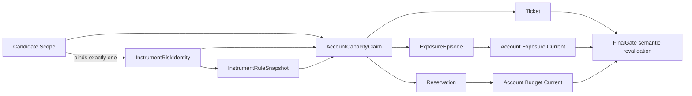

# Dual-Position Account Risk V0 Asset-Neutral Identity Extension

## 1. Decision Summary

**采用方案 A：扩展现有账户风险权威主链，不新增第二套风险引擎。**

本设计把以下未来扩展缝纳入 Dual-Position Account Risk V0：

```text
Candidate Scope
-> exact exchange_instrument_id
-> stable InstrumentRiskIdentity
-> versioned InstrumentRuleSnapshot
-> immutable AccountCapacityClaim
-> one Reservation + one Ticket + one ExposureEpisode
-> Account Exposure Current / Account Budget Current
-> FinalGate semantic revalidation
```

核心目标不是现在建设完整多资产交易系统，而是确保当前预算模型不会把
`symbol`、`crypto_usdm_perp`、可读 ID 前缀或当前交易规则误当作永久风险身份。

**本设计不改变 Owner 已确认的风险参数**：单 Ticket 计划止损风险 **2.5%**、
最多 **2** 个仓位、组合 open risk **6%**、单主风险簇 open risk **4%**、
initial margin **90%**、最大杠杆 **10x**、同一 instrument 不允许第二个新 Ticket。

本设计只授权书面设计收敛。它不授权业务代码修改、migration apply、部署、
生产政策激活、交易品种扩张或 exchange write。

## 2. 已知客观事实

以下事实来自 2026-07-15 当前工作分支
`codex/dual-position-account-risk-v0` 的跟踪代码与 migrations。

| 事实对象 | 当前实现 | 直接风险 |
| --- | --- | --- |
| **Candidate Scope 身份** | `brc_strategy_group_candidate_scope` 以 `strategy_group_id + symbol + side` 作为 active 唯一键 | 同一个业务 symbol 无法安全区分 venue、合约类型、结算方式或未来到期合约 |
| **Action-Time instrument 解析** | `promotion_action_time_lane.py` 使用 `exchange_id + ':' + symbol` 拼接 `exchange_instrument_id` | 下游从别的字段推导风险身份，破坏身份守恒 |
| **Reservation-only exposure** | `account_exposure_current.py` 同样用 `exchange_id + ':' + symbol` 拼接 instrument | projection 可能生成未被 registry 授权的身份 |
| **Instrument registry** | `brc_exchange_instruments` 同时保存 `asset_class`、price tick、quantity step、min notional | 稳定身份与会变化的交易规则没有版本边界 |
| **Symbol mapping** | `brc_symbol_instrument_mappings` 的 active 唯一索引只覆盖 `symbol` | mapping 仍是 symbol-centric，不能成为 Action-Time 风险身份权威 |
| **Capacity candidate** | `AccountCapacityCandidate` 只有 instrument 和单一 `risk_cluster_id`，没有 asset class、rule snapshot 或事实快照引用 | 容量决定无法完整证明使用了哪一版身份、规则与价格事实 |
| **Capacity result** | `AccountCapacityReservationResult` 没有 reservation ID、exposure episode、claim hash 或幂等键 | retry、审计和跨阶段身份守恒不足 |
| **Exposure current** | `brc_account_exposure_current` 按 netting domain 保存当前状态，但没有 `asset_class` 和 episode 身份 | 当前净额域与一次具体交易暴露容易混为同一对象 |
| **Snapshot guard** | 预留阶段要求 `source_snapshot_id` 与 `projection_version` 同时完全相等 | 仅快照 ID 变化也会使旧 claim 失效，阻断原因过度依赖物理版本而非业务语义 |
| **Risk cluster** | 当前 membership 实际按 instrument 解析单一 cluster | 无法表达“主执行风险簇”和未来其他相关性分组之间的边界 |
| **Terminal reservation repair** | migration 123 已能保守释放无 exchange write、无 unknown command、无 slot claim 的 terminal pre-submit `consumed` reservation | 新 backfill 必须复用并验证这条守恒规则，不能再次把 terminal history 当成 current capacity |
| **Policy event binding** | migration 125 已增加 policy event、allowed risk 与 margin accounting 字段 | 资产中立扩展必须延续现有 claim，不得重复建设 policy-event 修复 |
| **Budget hot-path reservation read** | `account_budget_current.py` 只用 `account_id` 查询全部 Reservation，再在 Python 过滤 `active/consumed` | 历史 Ticket/claim 数量会直接放大 Action-Time 行数、对象数和内存 |
| **Budget hot-path exposure read** | 同一 projector 查询账户全部 exposure current，再在 Python 排除 `flat/closed` | 已交易 instrument 数量会进入每次容量计算，即使当前只有 0–2 个有效 exposure |
| **Ownership command evidence** | ownership classifier 读取全部非终态 Ticket command，再在 Python 排除 terminal command | 查询没有先按当前 account/exchange/Ticket lineage 收窄 |
| **Full-account HTTP read** | Budget snapshot 复用脚本级 `_request_json()`；成功与错误路径均无字节上限 | 五个并发响应可同时形成 raw bytes、JSON tree 和 typed rows |
| **Performance acceptance** | 现计划只检查 30 秒总时限、文件增长和网络调用次数 | 小 PG fixture 无法证明历史增加后查询行数与峰值内存保持不变 |

事实来源：
`migrations/versions/2026-07-04-086_create_pg_runtime_control_state_foundation.py`、
`migrations/versions/2026-07-14-122_create_account_risk_current_projections.py`、
`migrations/versions/2026-07-14-123_repair_terminal_budget_reservations.py`、
`migrations/versions/2026-07-14-124_add_account_capacity_reservation_scope.py`、
`migrations/versions/2026-07-14-125_add_account_capacity_claim_policy_event.py`、
`src/application/runtime_lane_identity_service.py`、
`src/application/action_time/promotion_action_time_lane.py`、
`src/application/action_time/account_capacity_reservation.py`、
`src/application/action_time/account_exposure_current.py`、
`src/application/action_time/account_budget_current.py`、
`src/application/action_time/account_exchange_ownership.py`、
`src/infrastructure/binance_usdm_account_risk_snapshot.py`、
`scripts/materialize_action_time_ticket_sequence.py`、
`scripts/run_ticket_bound_lifecycle_maintenance_once.py`、
`scripts/collect_strategy_group_live_facts_readonly.py`。

## 3. 基于事实的设计判断

### 3.1 吸收与调整矩阵

| 审查建议 | 设计决定 | 理由 |
| --- | --- | --- |
| Candidate Scope 绑定 exact instrument | **吸收，但不新增 glue table** | 直接扩展现有 Candidate Scope，使它继续是唯一 scope owner |
| 稳定 instrument identity 与规则快照分离 | **完整吸收** | tick、step、min notional、contract multiplier 会变化，不能污染稳定身份 |
| `exposure_id` 改为 `exposure_episode_id` | **吸收** | Reservation 阶段尚未必有真实 exposure，episode 可合法终止于 `never_opened` |
| 拆分 asset class、instrument type、settlement/margin asset | **完整吸收** | 经济资产类别、交易产品结构和资金结算维度彼此独立 |
| Claim 加 rule/pricing/hash/idempotency | **完整吸收** | 保证容量决定可重放、可去重、可审计 |
| `status`、`margin_accounting_state` 不属于 immutable claim | **完整吸收** | 它们是随生命周期变化的 current state |
| snapshot ID 一变化就废弃 claim | **拒绝此旧行为，改为语义重验** | 保存原始快照用于审计，但以最新容量与 blocker 判断是否仍可提交 |
| 多 cluster membership | **只预留结构，不启用多重 cap** | V0 只执行 Owner 授权的 primary cluster cap，避免偷偷增加保守约束 |
| 新增 Candidate Scope instrument binding table | **不吸收** | 会让 scope 身份由两张表共同拥有，并增加 join ambiguity |
| 将现有可读 instrument ID 全量改成 UUID | **不作为前置条件** | 关键约束是消费者不得解析 ID；物理改名会增加迁移风险但不增加业务能力 |
| 新建预算专用 bounded read contract | **完整吸收，替换通用 `_rows()`** | 当前/历史必须在 SQL 边界分离，不能把过滤责任交给 Python |
| Full-account snapshot 按 symbol 或低行数上限截断 | **拒绝** | 账户风险必须完整；通过流式解析和释放中间副本控制内存，异常单记录才 fail-closed |
| HTTP timeout 作为唯一资源边界 | **拒绝** | timeout 不限制响应字节、JSON 对象数或同时驻留内存 |
| 用小数据 30 秒测试证明性能 | **拒绝** | 必须加入 terminal history 放大、SQL 计划、返回行数和 Python 峰值分配认证 |

### 3.2 统一不变量

1. **`exchange_instrument_id` 是风险与执行边界的唯一交易品种身份**。
2. `symbol`、`exchange_symbol`、展示名和 ID 前缀只能用于查询或展示，不能推导权限、风险、venue 或产品类型。
3. **Candidate Scope 必须直接绑定一个 exact instrument**；Action-Time 不允许再从 symbol mapping 猜测 instrument。
4. **InstrumentRiskIdentity 稳定，InstrumentRuleSnapshot 可版本化变化**。
5. **一个 ActionTimeInvocation 最多对应一个 reservation、一个 Ticket 和一个 exposure episode**；retry 只能返回同一 claim 或显式冲突。
6. **Ticket 仍是唯一业务生命周期状态拥有者**；ExposureEpisode 只提供身份与派生事实，不建立第二套业务状态机。
7. **AccountCapacityClaim 的事实载荷不可变**；reservation status、margin accounting 和 reconciliation 是可变 current state。
8. 新账户快照不能仅凭 snapshot ID 不同自动否决 claim；必须重验其业务容量与安全语义。
9. 发现外部、人工或无法归属的账户事实时，**只阻断新增风险**，不得阻断保护、退出、对账和结算。
10. 全部当前状态继续使用 **PG/current**；不得引入 JSON、Markdown、YAML 或本地文件 authority。
11. **Action-Time 预算读取只允许 current/active exact-key SQL**；禁止
    `read_control_state()`、`SELECT *`、运行时 table reflection 和 Python terminal-history 过滤。
12. **历史行数不得改变预算热路径返回行数**；合法 V0 current 集合最多读取
    `max_concurrent_positions + 1` 行来证明正常或超限，异常后立即 fail-closed。
13. **Full-account snapshot 必须完整且内存有界**；通过流式读取、增量规范化和及时释放
    中间对象控制驻留内存，不得用低业务行数上限截断合法账户事实。
14. **Migration/backfill 不得把全历史 materialize 到 Python**；只允许 set-based SQL
    或 keyset-bounded batch。

## 4. Target Identity Model

### 4.1 身份关系



### 4.2 `InstrumentRiskIdentity`

`brc_exchange_instruments` 继续作为稳定 instrument registry，但它的目标职责收窄为
**身份与静态合同类型**。

| 字段 | 语义 | 稳定性 |
| --- | --- | --- |
| **`exchange_instrument_id`** | 系统内部 canonical instrument identity | 稳定、不可解析 |
| **`exchange_id`** | venue / exchange 身份 | 稳定 |
| **`exchange_symbol`** | venue 当前识别符 | 可展示，不可作为跨表身份 |
| **`asset_class`** | 经济标的类别，如 `crypto`、`equity`、`precious_metal` | registry version 内稳定 |
| **`instrument_type`** | 产品结构，如 `perpetual`、`future`、`equity_linked_contract` | registry version 内稳定 |
| **`settlement_asset`** | 盈亏结算资产 | registry version 内稳定 |
| **`margin_asset`** | 保证金资产 | registry version 内稳定 |
| **`instrument_identity_schema_version`** | 身份合同的结构版本，不是从 ID 中解析出的业务版本 | schema 演进时单调版本化 |
| **`status`** | `active / disabled / retired` | 可变控制状态，不属于 ID 内容 |

`exchange_instrument_id` 可以暂时保留 `binance_usdm:SOLUSDT` 等历史值，但任何新代码、
constraint、router 或 policy 均不得通过字符串前缀推导 `exchange_id`、`instrument_type`
或 `asset_class`。同一 ID 的 `asset_class`、`instrument_type`、settlement 与 margin
语义不得原地改写；发现登记错误时先 disable 旧身份，再登记新 identity。现有
`LIKE 'binance_usdm:%'` 属于待清理兼容路径。

### 4.3 `InstrumentRuleSnapshot`

新建 versioned PG authority `brc_instrument_rule_snapshots`，从 stable registry 中接管
会变化的交易规则。

| 字段组 | 必须字段 | 作用 |
| --- | --- | --- |
| 身份 | **`instrument_rule_snapshot_id`**、`exchange_instrument_id`、`rule_schema_version` | 精确引用一版规则 |
| 数量与价格 | `price_tick`、`quantity_step`、`min_qty`、`min_notional` | 合法下单与自动缩量 |
| 合约规则 | `contract_multiplier`、`quantity_unit`、`price_unit` | 避免默认所有产品都是线性 USDT perpetual |
| 杠杆与保证金 | `exchange_max_leverage_for_claim_notional`、`leverage_rule_source_ref` | 提供本次 planned notional 可用的归一化上限与规则来源 |
| 时效 | `observed_at_ms`、`valid_from_ms`、`valid_until_ms` | Action-Time freshness |
| 来源 | `source_fact_snapshot_id`、`semantic_hash` | 可审计与去重 |

Budget core 不直接实现 funding、交易时段、到期、换月或 FX 规则。未来 instrument adapter
把这些差异归一为版本化输入；V0 未启用的 carry/gap reserve 保持
`not_applicable` 或 `0`，不能暗中扩大风险预算。

## 5. Candidate Scope 精确绑定

### 5.1 表结构决定

直接扩展 `brc_strategy_group_candidate_scope`：

1. 新增 non-null **`exchange_instrument_id`**，外键指向 instrument registry。
2. 保留 `symbol` 和 `exchange_symbol` 作为显示、研究映射与运维检索字段。
3. active 唯一键从
   `strategy_group_id + symbol + side`
   改为
   **`strategy_group_id + exchange_instrument_id + side + timeframe`**；active runtime
   scope 的 `timeframe` 必须 non-null。
4. Runtime Lane Identity、signal input、readmodel 和 Action-Time 全部从 Candidate Scope
   读取 exact instrument，不再通过当前 symbol mapping 升级身份。
5. `brc_symbol_instrument_mappings` 只保留为历史查询、市场数据别名和迁移辅助；
   它不得成为 live-submit 风险身份 authority。

同一 StrategyGroup 未来若观察不同 venue、不同期限或不同合约类型，必须登记为不同
Candidate Scope。它们可以共享业务 symbol，但不能共享 execution identity。

### 5.2 映射时间语义

历史 Ticket、reservation 和 signal 的回填必须按其发生时间解析 mapping：

```text
reservation -> reserved_at_ms
ticket      -> created_at_ms
signal      -> event_time_ms
```

禁止用“当前 active mapping”覆盖历史身份。无法唯一回填的 terminal history 只保留为
legacy audit row，不得进入 current projection 或 live eligibility。

## 6. Account Capacity Claim

### 6.1 物理复用与领域命名

继续复用 `brc_budget_reservations`，不新增平行 claim 表。

**领域 `reservation_id` 等于现有 `budget_reservation_id`**。为避免无意义的高风险物理改名，
数据库主键可以继续使用 `budget_reservation_id`；typed model 和文档统一称为
`reservation_id`，repository 负责一对一字段映射。

### 6.2 不可变 Claim Payload

以下字段在 claim 创建后不可更新：

| 维度 | 必须字段 |
| --- | --- |
| 主身份 | **`reservation_id`**、**`ticket_id`**、**`exposure_episode_id`**、`action_time_invocation_id`、`action_time_lane_input_id`、`reservation_idempotency_key` |
| 账户与运行 | `account_id`、`runtime_profile_id`、`strategy_group_id`、`side` |
| Instrument | **`exchange_instrument_id`**、**`asset_class`**、`instrument_type`、`settlement_asset`、`margin_asset` |
| Rule | **`instrument_rule_snapshot_id`**、`instrument_rule_schema_version` |
| 市场事实 | **`pricing_source_fact_snapshot_id`**、entry reference、stop、qty、notional |
| 账户事实 | **`account_source_fact_snapshot_id`**、`account_fact_schema_version`、claimed budget projection version |
| Policy | `account_risk_policy_version`、`account_risk_policy_event_id` |
| Cluster | **`primary_risk_cluster_id`**、**`cluster_membership_snapshot_id`** |
| 容量结果 | allowed risk ceiling、actual planned stop risk、reserved margin、selected leverage |
| 完整性 | **`capacity_claim_schema_version`**、**`capacity_claim_hash`** |
| 时效 | `reserved_at_ms`、`expires_at_ms` |

`capacity_claim_hash` 使用 canonical JSON 语义序列化：字段名排序、Decimal 规范化字符串、
显式 null 规则和 schema version。hash 不包含任何 mutable current-state 字段。

`reservation_idempotency_key` 在 V0 中只由稳定 Invocation 边界构成：

```text
account_id
+ runtime_profile_id
+ action_time_invocation_id
```

相同幂等键重试必须返回同一个 claim；相同 key 但 payload hash 不同必须 fail-closed
并进入 reconciliation，不得创建第二份容量。

`action_time_lane_input_id`、`exchange_instrument_id`、`side`、candidate、signal、policy event
和各类 snapshot ID 都属于 payload/hash，**不得加入幂等键**。数据库同时对
`action_time_invocation_id` 建唯一约束；repository 必须先按 Invocation 查找现有 claim，
因此任何同 Invocation 的身份漂移都会成为 same-key/different-hash 冲突，而不能换 key
创建第二份容量。

`account_risk_policy_event_id` 属于 claim payload 与 claim hash，但**不属于幂等键**。
政策变化不得让同一个 Invocation 获得第二份 reservation；未 dispatch 的旧 claim
应被 invalidated，后续只有新的合法 market-event / Invocation 才能创建新 claim。

事实字段的当前生产映射固定为：

| Claim 字段 | 现有生产来源 |
| --- | --- |
| `pricing_source_fact_snapshot_id` | 产生 entry reference 的 `action_time_fact.fact_snapshot_id` |
| `account_source_fact_snapshot_id` | `FullAccountRiskSnapshot.source_snapshot_id` |
| `account_fact_schema_version` | `FullAccountRiskSnapshot` 的 typed schema version |
| `instrument_rule_snapshot_id` | PG current instrument-rule snapshot |
| `cluster_membership_snapshot_id` | PG versioned membership snapshot header |

以上字段都必须来自本次 Invocation 消费的真实 PG/current 或事务外已采集 typed snapshot，
不得使用报告文件、当前 alias 推断或测试夹具补造。

### 6.3 物理写入顺序与循环依赖

Reservation 与 Ticket 的关系只允许一个强依赖方向。为了同时约束三份预生成身份，
强 FK 使用组合 lineage，而不是只校验 reservation ID：

```text
Ticket.(budget_reservation_id, ticket_id, exposure_episode_id)
-> Reservation.(budget_reservation_id, ticket_id, exposure_episode_id)
```

事务开始后先生成 `reservation_id + ticket_id + exposure_episode_id`。Reservation 可以先用
预生成的 `ticket_id` 与 `exposure_episode_id` 写入，并对三字段建立 composite unique key；
不建立 Reservation -> Ticket 的反向 FK。随后写 Ticket，使 Ticket 的 composite FK 指向
已存在 Reservation。这样 Ticket ID 或 Episode ID 漂移都会在提交前失败。若未来保留双向
FK，只能使用同一事务内的 deferrable constraint。**任何不完整或交叉组合都不能提交。**

### 6.4 可变 Reservation Current

以下字段不进入 immutable claim hash：

| 字段 | 所有者 | 允许变化 |
| --- | --- | --- |
| **`status`** | Reservation transition service | `active -> consumed / released / expired / invalidated` |
| **`margin_accounting_state`** | Account budget projector | `reserved_unreflected -> exchange_reflected -> released / unknown` |
| `reconciliation_state` | Reconciliation | 当前一致性结果 |
| `released_at_ms` / `invalidated_at_ms` | 对应 transition | 终止时间 |
| `current_first_blocker` | Current projection | 当前新 entry blocker，不改写历史 claim |

数据库必须通过 repository update allowlist、trigger 或等价约束，禁止普通 transition
更新 claim payload 列。

## 7. Exposure Episode 与 Current Projection

### 7.1 语义边界

**`exposure_episode_id` 是一次预期交易暴露的稳定身份，不是第二个生命周期状态机。**

它在 Reservation、Ticket 和容量 claim 的同一短 PG 事务中生成并持久化，并继续保存在
entry/protection exchange command、reconciliation 与 Live Outcome lineage 中。合法结果包括：

- `never_opened`：Ticket 在任何 entry fill 前终止；
- `working_entry`：存在未完成的 entry attempt/order；
- `open`：存在已归属 position；
- `partially_exited`：Ticket 生命周期事实显示部分退出；
- `closed`：交易所与内部事实确认已平仓；
- `unknown`：事实不足，需要 reconciliation。

这些是**派生 exposure facts**。Ticket 仍独占 `OBSERVING -> ... -> CLOSED` 等业务主状态；
任何 exposure projector 都不能反向命令 Ticket 跳转。

### 7.2 Current Projection

`brc_account_exposure_current` 继续以
`account_id + exchange_instrument_id + position_mode + position_bucket`
作为 netting-domain current key，并新增：

- `asset_class`；
- `instrument_type`；
- `current_exposure_episode_id` nullable；
- `primary_risk_cluster_id`；
- `cluster_membership_snapshot_id`；
- `account_source_fact_snapshot_id`；
- `account_fact_schema_version`。

当净额域 flat 时，`current_exposure_episode_id = NULL`。历史 episode 通过 Ticket、claim、
exchange command 和 lifecycle event lineage 审计，不要求 current 表保存所有历史 episode。

### 7.3 外部与人工仓位

| 场景 | Projection 行为 | 新 entry 行为 |
| --- | --- | --- |
| instrument 可识别、但没有系统 Ticket 归属 | 写入 netting-domain current，`current_exposure_episode_id = NULL`、`ownership_state = external_unowned` | **账户级 global new-entry hold** |
| instrument 无法映射到 registry | 不伪造 canonical instrument 或 exposure episode；保留原始 exchange diagnostic 与 process blocker | **账户级 global new-entry hold** |
| exchange outcome unknown | 保留现有 claim、Ticket 与 episode lineage，进入 reconciliation | 阻断新风险；继续保护、退出和对账 |

无法映射的 exchange 原始身份只进入现有 account/exchange fact snapshot 与
`brc_account_budget_current.first_blocker`。不得为了让 current projection 能落行而制造
假的 `exchange_instrument_id`。

## 8. Risk Cluster 版本化

V0 从单字段 `risk_cluster_id` 演进为：

- **`primary_risk_cluster_id`**：当前 Owner 风险政策实际执行 4% cap 的主风险簇；
- **`cluster_membership_snapshot_id`**：本次 claim 所见的完整版本化 membership set；
- future secondary memberships：只作为扩展数据，不参与 V0 cap 计算。

目标 membership authority 必须支持一个 instrument 对应多条带 role 的 versioned membership，
并约束每个 policy version 下最多一个 active primary membership。

具体结构为一个 `brc_risk_cluster_membership_snapshots` header 加多条
`brc_risk_cluster_memberships` member row：header 持有 snapshot identity、policy version、
instrument identity 与 semantic hash；member row 持有 `risk_cluster_id`、
`membership_role=primary|secondary` 和 status。Claim 同时保存 header ID 与 primary cluster ID。

**V0 不启用动态相关性、VaR、Kelly、跨币种 FX 风险换算或多重 cluster cap。**
未来新增 secondary cap 属于风险政策扩张，必须由 Owner 明确授权，不能借 schema migration
自动生效。

## 9. FinalGate 语义重验

### 9.1 原始事实保留

Claim 必须永久保留创建时的 account、pricing、rule、policy 和 membership snapshot 引用，
用于解释“当时为何允许这个容量”。

### 9.2 当前事实重验

**新的 account snapshot ID 本身不是 blocker。** FinalGate 在 exchange write 前读取最新
PG/current 并验证：

1. policy event 仍是当前授权事件；
2. Candidate Scope、Ticket、claim 的 exact instrument、side、account 和 runtime 一致；
3. 最新账户与 instrument facts 未过期；
4. 没有新增 external/unowned/unknown position 或 order；
5. claim 仍被 Account Budget Current 恰好计数一次；
6. 计算 `current aggregate - this claim + this claim`，确认排除自身后再加回仍满足 wallet、
   available balance、portfolio risk、primary cluster risk、position slot 和 margin cap；
7. 当前 rule snapshot 仍使原 claim 的 qty、price、min notional、margin 与 leverage 合法；
8. `capacity_claim_hash` 与 immutable payload 一致；
9. reservation 未过期、释放、失效或重复消费。

以下变化要求 exchange write 前使当前 claim / Ticket 失效：

- policy event 改变；
- Owner scope 撤回；
- instrument identity 或 contract type 改变；
- rule 变化导致 qty、price、min notional、margin 或 leverage 不再合法；
- primary cluster membership 改变；
- 当前容量不足或出现新的账户级安全 blocker。

V0 不在同一 Invocation 内改写 immutable claim，也不创建 claim generation。若新规则不能
继续容纳原 qty/price/margin，当前 reservation 与 Ticket 在 dispatch 前 invalidated；后续
等待新的合法 market event。账户 snapshot 变化但语义容量仍满足时，可以继续使用原 claim。

一旦 command 已 dispatch、outcome unknown 或形成 fill，不得用上述 entry gate 阻断保护、
TP、Runner、退出、对账和 settlement。此时冻结 lineage，只阻断新增风险。

## 10. 原子边界与单一主链

容量创建的唯一事务顺序是：

```text
load exact Candidate Scope / policy / rule / pricing / account / cluster current facts
-> load bounded active exposure / reservation / command lineage
-> lock exact Account Budget Current row
-> revalidate the prefetched current watermarks
-> compute capacity using Decimal
-> generate reservation_id + ticket_id + exposure_episode_id
-> insert immutable AccountCapacityClaim
-> update Account Budget Current by CAS
-> insert Ticket / Lane references
-> commit once
```

事务外完成 exchange/network fact collection；事务内只消费已落入 PG/current 的 typed facts。
不允许先写 projection、后补 reservation，也不允许 reservation、Ticket 和 exposure episode
分别提交后靠补偿拼接。

所有 SQL 必须由预算专用 typed hot-path repository 持有。该 repository 是
`action_time_hot_path_current` 的账户容量读面，不是第二个 authority；它替换
`account_budget_current._rows()`、跨账户 command evidence 读取和任何
`read_control_state()` 复用。事务内禁止 `autoload_with`、`information_schema` reflection、
动态全表注册和 `SELECT *`。

## 11. Migration 与切换策略

逻辑 authority 始终只有一套，但 schema 迁移按以下阶段执行：

1. **Precondition cleanup**：先重跑 migration 123 等价审计，释放无 exchange write、
   无 unknown command、无 slot claim 的 terminal pre-submit reservation；剩余 active/consumed
   行必须能证明仍持有风险。
2. **Expand**：新增 nullable 字段、rule snapshot、membership snapshot 和新约束所需索引。
3. **Historical-time Backfill**：按 reservation/ticket/signal 发生时间回填 exact instrument；
   为可证明的 active/consumed claim 生成稳定 episode 与 claim lineage。优先使用
   set-based SQL；确需 Python 分类时，只允许按稳定主键 keyset 分批，每批最多 **1000** 行，
   禁止 `.all()`、`fetchall()` 或全量 list。
4. **Validate**：证明所有 live-eligible / current rows 均具有完整 identity、snapshot 和 hash；
   不可解析 history 标记为 legacy audit-only。
5. **Switch**：一次性切换 Candidate Scope、runtime identity、capacity、Ticket、FinalGate 和
   projection readers/writers 到新字段。
6. **Add Constraints**：把 active/current/live-eligible 所需字段改为 non-null，增加唯一键、
   FK、幂等键与 immutable payload 保护。
7. **Remove Fallback**：删除 symbol 拼接、current mapping 推导、旧单 cluster 读取和 registry
   mutable-rule 读取路径，同时删除通用 `_rows()`、Budget 热路径 table reflection 和
   Python terminal-history 过滤。

这不是 PG + file 双 authority，也不是长期 dual write。Expand 只提供一次短维护窗口内的
可回填结构；Switch 后旧路径立即成为删除目标。

## 12. Verification Matrix

| 验证层 | 必须证明 | 关键负例 |
| --- | --- | --- |
| Domain | Decimal sizing、2.5%/6%/4%/90%/10x 规则不变 | asset class 或 instrument type 不得改变已授权数值 |
| Candidate Scope | exact instrument 直接绑定 | 相同 symbol 的不同 instrument 不得串线 |
| Identity | consumer 不解析 ID | 可读前缀变化不影响 venue/type 解析，因为解析已删除 |
| Rule snapshot | claim 固定创建时规则并在提交前重验 | tick/step/min-notional 变化使原 order 不合法时必须在 dispatch 前失效 |
| Idempotency | 同一意图只有一个 reservation/Ticket/episode | retry payload 不同必须冲突而非双占容量 |
| Claim integrity | immutable payload hash 可重算 | status 变化不能改变 hash；payload 变化必须失败 |
| Snapshot semantics | 新 snapshot ID 可在语义不变时继续 | 容量减少、外部仓位、unknown order 必须阻断新 entry |
| Exposure | current netting domain 与 episode 分离 | `never_opened` 不得伪造成真实仓位 |
| External facts | 可识别/不可识别外部仓位均 fail-closed 新 entry | 不得伪造 canonical exposure 以绕过 mapping 缺失 |
| Cluster | V0 只执行 primary cap | secondary membership 不得偷偷叠加风险限制 |
| Lifecycle | entry gate 与 recovery/exit 分离 | policy/snapshot 变化不得阻断已有仓位保护和退出 |
| Migration | active/current 行完整、history 可审计 | 禁止 current active row 继续依赖 symbol fallback |
| Runtime I/O | 生产 cadence 只读写 PG/current | `audit_production_runtime_file_io.py` 必须 `performance_risk.status=clear` |
| Query cardinality | 只返回 current/active 合法基数或一行 overflow evidence | 追加 100,000 条 terminal history 后返回行数不得增加 |
| SQL plan | partial/current index 命中 exact account/profile/status/snapshot key | Budget history、command history、rule/membership history 不得出现 Seq Scan |
| HTTP memory | success body 按 endpoint schema 增量解析、transport 受背压、error excerpt 有界；typed rows 完整保留必要事实 | 禁止同时驻留完整 raw body、通用 JSON tree 和重复 typed 副本，也禁止用字节/行数上限截断合法事实 |
| Migration memory | set-based 或 keyset batch，Python 单批最多 1000 行 | 禁止 `.all()`、`fetchall()` 和全历史对象驻留 |
| Python allocation | 大历史 fixture 相对小 fixture 不产生随历史线性增长的分配 | 100,000 条 terminal history 的 hot-path 峰值增量不超过 **16 MiB** |

PostgreSQL 集成认证必须覆盖真实 constraint、`FOR UPDATE`、CAS 冲突、唯一幂等键、
immutable update rejection 和 concurrent retry。SQLite unit test 不能替代这些发布门。

## 13. Cadence、基数与内存预算

### 13.1 生产 cadence 合同

| 维度 | 目标合同 |
| --- | --- |
| **No-signal cadence** | 不创建 claim、Ticket、episode、rule snapshot 或 JSON/MD；新增文件数必须为 **0** |
| **Candidate Scope / membership 写入** | 仅 Owner policy、registry migration 或显式 admin 变更触发，不在 watcher tick 内追加 |
| **Rule snapshot 写入** | 只在 exchange-metadata semantic hash 改变时追加；相同 hash 只复用 current row |
| **Action-Time PG 增量** | 每个 Invocation 最多 1 reservation、1 Ticket、1 episode identity；current projection 使用 bounded upsert |
| **热路径查询** | 只按 exact candidate/instrument/policy/snapshot/reservation key 查 current row，不扫描历史表 |
| **总时限** | 继续服从现有 Action-Time refresh **30 秒**预算；本设计不延长任何事实 freshness |
| **网络与 subprocess** | 容量事务内 **0** 网络、**0** subprocess；复用事务外已有 timeout-bounded fact collection |
| **文件与磁盘** | 运行时 JSON/MD 写入 **0**；PG append-only claim/history 按现有数据库 retention 管理 |
| **CPU** | 每次容量计算复杂度只与当前 exposure、active reservation 和当前 membership 数量相关，不运行组合优化器 |

生产 cadence 认证必须执行 `scripts/audit_production_runtime_file_io.py`，并要求
`performance_risk.status=clear`、`frequent_report_write=0`。

### 13.2 Budget Hot-Path Read Contract

预算读面必须使用专用 typed repository，并固定为以下查询：

| 读取对象 | SQL 收窄条件 | 最大 materialized 行数 |
| --- | --- | --- |
| Account Budget Current | `account_id + runtime_profile_id + risk_policy_version` | **1** |
| Active Exposure Current | `account_id + exposure_state NOT IN ('flat','closed')`；另用 `EXISTS` 检查 blocker | **`max_concurrent_positions + 1`** |
| Effective Reservation | `account_id + runtime_profile_id + status IN ('active','consumed')` | **`max_concurrent_positions + 1`** |
| Current policy/rule/cluster | exact current identity 或 snapshot ID | 正常 **1**；SQL `LIMIT 2`，第 2 行只用于证明冲突 |
| Claim/Ticket | exact Invocation、reservation 或 Ticket ID | 每类 **1** |
| Command identity evidence | current account/exchange 的非终态 Ticket IDs + 非终态 command state | 只覆盖当前 Ticket 集合 |

当 Exposure 或 Reservation 读取到 `max_concurrent_positions + 1` 行时，已经足以证明
当前状态超出 Owner policy；repository 返回 typed overflow blocker，禁止继续加载剩余行。
历史解释属于显式 audit/forensics read，不得复用 Action-Time 连接或对象图。

需要的 partial/current indexes 必须在 constraint migration 中同时交付。PostgreSQL
集成认证使用 `EXPLAIN (FORMAT JSON)` 证明 history 表没有 Seq Scan；仅依赖当前小数据的
wall-clock 测试不构成验收。

### 13.3 Full-Account Snapshot Memory Contract

Full-account 语义继续覆盖整个绑定子账户，不允许 symbol filter。这里优化的是**程序读取
方式与同时驻留内存**，不是合法响应总量或账户事实数量：

```text
read_chunk_bytes = 65536                # 64 KiB configurable transport default
concurrent_endpoint_count = 5           # existing complete account fact set
max_stored_error_excerpt_bytes = 65536  # 64 KiB diagnostic-only excerpt
```

HTTP transport 默认按 64 KiB chunk 读取 success body，并使用支持 nested object/array 的
事件式增量 JSON parser；transport 必须通过消费速度形成背压，禁止 `read()` 无参全量读取。
**不设置 512 KiB/endpoint 或 2.5 MiB/五 endpoint 的合法响应拒绝阈值**。这两个数不进入
业务合同、配置或 FinalGate；验收直接证明没有完整 raw-body 累积。HTTP error body 只保留
最多 64 KiB 的脱敏诊断 excerpt，随后关闭 response；该截断只影响错误文本，不影响成功
事实或风险判断。

五个 endpoint 按 schema 分别归一化，而不是先构造五棵通用 JSON tree：

| Endpoint 类型 | 增量消费方式 | 完整性要求 |
| --- | --- | --- |
| Account / Position Mode object | 只消费合同要求的 top-level scalar；嵌套 assets/positions 逐事件跳过 | 所有预算标量与账户模式必须齐全，否则整份 snapshot fail-closed |
| PositionRisk array | 每个 item 到达即校验和规范化 | 丢弃 zero-position row，完整保留全部非零仓位 |
| Regular / Algo open-order array | 每个 item 到达即校验和规范化 | 完整保留全部 open order，不按 symbol 或数量截断 |

单个合法 JSON item 不以任意字节阈值拒绝；malformed JSON、缺失合同字段、类型错误或连接
中断仍使整个 snapshot fail-closed，已经解析的部分不得冒充完整账户事实。

PositionRisk 在解析过程中立即丢弃 zero-position row，只保留全部非零仓位；普通单和 Algo
单完整保留全部 open order。不得规定 `max_positions`、`max_orders` 或总 typed row 的低业务
上限。内存复杂度允许与**真实 active account facts**成正比，但不得与 zero-position universe、
完整 raw response 副本、通用 JSON tree 或历史 PG 行数成正比。

Budget runtime 不再从 `scripts/collect_strategy_group_live_facts_readonly.py` 导入
`_request_json()`。流式 HTTP/JSON transport 位于 `src/infrastructure/`，Budget 的两个
生产调用方共用同一 typed response contract；已消费 raw chunk 立即释放，日志只记录
endpoint、总 byte count、item count、耗时和 failure code，不记录敏感 body。

### 13.4 Migration 与历史规模合同

Migration 127 的 preflight 只返回 count/min/max key，不返回 payload 列表。回填优先由
PG set-based `UPDATE ... FROM` 完成；必须进入 Python 的异常分类使用稳定主键 keyset，
每批最多 **1000** 行，并设置 `lock_timeout=5s`、单 statement
`statement_timeout=60s`。这些是 migration session 的可配置 fail-fast 默认值，不是 OS
限制，也不减少迁移总行数。超时、重复 mapping 或单批内存越界时整次 migration
fail-closed，不进入 constraint phase；修正查询或调整维护窗口后从同一稳定 cursor 重试。

### 13.5 可失败的规模认证

发布前必须在本地 PostgreSQL 注入至少：

```text
100000 terminal budget reservations
100000 terminal exchange commands / Ticket lineage rows
100000 historical rule and membership rows
2 current exposures
1 active claim
```

大历史 fixture 与小 fixture 必须返回相同 current rows、相同 blocker 和相同 SQL 数量；
Budget hot path 不得出现 `read_control_state`、`SELECT *`、table reflection 或 Python
terminal-history filter。预热后用 `tracemalloc` 比较两次 typed repository 调用，大历史相对
小历史的峰值增量不得超过 **16 MiB**。这项认证与 30 秒总时限并列，任何一项失败都阻断
本地完成声明。16 MiB 是“大历史相对小历史”的测试增量，不是生产进程的 OS 内存上限。

## 14. 明确不建设的能力

本阶段不建设：

- 完整多资产执行 kernel；
- 证券交易日历、开闭市和 halt engine；
- 期货到期、换月和交割 engine；
- 跨账户或跨币种 FX 归一化；
- 动态相关性、VaR、Kelly、风险平价；
- 多 venue routing 或 best execution；
- 资金分配 optimizer；
- 多 cluster 同时扣减；
- 前端资产配置管理。

未来 equity-linked contract 或 precious-metals contract 接入时，复用本设计身份和 claim
接口，再补该 asset class 的 adapter、session/expiry/settlement facts 和 Owner policy；
不重写账户预算主链。

## 15. Owner 决策边界

### 15.1 当前无需新增 Owner 决策

以下属于已确认产品愿景下的工程实现：

- exact instrument 身份守恒；
- identity/rule snapshot 分层；
- reservation/ticket/exposure episode 一对一；
- claim hash、幂等和快照语义重验；
- primary cluster + membership snapshot 扩展缝；
- schema backfill、约束和旧 fallback 删除。

它们不改变当前 2.5%/2/6%/4%/90%/10x 风险政策，不需要引入新的风险参数确认。

### 15.2 未来必须由 Owner 决策

实际启用新的 equity-linked 或 precious-metals instrument 前，Owner 仍须明确：

- live instrument / venue / side scope；
- asset-class-specific risk acceptance；
- session、gap、expiry、settlement 与 protection policy；
- capital allocation policy 是否及如何比较不同 asset class；
- secondary cluster cap 是否从扩展数据升级为实际硬门禁。

## 16. 设计审查结论与当前停点

书面设计完成需要满足：

- 资产中立字段没有退化为 symbol 或 crypto perpetual 常量；
- 新 identity 不创建第二个风险引擎、Ticket 状态机或 file authority；
- immutable claim 与 mutable current state 分离；
- migration 有明确 fallback 删除条件；
- Owner 当前风险参数不被修改；
- 未来多资产只保留稳定接口，不提前建设完整系统。

本轮审查关闭了以下设计风险：旧 DB table authority 冲突、Reservation/Ticket 循环依赖、
policy-event 幂等泄漏、claim 自身重复计数、timeframe identity 缺失、terminal history
误回填、Budget 全历史 Python 过滤、command evidence 跨 scope 宽读、Full-account HTTP
无字节上限、migration 全量 materialization 以及小 fixture 性能假绿。

**当前设计已具备输出 implementation plan 的条件。** 执行计划仍保持 local-only；在用户
另行启动编码前，不修改业务代码、不创建 migration、不运行生产部署，也不改变生产风险政策。
