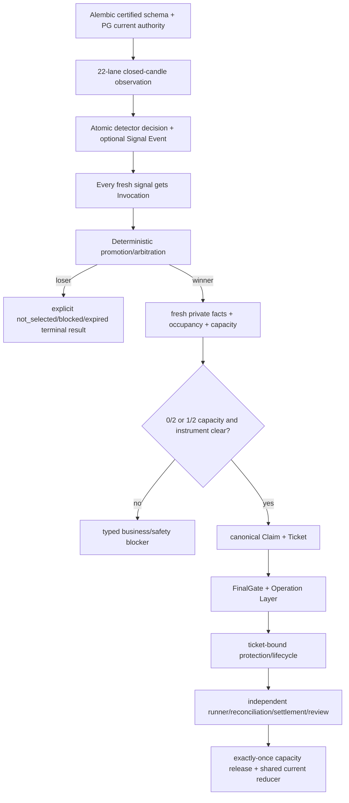

# P0 Schema Truth、Action-Time 与双仓位实盘前置收敛设计

## 1. 决策摘要

### 1.1 核心判断

**系统已经处于生产集成后期和并发恢复硬化期。** 单笔垂直交易链已经证明可达，东京服务、PG、Signal、Ticket、FinalGate、Operation Layer 与 ticket-bound lifecycle 均有可保留的真实基础；当前剩余问题不再是“能不能交易”，而是：

1. 多个同时信号是否全部被保存并得到明确结果；
2. 账户从 **0/2 → 1/2 → 2/2** 时容量、instrument claim 与生命周期是否保持一致；
3. 两个仓位的 Ticket、保护、runner、对账、结算和释放是否互不串线；
4. PostgreSQL schema、ORM、测试和生产升级是否由同一权威定义；
5. 异常、重启、超时和历史数据是否能自动收敛，而不是继续依赖 repair migration；
6. Watcher、Candidate、Goal、Monitor、Ops 和 Forensics 是否使用同一运行语义。

本 Program 的目标不是强制产生第二笔真实仓位，而是达到：

```text
engineering complete
+ schema truth certified
+ production-shaped PostgreSQL certified
+ dual-position concurrency/recovery certified
+ Tokyo no-exchange-write canary accepted
= multi_position_pre_live_certified
```

达到该状态后，下一步仅剩自然信号下的真实多仓位校准；真实交易继续由现有 Owner policy、FinalGate、Operation Layer、保护和对账边界决定。

### 1.2 为什么必须扩大现有 P0-ACH 范围

原 P0-ACH 已正确识别 Persisted Decimal、Invocation 丢失、occupancy 分裂、detector current、历史健康和通知恢复问题，但它预先决定 **migration 141**，未先解决以下认证基础：

- Alembic metadata 指向空 `Base.metadata`；
- runtime repository 仍可能执行 `create_all()`；
- 测试 head 和手工 schema helper 已落后于生产 head；
- migration 曾混合 DDL、策略注册、Owner policy 激活和运行状态修复；
- 同一状态被多个 SQL consumer 分别解释。

如果不先关闭这些问题，即使当前功能测试转绿，也仍可能再次出现“测试 schema 正确、生产 schema 不同”或“一个 readmodel 已终态、另一个仍 active”。因此 **Schema Truth Gate** 和 **Runtime Semantic Kernel** 是本次功能修复的前置条件，不是独立的新治理项目。

### 1.3 与既有 Program 的关系

| Program | 当前角色 | 在本设计中的处理 |
| --- | --- | --- |
| **P0-FRR** | observation/action-time、detector、core-order convergence 的设计来源 | 不再作为独立活跃 P0；剩余任务并入 P0-ACH |
| **P0-ATC** | migration 140、Account Current、failed-submit capacity 释放的部署基线 | 保留为 deployed component baseline |
| **P1-F Dual-Position V0** | `max_concurrent_positions=2`、Exposure/Budget/Claim/lineage 基础 | 在本 Program 内执行 whole-branch recertification，不新开并行 WIP |
| **R1B Natural Live Lifecycle Calibration** | 真实 venue 行为与自然信号校准 | 保留为 P0 interrupt；仅在本 Program pre-live certified 后执行 |

**P0-ACH 是当前唯一活跃的中型 P0 收敛 Program。**

### 1.4 Owner 与授权边界

批准本设计仅表示允许在当前分支、当前五个 StrategyGroup、当前 22 条 candidate lane、当前账户和既有 profile 内实施工程收敛。

本设计不改变：

- `max_concurrent_positions=2`；
- `max_new_action_time_lanes=1`；
- StrategyGroup、symbol、side、notional、leverage、planned stop risk 或 Owner policy；
- FinalGate、Operation Layer、protection、reconciliation、settlement 或 review 权限；
- exchange credential、withdrawal、transfer 或 secret；
- unknown outcome、duplicate submit、missing protection、wrong account/instrument 下的 fail-closed 行为。

## 2. 已知客观事实

### 2.1 当前生产与服务事实

截至 **2026-07-20 11:44（上海时间）**：

| Surface | 当前事实 | 来源 |
| --- | --- | --- |
| **Branch / release** | `codex/budget-model-review-20260714` / `386cc3d7` | 本地 Git、东京 release manifest |
| **Migration head** | `140`，单 root、单 head、线性 `001 → 140` | Alembic revision graph、东京 probe |
| **Backend** | HTTP 200，`runtime_bound=true`，`live_ready=false` | 东京 readonly probe |
| **Timers** | Watcher、Monitor、Lifecycle timer 均 active | 东京 ops health |
| **Observation coverage** | 五个 StrategyGroup、**22 条 current lane**，missing coverage=`0` | 东京 PG ops health |
| **Account state** | PG Owner readmodel 报告 **2/2 个仓位槽位占用** | 东京 PG ops health |
| **Current health** | `warn`，包含历史 Attempt、runner proof 和 lifecycle attention 收敛问题 | 东京 PG ops health |

上述检查全部只读，没有调用 FinalGate、Operation Layer 或交易所写接口。

### 2.2 当前信号链事实

在 **2026-07-20 00:00 至 11:44（上海时间）** 的 PG 窗口中：

| 对象 / 结果 | 数量 |
| --- | ---: |
| **Live Signal Event** | **67** |
| **ActionTimeInvocation** | **32** |
| **Promotion Candidate** | **3** |
| **Action-Time Lane** | **3** |
| **Ticket** | **3** |
| **Protected Submit Attempt** | **1** |
| **Ticket-bound Lifecycle Run** | **1** |
| **Live Outcome** | **0** |

这些 Signal Event 包含连续 watcher tick 对同一市场状态的重复检测，不等同于 67 个独立交易机会，但足以证明系统正在面对真实的多信号和并发状态。

### 2.3 当前 blocker 分布

| 第一 blocker | 数量 | 分类 |
| --- | ---: | --- |
| **`action_time_invocation_missing`** | **35** | engineering handoff gap |
| **`runtime_process_outcome_missing`** | **24** | engineering handoff gap |
| **`account_instrument_already_claimed`** | **3** | 正常业务/账户安全阻止 |
| **`ticket_expired_before_submit`** | **2** | Action-Time 性能/TTL 问题 |
| **local Order registration DBAPIError** | **1** | Operation Layer 前本地持久化问题 |
| **`max_concurrent_positions_reached`** | **1** | 正常 **2/2** 容量阻止 |
| **successful Invocation 后缺 Promotion** | **1** | engineering handoff gap |

最深的三条链已经产生 Ticket：一条推进到 Operation Layer 前的 local Order registration，另外两条在真实提交前过期。当前窗口没有形成新的 completed trade。

### 2.4 单笔能力与多仓位能力必须分开

已有单笔真实交易和当前账户存在两个仓位，只能分别证明：

- 官方链路曾经能够完成一笔真实交易；
- 当前账户事实能够表达两个仓位槽位占用。

它们尚不能证明两个仓位都由官方链独立创建、保护、runner、对账、结算和释放，也不能证明多信号并发、进程重启和 Claim race 不会产生串线或重复占用。

### 2.5 Persisted Decimal 事实

生产数值 `reserved_margin=323.2469333333333333333333333` 写入 `Numeric(36,18)` 后变为 `323.246933333333333333`。当前实现先对 raw payload 计算 hash，写入后又把 PG 回读 payload 与 raw object 严格比较，因此合法的 PG scale coercion 被误判为 semantic drift。

影响范围不只 `reserved_margin`，还包括任何同时参与计算、有限 scale 持久化、hash、幂等或安全复核的 price、qty、risk、margin、fee、funding 和 PnL Decimal。

### 2.6 多信号和 Invocation 事实

当前刷新序列仍可能在正式 arbitration 前通过单行选择语义丢弃同 tick 的其他 Signal。被丢弃的 Signal 没有 `arbitration_lost`、`business_blocked` 或其他机器终态，因此不是正常竞争失败，而是因果对象丢失。

### 2.7 Occupancy、订单与终态事实

核心 `orders` 与 ticket-bound lifecycle 对部分历史保护订单存在终态分裂。Watcher、Action-Time 和 next-entry gate 因此可能对同一账户得出不同 occupancy 结论。历史 `submit_failed`、runner warning 和 closed lifecycle 也仍可能被 Ops Health 计入 current issue。

### 2.8 Detector 与 current projection 事实

22/22 coverage 证明 watcher 调度和 identity 可用，但 Candidate Pool 仍报告 22 个 `detector_not_attached`。与此同时自然 Signal Event 持续产生，说明 detector 计算事实与 current projection 没有形成同一 durable authority。

### 2.9 Migration 与 Schema 治理事实

| 指标 | 当前事实 | 风险 |
| --- | ---: | --- |
| **Migration 总量** | **140 个、约 24,497 行** | 认知和认证成本上升 |
| **Migration graph** | 1 root、1 head、0 branch point | 历史链仍完整 |
| **最大 revision** | `086` 约 1,831 行、创建约 47 张表 | foundation 过宽 |
| **近期增长** | `086` 后约 16 天新增 55 个 revision | 核心不变量仍在快速收敛 |
| **重复状态约束** | lifecycle status/event CHECK 各至少被 7 个 revision 改写 | 状态机边界不稳定 |
| **Alembic metadata** | `Base.metadata=0` 张表；`PGCoreBase.metadata=96` 张表 | drift detection 失效 |
| **Runtime schema creation** | `init_pg_core_db()` 调用 `PGCoreBase.metadata.create_all()` | 双 Schema Authority |
| **Head test** | 测试仍断言 `136`，真实 head 为 `140` | 质量门漂移 |
| **Test schema helper** | 手工 migration 清单只到旧 head，并执行 ad-hoc `ALTER TABLE` | 测试 schema 不等于生产 schema |

Migration 数量本身不是设计失败。真正的问题是 Migration 曾同时承担 DDL、数据修复、Strategy/Event seed、Owner policy/canary 激活和运行状态补偿。

当前 Schema-Fit 审计还确认了三个需要优先验证的结构点：

1. `brc_account_budget_current` 的唯一键当前包含 `risk_policy_version`，但容量锁按 `account_id + runtime_profile_id` 读取；policy version 变化后可能出现多个“current”行。正确不变量是一个 account/profile 只有一条 Budget Current，policy version 是其属性。
2. Account Exposure 使用的 netting key 形态与 Ticket/Command/Hold 使用的 canonical key 分隔符、字段和长度不同；双仓位、hedge bucket 和 hold resolution 可能无法稳定关联同一机械仓位域。
3. `brc_runtime_fact_snapshots` 的 detector decision 缺一等 lane/event/candle/release identity；相同 candle 的 `ON CONFLICT DO UPDATE` 可能改写历史 decision。

### 2.10 维护性与运行成本事实

| Surface | 当前规模或行为 | 影响 |
| --- | ---: | --- |
| `pg_models.py` | 约 **7,388 行、96 张 ORM 表** | schema monolith |
| `trading_console.py` | 约 **8,560 行** | readmodel 高耦合 |
| `promotion_action_time_lane.py` | 约 **2,884 行** | Action-Time 路径职责过宽 |
| watcher script | 约 **3,064 行** | observation、writer、projection 编排耦合 |
| refresh sequence | subprocess + stdout JSON 协议 | 类型和失败语义退化 |

生产文件 I/O 机器审计当前没有发现 recurring JSON/MD authority 的直接 P0 风险；no-signal tick 继续要求生成 **0 个 JSON/MD 文件**。

## 3. 基于事实的阶段与根因判断

### 3.1 当前工程阶段

| 能力层 | 阶段判断 |
| --- | --- |
| 基础架构和单笔 vertical slice | 后期，已有真实证明 |
| 多信号守恒和确定性仲裁 | 中后期，正在暴露生产缺口 |
| 双仓位容量和独立生命周期 | 组件已部署，whole-chain 尚未认证 |
| Schema、测试和恢复治理 | 尚未收敛，是当前认证基础阻塞 |
| 稳定生产运营 | 尚未进入 |

因此当前属于 **Late Integration + Production Hardening + Pre-Certification**。

### 3.2 系统性根因

前期主要按以下方式演进：

```text
新增能力
-> 新表/新状态/新脚本
-> 局部测试
-> 生产发现 current truth 缺口
-> repair path 或 migration 修历史
```

这种方式快速建立了真实资金安全能力，但没有同步冻结四个共享核心：

1. **唯一 Schema Authority**；
2. **Runtime Semantic Kernel**；
3. **每个 Current Projection 的唯一 writer/reducer**；
4. **生产形态 PostgreSQL、并发和恢复认证基线**。

当前维护困难来自：

```text
同一业务事实
-> 多份状态集合
-> 多套 SQL predicate
-> 多个 readmodel
-> 多个 repair path
-> 再新增 migration 或兼容逻辑
```

### 3.3 多仓位不是并行多提交

当前 Owner policy 是：

```text
max_concurrent_positions = 2
max_new_action_time_lanes = 1
```

因此多仓位能力的正确语义是：

```text
宽观察并保存所有 Signal
-> 同一 allocation domain 确定性选择至多一个新 winner
-> 安全创建一个新 Ticket
-> 已有受保护仓位继续独立运行
-> 后续自然机会可以在剩余容量内累积到 2/2
```

本 Program 不允许同一 tick 无控制地并行提交多个新订单。

## 4. 目标状态与非目标

### 4.1 目标状态 `multi_position_pre_live_certified`

完成时必须同时满足：

1. Alembic 是唯一生产 Schema Authority；
2. `001–140` 内容被冻结且 checksum 可验证；
3. 下一 migration 是否存在由 Schema Truth Gate 决定；
4. 所有 fresh eligible Signal 都有 Invocation 和明确结果；
5. 同一 allocation domain 至多一个 Action-Time winner；
6. 0/2、1/2、2/2、同 instrument conflict、release 和 recovery 全部通过真实 PG 认证；
7. 每个 Ticket 的保护、runner、reconciliation、settlement 和 capacity release 相互隔离；
8. Candidate、Goal、Monitor、Ops 和 Forensics 对同一 snapshot 得出同一 first blocker；
9. Action-Time、Watcher 和 current readmodel 性能在既有预算内；
10. shadow restore、schema fingerprint、previous-application compatibility class 和东京 no-write canary 通过；
11. 不产生 exchange write，不扩大 live policy。

### 4.2 明确非目标

- 真实第二仓位成交或真实多仓位 exchange-write 证明；
- position cap 从 2 扩大到 3；
- 新 StrategyGroup、symbol、side、runtime profile 或 account；
- Capital Allocation V1、strategy sleeve、dynamic correlation 或 drawdown policy；
- Multi-Asset Execution Kernel；
- squash 或重写 migration `001–140`；
- 数据库平台替换；
- 全仓库巨型模块重写；
- synthetic/replay 信号进入生产实盘；
- destructive cleanup、手工 SQL 或历史交易记录删除。

## 5. 架构方案比较

| 方案 | 优点 | 主要风险 | 决策 |
| --- | --- | --- | --- |
| 当前问题逐个点修并继续追加 migration | 短期改动小 | 双 authority、状态漂移和测试旁路继续存在 | 拒绝 |
| 立即 squash/rewrite 数据库和执行链 | 表面简化 | 破坏生产升级、审计和真实资金安全历史 | 拒绝 |
| 新增独立 Schema/Consolidation Program | 职责看似独立 | 形成新的 WIP 和文档权威 | 拒绝 |
| **扩展现有 P0-ACH，先 Schema Truth，再功能和双仓位认证** | 一条主线同时关闭功能缺陷和认证根因 | 需要严格串行审查核心边界 | **采用** |

## 6. 目标架构



## 7. 核心架构契约

### 7.1 Schema Truth Gate

执行顺序固定为：

```text
freeze 001-140
-> verify immutable checksums and single head
-> inventory Alembic-owned / ORM-only / legacy-unmapped schema
-> align Alembic metadata with PG models
-> compare clean 001->head and production 140->head fingerprints
-> perform field-by-field schema-fit audit
-> approve no migration or the minimum capability bundle
```

禁止因为设计文档出现编号就默认创建下一 migration。

### 7.2 Single Schema Authority Contract

目标必须收敛为：

```text
Alembic owns production schema.
ORM models describe mappings.
Repository initialize verifies schema capability.
Runtime never creates production tables.
```

要求：

1. production runtime 路径移除 `create_all()`；
2. migration/deploy role 与 application role 分离；
3. application role 不具备 `CREATE/ALTER/DROP`；
4. startup 只校验 Alembic head、required capability 和 schema fingerprint；
5. migration/head/count 常量由同一 release manifest 提供；
6. migration 测试通过 Alembic API 动态取得真实 head；
7. 手工 migration 清单和测试内 ad-hoc `ALTER TABLE` 退出生产认证路径。

#### 7.2.1 PG Role Topology Gate

Schema Truth Gate 必须在任何生产 grant/revoke 或 migration apply 之前只读审计东京实际角色拓扑，并输出：

```text
migration_role_id
application_role_id
application_session_user / application_current_user
migration_session_user / migration_current_user
application_connection_identity_ref
migration_connection_identity_ref
database_owner
target_schema_owner
managed_table_and_sequence_owners
role_membership
set_role_path
schema_create_privilege
object_owner_implicit_alter_drop_capability
default_privileges
application_can_create
application_can_alter
application_can_drop
credential_or_secret_change_required
role_topology_decision
```

`role_topology_decision` 只能是：

| 决策 | 含义 | 后续行为 |
| --- | --- | --- |
| `existing_roles_sufficient` | 已有独立 migration/application identity，ownership、membership 和 default privilege 已满足边界 | T02 固化验证，T13 复核 |
| `grant_owner_convergence_without_secret_change` | 可用现有身份通过 grant/revoke、owner transfer 或既有 `SET ROLE` 路径收敛，无需新 credential/secret | T02 生成逐对象计划，shadow 证明后 T13 在 Writer Fence 下 apply/verify |
| `credential_or_secret_change_required` | 需要创建 role、credential、secret 或修改密钥分发 | 状态变为 `blocked_owner`；本 Program 不得自动实施 |
| `role_topology_unknown` | 无法证明当前服务和 migration 实际使用哪个 role | fail closed，不进入 T13 |

T13 不得临时创建新数据库凭据来满足验收。最终认证要求 application identity 既没有 schema-level DDL privilege，也不是 managed table/sequence 的 owner，且不能通过 membership、`SET ROLE` 或 default privilege 绕过；若该结果依赖新的 credential/secret，Owner 决策是明确的生产权限边界，不得伪装成普通工程步骤。

不得简单把 `target_metadata` 从空 `Base.metadata` 改指向 `PGCoreBase.metadata` 就宣称完成。当前还存在 migration-only 表；必须建立完整 managed-schema registry/fingerprint，并为 ORM-managed、migration-only、legacy/archive 表设置显式 include/exclude 规则。

### 7.3 Runtime Semantic Kernel

Kernel 是共享领域语义，不是第二 runtime 或兼容 adapter。它集中定义：

```text
phase          少量稳定业务阶段
state          running / blocked / terminal / outcome_unknown
terminal_kind  ticket_bound / not_selected / expired / rejected / superseded / completed
reason_code    可扩展 typed code
```

Kernel 提供：

- `is_active`；
- `is_terminal`；
- `is_current`；
- `is_operationally_relevant`；
- 合法 transition；
- Decimal scale/rounding；
- blocker owner 和 Owner-action 映射；
- Owner product state 映射。

各 Aggregate 保留自己的领域状态机；Kernel 统一解释，不把所有表压成一个万能 status。`reason_code` 不采用频繁变化的完整 DB CHECK 列表。

### 7.4 Persisted Decimal Canonicalization Contract

统一顺序：

```text
raw Decimal
-> instrument-rule quantization
-> persistence semantic quantization
-> frozen canonical payload
-> canonical hash/idempotency
-> INSERT
-> reload canonical payload
-> canonical equality
```

| 语义 | 示例 | 方向 |
| --- | --- | --- |
| Venue exact | price、qty、stop | 先按 InstrumentRule；无法无歧义表达则 fail closed |
| Allowance | allowed risk、available capacity | 不得向上扩大授权 |
| Consumption | margin、notional、planned stop risk | 不得向下低估占用 |
| Observation | 非授权测量值 | 明确版本化 rounding |

hash、Claim、Ticket、FinalGate 和 retry 必须消费同一 canonical payload。若现有 `Numeric(36,18)` 足够表达规范值，则此修复不得创建 schema migration。

### 7.5 Signal Conservation And Invocation Contract

每个 fresh eligible Signal 必须先得到一个轻量 Invocation，冻结 exact Signal、完整 lane identity、event/candle watermark、release generation 和 expiry。

每个 Invocation 必须得到一个明确结果：

```text
selected
not_selected
business_blocked
safety_blocked
ticket_bound
expired
rejected
superseded
outcome_unknown
```

这些是 Kernel 的语义结果，不要求全部成为一个高频变化的 DB `status IN (...)`。

### 7.6 Deterministic Arbitration Contract

同一 `account_id + runtime_profile_id` allocation domain 内：

1. 所有 fresh Signal 先被持久化和 materialize；
2. 过滤 stale、policy-disabled、identity-invalid 和明确 conflict；
3. 使用 Owner priority、candidate priority、event time、observed time、signal ID 的稳定排序；
4. 事务内最多一个 winner；
5. 所有 loser 写明确结果和 winner reference；
6. 只有 winner 刷新 private account facts、occupancy、Claim 和 Ticket；
7. partial write 整体回滚，重试结果不变。

### 7.7 Bounded Multi-Position Contract

当前只认证 Owner 已批准的 **2 个并发仓位**：

| 场景 | 必须结果 |
| --- | --- |
| 0/2 + 不同 instrument Signal | 保存全部 Signal；一次最多一个 winner |
| 1/2 + 新 instrument | 可安全 Claim 到 2/2 |
| 1/2 + 同 instrument | `account_instrument_already_claimed` |
| 2/2 + 任意第三仓位 | `max_concurrent_positions_reached` |
| Ticket/lifecycle terminal | 容量释放恰好一次 |
| unknown exchange outcome | 容量继续占用并 fail closed |
| Claim 后进程退出 | 重启后幂等恢复，不重复占用 |
| 两 worker 并发 Claim | 锁和约束保证不超过 2 |
| 一个 protected position + 一个 pending Claim | 计为 **2/2**；第三个请求被阻止 |
| lifecycle release 与新 Claim 并发 | 同一 account/profile 锁内串行化；不得 lost update、double release 或瞬时超配 |
| Claim lease/process exit 时第三个请求 | 未经确定性 expiry/reconciliation 前，pending Claim 继续占用 |
| simultaneous close + claim | release 先提交时 Claim 可成功；否则返回精确 cap/retry 结果，任何可见状态不得超过 2 |
| portfolio / cluster / margin 任一超限 | 即使 slot 尚有空余也必须独立阻止 |
| 第一仓位进入 runner | 第二仓位保护、runner、settlement 不串线 |

容量必须按 ownership 而不是按表行数计算：

```text
claimed_position_slots =
distinct active Exposure ownership
+ effective pending Claims not yet reflected by the same exposure_episode_id
```

pending Claim 转为同一 ExposureEpisode 时是 ownership replacement，不是新增 slot；risk、cluster risk 和 margin 也只能计算一次。Release projector 与新 Claim 必须锁同一 `account_id + runtime_profile_id` Budget Current，并使用 monotonic projection version/CAS。允许的线性结果只有 release 先提交后 Claim 成功，或 Claim 看到旧 2/2 后被精确阻止/因版本变化重试；禁止 lost update、negative slot、phantom free slot 和旧 snapshot 覆盖新 current。

所有 identity 必须至少绑定 account、runtime profile、canonical instrument、position mode、position bucket/netting domain、side、Ticket 和 exposure episode；不能只按 symbol 或 StrategyGroup 推断。Netting domain 必须由一个 versioned `NettingDomainKey` builder 生成，Exposure、Command、Hold、Protection 和 Reconciliation 不得自行拼接。

### 7.8 Lifecycle Occupancy Contract

`LifecycleOccupancySnapshot` 是新 ENTRY gate 的唯一 occupancy 解释：

```text
flat_and_clear
open_protected
recovery_required
unknown_fail_closed
```

Observation 不因仓位占用停止；occupancy 只阻止 winner 的 Action-Time progression。terminal ticket-bound truth 必须由正式 lifecycle projector 收敛 core `orders`，禁止 watcher 和 direct sequence 分别维护不同冲突规则。

### 7.9 Detector Decision And Signal Atomicity Contract

每个 `lane + event spec/version + closed candle identity` 最多持久化一个 typed detector decision：

```text
computed
satisfied
failed_facts
fact_values
source_watermark
release_generation
valid_until
```

Detector decision 与由其产生的 Signal 必须在同一应用服务和明确事务边界中提交；不得出现 Signal 已存在但 detector current 缺失。重复 tick 为幂等 no-op，payload drift 形成 typed process blocker。

### 7.10 One Current Projection, One Writer

| Projection | 唯一写入者 | 应退休的竞争路径 |
| --- | --- | --- |
| Detector Decision Current | observation application service | watcher 二次解析后分步 writer |
| Signal Event | detector decision transaction | 独立无 detector lineage 的 signal writer |
| Invocation | Action-Time intake service | global single-row trigger |
| Promotion/Lane | Invocation arbitration service | legacy global batch materializer |
| Account Exposure/Budget Current | account risk projector | consumer 自行推导容量 |
| Netting Domain Hold | netting-domain hold service | Command、Protection、Reconciliation 分别拼 key |
| Order Current | ticket-bound lifecycle reducer | legacy `orders` safety authority和长期 repair projector |
| Runtime Health | shared operational reducer | Monitor、Goal、Ops 各自 SQL 状态集合 |

每个旧路径必须在同一任务中写明被谁替换、删除条件和负例证明。

### 7.11 Shared Current Reducer And Operational Relevance

Candidate Pool、Readiness、Tradeability、Daily Table、Goal、Monitor、Ops 和 Forensics 共用一个 typed snapshot 和 pure reducer。

当前风险定义为：

```text
nonterminal Ticket/lifecycle
OR active Reservation/Exposure/hold
OR unresolved exchange command/outcome
OR active venue position/open order
OR live protection gap
```

已经 terminal、无 active exposure/hold/order、无 unknown outcome 的历史失败只进入 `historical_warnings`，不能继续制造 current unavailable。

### 7.12 Notification Incident Contract

Event occurrence 与 capability incident 必须分离。工程 incident fingerprint 至少包含 lane identity、process name、exact blocker 和 release generation。

Signal 过期、top-lane 变化或当前查询不再返回该行不能单独表示 recovery。恢复必须来自同 process 的更新 success 或更高 release generation 的明确 certification。工程 blocker 默认 `owner_action_required=false`。

### 7.13 Critical-Path Orchestration Contract

当前 Program 只收敛交易关键路径，不进行全仓库脚本重写：

```text
systemd/CLI thin entry
-> typed application coordinator
-> explicit transaction boundaries
-> typed command/result
-> PG process outcome
```

Action-Time 内部不得继续依赖 subprocess stdout 最后一行 JSON 作为核心语义协议。一次性部署、备份和 archive tooling 可以保留文件协议，但不能成为交易 current authority。

### 7.14 Action-Time Deadline Conservation Contract

现有 **30 秒**不再只是完成后的 latency 标签，而是每次 Invocation 的真实执行截止时间：

```text
systemd_deadline_ms = min(
  unit_deadline_ms,
  action_time_started_at_ms + 30_000
)

global_deadline_ms = min(
  signal_expires_at_ms,
  ticket_expires_at_ms when Ticket exists,
  every_required_fact_valid_until_ms,
  systemd_deadline_ms
)
```

每一步必须在开始前重新计算：

```text
remaining_ms = global_deadline_ms - now_ms
step_timeout_ms = min(step_ceiling_ms, remaining_ms - durable_close_reserve_ms)
```

其中 `durable_close_reserve_ms` 必须至少为 **1,000ms**，用于持久化 terminal/process outcome、关闭 Invocation，并通过正式 transition 释放尚未消费的 Claim/Reservation。若剩余预算不足，不得启动下一步；必须在 Ticket 创建、FinalGate input 或 Operation Layer submit handoff 之前终止并保存 exact deadline blocker。

序列开始时必须同时记录 wall clock 与 monotonic clock；remaining budget 使用 monotonic elapsed 计算，避免系统时钟校正延长执行。新 Fact 或 Ticket 绑定后可以把 `global_deadline_ms` 缩短，但绝不能把已经确定的 deadline 延后。PG `lock_timeout`、`statement_timeout` 和所有 API/subprocess timeout 必须来自同一 remaining budget。

Deadline 不得延长 Signal、Ticket 或事实的有效期。外层 **45 秒**只允许作为失控进程的 kill ceiling，不能成为成功预算。若网络写入尚未开始，超时必须守恒地关闭并释放未消费容量；若 official exchange call 已开始且结果未知，则状态必须是 `outcome_unknown`，容量和 hold 继续占用直到 reconciliation，不得按普通 timeout 释放。

## 8. Schema 与 Migration 设计

### 8.1 冻结 `001–140`

- 已部署 revision 不再修改、重编号或删除；
- CI 对认证基线计算 checksum；
- 旧 revision 发生内容变化直接阻止合并；
- 当前不 squash，也不在生产链上建立假 root。

### 8.2 Schema-Fit Matrix

| 问题 | 默认判断 | 允许新增 schema 的条件 |
| --- | --- | --- |
| Decimal canonicalization | 代码/持久化契约 | 只有现有 Numeric 无法表达业务不变量 |
| 多信号 Invocation | 代码、批处理和 arbitration | 只有现有 identity/unique 约束无法保证 signal conservation |
| Invocation terminality | 优先复用 `closed_at_ms`、Ticket、process outcome 和 Kernel | 需要持久化、索引和约束的稳定 terminal primitive 缺失 |
| Account Budget Current identity | 一个 account/profile 只能有一条 current | 当前 unique key 含 policy version，机器审计确认需要收敛时最小修复 |
| Detector current identity | 复用现有 fact table | 缺 lane/event/candle/release typed identity 与不可变唯一索引时 additive 扩展 |
| Netting Domain canonical identity | 统一纯领域 builder | 现有 key 长度/公式无法确定性 backfill 或约束时扩宽/版本化 |
| Process/incident fingerprint | 复用现有 `first_blocker/runtime_head/source_watermark/correlation_id/resolved_at_ms` | 默认不新增同义字段；只有查询/唯一约束机器证据不足时再评估 |
| Runtime health reducer | 纯代码/readmodel | 不应为每个 reason 新增 DB status |
| Schema Authority | Alembic/ORM/startup 修复 | 通常不需要业务 migration |

### 8.3 Conditional Schema Capability Bundle

若 Gate 证明必须新增 migration，必须以一个 capability bundle 管理，而不是先决定编号。Bundle 包含：

- capability ID；
- from/to revision；
- affected tables 和唯一 writer；
- expand/backfill/enforce revision；
- data convergence service；
- code compatibility floor；
- lock/statement timeout；
- rollback class；
- schema fingerprint；
- restore point；
- clean DB 和 production upgrade acceptance。

`planned_migration_set` 表示一个 logical capability bundle，可以由多个有序的 expand/backfill/enforce revision 组成；它不是预先承诺的单一 revision number。Bundle manifest 还必须记录 `role_topology_decision`、`previous_code_compatibility_floor` 和 `restore/rollback_class`。

当前最可能进入该 bundle 的业务结构最小集合仅有：

1. Account Budget Current 单行唯一键收敛；
2. Detector Decision typed identity 与不可变 partial unique index；
3. Netting Domain canonical key 的必要列宽/版本/backfill。

若 T01 证明某个 ORM-only table/column 是移除 production `create_all()` 的必要依赖，则它可以作为同一 logical bundle 的 **Schema Authority Closure item**，但必须在 T01 逐项命名 affected table、唯一 writer 和 exact capability；T02 不得自行扩大 bundle scope。

Decimal、multi-signal、Invocation 阶段语义、notification/process correlation、shared reducer 和 core-order terminal convergence 默认属于代码与单写者修复。

### 8.4 Migration Responsibility Matrix

| 变化 | 正确载体 |
| --- | --- |
| DDL、稳定约束、索引 | Alembic |
| 必要历史结构 backfill | bounded forward migration |
| Strategy/Event Spec | PG registry/version command |
| Owner policy | Owner policy event/API |
| 当前状态收敛 | official projector/reconciliation service |
| 一次性运维修复 | dry-run/apply、前后置断言、可重复执行的 service |
| Decimal/hash canonicalization | shared code contract，非必要不建 migration |

### 8.5 历史状态收敛

历史 Invocation、stale core Order、out-of-universe runtime 和历史 health rows 只能通过正式 owner service 幂等收敛。无法证明 exact lineage 的行保持 unresolved/fail-closed，禁止 migration 猜测业务终态或手工 SQL 批量改写。

### 8.6 认证 Baseline

本 Program 完成 shadow restore 和 schema equivalence；正式 `runtime_schema_v1` baseline/template 在生产稳定后建立。认证 baseline 不替代生产 `001–head` 历史，也不进入交易 runtime 输入。

## 9. Cadence、性能与保留

### 9.1 关键预算

| 路径 | 预算 |
| --- | --- |
| No-signal watcher tick | 0 个 JSON/MD 文件 |
| Action-Time refresh | `global_deadline_ms` 是真实截止时间；成功预算最多 **30 秒**，45 秒仅为外层 kill ceiling |
| DB lock transaction | 不包含 HTTP、exchange 或 subprocess I/O |
| Private account facts | 只对 arbitration winner 刷新 |
| Detector decision | 每 lane/event/candle 最多一行 |
| Current readmodels | 一次批量 PG snapshot + pure reducer |
| Schema/head/fingerprint | 只在 CI/startup/deploy，不进入 watcher tick |
| Retention | 脱离交易事务、timeout-bounded、人工/计划触发 |

22 条 15m lane 的 detector decision 理论上限约 **2,112 行/日**；1h lane 更低。相同 closed candle 的重复 tick 必须 no-op。

### 9.2 Hot-Path 认证

- account capacity 查询最多读取 `max_concurrent_positions + 1` 行；
- arbitration 和 Claim 使用 production-shaped `EXPLAIN ANALYZE`；
- 索引必须覆盖 current/identity/expiry，而不是依赖全表状态扫描；
- watcher cycle 保留至少 20% timeout headroom；
- CPU-heavy schema diff、forensics builder 和 archive 不进入生产 cadence；
- PG row growth、journald、release 和 backup retention 均有上限。

### 9.3 Retention、磁盘与告警基线

以下是本 Program 的默认生产基线；T00 机器审计可以在不降低交易 provenance 的前提下收紧，但不得改成无上限：

| 数据族 | 在线保留 | 容量/数量上限 | 删除保护 |
| --- | ---: | ---: | --- |
| superseded watcher coverage | **14 天** | 每 lane 只保留 current + 窗口历史 | current、incident/Ticket 引用行不删 |
| unreferenced public/account fact snapshots | **14 天** | `14 × frozen_daily_ceiling × 1.2` | current、Signal/Ticket/incident 引用行不删 |
| detector decisions | **90 天** | warn **190,080 行**；hard **228,096 行** | 任何 Signal/Ticket/incident 引用行永久作为 provenance 保留 |
| resolved runtime process outcomes | **90 天** | `90 × frozen_daily_ceiling × 1.2`；每次最多 chunk **5,000 行** | unresolved、`outcome_unknown`、Ticket/incident 引用行不删 |
| server monitor runs | **30 天** | `30 × frozen_daily_ceiling × 1.2` | notification/incident 引用行不删 |
| notification delivery/dedupe | **180 天** | `180 × frozen_daily_ceiling × 1.2`；unresolved/current dedupe 永久在线 | 未恢复 incident 和 audit refs 不删 |
| journald | **14 天** | `SystemMaxUse=2 GiB`；单次 vacuum 不超过 **10 分钟** | 保留当前 boot 和未恢复 incident 窗口 |
| application releases | current + 最近 **4** 个 known-good，最多 **5 个 / 8 GiB** | 先满足数量和容量两者中更严格者 | current、previous、restore-pinned release 不删 |
| verified PG backups | 最近 **7** 个、**30 天**、最多 **20 GiB** | 三项中最先达到者触发 prune | 最新已验证 predeploy restore point 至少保留到下一次 accepted deploy 后 7 天 |

Retention 由唯一的 `brc-runtime-retention` owner 在非交易 cadence 执行，默认每日一次、总时限 **10 分钟**、短事务 chunk delete；不在 watcher、Action-Time、FinalGate、Operation Layer 或 lifecycle transaction 内运行，不创建 JSON/MD report。

Retention current projection 必须机器输出：

```text
retention_status
retained_rows
retained_bytes
daily_growth_p95
capacity_budget
cleanup_lag_seconds
owner
next_cleanup_at
```

机器告警阈值：

- **warn**：任一 row/disk/count cap 达到 **80%**，预计 7 日增长将突破 cap，或一次 retention run 失败；
- **hard/deploy stop**：cap 达到 **95%**、连续两次 retention run 失败、备份无法验证，或 release/backup prune 无法保留保护项；
- **runtime hard safety**：PG/日志所在文件系统可用空间低于 **10%**，或数据库不能保证 durable write；此时阻止新 ENTRY，但已有仓位 protection/reconciliation 必须继续优先运行。

普通 retention warning 只能进入运维告警，不能伪装成市场 blocker 或无条件阻止已有仓位生命周期。

## 10. 安全与失败关闭边界

以下条件继续 hard-stop：

- Schema head/fingerprint 不匹配；
- canonical Decimal 无法无歧义表达；
- duplicate Claim 无法证明同一 Invocation/hash；
- arbitration 产生多个 winner 或 partial result；
- position/exposure/hold/unknown exchange outcome 无法归属；
- 同 instrument 已占用或账户达到 2/2；
- Ticket、account、instrument、side、netting domain 或 release generation 不一致；
- missing protection、duplicate submit、stale facts；
- FinalGate、Operation Layer、reconciliation 或 settlement 不可用。

不得通过降低仓位、延长 stale window、隐藏 blocker、删除历史或生成 synthetic production signal 通过验收。

## 11. 测试与认证策略

### 11.1 Schema 认证

```text
fresh PostgreSQL: 001 -> candidate head
production-shaped baseline: 140 -> candidate head
-> schema introspection/fingerprint equality
-> model metadata diff
-> previous-application compatibility classification
```

比较 column type/scale、nullable、default、index、unique、FK 和 CHECK。

### 11.2 双仓位与并发认证

必须覆盖：

- 0/2 → 1/2；
- 1/2 → 2/2；
- 2/2 第三仓位阻止；
- 同 instrument claim；
- two-worker same/different Claim；
- Claim 后 crash/restart；
- protected position + pending Claim = 2/2；
- pending Claim 转为同一 Exposure ownership 不双计；
- lifecycle release 与新 Claim 并发；
- Claim lease/process exit 期间第三个请求；
- simultaneous close + claim；
- portfolio、cluster、margin cap 独立阻止；
- lifecycle terminal exactly-once release；
- runner 与第二仓位隔离；
- unknown outcome 保留容量；
- protection missing、wrong account/instrument、duplicate submit。

### 11.3 生产形态全链

```text
raw public/account facts
-> detector decision
-> Signal
-> Invocation
-> Promotion/arbitration
-> occupancy/capacity
-> Claim
-> Ticket
-> FinalGate
-> fake/no-write Operation Layer
-> protected lifecycle simulation
-> current health
```

测试不得通过手工构造下游完整字典绕过 producer，不得使用 SQLite 代替 PostgreSQL Numeric、constraint、lock 和 concurrency 证明。

### 11.4 性能与文件 I/O

必须运行：

- production-shaped `EXPLAIN ANALYZE`；
- Action-Time global deadline enforcement matrix；
- row-growth and retention benchmark；
- `scripts/audit_production_runtime_file_io.py`；
- `scripts/validate_output_artifact_scope.py --git-status --git-tracked`。

## 12. 恢复、部署演练与东京 No-Write Canary

### 12.1 Shadow Restore Drill

```text
quiesced production-shaped snapshot
-> checksum + restore-list verification
-> restore into shadow PostgreSQL
-> apply candidate migration bundle if any
-> run schema/full-chain/performance certification
-> classify previous-code readonly/write compatibility
```

Compatibility 必须输出两个不同结论：

| 结果 | 定义 | 可执行动作 |
| --- | --- | --- |
| `previous_code_readonly_compatible` | previous exact release 在 Writer Fence 下 startup、health、current readmodel 无 schema error/错误 current 解释，且 DML=0、DDL=0、exchange write=0 | 只允许只读诊断；保持 Writer Fence |
| `previous_code_write_compatible` | previous release 的 writer compatibility matrix 全部通过，不遗漏新 identity/hash、不改写 immutable detector decision、不破坏 unique/FK/CHECK、不恢复退休 authority | 只有该结果为 true 才允许恢复全部 previous writer |

Write compatibility 必须分别认证：

| Writer 类别 | 必须证明 |
| --- | --- |
| Entry / Action-Time | 新 Signal/Invocation/Claim/Ticket identity、deadline 和单 winner 语义不退化 |
| Protection / Reconciliation | 已有仓位保护、unknown outcome、command 和 release 语义不退化 |
| Current Projection | 单 writer、immutable detector decision、Kernel/current relevance 不退化 |
| Monitor / Notification | incident fingerprint、recovery 和 Owner-action 语义不退化 |

若只有 readonly compatible，恢复策略固定为：

```text
Writer Fence
+ fail closed
+ forward fix
```

对应 rollback class 固定为 `code_rollback_readonly_only`。不得把“旧代码能启动”解释为“旧 writer 可以恢复”；previous Entry 和 Current Projection writer 必须保持禁用。Protection/Reconciliation writer 只有在该类别单独通过且为保护已有仓位所必需时才可运行。即使 `planned_migration_set=none`，该兼容性分类也必须执行；candidate writer 产生新事实后禁止整库 rollback 或生产 schema downgrade。

如果 migration 或 code certification 失败，恢复点必须能够重新建立 pre-change shadow state。生产 writers 恢复后产生新事实时不得通过整库回滚丢失新事件，只能 fail-closed 并 forward-fix。

### 12.2 Tokyo No-Write Canary

最终 canary 可以部署 exact certified SHA 和必要 schema，但必须：

- 在任何 production migration 前生成远端 custom-format PG backup，校验 checksum、restore list、可用磁盘和预计恢复时间，并把该 exact dump 恢复到 shadow DB 完成 upgrade certification；`deploy_backup=false` 不得通过本 Gate；
- 在部署前启用正式、可审计、可恢复的 **new-entry maintenance / submit-disabled fence**；该 fence 只阻止新的 Promotion winner 进入真实 submit，observation 和已有仓位的 protection/reconciliation/lifecycle 必须继续；
- fence 状态必须进入 release/PG audit lineage，不能只依赖未审计的临时文件；
- 保持既有 policy/profile/sizing；
- 不创建 synthetic Signal/Ticket；
- 不调用 FinalGate、Operation Layer 或 exchange write；
- 验证 22 lane coverage/detector/current reducer；
- 验证东京**当前实际 occupancy**与 exchange/account/lifecycle truth 一致；完整 0/1/2 matrix 由 T10/T11 的 production-shaped PG 认证负责；
- 验证 services、timeout、row growth、journald 和 file-I/O；
- 产出一个 pre-live certification 结论。

Canary 结束时 new-entry fence 保持启用。解除 fence 并允许自然信号进入真实 multi-position action 属于后续 R1B，不是本设计完成条件。

## 13. 维护成本控制与延后项

### 13.1 本 Program 必须完成

- Schema 单权威；
- Semantic Kernel；
- projection 单 writer；
- Action-Time critical-path typed coordinator；
- legacy promotion/order/current authority 的明确退休；
- 真实 PG 和 restore certification；
- current docs 的 head/branch/program 状态对齐。

### 13.2 本 Program 后处理

- 全面拆分 `pg_models.py`；
- 全面拆分 8,000 行级 Owner readmodel；
- 替换所有非关键 subprocess/stdout 协议；
- 全仓库文档归档和历史压缩；
- Capital Allocation V1 和 Multi-Asset Kernel。

延后项不得重新成为当前交易 authority，也不得阻止本 Program 内已经明确的正确性收敛。

## 14. 完成定义

### 14.1 Engineering Complete

1. Schema Truth Gate 和 Single Schema Authority 通过；
2. migration set 为 `none` 或经过证明的最小 capability bundle；
3. Decimal/Claim、Invocation/arbitration、occupancy、detector、reducer、health 和 notification 全部通过；
4. 每个 Current Projection 有唯一 writer；
5. production critical path 的 legacy authority 已删除或机器证明不可达；只有 archive/manual-only 路径可以保留明确 removal condition；
6. no-signal file write=0；Action-Time 和 hot-path 性能在预算内。

### 14.2 Multi-Position Pre-Live Certified

1. 0/2、1/2、2/2、同 instrument、第三仓位、release 和 recovery 全部通过真实 PG；
2. 两个 Ticket/lifecycle/runner/protection 不串线；
3. clean DB 与 production upgrade schema fingerprint 一致；
4. shadow restore 和 previous-application compatibility class 已明确；若仅 readonly compatible，则 Writer Fence + forward-fix runbook 通过；
5. Tokyo exact SHA/schema no-write canary 通过；
6. Owner action 只剩是否进入自然实盘校准。

### 14.3 未完成条件

以下任一存在即不得宣称 pre-live certified：

- runtime `create_all()` 仍可改变生产 schema；
- PG role topology 未知，或 application DDL denied 需要未获授权的新 credential/secret；
- migration/head 测试仍硬编码旧 revision；
- Signal 无 Invocation 或 Invocation 无结果；
- 多 worker 可突破 position cap 或重复 Claim；
- core/ticket-bound occupancy 结论不同；
- health/readmodel 对同一 snapshot 给出不同 first blocker；
- restore 未验证；
- canary 需要 exchange write 才能证明工程正确。

## 15. Chain Position

```text
chain_position: action_time_boundary
strategy_group_id: five active StrategyGroups
symbol: 22 active candidate lanes
stage: late_integration_and_production_hardening
first_blocker: schema authority and runtime semantic truth are not yet certified as single-source across clean DB, production upgrade, multi-signal and dual-position concurrency
evidence: Tokyo is at release 386cc3d7 / migration 140 with 22/22 coverage and 2/2 account occupancy; the 2026-07-20 window has 67 signal events, 32 invocations, 3 tickets, 60 engineering handoff gaps, and no new live outcome
next_action: execute P0-ACH beginning with Baseline/RED freeze and Schema Truth Gate
stop_condition: multi_position_pre_live_certified; Alembic is sole schema owner; every signal has an explicit outcome; 0/1/2 capacity and release are certified; all current projections agree; Tokyo no-write canary passes
owner_action_required: true_for_implementation_confirmation_only; false_for_ordinary_engineering_after_confirmation
signal_event_id: multiple; representative signal:22a5798dfa1db20d2df2910e27a31f37
promotion_candidate_id: none for representative signal
action_time_lane_input_id: none for representative signal
ticket_id: none for representative signal
authority_boundary: design and planning only; no policy/profile/sizing expansion, no real multi-position submit proof, no FinalGate or Operation Layer bypass, and no destructive migration
```
