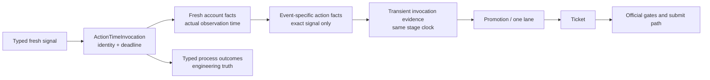

# P0 Action-Time Invocation Consistency And Failure Truth

## Decision

Replace the current implicit Action-Time batch clock and Candidate-Pool-produced
Action-Time readiness with one durable, identity-bound **ActionTimeInvocation**.
The invocation is a causal context before a Ticket, not a second trade
lifecycle owner. A Ticket remains the only business-lifecycle owner after a
trade intent exists.



The Action-Time hot path must no longer use the Owner Candidate Pool read model
as an execution prerequisite. The Candidate Pool remains a PG-backed read model
and consumer of outcome truth; it does not create the readiness evidence on
which the Action-Time promotion path depends.

## Confirmed Incident Evidence

### Natural Event Timeline

The Tokyo PG read-only reconstruction for `BRF2-001 / AVAXUSDT / short` proves
the following sequence. Times are China Standard Time on 2026-07-13.

| Time | Durable fact | Meaning |
| --- | --- | --- |
| 15:03:34.271 | watcher coverage row | Covered row was written without typed lane fields and with `runtime_profile_id=NULL` |
| 15:03:34.321 | `signal:4a605b887ee7ce5e527e0bacfa67780d` | Fresh trial-grade, trial-live, execution-eligible signal with complete `RuntimeLaneIdentity` |
| 15:03:41.471 | Action-Time sequence start | Sequence fixed `now_ms=T0` |
| 15:03:43.409 | account-safe and account-mode facts | Fresh account facts were written at `T0 + 1,938ms` |
| 15:03:47.808 | `action_time_ticket_sequence` outcome | `business_blocked`, `first_blocker=readiness_missing`, but typed lane columns were null |
| 15:03:58.581 | outer refresh outcome | Incorrectly persisted as `succeeded/completed` because child business blocking exits with code `0` |
| 15:08:02.000 | signal expiry | Expiry ended the opportunity but must not erase the engineering blocker |

No Ticket, FinalGate pass, Operation Layer handoff, exchange command, exchange
write, order, position, profile mutation, or sizing mutation occurred.

### Direct Root Cause

`ticket_materialization_sequence` captures `T0`, materializes facts at `T0`,
then calls `publish_action_time_pretrade_readiness(conn)` without `now_ms`.
The publisher writes readiness at `T1 > T0`; promotion then reads PG current
state at `T0`, where the repository correctly filters `computed_at_ms <= T0`.
The sequence therefore hides its own new row and reports `readiness_missing`.

A no-write local reproduction proves that `T1=T0` commits a Ticket while
`T1=T0+1ms` rolls back with `readiness_missing`. This is deterministic and is
not a market, strategy-semantic, account-safety, or exchange-response issue.

### Same-Class Extension

The outer refresh starts account-safe collection before the Ticket sequence but
passes no invocation context to that collector. The collector records actual
time, correctly producing facts after `T0`; the sequence then reads at stale
`T0`. The 2026-07-13 incident had an older still-fresh account fact available,
so this was not the first blocker. It becomes a real blocker as soon as the
previous account fact is missing or expired. Backdating the newly collected
fact to `T0` is forbidden because it falsifies fact observation time.

## Alternatives Considered

| Option | Benefit | Rejected risk or limitation | Decision |
| --- | --- | --- | --- |
| Pass `now_ms=T0` into the existing readiness publisher only | Smallest diff; closes the 1ms reproduction | Still hides account facts collected after `T0`, leaves a generic read model on the execution path, and does not bind the triggered signal across processes | Reject |
| Re-capture a later `now_ms` after account collection and pass a signal ID through CLI arguments | Avoids backdating and can unblock the immediate event | Restart/retry semantics remain implicit, a different new signal can race into the global selector, and parent/child truth remains loosely coupled | Reject |
| Durable ActionTimeInvocation with exact signal identity, stage-local real time, and direct transient readiness evidence | Preserves temporal truth, exact lane identity, retry/restart lineage, and one official signal-to-Ticket chain | Adds one bounded PG context table and focused migration | **Accept** |
| Create a Ticket before Action-Time facts and use Ticket as the invocation context | Reduces one object | Creates business trade intent before account/action facts, weakens the pre-ticket boundary, and conflates causal context with Ticket lifecycle | Reject |

## Core Model

### ActionTimeInvocation Is Not a Trade Lifecycle

`ActionTimeInvocation` has one purpose: bind the already-existing fresh signal
to exactly one bounded attempt to collect action-time facts and materialize a
Ticket. It does not own order, position, protection, runner, reconciliation, or
settlement state. Once a Ticket exists, the Ticket remains the sole business
lifecycle owner.

The durable row contains only immutable or causal fields:

```text
action_time_invocation_id
signal_event_id
RuntimeLaneIdentity fields + lane_identity_key + source_watermark
opened_at_ms
expires_at_ms
account_safe_fact_snapshot_id
account_mode_fact_snapshot_id
action_time_fact_snapshot_id
ticket_id
closed_at_ms
```

The row does not introduce a second business status enum. Stage success,
business blocking, retryable failure, and hard failure continue to live in
typed `brc_runtime_process_outcomes` rows associated with the same immutable
lane identity and source watermark.

### Stage-Time Rule

There are three different time concepts and they must never be substituted for
one another.

| Field | Meaning | May it be reused as a later fact observation time? |
| --- | --- | --- |
| `opened_at_ms` | Time at which the fresh signal was selected into the invocation | No |
| `stage_at_ms` | Actual time a given stage evaluates its inputs | Yes, only as that stage's as-of boundary |
| `observed_at_ms` | Actual source-observation time of a market/account fact | No; it remains source truth |

Every stage must enforce:

```text
opened_at_ms <= observed_at_ms <= stage_at_ms < expires_at_ms
```

for facts intentionally refreshed for this invocation. Existing valid public
facts remain valid only when their own `observed_at_ms` and `valid_until_ms`
satisfy the stage boundary. Replay/simulation passes an explicit deterministic
clock; production stages obtain their actual stage time and persist it in their
process outcome. No production stage silently defaults to an unrelated clock
after an invocation context has been supplied.

### Exact Signal and Fact Binding

The server refresh starts an invocation from the exact PG fresh signal selected
by its trigger query. Account-safe collection receives the invocation ID and
binds the actual fact snapshot IDs to it. The atomic Ticket sequence receives
only an invocation ID; it resolves exactly that signal and those fact IDs, not
all current fresh signals or all generic readiness rows.

Within the atomic sequence, Action-Time fact materialization produces a typed
in-memory `ActionTimeInvocationEvidence` object. Promotion consumes that object
directly and persists its normal PG promotion/lane facts. It does not query
`brc_pretrade_readiness_rows` as an execution input. The generic per-symbol
readiness projection remains for Candidate Pool, Daily Table, monitor, and
Owner explanations only.

## Process-Outcome and Owner-Truth Rules

### Child Result Is Semantic, Not Only an Exit Code

`business_blocked` intentionally has process exit code `0` so systemd does not
treat a safe business stop as a crashed service. The outer refresh must still
parse the child structured result, stop subsequent Ticket-dependent stages,
persist an `action_time_refresh_sequence` outcome as `business_blocked`, and
preserve the exact first blocker and complete `RuntimeLaneIdentity`.

Only `succeeded` or `noop` may make the outer refresh report completion.
`business_blocked` is neither a service crash nor market wait. It is an
engineering/business-chain stop that must be visible to Candidate Pool and the
server monitor until a newer same-invocation or same-lane success resolves it.

### Owner Language

The Owner surface must not expose internal gate names or raw blocker codes. For
this class of incident it reports:

```text
发现交易机会；系统处理链路未完成，本次未交易，系统正在自动处理。
```

Developer/audit detail retains the exact stage, `action_time_invocation_clock_skew`
or equivalent detail, invocation ID, signal ID, lane identity, and process
outcome lineage. It must never be rendered as `等待机会` while an unresolved
Action-Time engineering outcome exists.

## Runtime Coverage Identity Completion

`brc_watcher_runtime_coverage` currently stores generic strategy/symbol/side
coverage only. The incident row proves that it lacks `RuntimeLaneIdentity` and
even has a null profile. Migration `119` must add and require, for current
covered rows:

```text
candidate_scope_id
candidate_scope_event_binding_id
runtime_scope_binding_id
runtime_instance_id
runtime_profile_id
policy_current_id
strategy_group_version_id
asset_class
event_spec_id
event_spec_version
event_id
timeframe
time_authority
lane_identity_key
source_watermark
```

The watcher must write coverage from the resolved lane identity, not from a
display summary. Current untyped covered rows are invalidated fail-closed during
migration and are repopulated on the next watcher tick. Coverage history may be
used for forensics only when it has the same immutable identity as its source
signal; it cannot create a new trading lane.

## Cadence, Performance, and Storage

| Surface | Cadence | New PG work | Bound |
| --- | --- | --- | --- |
| No-signal watcher tick | Recurring | No ActionTimeInvocation row; no new action-time evidence row | Zero JSON/MD files; no hot-path broad Candidate Pool build |
| Natural fresh signal | Event-driven | One idempotent invocation upsert, exact fact-reference updates, typed process outcomes | Existing 30-second Action-Time budget; bounded lookups by invocation/signal/lane keys |
| Generic current projections | Existing cadence | Read-model consumption only after Action-Time work | Cannot block Ticket materialization or create Ticket authority |
| Watcher coverage | Existing watcher tick | One typed coverage row per resolved active lane | 22 active lanes; historical rows retention-managed by existing PG policy |
| Replay/simulation | Explicit local only | Isolated DB rows and explicit clock | Never emits a live signal or exchange write |

The design deletes the expensive dependency direction
`Action-Time -> Candidate Pool -> generic readiness row -> Action-Time`.
It replaces it with direct bounded input selection:

```text
ActionTimeInvocation -> exact signal + exact facts -> transient evidence -> promotion -> Ticket
```

## Migration and Rollout

1. Add migration `119` with the invocation table, fact-reference columns, and
   typed coverage columns/indexes.
2. Mark only untyped *current covered* coverage rows non-current; retain their
   historical rows without treating them as lane authority.
3. Deploy code and migration through the normal Tokyo quiesced release path.
4. Postdeploy verify exact head, migration, typed 22-lane coverage, no active
   invocation/Ticket mutation, no exchange writes, and no recurring files.
5. The next natural fresh signal must preempt ordinary work and prove:
   `signal -> invocation -> exact facts -> promotion/lane -> Ticket`, or record
   a typed, non-market first blocker at the exact stage.

Rollback is software-only and fail-closed: code lacking the new invocation
context must not materialize a production Ticket. Migration `119` is
forward-compatible for retained historical rows and never rebuilds authority
from JSON/Markdown artifacts.

## Acceptance

The unified task is accepted only when all conditions hold:

1. A `T0+1ms` readiness write cannot disappear from the same invocation path.
2. An account fact collected after invocation opening is accepted only at a
   later real stage time; it is never backdated.
3. A trigger for signal A cannot cause a Ticket for concurrently fresh signal B.
4. Every invocation-backed process outcome carries the full
   `RuntimeLaneIdentity` and source watermark.
5. A child `business_blocked` result stops dependent stages and gives the outer
   refresh the same semantic truth even though its shell exit code is `0`.
6. Candidate Pool, Daily Table, server monitor, and Owner text preserve an
   unresolved engineering blocker instead of reporting market wait.
7. All 22 current coverage rows are fully typed; an untyped coverage row cannot
   satisfy Action-Time coverage checks.
8. Replay uses the same invocation/materialization rules under an explicit
   clock, without real order authority.
9. Production cadence remains PG-only with zero recurring JSON/MD files, and
   all Action-Time work stays within the existing bounded timeout.
10. No test, deploy, or natural-event acceptance bypasses FinalGate, Operation
    Layer, protection, scope, idempotency, or exchange-write controls.

## Chain Position

```text
chain_position: action_time_boundary
strategy_group_id: BRF2-001
symbol: AVAXUSDT
stage: fresh_signal_to_action_time_ticket
first_blocker: action_time_boundary_not_reproduced
blocker_detail: action_time_invocation_clock_skew
evidence: natural signal signal:4a605b887ee7ce5e527e0bacfa67780d and deterministic 1ms local reproduction
next_action: replace implicit batch clock/readmodel readiness with invocation-bound exact fact materialization
stop_condition: one natural or isolated acceptance event reaches Ticket or preserves a typed non-market blocker without false market-wait projection
owner_action_required: no
authority_boundary: no FinalGate bypass, Operation Layer bypass, exchange write, profile change, sizing change, withdrawal, or transfer
signal_event_id: signal:4a605b887ee7ce5e527e0bacfa67780d
promotion_candidate_id: none
action_time_lane_input_id: none
ticket_id: none
```
