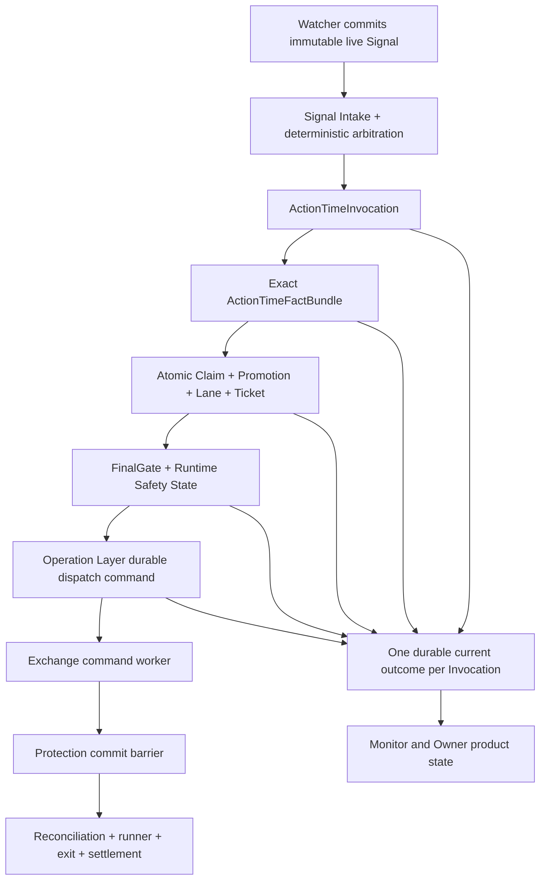
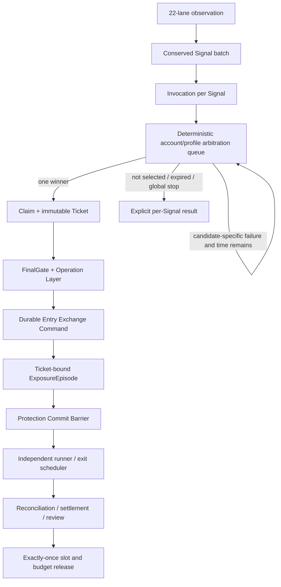

# P0 多仓位端到端执行收敛设计

## 0. 2026-07-21 自然信号生产复盘覆盖

### 0.1 覆盖关系

本节是 **2026-07-21 当前生产证据覆盖**。当本节与后文基于
`60999176` 的阶段判断、Owner 确认门或旧 first blocker 冲突时，以本节为准。
后文的 Signal-to-exit 不变量、删除优先原则和 R0-R9 设计继续有效。

当前工程结论为：**Ticket issuer 已接入生产编排，但自然信号链仍未闭合**。
watcher 本身保持无 Ticket 权限是正确边界；实际 Ticket producer 是 watcher 后置的
`action_time_if_needed` typed coordinator。2026-07-21 的自然信号已经触发该 producer，
但停在 `materialize_account_safe_facts`，因此后续 Ticket consumer 只能看到
`no_actionable_pg_ticket`。

### 0.2 已知客观事实

| 事实 | 当前证据 | 设计含义 |
| --- | --- | --- |
| **运行版本** | Tokyo `/home/ubuntu/brc-deploy/app/current` 为 `25483180`；PG revision 为 **142** | 本问题不是旧 release 未切换 |
| **服务健康** | backend、watcher timer、monitor timer、lifecycle timer 均 active；最近 oneshot result 为 success | systemd 存活与交易链可用必须分开判断 |
| **自然信号** | 11:32 与 11:35 watcher 出现 fresh signal；其中 `signal:b37a62a6147794bc9a932c0984e83074` 被报告为 `ready_for_action_time_ticket_materialization` | 策略信号条件已经至少一次满足，不能归类为纯市场等待 |
| **Action-Time 进度** | `85-action-time-refresh-if-needed.conf` 触发 typed coordinator；本次停在 `materialize_account_safe_facts` | Ticket producer 存在，当前 first blocker 位于 producer 的事实束入口 |
| **Ticket 结果** | dispatcher 随后返回 `no_actionable_pg_ticket`；PG Ticket current 为 0，历史状态仅 `closed=6`、`expired=54` | consumer 正常拒绝无 Ticket，但其 `blocker_class=none` 会掩盖上游失败 |
| **账户与容量** | 同一窗口只读交易所事实为 0 active position、0 open order；PG Account Current 为 `0/2`、`new_entry_allowed=true`、reconciliation matched | 当前 first blocker 没有证据指向仓位容量或 Owner 停止授权 |
| **副作用** | lifecycle capability enabled；`exchange_write_called=false`、`order_created=false` | 本次没有误下单，也没有完成自然 Ticket-to-trade 验收 |
| **补查边界** | 11:36 后本地 SSH 两次有界重连超时 | 精确 account-safe blocker code 必须从 PG process outcome 补取，不能凭日志阶段名臆造 |

来源：2026-07-21 Tokyo systemd journal、PG current/audit、signed read-only exchange GET、
当前 tracked code `25483180`。

### 0.3 当前 blocker 分类

```text
chain_position: action_time_boundary
stage_reached: action_time_invocation_selected_and_typed_coordinator_started
first_blocker_class: action_time_boundary_not_reproduced
first_blocker_detail: materialize_account_safe_facts business-blocked before Ticket commit
owner_action_required: false
authority_change_required: false
```

这不是策略信号不满足，也不是新增聊天授权缺失。Owner policy、FinalGate、
Operation Layer 和 submit-mode 仍必须在后续逐级通过，但本次链路在到达这些边界前已停止。

### 0.4 完整 Ticket-to-trade 问题矩阵

| 链路阶段 | 已部署能力 | 当前问题或未完成证明 | 分类 | 优先级 |
| --- | --- | --- | --- | --- |
| Signal → Invocation | bounded Signal intake、确定性 arbitration、每 Signal Invocation/process outcome 代码已部署 | 自然信号 Invocation、selected result 与最终 blocker 尚未形成一次可直接查询的端到端验收行 | 工程与可观测性 | **P0** |
| Invocation → Account Facts | typed coordinator 已调用真实只读 account collector | collector 仍以 legacy flat-only `account_safe_facts_ready` 作为总闸；它不能表达 `0/2`、`1/2` 下 exact NettingDomain 可开第二仓的语义 | 工程模型错误 | **P0** |
| Account Facts → Ticket | atomic fact/promotion/reservation/lane/Ticket savepoint 已部署 | 本次未越过 account facts；没有证明自然事实束能在最短 TTL 内创建 Ticket | 工程验收缺口 | **P0** |
| Deadline | coordinator 有 30 秒预算，systemd 有 37 秒 Action-Time timeout | account collector 顺序调用 6 个端点，并再次并发调用 5 个 account-risk 端点；单请求 timeout 被重复使用，remaining deadline 没有贯穿每个网络调用 | 性能与时序错误 | **P0** |
| Ticket → FinalGate/Runtime Safety | typed coordinator 可 materialize FinalGate、handoff、Runtime Safety State | coordinator 与 dispatcher 都会触碰 FinalGate/handoff 语义，存在两个编排 owner；Ticket TTL 与 dispatcher 的新 timeout 不是同一 deadline | 所有权与时序风险 | **P0** |
| Dispatcher | 只消费 PG Ticket、拒绝 file identity，边界正确 | `no_actionable_pg_ticket` 在上游 Invocation 已失败时仍投影为 `running + blocker_class=none`；失败被消费者的空结果覆盖 | Current truth 错误 | **P0** |
| Automation identity | dispatcher 可为本机 API 自签 operator session | 自动交易进程依赖 Operator Console session secret/UI auth adapter；这不是 Owner policy，但属于不必要的部署耦合和单点故障 | 服务边界风险 | **P1** |
| Operation Layer → durable submit | submit-mode decision、durable command、idempotency、`outcome_unknown` 对账已有代码与 PG 测试 | 当前 release 没有自然信号到达该阶段；constructed/fixed-clock 证明不能替代自然 producer-to-consumer 验收 | 运行验收缺口 | **P1** |
| Submit → protection/lifecycle | protection、first tick、continuous reconciliation、runner、settlement、review 为部署基线 | 当前 0 position/0 order 且 timer 健康；但新 release 尚无自然 Ticket 证明 entry、SL、TP1、runner、exit、release 的同一 lineage | Live calibration | **R1B** |
| Owner/monitor truth | PG process outcomes、shared reducer、server monitor 已部署 | watcher 的“待物化”、Action-Time 的实际失败和 dispatcher 的“无 Ticket”仍可形成三种互相矛盾的当前状态 | 产品状态错误 | **P0** |

### 0.5 系统性根因

本次暴露的不是一个 if 条件，而是以下组合：

```text
watcher 只负责 Signal，边界正确
-> 后置 Action-Time producer 使用全账户 legacy flat-only gate
-> account facts 重复采集且 deadline 分裂
-> Ticket 未创建
-> dispatcher 只看 Ticket，返回无动作
-> current projection 没有把 exact Invocation failure 提升为当前 first blocker
-> 系统看起来“运行中”，真实机会却已过期
```

测试逃逸原因同样是系统性的：

1. typed coordinator 单测把 account、Ticket、FinalGate、handoff、safety 全部 mock 成完整结果；
2. PostgreSQL 测试分别证明 Signal arbitration 与 Ticket materialization，但没有从真实
   account snapshot producer 贯穿 typed coordinator 与 dispatcher；
3. systemd 测试主要验证 drop-in 字符串存在，没有模拟同一 watcher tick 的三个
   `ExecStartPost` 与共享 TTL；
4. downstream fake/fixed-clock 证明从完整 Ticket 或完整事实开始，绕过了真实 producer 边界；
5. monitor 测试没有要求“selected Invocation 失败时，no Ticket 不得清空 first blocker”。

### 0.6 目标架构：一个 Invocation、一个事实束、一个 deadline、一个 current outcome



#### 0.6.1 Exact ActionTimeFactBundle

新增的是 typed application model，不是 JSON 文档表。一个 Invocation 的事实束必须包含：

- `action_time_invocation_id`、完整 `RuntimeLaneIdentity` 与 source watermark；
- 一次并发采集形成的 account、position、regular order、algo order、account mode snapshot；
- exact `account_id + exchange_id + runtime_profile_id`；
- exact `exchange_instrument_id + NettingDomainKey`；
- fresh instrument rule、leverage bracket 与 executable price refs；
- Account Capacity Current version、claimed slots、remaining capacity、same-domain conflict；
- 每项事实的 observed/valid-until、source snapshot ID 与 failure code；
- trusted refs 与 observed-but-blocked refs 分离，失败事实可审计但不能获得 submit authority。

`account_safe_facts_ready` 不再等价于“账户完全 flat”。新闸门为：

```text
base account safety healthy
+ exact snapshot complete and fresh
+ Account Capacity Current allows one claim
+ exact NettingDomain has no conflicting position/order/hold
= account_actionability_ready
```

#### 0.6.2 单一编排所有权

Action-Time coordinator 是 `Signal/Invocation → dispatch-ready command` 的唯一应用层 owner：

1. materialize exact fact bundle；
2. atomic Claim/Promotion/Lane/Ticket；
3. FinalGate；
4. Runtime Safety State；
5. Operation Layer handoff；
6. durable dispatch command commit。

dispatcher 只领取 durable command 并调用官方 submit adapter。它不得重新选择 Ticket、
重建 FinalGate、重置 deadline 或用“无 Ticket”解释上游失败。

#### 0.6.3 统一 deadline

```text
effective_deadline = min(
  signal.expires_at_ms,
  every trusted fact.valid_until_ms,
  ticket.expires_at_ms when created,
  action_time_started_at_ms + 30_000
)
```

所有 PG lock、HTTP、signed GET 和 dispatcher 领取均从 remaining deadline 派生。
网络事实并发获取；不得给 6 个顺序请求各分配完整 12 秒，也不得在 systemd 下一阶段重置预算。

#### 0.6.4 Current truth conservation

每个 selected Invocation 必须有一个 current outcome：

```text
processing
| business_blocked(first_blocker, stage, fact refs)
| retryable_failure(first_blocker, stage, retry deadline)
| hard_failure(first_blocker, incident ref)
| dispatch_ready(ticket/command refs)
| submitted(attempt/command refs)
| terminal(outcome ref)
```

`no_actionable_pg_ticket` 只允许用于“当前没有 selected/processing/failed Invocation”的纯空闲状态。
只要某个 fresh Signal 已 selected 且未产生 Ticket，monitor 必须显示系统处理失败或暂不可用，
不能显示 blocker none 或 market wait。

### 0.7 不采用的方案

| 方案 | 拒绝原因 |
| --- | --- |
| 在 watcher 中把 `allow_action_time_ticket_materialization` 改成 true | 把观察者升级成交易 producer，破坏权限边界，并形成第二条 Ticket 路径 |
| dispatcher 发现无 Ticket 时临时创建 Ticket | consumer 反向承担 producer 职责，无法绑定 exact facts/deadline/transaction |
| 只把当前 account-safe blocker 改成忽略 | 会绕过 active position/open order、NettingDomain 与 snapshot freshness 安全检查 |
| 延长 systemd timeout | 掩盖重复网络采集和 deadline 分裂，不能保证 signal/fact 仍新鲜 |
| 再加一个 report/JSON glue script | 违反 PG current 和 zero recurring file-I/O 边界 |
| 要求 Owner 每次确认 Ticket | 把工程缺口转成手工操作，违反 Owner supervisor 模型 |

### 0.8 当前完成定义

本轮设计关闭只允许在以下条件全部成立后声明：

1. 自然或 production-shaped raw signal 经真实 fact producer 创建 exact Invocation outcome；
2. 0/2 与 1/2 不再被 legacy flat-only gate 阻止，2/2 与 same-domain 仍 fail-closed；
3. account facts 每 Invocation 只形成一个 authoritative snapshot generation；
4. producer、dispatcher 和 monitor 使用同一 deadline 与 source watermark；
5. selected Invocation 未产生 Ticket 时，所有 current surfaces 显示同一 first blocker；
6. Ticket 后只存在一个 FinalGate/handoff orchestration owner；
7. automation 不依赖人工 Operator Console session；跨 HTTP 时使用独立 service identity；
8. no-signal tick 创建 **0 JSON/MD**，Action-Time PG writes 有界；
9. disposable PG、two-worker、deadline、restart、duplicate delivery、0/1/2 capacity、
   fake exchange 与 monitor parity 全绿；
10. Tokyo bounded deploy 后，下一 distinct natural signal 要么到达 durable dispatch/submit，
    要么在同一 Invocation 上留下一个真实安全/策略/账户 blocker，不能再次无 Ticket 丢失。

## 1. 决策摘要

### 1.1 核心目标

本设计解决剩余的 **多仓位端到端工程问题**：每个符合条件的真实信号都必须被保存、选择或明确淘汰；每个被选择的交易必须拥有独立 Ticket、订单、保护、runner、退出、对账和容量释放链路。

目标链路为：

```text
Detector Decision
-> Signal
-> Invocation
-> deterministic arbitration
-> Capacity Claim
-> Ticket
-> FinalGate
-> Operation Layer
-> durable Exchange Command
-> ExposureEpisode
-> protection
-> independent runner / exit
-> reconciliation / settlement / review
-> exactly-once capacity release
```

这不是提高仓位上限的设计。当前约束保持：

```text
max_concurrent_positions = 2
max_new_action_time_lanes = 1
```

### 1.2 当前阶段判断

系统已有单笔真实交易和双仓位预算组件，但尚未完成多信号、多进程、双 Ticket 和故障恢复条件下的全链认证。当前阶段是 **Late Integration + Production Hardening + Pre-Certification**。

来源：当前 tracked code、commit `60999176`、P0-ACH 设计与 PostgreSQL disposable certification。

### 1.3 Owner 设计原则落实

本设计采用 **合理激进、删除优先、核心替换、拒绝长期兼容层**：

1. 错误的全局选择器直接删除，不再增加筛选补丁。
2. subprocess/stdout 内部协议由 typed coordinator 替换。
3. 重复状态集合由共享语义内核替换。
4. 一次性 repair 逻辑迁入正式 projector/reconciliation service 后删除。
5. 新 Ticket 禁止进入 `legacy_unbound` 路径。
6. 每个替换切片必须同时声明旧路径删除条件。

真实资金边界仍然 fail-closed：错误账户、错误 instrument、陈旧事实、重复提交、未知交易所结果、缺失保护、FinalGate/Operation Layer 绕过均不可放宽。

## 2. 已知客观事实

| 事实 | 当前证据 | 工程含义 |
| --- | --- | --- |
| **Schema Truth 基础** | Migration 141、Decimal、NettingDomain、detector identity 已有本地与 disposable PG 证明 | 不需要再以 migration 作为默认修复手段 |
| **全局触发** | `run_server_product_state_refresh_sequence.py` 仍按 Ticket/Lane/Promotion/Signal 逐层 `LIMIT 1` | 多信号在正式仲裁前仍可能丢失或被隐式排序 |
| **内部协议** | Action-Time critical path 仍使用 subprocess、stdout JSON 和 exit code | deadline、错误语义和事务边界分裂 |
| **Ticket sequence** | 仍保留 Invocation 模式和 global/non-Invocation 模式 | 两套生产语义可能漂移 |
| **状态解释** | Invocation、Promotion、Ticket、Attempt、Lifecycle、Ops 分别维护 active/terminal 集合 | 同一事实可能在不同 consumer 中得到不同结论 |
| **历史兼容** | `legacy_unbound`、legacy account-safe、retired executor stub 和 repair 路径仍存在 | 维护成本和误调用面继续扩大 |

## 3. 方案比较

| 方案 | 优点 | 风险 | 决策 |
| --- | --- | --- | --- |
| 局部补丁 | 改动小、短期快 | 保留双路径、重复语义和后续 repair | 拒绝 |
| 一次性重写整条交易系统 | 最终结构干净 | 真实资金爆炸半径过大、回滚点不足 | 拒绝 |
| **纵向切片替换** | 每次替换一个权威边界并删除旧路径 | 需要严格串行和强测试 | **采用** |

## 4. 核心身份模型

### 4.1 PositionExecutionUnit

定义 **PositionExecutionUnit** 作为协调概念，不新增万能 Aggregate 或通用文档表。一个交易单元由以下身份共同确定：

```text
signal_event_id
+ action_time_invocation_id
+ ticket_id
+ account_id
+ runtime_profile_id
+ exchange_instrument_id
+ position_mode
+ position_bucket
+ netting_domain_key
+ exposure_episode_id
```

任何层不得从 symbol、StrategyGroup 或“最新记录”推断缺失身份。

### 4.2 Aggregate 边界

| Aggregate | 唯一职责 | 禁止承担 |
| --- | --- | --- |
| Detector / Signal | 市场事件和计算事实 | 预算、Ticket、订单权限 |
| Invocation / Arbitration | 本次尝试及选择结果 | 交易所结果 |
| Claim / Budget Current | 容量、风险、保证金占用 | 信号有效性 |
| Ticket | 不可变交易意图和版本绑定 | 实际成交状态 |
| Exchange Command | 外部写入的 exactly-once 身份 | 策略治理 |
| ExposureEpisode | 机械仓位所有权 | 信号与晋级状态 |
| Lifecycle / Exit Policy | 保护、部分退出、runner、终退 | 新机会仲裁 |

## 5. 目标架构



### 5.1 Global 与 per-trade 边界

只有四类服务是账户全局服务：

1. 宽观察与 Signal intake；
2. 新机会的确定性仲裁；
3. Account Budget / Capacity Current；
4. Exchange Command dispatch scheduler。

Ticket 创建后的保护、runner、退出、对账、结算和 review 必须全部按 **Ticket + ExposureEpisode** 运行。

## 6. 多信号守恒与确定性仲裁

### 6.1 Intake

每个 bounded fresh execution-eligible Signal 必须得到：

```text
one Invocation
+ one process outcome
+ one terminal or selected result
```

单轮最大批量为 **64 Signals**，防止异常积压拖垮 Action-Time。

### 6.2 稳定排序

```text
Owner policy priority
-> candidate scope priority
-> event_time_ms ascending
-> observed_at_ms ascending
-> signal_event_id ascending
```

数据库返回顺序、进程启动顺序和 watcher 写入顺序不得影响结果。

### 6.3 Aggressive Fallback

同一 `account_id + runtime_profile_id` 仲裁轮中：

1. 先关闭 invalid、expired、duplicate 和 already-terminal Signal。
2. 从最高排名候选开始。
3. 候选特有的 pre-Claim blocker 允许在 deadline 内尝试下一候选。
4. `2/2 capacity`、账户未知、Owner pause、exchange safety stop 等全局 blocker 立即结束整轮。
5. 一旦一个 Claim/Ticket 提交，其他 Signal 写 `not_selected_this_round + winner_ref + rank`。
6. 任何情况下单轮最多提交一个新 Claim/Ticket。

这比“第一个失败就整轮停止”更激进，同时不突破一次一个新 Action-Time lane 的政策。

## 7. 容量与双仓位一致性

### 7.1 容量是 ownership union

```text
active capacity owners =
  reservation-only Claim
  UNION active ExposureEpisode
  UNION unresolved submit outcome / active NettingDomain hold
```

同一 Ticket 从 Claim 转换成 Exposure 时仍是一个 owner，禁止双计。

### 7.2 生命周期

```text
reservation_only
-> ticket_bound
-> working_entry
-> open_protected / partially_exited / runner_active
-> flat_reconciled
-> settled_released
```

### 7.3 Release Gate

只有以下条件全部满足才释放容量：

- exact NettingDomain 的交易所仓位为 flat；
- 没有 remaining working-entry quantity；
- 没有 unresolved 或 leased Exchange Command；
- 没有意外存活的保护订单；
- reconciliation matched；
- settlement/review terminal event 被 exactly-once 消费。

进程结束、服务重启、Ticket 过期或本地异常本身均不得释放容量。

## 8. Same-Instrument Boundary

在 **one-way mode** 下，同一 `account + instrument + BOTH` 会被交易所净额合并，因此不能作为两个独立仓位管理。第二个相同 NettingDomain 的 Ticket 必须被阻止，除非未来单独设计并授权 scale-in/position aggregation 模型。

不同 instrument 可独立占用两个槽位。hedge mode 的 LONG/SHORT 只有在账户与交易所当前事实明确证明时才是两个 bucket。

## 9. Durable Submit 与 Unknown Outcome

官方边界固定为：

```text
Ticket
-> FinalGate pass
-> Operation Layer handoff
-> durable Exchange Command committed
-> worker lease
-> exchange write
-> authoritative outcome or outcome_unknown
```

网络 I/O 禁止发生在 Account Budget 或 arbitration lock 内。worker 在 dispatch 后崩溃时，必须使用稳定 client-order identity 查询交易所，禁止创建第二条提交命令。

`outcome_unknown` 保留 Claim、slot 和 NettingDomain hold，直到对账证明 submitted 或 absent。

## 10. Protection Commit Barrier

Entry 被交易所接受不等于交易链完成。每个 Ticket 必须满足：

```text
entry fill truth
+ initial stop accepted
+ TP1 accepted when policy requires
+ protection reconciliation matched
= open_protected
```

partial fill 按 exact filled quantity 调整保护。保护失败保持当前 hard safety incident 和容量占用，不能降级成历史 warning。

## 11. 独立 Runner 与退出

Runner 以 Ticket 为调度单位。入场使用 15m 或 1h 并不决定 runner cadence；实际 cadence、TP1、移动止损和终退规则来自 Ticket 绑定的 exit-policy version。

每次 runner tick 必须校验：

- `ticket_id + exposure_episode_id`；
- exact position quantity 和 bucket；
- current protection generation；
- 没有竞争中的 lifecycle command；
- exit-policy hash 和 reference snapshot；
- 该退出动作要求的新鲜事实。

15m SOR Ticket 与 1h StrategyGroup Ticket 可以同时运行不同退出节奏，不共享“latest active ticket”状态。

## 12. Terminal Closure

```text
final exit observed
-> residual protection cancelled or proven absent
-> position/open-order reconciliation matched
-> ExposureEpisode terminal
-> PnL / fee / funding settlement
-> Review Ledger capture
-> Account Budget release
```

每一步均可重试且幂等。release semantic fingerprint 防止重复释放。

## 13. Runtime Semantic Kernel

共享内核只定义稳定语义：

```text
phase: observation / selection / pre_submit / submitted / protected / exit / closure
state: running / blocked / terminal / outcome_unknown
terminal_kind: selected / not_selected / expired / rejected / completed / cancelled
reason_code: extensible typed cause
```

统一提供：

- `is_active`；
- `is_terminal`；
- `is_current`；
- `is_operationally_relevant`；
- legal transition；
- blocker owner 与 Owner-action 映射。

Candidate、Goal、Monitor、Ops 和 Forensics 必须使用同一 reducer 和 PG watermark。

## 14. Current Projection 唯一写入者

R7 的详细 Current/Historical 分界、共享 reducer 输入输出、incident fingerprint、watermark、consumer cutover 和 legacy 删除条件，以
`docs/current/P0_R7_CURRENT_TRUTH_REDUCER_AND_LEGACY_RETIREMENT_DESIGN.md`
为执行权威。本节保留顶层 ownership 约束。

| Projection | Sole writer |
| --- | --- |
| Detector decision + Signal | observation application transaction / durable outbox |
| Invocation + arbitration | Action-Time intake/arbitration service |
| Exposure/Budget Current | account truth projector |
| Ticket/Command/Lifecycle Current | ticket-bound lifecycle reducer |
| Runtime Health/Incident Current | shared operational reducer |
| Owner notification current | server monitor notification projector |

## 15. 删除与替换清单

| 历史债 | 动作 | 删除条件 |
| --- | --- | --- |
| `_action_time_trigger_identity()` 全局 `LIMIT 1` | **删除业务选择职责** | bounded arbitration two-worker tests 通过 |
| refresh sequence subprocess/stdout JSON | **用 typed coordinator 替换** | typed result 覆盖 Signal→handoff |
| Ticket sequence global/non-Invocation 分支 | **删除生产可达性** | 所有生产调用强制 Invocation ID |
| 各 readmodel 重复状态集合 | **替换为 Semantic Kernel** | consumer parity tests 通过 |
| 新 Ticket 的 `legacy_unbound` exit policy | **直接拒绝** | 新 Ticket 全部 version-bound |
| retired direct runner/orphan executor stub | **删除模块与 import** | durable command reachability 证明通过 |
| 一次性 repair current mutator | **迁入正式 projector 后删除** | dry-run/apply/idempotency 通过 |
| JSON/stdout/file authority | **从生产决策删除** | PG/current readmodels 覆盖语义 |

临时 adapter 只能存在于一个 commit series，并在切片验收前删除。禁止 dual writer。

## 16. 性能与运行成本

| Surface | Contract |
| --- | --- |
| Observation | 22 lanes；每 lane/event/closed candle 最多一条 decision；no-signal tick 生成 **0 JSON/MD** |
| Signal intake | 每轮最多 64；索引批量查询；确定性排序 |
| Action-Time | 全局 deadline ≤ **30 秒**，且不晚于 Signal/Ticket/Fact expiry |
| PG lock | 无网络 I/O；timeout 从 remaining deadline 派生；只覆盖 selection/Claim commit |
| Lifecycle | Ticket/status/next-due 索引队列；禁止全历史扫描和 latest-row 选择 |
| Retention | 引用中的 Signal/Ticket/incident provenance 永久保留；其他历史按现有 retention chunk 删除 |
| Disk/log | 无 recurring report files；journald、PG、backup 均有阈值与 owner |

验收记录 p50/p95/p99 和 `EXPLAIN ANALYZE`。禁止以扩大 30 秒 deadline 隐藏性能问题。

## 17. Migration 与兼容规则

Migration **141** 仍是当前 candidate head。剩余修复默认使用代码、query、reducer 和删除。只有现有 schema 无法表达稳定、可索引、需数据库约束的不变量时才允许新 migration。

Strategy seed、Owner policy、运行状态 repair 和新 reason code 均不得放入 migration。

新 writer 产生事实后禁止 schema downgrade 或整库 rollback。previous code 仅 readonly compatible 时，Writer Fence 保持启用并 forward-fix。

## 18. 故障隔离与回滚

- 生产 apply 前，每个代码切片可独立 revert。
- migration apply 后保持 schema forward。
- new writer 激活后，失败时关闭 new entry，但继续已有仓位 protection/reconciliation。
- 不得删除 Ticket、Command、ExposureEpisode 或 lifecycle history。
- 任何 rollback 不得恢复已退休的 global selector、stdout protocol 或 direct executor。

## 19. 完成定义

必须同时满足：

1. 每个 fresh Signal 有 Invocation 和明确结果；
2. two-worker arbitration 最多提交一个新 Ticket；
3. 0/2、1/2、2/2、第三请求线性一致；
4. 两个不同 instrument Ticket 的订单、保护、runner、退出互不串线；
5. one-way same-domain 第二 Ticket 被正确阻止；
6. crash、timeout、unknown outcome 保留 exact capacity；
7. terminal Ticket 只释放自己的 slot/risk/margin 一次；
8. 所有 current consumer 对 active/terminal/first blocker 一致；
9. 删除清单中的旧路径已删除或机器证明不可达；
10. disposable PG、shadow restore、Tokyo no-write canary 通过，Writer Fence 仍启用。

## 20. Chain Position

```text
chain_position: action_time_boundary
strategy_group_id: five active StrategyGroups
symbol: 22 active candidate lanes
stage: multi_position_execution_convergence_design_complete
first_blocker: global single-row trigger and fragmented per-trade lifecycle semantics prevent certified Signal-to-exit isolation
evidence: commit 60999176 and current tracked code; refresh sequence retains global LIMIT 1 plus subprocess/stdout semantics, while lifecycle/readmodels retain duplicate status and legacy paths
next_action: execute the implementation plan beginning with Semantic Kernel and bounded Signal intake/arbitration
stop_condition: every Signal has a result; one new winner is linearizable; two Tickets remain isolated through protection, runner, exit and exactly-once release; legacy paths are deleted; predeploy certification passes
owner_action_required: true_for_design_confirmation_only
signal_event_id: multiple / production-shaped batch
promotion_candidate_id: none_at_design_stage
action_time_lane_input_id: none_at_design_stage
ticket_id: none_at_design_stage
authority_boundary: design only; no policy/profile/sizing expansion, no production migration, no FinalGate or Operation Layer bypass, no exchange write
```
