# P0 多仓位端到端执行收敛执行计划

## 0. 2026-07-21 R10 当前执行覆盖

### 0.1 覆盖声明

**R0-R9 已作为 `25483180` / schema `142` 的部署组件基线存在。**
本节定义自然信号暴露后的当前执行主线。当本节与后文“等待 Owner 实施/部署确认”、
`60999176` first blocker 或旧部署前停止点冲突时，以本节为准。

本轮不改变 StrategyGroup、symbol/side、2.5% Stop risk、max 2 positions、
max 1 new Action-Time lane、notional、leverage、FinalGate 或 Operation Layer 权限。

### 0.2 当前 Live Enablement 状态

```text
Live Enablement Before:
  fresh live Signal persisted
  -> Invocation selected / typed coordinator started
  -> blocked at materialize_account_safe_facts
  -> no Ticket
  -> dispatcher reported no_actionable_pg_ticket

Live Enablement After R10:
  fresh live Signal persisted
  -> exact Invocation FactBundle
  -> atomic Claim/Promotion/Lane/Ticket or exact blocker
  -> FinalGate/Runtime Safety/Operation handoff under one deadline
  -> durable dispatch command
  -> official protected submit or exact hard blocker
  -> same-lineage lifecycle/reconciliation/settlement
```

**当前 first blocker:** `action_time_boundary_not_reproduced`，具体阶段为
`materialize_account_safe_facts`。精确 business blocker code 必须从 PG audit/process
outcome 读取；在无法补查时禁止推断为策略未满足或 Owner 未授权。

### 0.3 串行执行顺序

```mermaid
flowchart LR
    T00["R10-T00 Exact forensics"] --> T01["R10-T01 Production-shaped RED"]
    T01 --> T02["R10-T02 Exact ActionTimeFactBundle"]
    T02 --> T03["R10-T03 Single coordinator + deadline"]
    T03 --> T04["R10-T04 Durable dispatcher boundary"]
    T04 --> T05["R10-T05 Current truth + monitor"]
    T05 --> T06["R10-T06 PG/full-chain certification"]
    T06 --> T07["R10-T07 Bounded Tokyo deploy"]
    T07 --> T08["R10-T08 Natural-event acceptance"]
```



T02-T04 都触及 Action-Time 主链，必须串行。T05 的 readmodel/monitor 实现可在 T04
接口冻结后并行准备测试，但合并与部署必须在 T04 之后。

## R10-T00 — Exact Production Forensics Freeze

### Task Packet

**Task ID:** `P0-ACH-R10-T00`

**Goal:** 固定 2026-07-21 自然信号从 Signal 到 account-safe blocker 的 exact PG 谱系。

**Why:** 当前已知失败阶段，但 SSH 中断后缺少精确 account-safe blocker、Invocation ID
和 snapshot refs。没有 exact lineage 就不能决定事实生产器与 projection 的修复范围。

**Allowed files:** 无 production edit；只读 Tokyo/PG/exchange query；必要时更新本文档的
completion record。

**Forbidden actions:** restart、deploy、migration、手工 PG update、Ticket/Signal 插入、
exchange write、credential 输出。

**Requirements:**

1. 查询 `signal:b37a62a6147794bc9a932c0984e83074` 的 StrategyGroup/symbol/side/Event Spec；
2. 查询 exact Invocation、arbitration rank/result、fact snapshot IDs、process outcomes；
3. 查询是否存在 promotion/lane/reservation/Ticket，确认 atomic rollback 范围；
4. 查询 Owner policy/runtime binding 的 enabled/tier/live-submit 状态和版本；
5. 对照 signed GET、Account Current、core orders/positions 与 ticket-bound orders；
6. 输出一个 first blocker、一个 owner、一个 next action，不生成 repo JSON/MD report。

**Done When:** exact signal lineage 可以解释“为何没有 Ticket”，且策略、授权、账户事实、
工程故障不再混为一类。

**Hard Stop:** 未保护仓位、unknown exchange outcome、duplicate command、账户/交易所不一致。

## R10-T01 — Production-Shaped RED Matrix

### Task Packet

**Task ID:** `P0-ACH-R10-T01`

**Goal:** 在修改 producer 前建立真实 watcher→Invocation→facts→Ticket→dispatcher 的失败复现。

**Allowed files:** focused unit/integration tests、disposable PostgreSQL fixtures、fake signed
GET provider、systemd orchestration harness。

**Forbidden files:** production implementation、policy、migration、exchange gateway。

**Requirements:**

1. 从 raw detector decision/live signal row 开始，禁止注入完整 Ticket-ready dictionary；
2. 使用真实 `conserve_and_arbitrate_fresh_signals` 与真实 typed coordinator；
3. account provider 只 mock HTTP response，不 mock `account_safe_facts_ready`；
4. 覆盖 0/2、1/2 different instrument、2/2、same NettingDomain、open regular/algo order；
5. 覆盖 sequential endpoint latency、deadline 前后 1ms、outer timeout、dispatcher delay；
6. 覆盖 selected Invocation 失败后 dispatcher 不得返回 blocker none；
7. 覆盖 duplicate watcher tick、service restart、two workers 和 exact idempotency。

**Blocker Removed Or Reclassified:** 把“只在生产出现”转成 deterministic RED。

**Tests:** 新 PostgreSQL integration + systemd-sequence harness；SQLite 不得替代 lock/Numeric。

**Done When:** 至少一个 RED 精确复现 2026-07-21 断点，且每个后续 task 有对应失败用例。

## R10-T02 — Exact ActionTimeFactBundle 与双仓位事实语义

### Task Packet

**Task ID:** `P0-ACH-R10-T02`

**Goal:** 用一个 Invocation-bound typed fact bundle 替换 legacy flat-only account-safe 总闸。

**Allowed files:**

- `src/application/action_time/account_safe_facts.py`；
- `src/application/action_time/runtime_pg_fact_snapshots.py`；
- `src/application/action_time/account_capacity_materialization.py`；
- `src/infrastructure/binance_usdm_account_risk_snapshot.py`；
- 新纯 typed domain/application model；
- focused tests。

**Forbidden files:** Owner policy值、max position、notional/leverage、migration，除非 T02 先证明
现有 schema 无法保存 stable indexed invariant 并重新进入 Schema Truth Gate。

**Requirements:**

1. 以 exact Invocation identity 解析 account/profile/instrument/NettingDomain；
2. 一次并发 signed GET generation 获取 account、positions、regular/algo orders、mode；
3. 删除 action-time 内重复 account/position/order/mode 网络采集；
4. instrument rules/leverage refs 复用 fresh PG snapshot，缺失时按 remaining deadline bounded refresh；
5. `account_actionability_ready` 使用 Account Capacity Current 与 exact-domain conflict；
6. 0/2、1/2 different instrument 可继续；2/2、same-domain、unknown snapshot fail-closed；
7. blocked snapshots 保留 observed refs，但不得进入 trusted refs 或 submit authority；
8. 事实 bundle 的 snapshot generation/version 在 Ticket、FinalGate、Runtime Safety 中保持一致。

**Live Enablement State After:** natural Invocation 可以在真实账户 0/2 或合法 1/2 状态继续，
也可以留下 exact capacity/domain blocker。

**Done When:** legacy `active_position_clear && open_orders_clear` 不再是双仓 Ticket 的总闸，
且所有 hard conflict negative tests 仍通过。

**Hard Stop:** 通过忽略 open order/position 来“修好”Ticket，或把不完整 snapshot 标记为 safe。

## R10-T03 — 单一 Action-Time Coordinator 与统一 Deadline

### Task Packet

**Task ID:** `P0-ACH-R10-T03`

**Goal:** 让一个 coordinator 独占 Invocation 到 durable dispatch-ready command 的编排。

**Allowed files:**

- `src/application/action_time/typed_coordinator.py`；
- `src/application/action_time/ticket_materialization_sequence.py`；
- FinalGate、Runtime Safety、Operation handoff application services；
- `scripts/run_server_product_state_refresh_sequence.py`；
- systemd Action-Time drop-in；
- focused tests。

**Forbidden files:** watcher Ticket 权限、loose FinalGate/Operation parameters、exchange write bypass。

**Requirements:**

1. input 仅 `action_time_invocation_id`；
2. effective deadline 取 Signal/facts/Ticket/30s 最小值；
3. 每个 network/PG/API timeout 从 remaining budget 派生；
4. Ticket atomic transaction 保持 Claim/Promotion/Lane/Ticket all-or-none；
5. FinalGate、Runtime Safety、handoff 只由 coordinator materialize 一次；
6. coordinator 成功必须提交 durable dispatch command identity；
7. 每个失败步骤同步写 Invocation current outcome 与 audit；
8. 删除或机器证明不可达的第二 orchestration branch 不得作为 fallback 保留。

**Performance acceptance:** account network calls 并发；Action-Time p95/p99 在 budget 内；
无 signal 时不进入 heavy path；每 no-signal tick **0 JSON/MD**。

**Done When:** 一个 Invocation 不会被 coordinator 和 dispatcher 各自重放 FinalGate/handoff，
systemd 阶段切换也不会重置 TTL。

## R10-T04 — Durable Dispatcher Boundary

### Task Packet

**Task ID:** `P0-ACH-R10-T04`

**Goal:** dispatcher 只领取 durable command，并通过官方 application port 进入 protected submit。

**Allowed files:** dispatcher、Operation Layer application service、protected-submit command worker、
systemd wiring、focused tests。

**Forbidden files:** UI/Operator policy、Owner credential、withdrawal/transfer、gateway bypass、第二 submit path。

**Requirements:**

1. dispatcher input 仅 durable dispatch command ID；
2. 禁止重新选择 latest Ticket、重做 FinalGate、重建 Runtime Safety；
3. 优先直接调用 typed official application port；不得依赖 Operator Console UI session；
4. 若架构强制保留 HTTP，必须使用现有 server-owned service boundary；任何新 credential 需求
   立即停止并单独升级 Owner 授权，不在本 task 偷渡；
5. durable Exchange Command 先 commit，再 network I/O；
6. crash-before/after-dispatch、timeout、outcome_unknown、duplicate worker 保持 exactly-once；
7. submit mode 仍由 PG policy/current Runtime Safety 决定，systemd `armed` 不是绕过凭证。

**Done When:** UI auth 不再是自动交易依赖，且 fake exchange ledger 证明每 command 最多一次 effect。

## R10-T05 — Current Truth、Monitor 与 Owner 状态收敛

### Task Packet

**Task ID:** `P0-ACH-R10-T05`

**Goal:** 让 Signal、Invocation、Ticket consumer 和 monitor 对同一 first blocker 一致。

**Allowed files:** shared current reducer、process outcome relevance、Candidate/Goal/Tradeability、
server monitor、notification、forensics、tests。

**Forbidden files:** 新 current table、JSON cache、用过滤历史制造假健康。

**Requirements:**

1. selected/processing/failed Invocation 的优先级高于 `no_actionable_pg_ticket` 空闲结论；
2. `no_actionable_pg_ticket + blocker none` 仅在没有 current Invocation 时成立；
3. watcher `ready_for_action_time_ticket_materialization` 在 Owner 面只映射为“处理中”；
4. exact stage、first blocker、source watermark、fact refs 在 developer forensics 可查询；
5. monitor 仅在状态变化/需要介入时通知，重复同 blocker PG dedupe；
6. business blocker 不让 oneshot systemd 变 failed，但也不能被标为 market wait；
7. later same-lane success 可清 current blocker，audit history 保留。

**Done When:** Readiness、Tradeability、Goal、Monitor、dispatcher 对同一 fixture 的
first blocker、Owner state、owner_action_required 完全一致。

## R10-T06 — PostgreSQL 与 Ticket-to-trade Full-Chain Certification

### Task Packet

**Task ID:** `P0-ACH-R10-T06`

**Goal:** 在无真实 exchange write 条件下证明完整 producer-to-lifecycle 链。

**Requirements:**

1. six Event Specs 从 raw facts/decision 到 exact Invocation FactBundle；
2. 0/2 与 1/2 positive；2/2、same-domain、stale、missing、conflict negative；
3. Signal→Ticket→FinalGate→handoff→durable command→fake exchange→protection barrier；
4. two Tickets different instrument 的 protection/runner/exit/release 隔离；
5. two-worker、kill/restart、lock/statement timeout、deadline、duplicate delivery；
6. actual systemd order `watcher → summary → action-time → dispatcher` 的等价 harness；
7. `scripts/audit_production_runtime_file_io.py` 报告 `performance_risk.status=clear`；
8. production credential 调用数 0，exchange write 0。

**Done When:** 不再存在从 downstream-complete fixture 开始的唯一 happy-path 证明；
真实 producer-consumer contract 全绿。

## R10-T07 — Bounded Tokyo Deploy

### Task Packet

**Task ID:** `P0-ACH-R10-T07`

**Goal:** 在当前 focused branch 上完成可回滚的 exact-SHA 部署，并保持真实资金边界。

**Preconditions:**

- clean scoped diff；
- focused + PG + file-I/O + performance tests 全绿；
- exact migration head 与 release manifest 对齐；
- signed GET 证明 positions/orders/protection/reconciliation 正常；
- 没有 unknown exchange outcome、unprotected position 或 duplicate command。

**Sequence:**

```text
verify exchange/PG/account truth
-> engage Writer Fence only if writer transition requires
-> git fetch/export exact commit
-> Alembic only when an approved migration exists
-> switch app/current
-> restart only affected units
-> publish current projections
-> no-write canary
-> verify backend/watcher/monitor/lifecycle
-> release fence only after exact acceptance
```

本开发阶段的 focused commit 和 bounded Tokyo apply 已在 Standing Authorization 内，
不新增普通聊天确认门。若出现 credential mutation、destructive migration、profile/sizing/scope
变化，则立即停止并升级 Owner 决策。

**Done When:** deploy、schema、units、PG lineage、no-write canary、file-I/O/performance 全部通过。

## R10-T08 — Natural-Event Acceptance

### Task Packet

**Task ID:** `P0-ACH-R10-T08`

**Goal:** 使用下一个 distinct eligible natural signal 验收正式 Ticket-to-trade 路径。

**Acceptance:**

1. Signal、Invocation、FactBundle、Claim、Promotion、Lane、Ticket lineage 完整；
2. 若被真实策略/账户/安全条件阻止，保存一个 exact blocker 且 Owner state 正确；
3. 若全部通过，FinalGate、Runtime Safety、Operation handoff、durable command、submit attempt 完整；
4. 真实提交后立即进入 protection barrier、reconciliation 和 lifecycle scheduler；
5. exchange/local outcome unknown 时停止新 entry 并对账，不重复提交；
6. 最终 closure 释放该 Ticket 自己的 slot/risk/margin 一次；
7. 不强制制造第二仓，不把未出现自然机会当工程失败。

**Done When:** 一个 distinct natural identity 到达真实 terminal outcome，或到达一个真实、
可操作、未被 monitor 掩盖的 hard/business blocker。

## 0.4 Git、分支与提交管理

| 项目 | 规则 |
| --- | --- |
| **工作分支** | 继续 `codex/budget-model-review-20260714`；当前 Tokyo 与本分支同 head `25483180`，无需从 stale parent 新开修复线 |
| **隔离** | 核心 execution/risk/lifecycle 文件串行；非核心 readmodel 测试可在独立 `codex/*` worktree 准备，必须由主控审查后合并 |
| **提交粒度** | T01 test-only；T02 facts；T03 coordinator；T04 dispatcher；T05 projection；T06 certification；T07 deploy receipt |
| **禁止混入** | `.agents/skills/skill-creator/` 等无关 untracked 用户文件、`output/**`、reports、runtime generated files |
| **合并门** | 每 commit 独立可测、无旧 fallback reachability、没有 policy/profile/sizing diff |
| **回滚** | code-only slice 可 revert；一旦新 writer 产生事实，保持 schema forward 并用 fence + forward-fix，不恢复旧 producer/dispatcher 路径 |

建议提交主题：

```text
test: reproduce natural signal account-fact chain break
fix: bind exact action-time account fact bundle
refactor: unify action-time deadline and coordinator ownership
refactor: dispatch durable operation commands without operator session
fix: conserve invocation blocker across no-ticket projections
test: certify natural signal ticket-to-trade chain
```

## 0.5 R10 Program Stop Conditions

以下任一条件成立即停止 apply 或自然交易推进：

- exact production blocker 尚未取证，却试图按猜测改 gate；
- unprotected position、unknown exchange outcome、duplicate submit/command；
- 2/2 capacity、same NettingDomain conflict 或 Account Current mismatch；
- facts/Ticket/deadline stale；
- Owner policy、runtime scope、profile、sizing、credential 发生未授权变化；
- typed coordinator 与 dispatcher 仍各自 materialize FinalGate/handoff；
- selected Invocation failure 仍被 `no_actionable_pg_ticket` 清空；
- no-signal tick 写 JSON/MD 或 Action-Time 引入无界历史扫描；
- PostgreSQL concurrency/timeout/restore 或 fake exchange exactly-once 未通过。

## 0.6 R10 Chain Position

```text
chain_position: action_time_boundary
strategy_group_id: exact value pending PG lineage refresh
symbol: exact value pending PG lineage refresh
stage: natural_signal_selected_typed_coordinator_account_facts_blocked
first_blocker: action_time_boundary_not_reproduced:materialize_account_safe_facts
evidence: Tokyo 2026-07-21 11:32-11:36 systemd/PG/signed-GET snapshot at release 25483180 schema 142
next_action: execute R10-T00 exact lineage freeze, then R10-T01 RED before production changes
stop_condition: deployed natural signal reaches exact Ticket-to-trade terminal outcome or one genuine conserved blocker
owner_action_required: false
authority_boundary: no policy/profile/sizing/scope expansion, no credential mutation, no FinalGate/Operation Layer bypass, no duplicate submit
signal_event_id: signal:b37a62a6147794bc9a932c0984e83074
promotion_candidate_id: none_observed
action_time_lane_input_id: none_observed
ticket_id: none_observed
```

## 1. 执行目标

将当前系统推进到 **多仓位部署前认证完成**：每笔被选择的交易从 Signal 到 Ticket、真实订单准备、保护、runner、退出、对账和容量释放都具有独立、可恢复、可验证的链路。

本计划完成时停止在：

```text
exact certified commit
+ candidate migration head
+ disposable/shadow PostgreSQL certification
+ deployment package and rollback runbook
+ Writer Fence enabled
= deployment_confirmation_gate
```

不在本计划内执行东京部署、生产 migration、Writer Fence 解除或强制真实交易。

## 2. 当前基线

| 项目 | 基线 |
| --- | --- |
| Branch | `codex/budget-model-review-20260714` |
| Commit | **`60999176`** |
| Candidate migration head | **141** |
| Unit baseline | **138 focused tests passed** |
| Disposable PostgreSQL | migration、capacity concurrency、dynamic-head harness 已通过 |
| Remaining first blocker | global single-row trigger + fragmented per-trade lifecycle semantics |

## 3. 执行原则

1. **一个切片，一个权威替换，一个旧路径删除。**
2. 核心 entry、risk、lifecycle 文件串行修改。
3. 每个切片先写 RED，再实现，再执行 deletion/reachability test。
4. 不为兼容旧调用保留长期双路径。
5. 不因 live-only 条件阻止 rehearsal、PG、fake exchange 和 no-write 认证。
6. 不改变策略参数、风险预算、position cap、symbol/side scope。
7. 新 migration 必须重新通过 Schema Truth Gate，不允许顺手追加。

## 4. 依赖顺序


R1 与 R0 结束前不得并行修改 execution core。R5、R6 涉及相同 lifecycle/command 表面，必须串行。

## 5. R0 — Baseline、RED 与删除清单冻结

### Task Packet

**Task ID:** `P0-MP-R0`

**Goal:** 固定所有剩余 failure classes、旧路径和当前测试基线。

**Why:** 没有删除清单和 RED，容易把旧路径保留成“临时兼容”。

**Allowed files:** focused tests、reachability audit、两份本文档 completion record。

**Forbidden files:** production implementation、policy、migration。

**Requirements:**

1. RED 覆盖 same-timestamp 8 Signals、random insertion、two workers。
2. RED 覆盖 0/2、1/2、2/2、third requester、same domain。
3. RED 覆盖两个 Ticket runner/exit isolation。
4. RED 覆盖 timeout、crash、outcome_unknown、partial fill、protection failure。
5. 生成机器可读的旧路径清单，但结果只写测试 stdout，不生成 repo report。
6. 冻结 141 graph checksum 和 commit baseline。

**Chain Position:** `action_time_boundary`

**State Before:** failure evidence 分散。

**State After:** 每类剩余问题都有稳定 RED 和删除目标。

**Tests:** new focused RED tests；migration graph test；file-I/O audit。

**Done When:** 每个后续 Task 都能引用 exact failing test 和 exact old path。

**Hard Stop:** 用文档描述替代 executable RED。

## 6. R1 — Runtime Semantic Kernel

### Task Packet

**Task ID:** `P0-MP-R1`

**Goal:** 统一 active、terminal、current、outcome_unknown 和 operational relevance。

**Allowed files:** 新纯 domain semantic module、Invocation、process outcome relevance、focused consumer adapters/tests。

**Forbidden files:** 数据库 I/O 进入 domain、万能 Aggregate、status reason migration。

**Requirements:**

1. 实现 stable phase/state/terminal_kind/reason_code。
2. 实现 legal transition 和 terminal irreversibility。
3. Invocation expiry/close、Ticket、Attempt、Command、Lifecycle 使用同一 predicate。
4. reason code 不进入频繁变化 CHECK enum。
5. 先接入 execution/current hot consumers，再删除其本地 status sets。

**Blocker Removed:** `runtime_state_semantics_diverged`。

**Acceptance:** 同一 fixture 在 Candidate、Goal、Ops、Forensics 中 active/terminal 结论一致。

**Tests:** transition table、expiry、unknown outcome、closed-but-relevant、historical warning negatives。

**Done When:** execution hot path 不再自行维护重复 terminal set。

**Hard Stop:** 把 unknown outcome 当作安全 terminal。

## 7. R2 — Signal Intake 与确定性仲裁

### Task Packet

**Task ID:** `P0-MP-R2`

**Goal:** 保存所有 fresh Signal，按稳定规则选择至多一个新 Ticket winner。

**Allowed files:** Action-Time Invocation、new typed intake/arbitration service、promotion/lane、runtime process outcome、focused PG tests。

**Forbidden files:** Owner priority 数值、Capital Allocation V1、exchange write、多个并行新 winner。

**Requirements:**

1. bounded batch max 64，删除 global latest-Signal selector 的业务职责。
2. 每 Signal exactly one Invocation。
3. 排序固定为 policy/candidate/event/observed/signal ID。
4. account/profile domain 使用 row/advisory lock。
5. candidate-specific pre-Claim failure 可在 deadline 内尝试下一候选。
6. global blocker 关闭整轮并写相同 root cause。
7. one winner 后 losers 写 `not_selected_this_round`、rank、winner_ref。
8. duplicate delivery、retry、worker death 不产生第二 Invocation/Claim/Ticket。

**Live Enablement Before:** Signal 可能无 Invocation 或被 LIMIT 1 隐式丢弃。

**Live Enablement After:** 每个 Signal 有结果，唯一 winner 可解释。

**Tests:** 8/32/64 Signals、random order、two workers、winner expiry、first candidate blocker fallback、global 2/2 stop。

**Done When:** `action_time_invocation_missing` 和无结果 Signal 在 production-shaped fixture 中为 0。

**Hard Stop:** 依赖数据库隐式顺序或提交两个 winner。

## 8. R3 — Typed Action-Time Coordinator

### Task Packet

**Task ID:** `P0-MP-R3`

**Goal:** 用 typed coordinator 替换 critical-path subprocess/stdout 协议，并完整执行 global deadline。

**Allowed files:** new application coordinator、refresh sequence、fact materialization、Ticket sequence、FinalGate/handoff typed calls、deadline tests。

**Forbidden files:** exchange gateway、45 秒扩容、stdout 作为业务真值。

**Requirements:**

1. coordinator 输入为 Invocation ID，不接受 global/no-Invocation production mode。
2. typed step result 包含 state、blocker、identity、deadline、side-effect counters。
3. `global_deadline=min(signal,ticket,fact,30s)`，只能缩短。
4. API/PG timeout 从 remaining budget 派生。
5. deadline 不足在下一 authority boundary 前持久化 typed outcome。
6. deadline 后 Claim/Ticket/handoff 新写入为 0。
7. 删除 `_structured_child_process_outcome` 等 critical-path stdout parser。
8. 删除 Ticket sequence 的 production global branch。

**Tests:** deadline 前后 1ms、fact expiry 缩短、timeout kill、transaction rollback、typed error parity。

**Done When:** production Action-Time critical path 无 subprocess/stdout business protocol。

**Hard Stop:** 保留旧路径作为 fallback。

## 9. R4 — Capacity 与 Occupancy 线性化

### Task Packet

**Task ID:** `P0-MP-R4`

**Goal:** 让 Claim、Exposure、Command、Hold 和 Budget Current 对 0/1/2 状态得出唯一答案。

**Allowed files:** capacity claim/reservation、Exposure/Budget projector、hot-path repository、Ticket/Command ownership、formal repair projector、PG tests。

**Forbidden files:** position cap 修改、symbol-only conflict、manual production SQL。

**Requirements:**

1. capacity owner 使用 Ticket/ExposureEpisode identity union。
2. pending Claim 转 Exposure 不双计。
3. same one-way NettingDomain 第二 Ticket fail-closed。
4. different instrument 可占两个独立 slot。
5. outcome_unknown、active hold、missing protection 保留容量。
6. lifecycle release 与新 Claim 并发时线性化。
7. formal projector 替代一次性 current mutator；旧 repair path 删除。
8. FinalGate、watcher、next-entry gate 读取相同 Account Current。

**Tests:** 0→1、1→2、2→3 blocked、same domain、different domain、close-vs-claim、crash-vs-claim、pending→Exposure、exact release。

**Done When:** 所有 consumer 的 claimed slots、held risk、pending margin 一致。

**Hard Stop:** 因进程消失或本地 Ticket 过期释放容量。

## 10. R5 — Durable Submit 与 Protection Barrier

### Task Packet

**Task ID:** `P0-MP-R5`

**Goal:** 证明每个 Ticket 的 entry command 和初始保护独立、幂等、可恢复。

**Allowed files:** Codex-owned execution core、Exchange Command、worker、protected submit、fill projector、protection materializer/reconciler、tests。

**Forbidden files:** FinalGate/Operation Layer bypass、credential、sizing/profile mutation。

**Requirements:**

1. durable command 必须先提交 PG，再进行 exchange write。
2. worker lease、client-order ID、request fingerprint 唯一。
3. network ambiguous 进入 outcome_unknown 并保留容量。
4. partial fill 按 exact quantity 创建/调整保护。
5. initial stop 和 required TP1 全部 matched 后才是 `open_protected`。
6. 两个 Ticket 的 command/protection generation 不互相覆盖。
7. retired direct submit/protection executor 删除或不可达。

**Tests:** before/after dispatch crash、duplicate worker、authoritative reject、unknown recovery、partial fill、protection reject、two-ticket isolation。

**Done When:** fake exchange ledger 证明每 command 至多一次外部 effect，且每 Ticket 独立保护。

**Hard Stop:** unknown outcome retry submit 或无保护释放容量。

## 11. R6 — 独立 Runner、终退与 Closure

### Task Packet

**Task ID:** `P0-MP-R6`

**Goal:** 两个仓位可使用各自 exit-policy cadence、保护 generation 和终退链路。

**Allowed files:** exit-policy binding/service、runner scheduler/command/adjuster、lifecycle command materializer、reconciliation、finalizer、settlement/review tests。

**Forbidden files:** global latest Ticket、symbol-only lookup、新 Ticket legacy_unbound。

**Requirements:**

1. runner queue key 为 Ticket + ExposureEpisode + next_due。
2. cadence 来自 exit-policy，不从 entry timeframe 猜测。
3. 新 Ticket 必须 version-bound；legacy_unbound 只允许历史只读解释。
4. 一个 Ticket 的 TP1/SL/runner mutation 不影响另一个 Ticket。
5. final exit 后先清保护、对账，再 terminal exposure。
6. settlement/review 后 exactly-once release。
7. 删除 retired direct runner/orphan executor 和不再使用的 import。

**Tests:** 15m + 1h concurrent policies、TP1 on A while B unchanged、runner mutation race、final exit unknown、position flat with live stop、double finalizer。

**Done When:** 两 Ticket lifecycle event streams 和 capacity release 完全隔离。

**Hard Stop:** global latest-row runner 或批量按 symbol 关闭订单。

## 12. R7 — Current Reducer 与历史债删除

本阶段的详细任务切片、Allowed/Forbidden files、CurrentTruthBundle、Incident、Monitor/Forensics cutover、continuation 收敛与 repair mutator 删除条件，以
`docs/current/P0_R7_CURRENT_TRUTH_REDUCER_AND_LEGACY_RETIREMENT_IMPLEMENTATION_PLAN.md`
为执行权威。

### Task Packet

**Task ID:** `P0-MP-R7`

**Goal:** 所有 Owner/ops/readmodel 使用同一 current truth，并删除替换完成的历史路径。

**Allowed files:** shared reducer、Candidate/Goal/Daily/Ops/Forensics、monitor/notification、reachability tests、删除清单文件。

**Forbidden files:** 新 health table、新 JSON cache、隐藏历史错误。

**Requirements:**

1. 所有 projection 使用相同 PG watermark/run ID。
2. current issue 与 historical warning 分离。
3. incident fingerprint、recovery 和 Owner action 唯一。
4. detector false 为 computed_not_satisfied，不是 missing。
5. 逐项删除 global selector、stdout parser、global Ticket path、duplicate status sets、retired executor、current mutator。
6. ripgrep/import/runtime reachability 必须为 0。

**Tests:** consumer parity、historical warning negatives、notification dedupe、recovery once、deleted import/reachability audit。

**Done When:** 同一 snapshot 的 first blocker 在所有 current surfaces 一致。

**Hard Stop:** 通过过滤历史行制造假健康。

## 13. R8 — PostgreSQL Full-Chain 与 Chaos Certification

### Task Packet

**Task ID:** `P0-MP-R8`

**Goal:** 使用真实 PostgreSQL 和 fake/no-write exchange 认证完整多仓位链。

**Allowed surfaces:** disposable PG、production-shaped seed/snapshot、fake exchange ledger、process crash harness、performance tools。

**Requirements:**

1. `001→106→seed→head` 和 production baseline→head 均通过。
2. schema fingerprint 等价。
3. raw detector input 走到两个 independent lifecycle closure，禁止手工构造完整下游对象。
4. two workers、random order、kill/restart、lock timeout、statement timeout 全覆盖。
5. 0/1/2、third requester、same domain、different domain、unknown outcome、missing protection 全覆盖。
6. Action-Time p95/p99、EXPLAIN、row growth、retention、file-I/O 全通过。
7. exchange write 使用 fake ledger，production credential 调用数为 0。

**Tests:** new multi-signal PG、multi-position PG、full-chain chaos、schema fingerprint、restore tests。

**Done When:** machine-readable matrix 全绿且 no forbidden effect。

**Hard Stop:** SQLite 替代 lock/Numeric/concurrency 认证。

## 14. R9 — Shadow Restore 与部署前包

### 14.1 当前执行状态

**R7** 的共享 Current Truth 与旧路径退役已完成，**R8** 的 disposable
PostgreSQL 全链与 chaos 认证已完成。R9 尚未改变东京、生产 schema、生产
role、Writer Fence 或交易所；它只允许生成 exact commit 的预部署证据，并将
缺失的 shadow/role/previous-writer 证据保持为明确 blocker，不能以本地测试
替代。

### 14.2 已获得的 R9 只读证据

| 证据项 | 结论 | 影响 | 来源 |
| --- | --- | --- | --- |
| Migration graph | 单 head **`142`**；checksum 由 `prepare_multi_position_predeploy_package.py` 计算 | 可作为 candidate release 的不可变输入 | 本地 Git，2026-07-20 |
| Local PostgreSQL | disposable certification DB 当前无业务表，不能冒充 production shadow | 必须从 production backup 恢复到新 shadow 后再 fingerprint | 本地 Docker readonly catalog，2026-07-20 |
| Tokyo role topology（授权前） | 原运行 identity `brc_dryrun` 具有 superuser、`CREATEROLE` 与 `CREATEDB` | 触发独立 credential/role authorization；不得用旧 identity 进入部署前通过状态 | Tokyo `dingdingbot-pg` container readonly catalog，2026-07-20 |

因此授权前的 `role_topology_decision` 为
**`credential_or_secret_change_required`**。该生产权限边界已在 Owner 于 2026-07-20
单独授权后完成 provisioning；当前 pending application/migration identities 的实际
readonly audit 结果见 14.4，结论为 `existing_roles_sufficient`。在部署事务激活 active
env 前，旧 `brc_dryrun` 服务仍继续运行，不能将“已 provision”误报为“已 cut over”。

角色拓扑必须使用 `scripts/audit_postgres_role_topology.py` 的 stdout-only 审计结果
复核。该工具只在 read-only transaction 中读取 PostgreSQL catalog，并对连接身份
输出 hash reference；它不读取、输出或修改 credential，也不执行 role DDL。
`prepare_multi_position_predeploy_package.py` 直接消费该审计结果；移除任何可将
role topology 人工标为 `passed` 的命令行路径。

### 14.4 已完成的 Shadow、Compatibility 与 PostgreSQL 认证

| Gate | 结果 | 证据 |
| --- | --- | --- |
| Production backup → shadow | **passed** | Tokyo 以 `brc_runtime_migrator` 导出 custom dump；local disposable `brc_shadow_r9_20260720_clean` restore 后为 186 tables、18 sequences、revision 140；传输 checksum/size 匹配且东京 `/tmp` dump 已清理 |
| Shadow forward upgrade | **passed** | local PostgreSQL `140 → 141 → 142 (head)`；无 production migration |
| Candidate schema fingerprint | **passed** | `sha256:498c25595e46a5f8bc6c3dbf366b1c672cbc575bc0c881f90e844e5f82ae715b`；3599 columns、996 constraints、641 indexes |
| Pending role topology | **passed** | Tokyo readonly audit 使用 `brc_runtime_app` pending credential 与 `brc_runtime_migrator`：无 application CREATE/ALTER/DROP、无 credential change required、decision=`existing_roles_sufficient` |
| Previous code readonly compatibility | **passed** | Tokyo exact release `386cc3d761f17231a6c35d2bc96b347153cbd907` 在 upgraded shadow 的 readiness、Entry/Lifecycle/Projection/Monitor module imports、readonly canary DB startup 均通过；DML/DDL/exchange write=0 |
| Causal integrity PostgreSQL | **passed** | `tests/integration/test_runtime_causal_integrity_postgres.py`: 15/15 passed，64s |
| Capacity + account truth PostgreSQL | **passed** | `test_account_capacity_postgres.py` + `test_account_truth_convergence_postgres.py`: 6/6 passed，1.81s |

上述 shadow 与 tests 均在本地 disposable PostgreSQL 运行；Tokyo actions 仅包括
production catalog readonly、backup export 和已授权的 role/credential provisioning。
未执行 Tokyo deploy、服务 restart、production migration、Writer Fence 解除或 exchange
write。

### 14.5 Deployment Confirmation Gate Result

R9 predeploy manifest 已在 exact committed source 上生成，结果为
**`ready_for_owner_deploy_confirmation`**。它要求并已验证：migration graph 单 head
`142`、schema fingerprint、production backup shadow restore、four-surface previous
readonly compatibility、pending application/migration role topology、Writer Fence plan
与 no-write canary plan。manifest 必须在任何后续 source commit 后重新生成；本记录不
把静态 commit hash 复制为长期 authority。（来源：
`scripts/prepare_multi_position_predeploy_package.py` 的 stdout-only receipt，2026-07-20）

### 14.3 Production Role Convergence Record And Activation Design

2026-07-20 的 Owner 授权范围内，Tokyo production 已完成以下**未激活**的
数据库权限收敛：

| 身份 | 当前职责 | 权限边界 | 当前激活状态 |
| --- | --- | --- | --- |
| `brc_runtime_migrator` | database/schema、186 tables、18 sequences 的 owner；未来 Alembic migration | login；非 superuser；可在 `public` CREATE；默认授权 future table/sequence 给 application | pending credential 已创建；尚未用于 migration command |
| `brc_runtime_app` | runtime/backend/watcher/monitor/lifecycle 的 PG connection | login；非 superuser；无 `CREATEROLE/CREATEDB`；无 `public` CREATE；无 object owner；无 membership；186 tables 的 `SELECT/INSERT/UPDATE/DELETE` 与 18 sequences 的 `USAGE/SELECT/UPDATE` | pending credential 已创建；任何 systemd unit 尚未引用 |
| `brc_dryrun` | historical bootstrap identity | 仍保留，直至 deployment canary 证明新 identities 后再单独决定退休策略 | 当前运行服务仍使用；不可据此宣称 role cutover 完成 |

来源：Tokyo `dingdingbot-pg` container 的 role/object/privilege catalog 和使用新
credentials 的 TCP connection readonly validation，2026-07-20。凭据均为随机
生成、server-owned、mode `0600` 的 pending files；其值未进入仓库、stdout、文档或
agent context。

未来 deployment transaction 的固定顺序为：

```text
Writer Fence engaged + writer units stopped
-> validate pending migration/application credentials
-> atomically promote pending application env to active runtime env
-> execute application-role readonly preflight with active application env
-> use migration identity for Alembic only
-> use active application env for candidate current/projection/canary/runtime
-> prove application session user has no DDL/owner/membership bypass
-> keep fence until no-write canary and activation receipt pass
```

不得在本阶段写入或覆盖 `live-readonly.env`：它仍含独立的 exchange/notification
configuration。active runtime env 必须在 deployment window 内由 server-side helper
仅替换 `PG_DATABASE_URL`，并保留其他 existing keys，避免读取/输出或误删现有 secret。
任何 rollback 在 pointer switch 前只删除未激活 active env；pointer switch 后遵循
Writer Fence + forward-fix，不回退 schema 或重新启用旧 superuser runtime path。

候选代码将该顺序固化为 deploy journal 的
`runtime_application_env_activated` phase：它从 base env 仅移除
`PG_DATABASE_URL`/`DATABASE_URL`，追加 application DSN 后以 `0600` 原子写入 active
env。`pre_migration`/`schema_migrated` 只使用 migration env；pointer 之后的
projection、facts、canary、lifecycle 与 systemd runtime 使用 active application env。
若 active env 已存在但内容与本次 merge 不一致，transaction fail closed。
application preflight 在 `pre_migration` 前独立运行，绝不从 migration env 中调用；
否则 migration identity 会伪装成 application identity，必须 fail closed。

no-write canary 不再通过旧超级用户 `SET ROLE pg_read_all_data` 伪造只读身份；它必须
直接连接 `brc_runtime_app`，验证非 superuser、无 schema CREATE，并在
`SET TRANSACTION READ ONLY` 内使全部 DML probe 被拒绝。该变化保证 canary 同时验证
真实 runtime credential 与 no-write boundary。

### Task Packet

**Task ID:** `P0-MP-R9`

**Goal:** 准备 exact commit 的部署包，停止在 Owner 部署确认前。

**Allowed surfaces:** release manifest、deploy plan、PG backup/restore rehearsal、role topology readonly audit、Writer Fence plan、postdeploy readonly commands。

**Forbidden actions:** 东京 apply、生产 migration、grant/revoke apply、exchange write、Writer Fence 解除。

**Requirements:**

1. exact commit、source digest、migration head、graph checksum、schema fingerprint。
2. production backup restore 到 shadow 并执行 candidate upgrade/full-chain checks。
3. previous writer compatibility 分 Entry、Lifecycle、Projection、Monitor 四类。
4. role topology 输出 application/migration identity、owner、membership、DDL capability。
5. deployment 前 Writer Fence receipt 和恢复命令准备完整。
6. postdeploy no-write canary 命令、stop condition、rollback/forward-fix runbook 完整。
7. 产出 `ready_for_owner_deploy_confirmation` 或 exact blocker。

**Done When:** 部署所需命令和证据齐备，但没有改变东京状态。

**Hard Stop:** role topology unknown、backup restore 未验证、需要 secret 变化或 destructive migration。

## 15. 测试矩阵

| 维度 | 必须覆盖 |
| --- | --- |
| Signal | 1、8、32、64；同 timestamp；随机顺序；重复 delivery |
| Arbitration | first candidate fail then fallback；global blocker；two workers；winner expiry |
| Capacity | 0/2、1/2、2/2、third requester、same domain、different domain |
| Submit | before/after dispatch crash、reject、timeout、outcome_unknown、duplicate worker |
| Fill/protection | zero fill、partial fill、full fill、SL reject、TP1 reject、resize |
| Runner | 15m/1h 不同 cadence、TP1、stop movement、competing command |
| Exit | final exit accepted/rejected/unknown、flat + live protection、double finalizer |
| Recovery | restart、lease expiry、projector replay、release-vs-claim race |
| Projection | Candidate/Goal/Ops/Forensics/notification parity |
| Performance | deadline 30s、PG lock/statement timeout、EXPLAIN、row growth、retention |

## 16. Commit 与回滚点

| Slice | Commit subject | Rollback class |
| --- | --- | --- |
| R0 | `test: freeze multi-position execution red matrix` | code-only |
| R1 | `refactor: centralize runtime execution semantics` | code-only |
| R2 | `fix: conserve and arbitrate every live signal` | append-only Invocation facts retained |
| R3 | `refactor: replace action-time subprocess coordinator` | code-only before activation; forward-fix after facts |
| R4 | `fix: linearize multi-position capacity ownership` | schema forward; projector replay |
| R5 | `fix: isolate durable submit and protection per ticket` | Writer Fence + reconcile |
| R6 | `fix: isolate runner exit and release per ticket` | existing lifecycle remains active; forward-fix |
| R7 | `refactor: delete legacy runtime authority paths` | no old-path restoration after activation |
| R8 | `test: certify multi-position postgres full chain` | test-only |
| R9 | `chore: prepare multi-position predeploy package` | no production state change |

## 17. Deployment Confirmation Gate

最终交付必须明确：

```text
status: ready_for_owner_deploy_confirmation | blocked
exact_commit:
migration_head:
schema_fingerprint:
unit_test_count:
postgres_test_count:
full_chain_matrix:
deleted_path_count:
performance_risk.status: clear
file_io_risk.status: clear
role_topology_decision:
previous_code_compatibility:
writer_fence_plan:
backup_restore_status:
forbidden_effects: all_false
```

Owner 确认前停止，不执行部署。

## 18. Program Stop Conditions

以下任一存在即不得进入部署确认：

- fresh Signal 无 Invocation/result；
- 两 worker 可产生两个 winner；
- Claim 与 Exposure 双计；
- same one-way domain 可创建第二独立 Ticket；
- outcome_unknown 或 missing protection 释放容量；
- runner/exit 使用 global latest Ticket；
- 一个 Ticket 的保护或退出影响另一个 Ticket；
- current consumers first blocker 不一致；
- 删除清单存在 production reachability；
- 真实 PG、shadow restore、role topology、file-I/O 或 performance gate 未通过。

## 19. Chain Position

```text
chain_position: action_time_boundary
strategy_group_id: five active StrategyGroups
symbol: 22 active candidate lanes
stage: implementation_plan_ready
first_blocker: R1 Semantic Kernel and R2 bounded deterministic Signal arbitration are not implemented
evidence: design and current tracked code at 60999176
next_action: after Owner confirmation, execute R0 then R1 serially
stop_condition: ready_for_owner_deploy_confirmation with complete Signal-to-exit isolation and deleted legacy paths
owner_action_required: true_for_implementation_confirmation_only
authority_boundary: planning only; no production deployment, migration apply, exchange write, policy/profile/sizing change or Writer Fence release
```
