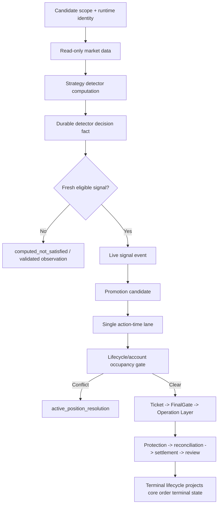

# P0 Production Runtime Full-Chain Readiness Remediation Design

> **Current authority note:** remaining detector、occupancy、core-order、Goal/Monitor
> and production-certification work is absorbed by `P0-ACH Schema Truth、Action-Time
> 与双仓位实盘前置收敛`. This document remains a component design source and must not
> run as a separate active P0 program.

## 1. Decision Summary

### 1.1 Core conclusion

**Tokyo infrastructure and service scheduling are healthy, but the production
runtime is not currently certified as capable of reacting to the next eligible
live signal.**

The observed defect is a four-part systemic failure:

1. **Observation is incorrectly gated by next-submit lifecycle clearance.**
   `next-attempt-observation-cycle` checks position/order clearance before it
   reads market data or runs the strategy detector.
2. **The legacy/core `orders` projection is stale.** Five protection rows remain
   `OPEN` even though the ticket-bound lifecycle projection records the same
   orders as `filled`, `cancelled`, or `replaced`, and every affected lifecycle
   is closed.
3. **Current read models conflate transport liveness, public-fact availability,
   and detector computation.** Healthy HTTP/compact transport can therefore be
   projected as validated market wait even when no strategy detector ran.
4. **Goal Status treats the latest historical submitted attempt as current
   forever.** It does not retire `real_order_submitted` after the corresponding
   lifecycle and post-submit closure reach terminal `closed` state.

The repair must be a **shared-core replacement**, not a one-time data patch:

```text
wide observation
-> durable detector decision fact
-> fresh live signal event when satisfied
-> promotion candidate
-> single action-time lane
-> lifecycle/account occupancy gate
-> Action-Time Ticket
-> FinalGate
-> Operation Layer
-> protection / reconciliation / settlement / review
```

The position/order gate remains fail-closed for **action-time narrowing and real
submit**, but it must not suppress read-only signal observation.

### 1.2 Owner decision requested

Approval of this design authorizes implementation and bounded Tokyo deployment
inside the existing runtime profile. It does not authorize:

- live-profile expansion;
- symbol, side, notional, leverage, or attempt-cap expansion;
- FinalGate or Operation Layer bypass;
- forced test orders;
- withdrawal, transfer, credential mutation, or secret changes;
- destructive deletion of production trading records.

## 2. Scope And Success Definition

### 2.1 Target product state

**Full-chain readiness** means the deployed program can do the following without
Owner manual operation:

```text
observe all active candidate lanes
-> compute exact detector facts
-> record current failed-fact or fresh-signal truth
-> promote a fresh eligible signal
-> narrow one action-time lane
-> refresh account/position/order/protection facts
-> create one exact Ticket
-> pass FinalGate when facts allow
-> call the official Operation Layer
-> protect, reconcile, settle, and review
```

This does not mean a trade must be forced during acceptance. The final live-only
condition may remain **a naturally occurring fresh signal**, but every
engineering-dependent capability before and after that condition must be
machine-certified.

### 2.2 In scope

- Tokyo backend, watcher, monitor, lifecycle timer, PG current projections, and
  deployment probes;
- observer/execution-gate separation;
- ticket-bound lifecycle to core order projection convergence;
- per-lane detector decision fact persistence;
- Candidate Pool, Tradeability, Daily Table, Goal Status, server-monitor and
  notification consistency;
- one-time non-destructive repair of the five proven stale core order rows;
- exact-head regression, PostgreSQL integration, canary, deploy and readonly
  production acceptance.

### 2.3 Out of scope

- strategy parameter or return optimization;
- new StrategyGroups or candidate symbols;
- new allocation policy, third concurrent position, or multi-account rollout;
- changing Owner risk budgets or current policy values;
- generating synthetic production signals or using rehearsal as live authority.

## 3. Known Objective Facts

The following facts were read from Tokyo on **2026-07-18**. They are current
machine evidence, not inference.

### 3.1 Service and deployment facts

| Surface | Current fact | Evidence source |
| --- | --- | --- |
| Release | **`19719b93d840742a76fd8f79548c720193a08989`** | release manifest and backend unit identity |
| DB schema | **136 migrations** | Tokyo readonly deployment probe |
| Backend | `active/running`, HTTP health `200`, `runtime_bound=true` | `systemctl`, `/api/health` |
| Writer capability | `BRC_EXECUTION_PERMISSION_MAX=order_allowed` | effective systemd unit |
| Watcher timer | active, approximately every **3 minutes** | `systemctl list-timers` |
| Monitor timer | active, approximately every **10 minutes** | `systemctl list-timers` |
| Lifecycle timer | active, approximately every **30 seconds** | `systemctl list-timers` |
| Disk | **31 GB available**, 46% used | `df -h` |
| Recent unit warnings | none in the inspected 90-minute window | `journalctl -p warning` |

### 3.2 Observation and projection facts

| Fact | Current value | Meaning |
| --- | ---: | --- |
| Candidate lanes | **22** | PG candidate scope / current coverage matrix |
| Current coverage rows | **22 healthy** | transport/projection liveness is current |
| Watcher business blockers | **19** | `NEXT-ATTEMPT-POSITION-ORDER-CONFLICT` |
| Public market fact snapshots | **22** | public input collection runs |
| Ready public symbols in captured tick | **5** | public-fact builder result |
| Recent HTTP 400 observation blockers | **0** in inspected window | prior transport contract defect is closed |
| Watcher top-level status | `blocked` / `watcher_attention` | signal detector did not run for blocked lanes |
| Server monitor status | repeated `notify_required` | current Goal Status remains misleading |

### 3.3 Position, order, and lifecycle facts

| Projection | Active/open rows | Terminal truth |
| --- | ---: | --- |
| Core `positions` | **0 active** | account/lifecycle projections are flat |
| Core `orders` | **5 OPEN protection rows** | stale current projection |
| Ticket-bound lifecycle runs | **6 closed live lifecycles**, 3 older submit failures | current lifecycle owner says closed |
| Ticket-bound protection rows | affected rows are `filled`, `cancelled`, or `replaced` | terminal order truth exists |
| Post-submit closures | **6 closed** | protection, reconciliation, settlement and review closed |

The exact stale core rows are:

| Symbol | Core role | Core status | Ticket-bound status |
| --- | --- | --- | --- |
| `AVAX/USDT:USDT` | SL | `OPEN` | `cancelled` |
| `BTC/USDT:USDT` | SL | `OPEN` | `filled` |
| `ETH/USDT:USDT` | SL | `OPEN` | `replaced` |
| `SOL/USDT:USDT` | SL | `OPEN` | `filled` |
| `SOL/USDT:USDT` | TP1 | `OPEN` | `cancelled` |

### 3.4 Current read-model contradictions

| Read model | Reported state | Contradicting fact |
| --- | --- | --- |
| Watcher coverage | `healthy` | 19 lanes returned a business blocker before detector computation |
| Candidate Pool | 21 lanes mostly `market_wait_validated` | those blocked lanes did not execute their strategy detector |
| MPG-001 / OPUSDT | `detector_not_attached` and watcher missing | a current healthy coverage row exists; detector fact is what is missing |
| Goal Status | `real_order_submitted` | latest corresponding lifecycle and post-submit closure are terminal `closed` |
| Monitor | repeated `notify_required` | notification is driven by stale Goal Status rather than current unresolved work |

## 4. Root Cause Analysis

### 4.1 Forward call chain

```text
brc-runtime-signal-watcher.timer
-> scripts/runtime_signal_watcher_tick.py
-> scripts/runtime_active_observation_monitor.py:2093
-> POST /strategy-runtimes/{id}/next-attempt-observation-cycle
-> src/interfaces/api_trading_console.py:5886
-> TradingConsoleReadModelService.owner_action_flow(...)
-> src/application/readmodels/trading_console.py:4889
-> _post_action_next_attempt_gate(...)
-> stale core orders count > 0 and active position count == 0
-> NEXT-ATTEMPT-POSITION-ORDER-CONFLICT
-> return before market_source/latest_closed_candles/detector evaluation
```

### 4.2 Exact failure condition

The blocking condition is implemented at
`src/application/readmodels/trading_console.py:4914`:

```text
pg_active_position_count
OR pg_open_order_count
OR exchange_position_count
OR exchange_open_protection_count
```

When only a core open-order row exists, the code enters
`position_order_conflict_requires_recovery` and emits
`NEXT-ATTEMPT-POSITION-ORDER-CONFLICT`.

`src/interfaces/api_trading_console.py:5912` then returns immediately before the
market source and runtime detector are invoked. The code is therefore executing
an **action-time occupancy rule at the observation boundary**.

### 4.3 Why the five rows remain open

The ticket-bound lifecycle uses these authoritative tables:

- `brc_ticket_bound_exit_protection_orders`;
- `brc_ticket_bound_order_lifecycle_runs`;
- `brc_ticket_bound_reconciliation_ticks`;
- `brc_ticket_bound_post_submit_closures`.

The core next-attempt gate reads the separate legacy/core tables:

- `orders` through `PgOrderRepository`;
- `positions` through `PgPositionRepository`.

The production reconciler terminalizes only
`brc_ticket_bound_exit_protection_orders`. It does not update the matching
`orders.id = local_order_id` row. Repository and source search confirms no
current ticket-bound terminal projector owns that synchronization.

The previous regression at
`tests/unit/test_ticket_bound_protection_reconciler.py:128` verifies only the
ticket-bound protection table. It never creates or asserts the core `orders`
projection consumed by `_post_action_next_attempt_gate`. This is the exact test
coverage gap that allowed local certification to pass.

### 4.4 Why current projections misreport market wait

`brc_watcher_runtime_coverage` correctly represents **technical liveness**, not
business readiness. However:

- `strategy_live_candidate_pool._pg_runtime_active_monitor_projection()` treats
  healthy coverage as active watcher scope;
- `_pg_replay_live_parity_projection()` derives `detector_attached` and
  `computed` from generic `pretrade_public` fact rows or prior readiness rows;
- the generic public-fact snapshot proves data availability, not that the
  strategy event detector ran;
- the current projector can therefore emit `market_wait_validated` without an
  actual detector decision fact.

This violates `BLOCKER_CLASSIFICATION_CONTRACT.md`: market wait requires a
current detector run and per-fact classification.

### 4.5 Why Goal Status remains `real_order_submitted`

`src/application/readmodels/strategygroup_runtime_goal_status.py:172` chooses
the latest `submitted` protected-submit attempt. The attempt is discarded only
when a newer active signal-chain object exists. It is not retired when its
ticket-bound lifecycle or post-submit closure becomes terminal.

With no newer fresh signal, the historical attempt remains selected and
`_pg_status_tuple()` returns `real_order_submitted` indefinitely. The monitor
therefore repeats `notify_required` even though the trade is already closed,
settled and reviewed.

### 4.6 Change origin

| Commit / period | Change | Current impact |
| --- | --- | --- |
| `e127a8cce`, 2026-06-08 | introduced `_post_action_next_attempt_gate` | lifecycle gate predates multi-lane watcher and is now applied too early |
| `7f0034fed`, 2026-07-07 | watcher began calling next-attempt observation API per runtime | legacy action gate became an observation-wide blocker |
| `bf634a7e`, 2026-07-18 | preserved typed blockers and result-backed liveness | exposed real business blocker after HTTP 400 repair, but did not separate observation from execution |
| `19719b93`, 2026-07-18 | additive sentinel schema acceptance | deployment fix is unrelated to the lifecycle/observation defect |

## 5. Expected Model Versus Actual Model

| Dimension | Expected | Actual | Defect |
| --- | --- | --- | --- |
| Observation order | compute detector first | next-submit gate first | active order state suppresses signal observation |
| Position/order authority | one lifecycle-derived current truth | core `orders` and ticket-bound tables diverge | stale projection blocks all matching symbols |
| Watcher liveness | transport/projection health only | consumed as detector readiness | false validated market wait |
| Detector truth | durable per-lane computation result | generic public facts used as proxy | computed/not-computed distinction is lost |
| Goal Status | current unresolved chain | latest submitted attempt | closed trade appears permanently active |
| Monitor notification | current abnormal state | stale Goal Status | repeated false attention state |
| Deploy probe | explicit target or repo-derived migration baseline | hard-coded 120/125 defaults | healthy schema 136 appears blocked |

## 6. Architecture Decision

### 6.1 Considered options

| Option | Benefit | Cost / risk | Decision |
| --- | --- | --- | --- |
| One-time SQL update of five orders | quickly clears current blocker | recurrence remains; observation still coupled; read models still lie | Reject as complete fix |
| Ignore reduce-only core orders in next-attempt gate | restores observation | may hide a real live protection order and leaves split authority | Reject |
| Run observation with `include_exchange=true` | adds exchange truth | adds signed GET load per lane and still blocks observation on business state | Reject |
| **Separate observation from execution and converge lifecycle projections** | fixes demonstrated class across all lanes and future lifecycles | bounded cross-module P0 change and schema/projector work | **Adopt** |

### 6.2 Target flow



### 6.3 Invariant A: observation cannot be blocked by submit occupancy

The observation endpoint must always attempt detector computation after these
observation-level checks pass:

- runtime exists and is active for observation;
- request identity matches runtime identity;
- runtime lane identity resolves from PG;
- market source and required detector inputs are available;
- event spec is current and typed.

Position, order, protection, budget and FinalGate facts are returned in a
separate `action_time_readiness` section. They may block promotion-to-action-time
or real submit, but not the detector calculation or durable signal observation.

### 6.4 Invariant B: one lifecycle occupancy projection owns submit blocking

Introduce one typed **`LifecycleOccupancySnapshot`** derived from current PG
ticket-bound truth and exact account/netting-domain identity. It answers only:

```text
flat_and_clear
open_protected
recovery_required
unknown_fail_closed
```

The snapshot must include:

- account and venue identity;
- canonical instrument and side/netting domain;
- active position quantity;
- current entry/protection order identities;
- lifecycle run and post-submit closure IDs;
- source timestamps and freshness;
- exact first blocker and recovery action.

`_post_action_next_attempt_gate` must consume this typed snapshot. It must stop
counting generic legacy open-order rows as sufficient authority.

### 6.5 Invariant C: core order projection converges at lifecycle terminalization

The ticket-bound lifecycle finalization path becomes the single owner for
terminal status convergence of matching core order rows.

Terminal mapping:

| Ticket-bound status | Core `orders.status` |
| --- | --- |
| `filled` | `FILLED` |
| `cancelled` | `CANCELED` |
| `replaced` | `CANCELED` for the replaced local order |
| `expired` | `EXPIRED` |
| `rejected` | `REJECTED` |

The update is allowed only when all identity checks match:

- `orders.id == exit_protection_orders.local_order_id`;
- ticket, symbol, role, exchange order ID and parent entry identity agree;
- lifecycle/post-submit closure proves terminal state;
- no current exchange position/open order contradicts terminalization.

No row is deleted. Every correction appends an audit event containing the old
status, new status, source lifecycle ID and `exchange_write_called=false`.

### 6.6 Invariant D: detector decision facts are durable and distinct

The watcher must persist one bounded per-lane detector decision snapshot using
`brc_runtime_fact_snapshots.fact_surface = 'pretrade_strategy'`.

The snapshot identity is stable for:

```text
strategy_group_id
+ symbol
+ side
+ event_spec_version
+ trigger_candle_close_time_ms
```

It records:

- `computed`;
- `satisfied`;
- exact failed facts;
- detector/evaluator identity and version;
- source watermark and candle-close time authority;
- signal grade and required execution mode;
- observation business state;
- first blocker when computation could not complete.

Generic `pretrade_public` rows remain input/data facts. They must not prove that
the strategy detector ran.

### 6.7 Invariant E: coverage, computation and actionability stay separate

| State family | Owner | Question answered |
| --- | --- | --- |
| Watcher coverage | `brc_watcher_runtime_coverage` | Did a current technical observation call complete? |
| Detector decision | `pretrade_strategy` fact snapshot | Did the strategy compute, and which facts passed or failed? |
| Pretrade readiness | `brc_pretrade_readiness_rows` owner projector | What is the first lane blocker now? |
| Runtime safety | ticket-bound safety current state | May this exact Ticket submit now? |
| Goal Status | goal-status owner projector | What current product state should Owner see? |

`market_wait_validated` requires both healthy coverage and a current detector
decision. Healthy coverage alone is insufficient.

### 6.8 Invariant F: Goal Status is closure-aware

`real_order_submitted` is current only while the corresponding attempt has an
unresolved lifecycle or post-submit closure.

When the latest attempt's closure is terminal `closed`, Goal Status must fall
through to the current pretrade state:

- fresh signal processing;
- action-time processing;
- precise engineering blocker;
- computed-not-satisfied/validated waiting;
- temporarily unavailable.

Historical submitted attempts remain audit evidence but cannot own current
product status.

### 6.9 Invariant G: deployment baselines are explicit

Readonly probe and postdeploy verification must not silently compare against
hard-coded migration counts from an older release. The target count and latest
migration must be:

1. explicitly supplied by the deploy plan; or
2. derived from the exact target release manifest.

Plan-only probes without an expected migration baseline may report facts and a
warning, but must not manufacture a mismatch blocker.

## 7. Current Chain Position

```text
chain_position: pretrade_candidate_readiness
strategy_group_id: MPG-001
symbol: SOLUSDT
stage: active_observation
first_blocker: active_position_resolution caused by stale core protection-order projection before detector computation
evidence: PG positions=0; core OPEN orders=2; ticket-bound SOL lifecycle=closed; ticket-bound SOL SL=filled and TP1=cancelled; watcher runtime strategy-runtime-718f8266de1e returns NEXT-ATTEMPT-POSITION-ORDER-CONFLICT
next_action: replace the observation-time next-attempt gate with lifecycle-authoritative occupancy separation and terminal core-order convergence
stop_condition: MPG-001/SOLUSDT produces a current detector decision fact while flat; action-time remains fail-closed unless exact lifecycle/account facts allow it
owner_action_required: false
signal_event_id: none current
promotion_candidate_id: none current
action_time_lane_input_id: none current
ticket_id: none current
authority_boundary: design and readonly evidence only; no FinalGate, Operation Layer, exchange write, profile change, or sizing change
```

## 8. Affected Components

### 8.1 Expected production code changes

| Component | Intended change |
| --- | --- |
| `src/interfaces/api_trading_console.py` | compute observation independently; return separate action-time readiness |
| `src/application/readmodels/trading_console.py` | replace generic count gate with typed lifecycle occupancy input |
| `scripts/runtime_active_observation_monitor.py` | persist detector decision facts; preserve typed computation/business state |
| `src/application/readmodels/watcher_decision_fact_projection.py` | extend typed observation result and bounded decision projection |
| `src/application/readmodels/strategy_live_candidate_pool.py` | consume actual detector decisions; stop deriving detector state from public facts |
| `scripts/publish_runtime_control_current_projections.py` | project readiness from coverage + detector facts + lifecycle occupancy |
| `src/application/readmodels/strategygroup_runtime_goal_status.py` | retire submitted status after terminal closure |
| `src/application/action_time/ticket_bound_lifecycle_finalizer.py` | invoke terminal order projection convergence |
| `src/application/action_time/lifecycle_maintenance_service.py` | bounded repair/convergence cadence owner |
| `src/infrastructure/pg_order_repository.py` | typed conditional terminal status update if needed |
| `scripts/probe_tokyo_runtime_governance_readonly.py` | remove stale implicit migration baseline blocker |
| `scripts/verify_tokyo_runtime_governance_postdeploy.py` | require target-release migration identity from deploy plan |

`src/application/order_lifecycle_service.py` is a Codex-owned core file. It is
modified only if implementation proves the terminal projection invariant cannot
be owned safely by the ticket-bound finalizer and existing repository boundary.

### 8.2 Schema impact

Preferred migration: **137**.

The migration remains additive and rollback-compatible. It may add indexes or
constraints needed for bounded lookup of `pretrade_strategy` facts and exact
local-order terminal projection. No destructive table rewrite or record deletion
is allowed.

## 9. One-Time Production Data Repair

The production repair is a deterministic projection correction, not cleanup by
guessing.

### 9.1 Dry-run proof

For each candidate row:

1. match core order ID to ticket-bound `local_order_id`;
2. prove lifecycle and post-submit closure are terminal;
3. prove the ticket-bound order status is terminal;
4. obtain fresh readonly exchange position/open-order facts;
5. require zero contradictory live exchange state;
6. print old/new status and exact lineage without applying.

### 9.2 Apply behavior

Apply inside one bounded PG transaction:

- update only the five proven rows or a smaller subset that still satisfies all
  preconditions;
- append audit lineage;
- refresh current projections;
- run watcher and monitor readonly acceptance;
- stop immediately if any exchange state or identity is ambiguous.

## 10. Verification Strategy

### 10.1 Required negative tests

| Scenario | Required result |
| --- | --- |
| stale core protection row, lifecycle terminal | observation still computes; action-time uses corrected lifecycle truth |
| real open protected position | observation computes; action-time blocks new submit |
| exchange/PG mismatch | observation computes; action-time returns `active_position_resolution` |
| watcher HTTP error | coverage failed/degraded; no detector decision fact; no market wait |
| healthy transport without detector result | detector missing; no market wait |
| computed false strategy facts | `computed_not_satisfied` with failed-fact matrix |
| fresh satisfied signal with occupancy conflict | signal event may persist; action-time lane/Ticket/submit remains blocked |
| terminal submitted lifecycle | Goal Status no longer reports current `real_order_submitted` |
| active submitted lifecycle | Goal Status remains processing |
| stale deploy-probe defaults | no false blocker when explicit target baseline is supplied |

### 10.2 Full-chain acceptance matrix

| Layer | Acceptance |
| --- | --- |
| Services | backend and all three timers healthy; oneshot services exit success |
| Transport | 22/22 candidate lanes return typed responses or explicit technical failure |
| Observation | every eligible lane records current computed, false-fact, or precise engineering state |
| Lifecycle truth | core order and ticket-bound terminal status agree |
| Candidate Pool | zero false `market_wait_validated`; one first blocker per lane |
| Goal Status | current state is closure-aware and agrees with Candidate Pool |
| Monitor | notification only for current abnormal/intervention state |
| Action-time rehearsal | fresh-like typed input reaches Ticket/FinalGate/Operation-Layer boundary without exchange write |
| Live capability | at least one current scoped lane can proceed automatically on a natural fresh signal when all action-time gates pass |
| Safety | zero FinalGate bypass, duplicate submit, missing protection, profile/sizing mutation, withdrawal or transfer |

## 11. Cadence And Performance Boundary

| Dimension | Required behavior |
| --- | --- |
| Watcher cadence | existing approximately 3-minute timer |
| Detector fact writes | stable upsert per lane + closed-candle identity; no duplicate row per repeated tick |
| Maximum new detector rows | bounded by candidate lanes × new event candles; current matrix is 22 lanes |
| No-signal file writes | **0 JSON/MD files** |
| Core order convergence | only terminal/mismatched lifecycles; bounded indexed lookup |
| Goal Status | existing projection trigger; no historical full-table scan |
| API timeout | current per-call maximum 60 seconds and global watcher deadline retained |
| Disk retention | runtime facts follow PG retention; no recurring repo/report artifacts |
| Heavy builders | run only from PG-triggered projection sequence |

Production acceptance must include
`scripts/audit_production_runtime_file_io.py` with
`performance_risk.status=clear` and zero frequent report writes.

## 12. Deployment And Rollback

### 12.1 Deployment shape

1. exact-head local and PostgreSQL certification;
2. additive migration apply;
3. backend readonly health and schema acceptance;
4. watcher canary with no exchange write;
5. current projection refresh;
6. dry-run stale-order repair;
7. bounded projection repair apply;
8. normal timers resume and two-cycle observation acceptance;
9. monitor/notification acceptance;
10. production tag and evidence capture.

### 12.2 Rollback

- switch the current release symlink to the previous accepted release;
- preserve additive schema and all audit rows;
- do not reverse terminal order corrections unless new exchange evidence proves
  the authoritative terminal classification was wrong;
- disable the new projector owner before rollback if mixed-generation writers
  could run;
- keep live submit fail-closed during any mixed-generation uncertainty.

## 13. Acceptance And Stop Conditions

The repair is accepted only when all of the following are true:

1. **22/22** current candidate lanes have fresh technical coverage.
2. Every lane has an actual detector decision or one precise technical blocker.
3. No position/order conflict prevents detector computation.
4. The five known stale core orders are terminalized through exact lifecycle
   lineage, with zero exchange write.
5. Core order, ticket-bound lifecycle, reconciliation and post-submit closure
   agree for every closed production ticket.
6. Candidate Pool emits no false `market_wait_validated`.
7. Goal Status no longer remains `real_order_submitted` after closure.
8. Server Monitor no longer repeats stale `notify_required` decisions.
9. At least one current scoped lane is proven ready to react to a natural fresh
   signal through the official action-time chain.
10. All authority and real-funds safety boundaries remain fail-closed.

Hard stop conditions:

- any real exchange position or open order contradicts the proposed data repair;
- duplicate-submit or unknown exchange outcome appears;
- protection is missing for a live position;
- more than one real action-time lane becomes active;
- implementation requires changing Owner capital/profile/symbol/side policy;
- any test or canary causes exchange write outside official FinalGate and
  Operation Layer authority.

## 14. Supersession Note

This design supersedes the production-closure assumptions in
`P0_RUNTIME_OBSERVATION_TRUTH_AND_FORENSICS_REMEDIATION_DESIGN.md` where:

- a business-blocked observation response was considered sufficient healthy
  observation;
- ticket-bound ghost terminalization was accepted without proving convergence
  of the core `orders` projection consumed by the next-attempt gate;
- current detector computation was inferred from coverage/public facts.

The prior design remains provenance for the HTTP/compact/liveness fix, but it is
not sufficient authority for current production readiness.
