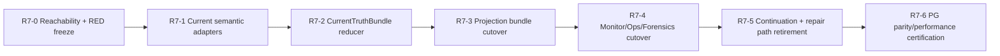

# P0-R7 Current Truth Reducer 与历史路径退役执行计划

## 1. 执行目标

将 R7 推进到 **共享 Current Truth 已认证、旧路径已删除、可以进入 R8 完整 PostgreSQL/chaos 认证**。

本计划不执行：

- 东京部署；
- 生产 migration；
- Writer Fence 解除；
- 真实交易所写入；
- 策略、风险预算、position cap、profile、symbol/side scope 变化。

## 2. 当前基线

| 项目 | 当前值 |
| --- | --- |
| Branch | `codex/budget-model-review-20260714` |
| Commit | **`54169ca341a11c56354c9980194a53ff0d51d38b`** |
| Migration head | **142** |
| R1 | Runtime Semantic Kernel 已提交 |
| R2 | Signal conservation/arbitration 已提交 |
| R3 | Invocation typed coordinator 已提交 |
| R7 first blocker | 多消费者重复解释 Current truth，且 legacy continuation/repair path 仍存在 |

## 3. 依赖顺序



R7-5 涉及 execution/lifecycle core，必须在 R7-1 至 R7-4 完成后串行执行。

## 4. R7-0 — 可达性与 RED 冻结

### Task Packet

**Task ID:** `P0-MP-R7-0`

**Goal:** 固定所有 duplicate semantic owners、legacy production entrypoints 和 repair mutators 的当前可达性。

**Why:** 删除前必须证明每条旧路径的真实调用者和替代责任。

**Allowed files:** focused tests、reachability validators、R7 文档 completion record。

**Forbidden files:** production implementation、migration、policy、deploy/systemd apply。

**Requirements:**

1. RED 证明 Candidate/Daily/Goal/Monitor/Forensics 对至少一组历史 blocker + current success fixture 产生不一致或重复解释。
2. RED 证明两个不同 Ticket 的 incident/current decision 不能互相覆盖。
3. RED 证明 global latest continuation 遇到多 current identity 时必须 hard-stop，而不是任选一条。
4. 生成 stdout-only reachability inventory，不创建 repo JSON/MD 报告。
5. 清单至少覆盖：
   - `_select_action_time_row`；
   - readmodel `_arbitration`；
   - `_action_time_continuation_identity`；
   - `_structured_child_process_outcome`；
   - `legacy_unscoped` process outcome；
   - `legacy_unbound` new-ticket/runner path；
   - three repair CLI families；
   - duplicate status/owner-action sets。

**Global Authority Model:** Owner controls policy; system executes; reducer only explains current state and grants no trading authority.

**Chain Position:** `action_time_boundary`。

**Live Enablement State Before:** Current consumers may disagree; deletion scope is not machine-frozen.

**Live Enablement State After:** Every old path has exact reader/writer/replacement/removal condition.

**Blocker Removed Or Reclassified:** `legacy_current_truth_reachability_unknown -> exact_deletion_inventory_ready`。

**Per-Symbol / Per-Fact Acceptance:** CPM/MPG/MI/SOR/BRF2 lane fixtures identify exact current vs historical result.

**Stop Condition:** Any old path has an unidentified production caller or required semantic owner.

**Capability Unlocked:** Safe implementation of shared reducer without blind deletion.

**Next Engineering Bottleneck:** Aggregate semantic adapter implementation.

**Rehearsal/Simulation Boundary:** Read-only source audit and tests only; no runtime mutation.

**Tests:** focused RED、ripgrep/import/runtime reachability baseline、file-I/O audit。

**Done When:** 每个 R7-1 至 R7-5 task 都引用 exact RED 与 exact old path。

**Hard Stop:** 以“看起来未使用”替代 machine reachability proof。

## 5. R7-1 — Aggregate Semantic Adapters

### Task Packet

**Task ID:** `P0-MP-R7-1`

**Goal:** 将 Signal、Invocation、Promotion、Lane、Ticket、Command、Exposure、Lifecycle、ProcessOutcome、Coverage/Facts 映射到同一 Runtime Semantic Kernel。

**Allowed files:**

- `src/domain/runtime_semantic_kernel.py`；
- new typed application semantic adapter module；
- `src/application/action_time/process_outcome_relevance.py`；
- focused unit tests。

**Forbidden files:** database I/O 进入 domain、万能 status enum、新 migration、readmodel 产品文案。

**Requirements:**

1. 每个 Aggregate 只有一个 adapter。
2. `outcome_unknown` 必须 active/current/operationally relevant。
3. Terminal 不可逆。
4. Current 与 historical warning 规则可由纯函数证明。
5. Repository/readmodel 不再定义新的 terminal/active 集合。
6. Unknown aggregate status fail-closed，并产生 typed unsupported blocker。

**Global Authority Model:** Semantic classification does not create signal, ticket, order or submit authority.

**Chain Position:** `action_time_boundary`。

**Live Enablement State Before:** Current predicates 分散在 repository/readmodels/monitor/forensics。

**Live Enablement State After:** 所有 current consumers 可以使用同一 aggregate-neutral semantic result。

**Blocker Removed Or Reclassified:** `runtime_state_semantics_diverged -> semantic_adapter_registry_ready`。

**Per-Symbol / Per-Fact Acceptance:** 相同 lane/ticket fixture 在全部 adapters 中 current/terminal 结论一致。

**Stop Condition:** 某 Aggregate 的 current 规则仍需从别的 readmodel 私有集合读取。

**Capability Unlocked:** CurrentTruthBundle reducer。

**Next Engineering Bottleneck:** Bundle reduction and first-blocker precedence.

**Rehearsal/Simulation Boundary:** 纯函数与 in-memory fixture；不写 PG。

**Tests:** transition table、unknown outcome、terminal history、latest same-process-lane、legacy typed-negative。

**Done When:** duplicate active/terminal definitions 的 production reachability 开始降为 0。

**Hard Stop:** 把 Aggregate-specific legal transition 移入万能 reducer。

## 6. R7-2 — CurrentTruthBundle Reducer

### Task Packet

**Task ID:** `P0-MP-R7-2`

**Goal:** 对一个 bounded PG snapshot 只执行一次 current reduction，并生成 lane/trade/account/incident decisions。

**Allowed files:** new reducer models/service、bounded repository read profile、focused PG/unit tests。

**Forbidden files:** 新 Current 表、runtime JSON authority、network I/O、FinalGate/Operation Layer/exchange write。

**Requirements:**

1. typed `CurrentTruthBundle`、`LaneOperationalDecision`、`TradeOperationalDecision`、`OperationalIncidentDecision`。
2. one `read_now_ms`、one `bundle_run_id`、one exact source watermark。
3. first-blocker priority 按设计固定。
4. 两 Ticket 独立 reduction。
5. unresolved mechanical effect 高于 terminal historical warning。
6. deterministic incident fingerprint、episode identity 与 recovery decision；关闭后复发必须形成新的 episode。
7. reducer 相同输入 byte-stable。
8. bounded read 不扫描完整历史表。

**Global Authority Model:** Bundle is explanation/current-state input only; Runtime Safety State remains live-submit safety authority.

**Chain Position:** `action_time_boundary`。

**Live Enablement State Before:** 各 projection 从原始 PG rows 独立重算。

**Live Enablement State After:** 所有 projection 有单一 typed current input。

**Blocker Removed Or Reclassified:** `current_truth_multi_interpreter -> current_truth_bundle_ready`。

**Per-Symbol / Per-Fact Acceptance:** 22 lanes + two active Ticket fixture 输出精确 decision；一个 lane failure 不覆盖另一 lane。

**Stop Condition:** Reducer 需要 generated JSON/MD、latest row without identity 或网络调用。

**Capability Unlocked:** Projection fan-out from one semantic truth.

**Next Engineering Bottleneck:** Current projection writer cutover.

**Rehearsal/Simulation Boundary:** Real PostgreSQL allowed; fake/no exchange; no write outside test schema except projection test transaction。

**Tests:** blocker precedence、stable ordering、two-ticket isolation、incident open/recover、watermark determinism、bounded query。

**Done When:** 一个 fixture 只 reduce 一次即可生成所有产品 surface 所需语义。

**Hard Stop:** 新建万能 DB Aggregate 或把 JSON snapshot 变成交易 authority。

## 7. R7-3 — Projection Bundle Cutover

### Task Packet

**Task ID:** `P0-MP-R7-3`

**Goal:** Candidate、Tradeability、Daily、Goal 从同一 CurrentTruthBundle 薄适配并一次发布。

**Allowed files:** current publisher、four readmodel adapters、projection ownership validator、snapshot repository、tests。

**Forbidden files:** readmodel 内重新读取 PG、readmodel 仲裁、独立 blocker/owner-action 集合、新 migration。

**Requirements:**

1. current publisher 单 transaction 读取一次、reduce 一次、fan-out 四个 projections。
2. 共同 `bundle_run_id` 和 input watermark digest。
3. Tradeability 加入正式 current bundle publish，不再只保留 ownership seed。
4. Candidate 仅反映 PG promotion/lane result，删除 `_select_action_time_row` 与 readmodel arbitration。
5. Daily/Goal 不再调用 Candidate builder。
6. readiness rows 按 semantic fingerprint upsert changed rows，不再全表 delete/insert。
7. projection failure 不覆盖上一条成功 current bundle。

**Global Authority Model:** Projections summarize; none grants FinalGate/Operation Layer or exchange-write authority.

**Chain Position:** `action_time_boundary`。

**Live Enablement State Before:** 三个 current builders 重复 Candidate reduction，Tradeability current publish 不完整。

**Live Enablement State After:** 四个产品 surfaces 同 bundle、同 watermark、同 blocker truth。

**Blocker Removed Or Reclassified:** `projection_first_blocker_drift -> projection_bundle_consistent`。

**Per-Symbol / Per-Fact Acceptance:** 22 lane rows在 Candidate/Daily/Tradeability/Goal 中 blocker/owner/action 一致。

**Stop Condition:** 任一 projection 仍能从 raw PG rows 独立重算 first blocker。

**Capability Unlocked:** Server Monitor/Owner Console consumption of stable Current bundle.

**Next Engineering Bottleneck:** Monitor/Ops/Forensics cutover.

**Rehearsal/Simulation Boundary:** PG current projection writes only; no submit/order effects。

**Tests:** consumer parity、projection owner、same bundle watermark、failed publish preserves last good、changed-row count。

**Done When:** parity validator 从“事后比较”降为结构性 invariant check。

**Hard Stop:** 通过复制 reducer 逻辑实现适配器。

## 8. R7-4 — Monitor、Ops、Owner 与 Forensics Cutover

### Task Packet

**Task ID:** `P0-MP-R7-4`

**Goal:** 所有运行解释和 Owner 状态消费 shared bundle/incident，不再维护私有 current 状态集合。

**Allowed files:** server monitor、Owner projection、runtime health/console readmodel、forensics reducer/repository、notification tests。

**Forbidden files:** watcher direct Feishu、monitor recompute Candidate/Goal、historical warning 作为 current blocker、local cache authority。

**Requirements:**

1. Server Monitor 不再调用 Candidate/Goal builders。
2. Monitor 只解释 shared incident decisions + systemd facts。
3. Runtime Health 删除 `signal_pipeline=PASSED` placeholder；Machine Health 与 trading current truth 分离。
4. Owner action 只能来自 reducer typed mapping。
5. Forensics current-window 使用 shared semantic adapters/incident；historical mode 保留 append-only lineage。
6. Forensics 禁止 `_first()` 依赖输入顺序；全部 exact identity + stable order。
7. Notification correlation 使用 incident identity，recovery exactly once。
8. stale projection 只能成为 `monitor_refresh_needed`，不能成为 hard safety 或市场等待结论。

**Global Authority Model:** Owner supervises; monitor and forensics do not operate execution gates.

**Chain Position:** `daily_live_enablement_status`。

**Live Enablement State Before:** Goal/Monitor/Forensics 可对同一事实给出不同解释。

**Live Enablement State After:** Owner、Ops 和审计 surface 使用同一 current truth；historical lineage 与 current issue 分离。

**Blocker Removed Or Reclassified:** `owner_runtime_state_explanation_drift -> owner_runtime_state_consistent`。

**Per-Symbol / Per-Fact Acceptance:** 当前 22 lanes 同 blocker；历史 terminal signal 不触发当前告警；current unresolved Ticket 必须显示。

**Stop Condition:** Monitor 或 Forensics 仍有独立 lifecycle/process status classification 影响 current conclusion。

**Capability Unlocked:** 可信的 Owner supervision 与 no-trade/incident explanation。

**Next Engineering Bottleneck:** Legacy continuation and repair mutator retirement.

**Rehearsal/Simulation Boundary:** Monitor notification dry-run/typed persistence；无交易所写入。

**Tests:** notification dedupe/recovery、historical negative、current unresolved positive、monitor stale projection、Owner language mapping。

**Done When:** Candidate/Goal/Ops/Monitor/current Forensics 的 first blocker 与 owner action 完全一致。

**Hard Stop:** 通过隐藏历史行或过滤 blocker 制造一致性。

## 9. R7-5 — Continuation 与 Repair Path 退役

### Task Packet

**Task ID:** `P0-MP-R7-5`

**Goal:** 删除 global latest continuation、stdout business protocol、legacy unscoped writes 和手工 current repair mutators。

**Allowed files:** typed Action-Time coordinator、refresh sequence、Invocation/ProcessOutcome、lifecycle reconciliation/finalizer、core order/position projector、delete targets、focused tests。

**Codex-owned core files explicitly allowed when required:**

- `src/application/order_lifecycle_service.py`；
- `src/application/position_projection_service.py`；
- `src/application/reconciliation.py`；
- `src/application/startup_reconciliation_service.py`。

**Forbidden files/actions:** exchange gateway behavior expansion、policy/profile/sizing、new live authority、manual production SQL、new migration without Schema Truth Gate。

**Requirements:**

1. exact selected Invocation/Ticket continuation service。
2. 0/1/>1 continuation 明确处理；>1 fail-closed。
3. 删除 promotion latest fallback。
4. 删除 production stdout parser 和 subprocess Action-Time business protocol。
5. 新 production process outcome 必须 typed lane identity；`legacy_unscoped` 只读历史。
6. terminal core-order projection 进入 formal lifecycle finalization。
7. submit/close projection recovery 进入 formal reconciliation service。
8. 删除三个 repair CLI family 及仅服务于它们的代码。
9. 新 Ticket/Runner current path 对 `legacy_unbound` 为 0 reachability。
10. 历史 terminal 数据仍可由 forensics 读取。

**Global Authority Model:** Official reconciliation may repair PG current truth; no bypass of FinalGate/Operation Layer and no duplicate exchange write.

**Chain Position:** `action_time_boundary`。

**Live Enablement State Before:** Typed Invocation path 与 global continuation/repair apply path 并存。

**Live Enablement State After:** 一条 typed continuation、一条 formal reconciliation authority、零手工 current mutator。

**Blocker Removed Or Reclassified:** `legacy_execution_and_repair_authority_reachable -> legacy_execution_and_repair_authority_deleted`。

**Per-Symbol / Per-Fact Acceptance:** 两 Ticket continuation/recovery 各自 exact identity；same-domain conflict fail-closed；无 global latest selection。

**Stop Condition:** Formal lifecycle/reconciliation 尚不能覆盖某 repair CLI 的有效语义。

**Capability Unlocked:** R8 双 Ticket chaos certification 可以只测试一条官方路径。

**Next Engineering Bottleneck:** R7 PostgreSQL parity/performance certification。

**Rehearsal/Simulation Boundary:** fake exchange/read-only exchange fixtures；production credential 调用数 0。

**Tests:** multiple continuation hard-stop、typed process outcome、terminal projection parity、submit/close recovery parity、deleted import/reachability。

**Done When:** deleted path/import/runtime reachability 全部为 0，官方 lifecycle/reconciliation tests 通过。

**Hard Stop:** 为兼容旧 CLI 保留 adapter 或 fallback。

## 10. R7-6 — PostgreSQL 与性能认证

### Task Packet

**Task ID:** `P0-MP-R7-6`

**Goal:** 证明 R7 在真实 PostgreSQL、22 lanes、双 Ticket 和高历史行数条件下正确、稳定、低维护成本。

**Allowed surfaces:** disposable PostgreSQL 16、fake/no-write exchange、performance tools、reachability/file-I/O validators。

**Forbidden surfaces:** Tokyo apply、生产 migration、真实 exchange write、生产数据 destructive cleanup。

**Requirements:**

1. 22 lane current bundle parity。
2. two Ticket independent incident/current/recovery。
3. current issue + historical warning negative matrix。
4. two workers 同时 publish，只有一个 current bundle 成功或稳定串行化。
5. projector crash 不破坏上一条 current bundle。
6. 100,000 historical rows 不进入 current hot scan。
7. publish p95 ≤ 3s、p99 ≤ 6s。
8. monitor 不运行 heavy builders。
9. no-signal tick 文件写入 0。
10. production reachability 0：global selector、stdout parser、repair CLI、new-ticket legacy_unbound、new-process legacy_unscoped、duplicate status sets。

**Global Authority Model:** Certification creates no live authority.

**Chain Position:** `action_time_boundary`。

**Live Enablement State Before:** Shared reducer 已实现但未完成 whole-current certification。

**Live Enablement State After:** `r7_certified_r8_ready`。

**Blocker Removed Or Reclassified:** `current_projection_consistency_uncertified -> current_projection_consistency_certified`。

**Per-Symbol / Per-Fact Acceptance:** 全 22 lane + 2 Ticket matrix 通过。

**Stop Condition:** 任一 consumer drift、false recovery、false market wait、legacy reachability 或性能超限。

**Capability Unlocked:** 进入 R8 full-chain/chaos certification。

**Next Engineering Bottleneck:** R8 two-Ticket Signal-to-exit chaos matrix。

**Rehearsal/Simulation Boundary:** disposable/shadow PG only；fake exchange ledger；production effect all false。

**Tests:** unit、integration、concurrency、performance、file-I/O、reachability、migration graph unchanged。

**Done When:** R7 completion manifest 全绿。

**Hard Stop:** 用 SQLite 替代 PostgreSQL current/concurrency 认证。

## 11. R7 测试矩阵

| 维度 | 必须覆盖 |
| --- | --- |
| Current semantics | running、blocked、terminal、outcome_unknown、historical warning |
| Lane | 22 active lanes、missing coverage、computed false、fresh signal、market wait |
| Ticket | created、finalgate-ready、submitted、expired、closed、invalidated |
| Command | prepared、dispatching、outcome_unknown、confirmed、rejected、hard-stopped |
| Lifecycle | protected、runner、final exit、missing protection、reconciliation mismatch、closed |
| Multi-position | different instrument 2 Ticket、same NettingDomain reject、one closes while one remains active |
| Incident | open、repeat suppress、worsen、recover once、recur after recovery |
| Projection | Candidate、Tradeability、Daily、Goal、Ops、Monitor、Forensics parity |
| Failure | reducer exception、writer crash、stale bundle、multiple continuation、unknown status |
| Performance | 22 lanes、100k history、p95/p99、bounded query/EXPLAIN |
| Deletion | imports、CLI、subprocess protocol、global latest、legacy unbound/unscoped |

## 12. Commit 切片

| Slice | Commit subject | Rollback class |
| --- | --- | --- |
| R7-0 | `test: freeze current truth and legacy reachability matrix` | test-only |
| R7-1 | `refactor: unify aggregate current semantics` | code-only |
| R7-2 | `feat: reduce one operational current truth bundle` | code-only |
| R7-3 | `refactor: publish current projections from one bundle` | code + current projection forward-fix |
| R7-4 | `refactor: align monitor ops and forensics current truth` | code + notification/current projection forward-fix |
| R7-5 | `refactor: delete legacy continuation and repair authorities` | forward-fix; old path must not return |
| R7-6 | `test: certify current truth convergence on postgres` | test-only |

## 13. Completion Manifest

```text
status: r7_certified_r8_ready | blocked
exact_commit:
migration_head: 142_or_schema_truth_gate_approved_successor
schema_change: none_expected
bundle_run_id_contract: passed
consumer_parity: passed
two_ticket_isolation: passed
incident_recovery_exactly_once: passed
legacy_continuation_reachability: 0
stdout_business_protocol_reachability: 0
repair_mutator_reachability: 0
new_ticket_legacy_unbound_reachability: 0
new_process_legacy_unscoped_reachability: 0
duplicate_current_status_sets: 0_in_production_consumers
projection_publish_p95_ms:
projection_publish_p99_ms:
performance_risk.status: clear
file_io_risk.status: clear
forbidden_effects: all_false
next_stage: R8
```

## 14. Program Stop Conditions

以下任一存在即不得进入 R8：

- Candidate、Tradeability、Daily、Goal、Monitor、Forensics first blocker 不一致；
- readmodel 仍能选择 promotion/action-time winner；
- Monitor 仍重建 Candidate/Goal 或独立判断 lifecycle incident；
- `outcome_unknown` 被视为 terminal 或释放容量；
- historical warning 触发 current Owner intervention；
- incident recovery 没有更新 watermark 证明；
- global latest continuation 仍生产可达；
- stdout business protocol 仍生产可达；
- repair apply CLI 或 direct current mutator 仍生产可达；
- active/new Ticket 可进入 `legacy_unbound`；
- production process outcome 可写 `legacy_unscoped`；
- no-signal tick 产生 JSON/MD；
- projection publish 超过预算或扫描完整历史；
- 需要未通过 Schema Truth Gate 的 migration。

## 15. Chain Position

```text
chain_position: action_time_boundary
strategy_group_id: five active StrategyGroups
symbol: 22 active candidate lanes
stage: r7_implementation_plan_ready
first_blocker: shared_current_truth_reducer_and_legacy_retirement_not_implemented
evidence: R7 design supplement plus tracked code at 54169ca3
next_action: after Owner confirmation, execute P0-MP-R7-0 and stop immediately if a legacy path lacks a formal replacement owner
stop_condition: status=r7_certified_r8_ready with all legacy production reachability zero and consumer parity passing
owner_action_required: true_for_r7_implementation_confirmation_only
authority_boundary: planning only; no deploy, production migration, exchange write, policy/profile/sizing change, or destructive production cleanup
```
