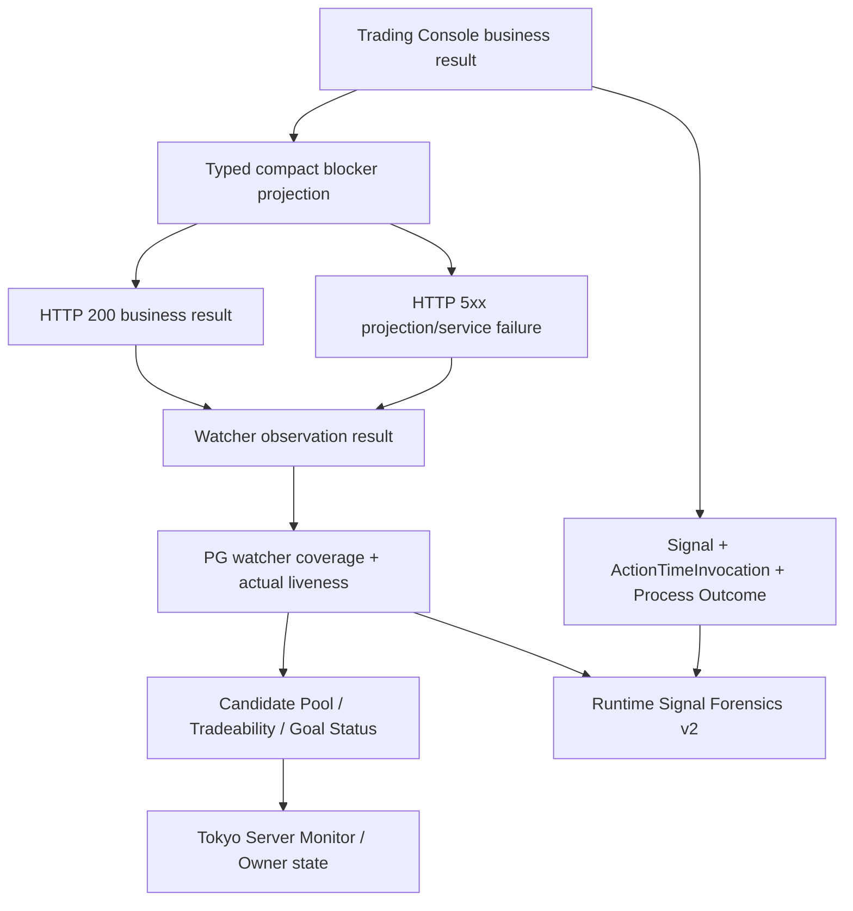

# P0 Runtime Observation Truth And Forensics Remediation Design

## Current Authority Notice

**The HTTP/compact/liveness work in this document is a deployed component
baseline, but its production-closure assumptions are superseded by
`P0_PRODUCTION_RUNTIME_FULL_CHAIN_READINESS_REMEDIATION_DESIGN.md`.**

Post-deployment evidence proved that typed HTTP 200 business blockers still stop
detector computation, ticket-bound ghost terminalization does not converge the
core `orders` projection, healthy coverage is being consumed as detector truth,
and terminal submitted attempts remain current in Goal Status. Current repair
planning must follow the superseding design.

## 1. Decision

### 1.1 Core decision

**The current merge branch is the only repair baseline.** The old release branch
remains read-only provenance and must not receive a parallel fix.

This program closes one systemic defect class:

```text
typed business blocker
-> compact watcher transport
-> observation result
-> PG watcher coverage/liveness
-> readiness / Tradeability / Goal Status / Server Monitor
-> signal forensics
```

The repair is accepted only when every layer preserves the same earliest truth.
An observation transport or schema failure must not become healthy coverage or
`waiting_for_market`. A missing downstream object must not be called an
engineering handoff gap when an existing ActionTimeInvocation or process outcome
already proves a business, runtime, or safety blocker.

### 1.2 Certification decision

The previously recorded Dual-Position component evidence remains useful, but the
**whole-branch deployment certification is reopened** because the branch still
contains a P0 observation-path defect that was outside the earlier test matrix.

```text
component evidence retained
+ branch-level observation defect discovered
-> LOCAL_REMEDIATION_CERTIFICATION_REOPENED
-> DEPLOYMENT_NO_GO
```

No Tokyo deployment, migration apply, policy activation, lifecycle mutation, or
exchange write is authorized by this design.

## 2. Known Objective Facts

### 2.1 Git and branch facts

| Fact | Verified state | Evidence |
| --- | --- | --- |
| **Current branch** | `codex/dual-position-account-risk-remediation-v1` | `git branch --show-current` |
| **Current HEAD** | `473be8113a34c35082798a18019f758bf57bf120` | `git rev-parse HEAD` |
| **Worktree** | clean before this document change | `git status --short --branch` |
| **Old release ancestry** | `20016445` is an ancestor of current HEAD | `git merge-base --is-ancestor` |
| **Tokyo production ancestry** | `6aad77ea` is an ancestor of current HEAD | `git merge-base --is-ancestor` |
| **Compact transport ancestry** | `67849367` and `e68fce06` are ancestors of current HEAD | `git merge-base --is-ancestor` |
| **Old release compact coverage** | the two compact commits are not ancestors of `20016445` | `git merge-base --is-ancestor` |
| **Prior code certification** | code commit `e4f49dcf`; current HEAD adds docs only after it | `git diff e4f49dcf..HEAD` |

### 2.2 Production and code facts

| Area | Objective fact | Current consequence |
| --- | --- | --- |
| **Watcher compact schema** | Trading Console emits structured blockers while `project_compact_text_array()` accepts only strings | structured business blocker raises `watcher_compact_projection_oversize:blockers` |
| **HTTP semantics** | the observation route maps unclassified internal exceptions to HTTP 400 | a server projection defect appears to be a bad client request |
| **Coverage projection** | scope selection alone produces `coverage_state=covered` and `liveness_state=active` | observation API failures may remain falsely healthy in PG |
| **Forensics repository** | Invocation and Runtime Process Outcome tables are not queried | missing promotion is over-classified as `engineering_handoff_gap` |
| **Resume projection** | absence of an open PG lane/Ticket directly emits `waiting_for_market` | an execution dispatcher makes a market-state decision without watcher proof |
| **Production observation** | 19 of 22 candidate lanes returned HTTP 400 in the captured Tokyo window | about 86.4% of the observation matrix was blocked |
| **Historical signal lineage** | 36 of 36 captured signals had an ActionTimeInvocation | Invocation absence was not the cause of the 34 missing promotions |
| **Missing promotion causes** | 33 first blocked at `active_position_clear`; 1 at `build_account_safe_facts_failed` | `promotion_candidate_missing` is not the correct first cause |
| **PG/exchange residue** | five PG OPEN protection rows were absent from current exchange position/protection truth | official reconciliation closure is required before those rows stop blocking new attempts |

Production facts above come from the 2026-07-18 Tokyo read-only PG queries,
`brc-runtime-signal-watcher` and `brc-runtime-monitor` journals, and current
systemd status. They are evidence for design and acceptance only; they do not
authorize production mutation.

## 3. Problem Definition

### 3.1 Primary failure chain

```text
Trading Console next-attempt gate
-> blockers: list[dict]
-> watcher_compact calls project_compact_text_array(blockers)
-> non-string item rejected
-> ValueError watcher_compact_projection_oversize:blockers
-> API catches generic exception
-> HTTP 400
-> active monitor records runtime_observation_cycle_http_400
-> coverage projector still marks selected scope covered/active
-> Goal/Resume surfaces may still say waiting_for_market
```

The defect is not response size. The exact failing blocker is small. The defect
is a producer-consumer type mismatch hidden behind an oversize error code.

### 3.2 Secondary causal-truth failure

```text
Signal exists
-> ActionTimeInvocation exists
-> action-time process stops on business/runtime blocker
-> promotion does not exist
-> forensics reads only Signal and Promotion
-> missing Promotion is classified as engineering handoff gap
```

The reducer infers an absent process from an absent result object even though PG
already contains the process identity and exact first blocker.

### 3.3 Status-ownership failure

`waiting_for_market` currently appears at layers that cannot prove the strict
`market_wait_validated` checklist. The Action-Time resume dispatcher knows only
whether an open lane/Ticket exists. It does not own watcher liveness, detector
execution, fact computation, or historical coverage continuity.

### 3.4 Certification escape

The earlier green suites exercised compact blockers as strings and exercised
downstream states with hand-authored healthy coverage. They did not exercise the
production-shaped chain:

```text
structured blocker producer
-> compact response
-> HTTP route
-> active monitor
-> PG liveness
-> current projections
-> forensics
```

## 4. Goals And Non-Goals

### 4.1 Goals

1. Preserve **typed business blocker semantics** through compact transport.
2. Separate **client request errors**, **server projection failures**, and
   **successful business-blocked observations**.
3. Make watcher liveness depend on the **actual observation result**.
4. Make `market_wait_validated` impossible when any required lane has failed,
   missing, stale, or discontinuous observation coverage.
5. Make forensics follow **Signal -> Invocation -> Process Outcome -> Promotion
   -> Lane -> Ticket** before classifying a missing object.
6. Remove market classification ownership from the Resume Dispatcher.
7. Close known PG ghost orders through the official reconciliation/lifecycle
   path without manual SQL.
8. Re-certify the combined Dual-Position plus observation-truth branch as one
   deployable source commit.

### 4.2 Non-goals

- no strategy parameter change;
- no symbol, side, venue, profile, leverage, notional, or capital expansion;
- no new packet, JSON report, Markdown runtime source, or local cache authority;
- no second watcher, second coverage table, or second forensics database;
- no FinalGate or Operation Layer bypass;
- no direct exchange write from watcher, monitor, forensics, or reconciliation
  diagnostics;
- no hand-written production SQL cleanup;
- no redesign of Dual-Position account-risk policy;
- no speculative watcher parallelization unless the existing 120-second cycle
  budget fails after correctness is restored.

## 5. Alternatives

| Option | Description | Benefit | Defect | Decision |
| --- | --- | --- | --- | --- |
| **A. String coercion** | convert every blocker dict with `str()` or keep only `id` | smallest patch | loses typed stage/severity, preserves schema ambiguity, encourages string parsing | Reject |
| **B. HTTP-only patch** | change 400 to 500 without changing compact schema | makes error class less misleading | watcher still fails and coverage may remain falsely healthy | Reject |
| **C. Coverage-only patch** | mark HTTP failures as failed liveness | stops false healthy state | production API still rejects valid business blockers and forensics remains wrong | Reject |
| **D. Unified observation truth repair** | typed compact blockers, correct HTTP semantics, result-backed liveness, causal forensics, status-owner correction | closes the full demonstrated defect class | larger bounded P0 change and requires branch re-certification | Adopt |

## 6. Target Architecture



### 6.1 Authority split

```text
Trading Console owns business blocker production.
Compact projector owns bounded transport shape.
Active watcher owns observation-attempt result.
PG coverage owns current and historical watcher liveness evidence.
Current projectors own market-wait and Owner status.
Forensics owns read-only causal explanation.
Lifecycle/reconciliation owns ghost-order closure.
```

No lower layer may upgrade its authority. In particular:

- HTTP 200 does not mean a strategy fact passed;
- `coverage_state=covered` does not mean observation succeeded;
- a promotion candidate does not mean Ticket authority;
- an absent Ticket does not mean market wait;
- forensics never mutates the state it explains.

## 7. Detailed Design

### 7.1 Typed compact blocker contract

Add one named Pydantic model in the existing watcher decision projection module.
Do not introduce a parallel transport package.

```text
WatcherCompactBlocker
  code: str
  stage: str | None
  severity: str | None
  detail: str | None
  recovery_action: str | None
```

Normalization rules:

| Producer input | Compact output |
| --- | --- |
| string blocker | `code=<string>`; other fields null |
| dict with `id` | `code=id` |
| dict with `code` but no `id` | `code=code` |
| dict with neither `id` nor `code` | reject as internal projection contract failure |
| arbitrary object | reject as internal projection contract failure |

Field mapping:

| Source field | Compact field | Rule |
| --- | --- | --- |
| `id` / `code` | `code` | required, max 256 UTF-8 bytes |
| `stage` / `blocked_stage` | `stage` | optional, max 128 bytes |
| `severity` | `severity` | optional, bounded enum/string |
| `evidence` / `detail` / `reason` | `detail` | optional, sanitized and max 512 bytes |
| `recovery_action` / `next_action` | `recovery_action` | optional, max 256 bytes |
| `path`, `retry_condition`, nested raw payloads | omitted | available only in full/audit projection |

Cardinality and payload limits:

- keep at most **64 blockers**;
- preserve the first blocker;
- append one typed `additional_blockers_omitted:<count>` item when truncated;
- each compact blocker must remain at or below **2 KiB** encoded;
- the complete blocker array must remain at or below **64 KiB**;
- the complete watcher compact response remains at or below **256 KiB**;
- warnings remain a separately bounded `list[str]`.

The compact projection must not mutate the original full payload.

### 7.2 Watcher consumer contract

The active monitor must stop assuming every blocker is directly stringable
business truth. It consumes `WatcherCompactBlocker.code` for classification and
retains the bounded typed object for diagnostics.

The monitor summary exposes:

```text
blocker_codes: list[str]
blockers: list[WatcherCompactBlocker]
```

`blocker_codes` is a derived convenience field, not a second authority. It must
always be produced from the typed blocker list in the same call.

### 7.3 HTTP status semantics

The observation route must classify failures as follows:

| Condition | HTTP status | Watcher meaning |
| --- | ---: | --- |
| Pydantic request validation | `422` | caller request schema invalid |
| explicit forbidden request, such as Ticket materialization in observation API | `400` | caller violated API contract |
| runtime instance not found | `404` | scoped identity absent |
| dependency/runtime service unavailable | `503` | retryable service failure |
| compact projection schema/size defect | `500` | internal projection failure |
| valid observation with business blocker | `200` | watcher ran; business state may be blocked |
| computed strategy facts not satisfied | `200` | healthy observation, market facts false |

Unclassified server exceptions must no longer be returned as HTTP 400. Stable
error codes may be returned in `detail`; sensitive values and raw payloads must
not be exposed.

### 7.4 Observation result model

The watcher adds one bounded in-memory result per selected runtime:

```text
WatcherObservationResult
  runtime_instance_id
  attempted: bool
  transport_state: success | http_error | timeout | deadline_exceeded
  projection_state: valid | invalid | unavailable
  business_state: computed | business_blocked | waiting_for_signal | unknown
  http_status: int | None
  first_blocker_code: str | None
  completed_at_ms
```

This object is not a new runtime source. It is the typed input used by the
existing coverage projector during the same watcher cycle.

### 7.5 Coverage and liveness semantics

Keep the existing `brc_watcher_runtime_coverage` table. No new coverage table is
allowed.

`coverage_state` and `liveness_state` become intentionally independent:

| Scope/observation result | `coverage_state` | `liveness_state` |
| --- | --- | --- |
| typed selected lane, HTTP 200 computed false | `covered` | `healthy` |
| typed selected lane, HTTP 200 business blocker | `covered` | `healthy` |
| typed selected lane, HTTP 4xx/5xx | `covered` | `failed` |
| typed selected lane, timeout/deadline | `covered` | `degraded` or `failed` |
| selected display match without immutable lane identity | `not_covered` | `identity_missing` |
| active runtime filtered out | `not_covered` | `not_covered` |
| candidate lane without runtime | `missing` | `missing` |

Rules:

1. A business blocker is not a watcher-health failure.
2. A technical observation failure is not a market blocker.
3. `last_tick_at_ms` records the observation attempt/completion time, not scope
   selection time alone.
4. `source_watermark` binds the exact runtime instance and watcher cycle.
5. All current lanes are written in one transaction after observation results
   are available.
6. A cycle must not publish healthy liveness before its API calls finish.

Existing consumers already require both covered scope and healthy/active
liveness. They must be updated to reject legacy `active` rows when the current
cycle records a technical failure.

### 7.6 Historical coverage proof

Forensics must not prove a historical no-signal window from the latest current
row alone.

The repository must query:

- candidate scopes effective during the requested window;
- watcher coverage rows whose validity intervals intersect the window;
- server monitor runs within the window.

The reducer groups coverage by immutable lane identity and validates interval
continuity. `market_absence_proven=true` requires:

1. every required lane is represented;
2. every covering interval is `coverage_state=covered`;
3. every covering interval has liveness `healthy` or explicitly accepted
   successful equivalent;
4. there is no failed/degraded interval in the requested window;
5. adjacent observation/monitor gaps do not exceed the contract cadence;
6. the first and last interval cover the window boundaries within tolerance.

Any HTTP failure, missing lane, stale interval, or cadence gap produces
`runtime_data_gap`, not market absence.

### 7.7 Signal forensics causal reducer

Replace the current inference order with:

```text
Signal
-> ActionTimeInvocation
-> invocation-scoped Runtime Process Outcomes
-> Promotion Candidate
-> Action-Time Lane
-> Ticket
-> Exchange Command / Submit Attempt
-> Lifecycle / Outcome / Notification
```

The repository adds existing tables only:

```text
brc_action_time_invocations
brc_runtime_process_outcomes
brc_strategy_group_candidate_scope
```

No migration is required for this read path.

When Promotion is missing, use this decision order:

| Evidence | Classification | First blocker |
| --- | --- | --- |
| Invocation missing | `engineering_handoff_gap` | `action_time_invocation_missing` |
| Invocation exists, blocking Process Outcome exists | map from process state | exact `first_blocker` |
| Invocation exists, no Process Outcome | `engineering_handoff_gap` | `runtime_process_outcome_missing` |
| Invocation processes succeeded but Promotion missing | `engineering_handoff_gap` | `promotion_candidate_missing_after_successful_invocation` |

Process state mapping:

| `process_state` | Forensics classification |
| --- | --- |
| `business_blocked` | `runtime_business_blocked` |
| `retryable_failure` | `engineering_runtime_failure` |
| `hard_failure` | `runtime_safety_or_identity_failure` |
| `noop` | continue causal search; do not invent a blocker |
| `succeeded` | continue causal search |

The earliest stage wins. A later generic missing object must not overwrite an
earlier exact blocker.

### 7.8 Forensics output contract

Replace the stdout schema with **`brc.runtime_signal_forensics.v2`**. Do not run
v1 and v2 in parallel.

Each finding includes optional lineage identities:

```text
signal_event_id
action_time_invocation_id
promotion_candidate_id
action_time_lane_input_id
ticket_id
process_name
process_state
first_blocker
```

The primary Owner explanation remains plain language. Internal identifiers and
codes remain developer/audit detail.

### 7.9 Market-wait ownership

`market_wait_validated` may be produced only by the PG-backed readiness /
Tradeability / Goal Status projection after the full checklist passes.

The Resume Dispatcher is reduced to execution identity:

```text
open Ticket exists -> resume exact Ticket path
open Lane without Ticket -> fail closed on missing Ticket identity
no open Lane or Ticket -> no_actionable_pg_ticket
```

`no_actionable_pg_ticket` is neutral. It must not emit:

```text
waiting_for_market
waiting_for_opportunity
market_wait_validated
```

The current projection priority is:

```text
hard safety / unknown exchange outcome
-> active position or order resolution
-> watcher transport/schema/liveness failure
-> action-time process failure
-> fresh signal processing
-> computed_not_satisfied
-> market_wait_validated
```

### 7.10 Ghost-order reconciliation closure

The five known PG OPEN rows are a production-state cleanup problem, not a reason
to weaken or hide the blocker.

Closure path:

```text
read-only PG/exchange identity proof
-> official reconciliation classification: PG ghost / exchange flat
-> ticket/lifecycle-linked PG terminalization through existing reconciliation
-> projection refresh
-> active_position_resolution cleared only after PG and exchange agree
```

Rules:

1. Never delete or update these rows by ad hoc SQL.
2. Never fabricate exchange cancel success when the exchange order is already
   absent.
3. Preserve original Ticket/order/role identity and audit event.
4. If an exchange order unexpectedly exists, stop and use the official
   ticket-bound orphan/protection command path.
5. If existing reconciliation cannot terminalize a proven PG ghost, the defect
   becomes a Codex-owned reconciliation implementation task; it is not worked
   around in watcher or Trading Console.

### 7.11 Certification truth

The current Dual-Position component tests are not discarded. The new release
candidate must include both:

```text
Dual-Position T01-T12 evidence
+ Runtime Observation Truth T01-T10 evidence
```

The final source commit, migration head, runtime lock, Linux import hashes,
full-suite count, file-I/O audit, and Tokyo canary must all name one exact HEAD.

## 8. Data And Migration Decision

### 8.1 Default decision

**No new PostgreSQL migration is planned.** The design reuses:

- `brc_watcher_runtime_coverage`;
- `brc_action_time_invocations`;
- `brc_runtime_process_outcomes`;
- `brc_strategy_group_candidate_scope`;
- existing current projections and lifecycle/reconciliation tables.

### 8.2 Migration hard stop

A migration may be proposed only if implementation proves that an acceptance
invariant cannot be represented by existing typed columns. Any such finding
stops the affected task and requires a design amendment before migration code.

JSONB must not be used to avoid a missing typed identity or lifecycle field.

## 9. Affected Code Boundaries

### 9.1 Primary files

| Area | Expected files |
| --- | --- |
| Compact blocker model | `src/application/readmodels/watcher_decision_fact_projection.py` |
| Observation API | `src/interfaces/api_trading_console.py` |
| Watcher observation and PG coverage | `scripts/runtime_active_observation_monitor.py` |
| Resume identity boundary | `scripts/runtime_signal_watcher_resume_dispatcher.py` |
| Forensics reducer | `src/application/runtime_signal_forensics.py` |
| Forensics repository | `src/infrastructure/runtime_signal_forensics_repository.py` |
| Forensics CLI | `scripts/ops/query_runtime_signal_forensics.py` |
| Candidate/Goal/monitor truth | existing Candidate Pool, Goal Status, Tradeability, Daily Table, and Tokyo monitor projectors as demonstrated by failing tests |
| Reconciliation closure | existing lifecycle maintenance/reconciliation services; Codex-owned reconciliation core only if the official path is incomplete |

### 9.2 Core-file ownership

The following possible files remain Codex-owned and may be edited only when a
task card explicitly allows them:

```text
src/application/reconciliation.py
src/application/order_lifecycle_service.py
src/application/startup_reconciliation_service.py
```

No other execution core file is expected to change.

## 10. Cadence And Performance

| Dimension | Required outcome |
| --- | --- |
| **Production cadence** | retain the current three-minute watcher timer and one bounded cycle per timer event |
| **API calls** | no additional observation API call; one call per selected runtime as today |
| **Cycle deadline** | retain the 120-second watcher cycle and systemd 122-second hard wrapper; no timeout extension to hide slow work |
| **Compact response** | remain below 256 KiB; watcher client limit remains 512 KiB |
| **No-signal file writes** | exactly `0` JSON/MD files |
| **PG writes** | reuse one coverage row per candidate lane per cycle; no additional row family in healthy no-signal cadence |
| **CPU** | no replay, full forensics, or heavy read-model builder inside each lane API call |
| **Disk** | no new report directory, JSONL, YAML, or dynamic evidence file |
| **Forensics** | explicit manual/read-only query only; bounded by time window and limit |
| **Retention** | existing PG coverage/audit retention; no new archive cadence |

If 22 healthy observations cannot finish inside the existing cycle budget after
the schema fix, performance is treated as a separate measured defect. It must
not be solved by marking unobserved lanes healthy or extending fact freshness.

## 11. Security And Safety Invariants

Every implementation and test must prove:

- observation remains non-executing;
- `allow_action_time_ticket_materialization=false`;
- no FinalGate or Operation Layer call;
- no exchange write or local order creation;
- no attempt counter or runtime budget mutation;
- no live profile, sizing, leverage, notional, symbol, or side change;
- no withdrawal, transfer, or credential mutation;
- sensitive values are absent or masked in API error detail and logs;
- replay, synthetic, audit, and forensics rows never become live signal authority;
- ghost-order closure uses official lifecycle/reconciliation identity only.

## 12. Failure And Acceptance Matrix

| Scenario | API result | Coverage/liveness | Current projection | Forensics |
| --- | --- | --- | --- | --- |
| computed facts false | HTTP 200 | covered/healthy | `computed_not_satisfied` | market condition not satisfied |
| active position blocker | HTTP 200 typed blocker | covered/healthy | `active_position_resolution` | exact business blocker |
| structured compact blocker | HTTP 200 | covered/healthy | exact blocker preserved | exact blocker preserved |
| projection schema defect | HTTP 500 | covered/failed | temporarily unavailable | engineering failure |
| dependency unavailable | HTTP 503 | covered/failed | temporarily unavailable | retryable runtime failure |
| watcher deadline exceeded | no successful API result | covered/degraded or failed | watcher tick missing / unavailable | coverage gap |
| scope attached but identity missing | no authoritative observation | not_covered/identity_missing | scope/runtime blocker | coverage gap |
| signal with Invocation business block | HTTP path independent | according to watcher result | exact blocker | Invocation Process Outcome blocker |
| signal without Invocation | n/a | n/a | engineering gap | `action_time_invocation_missing` |
| no lane/Ticket and unhealthy watcher | n/a | failed | temporarily unavailable | market absence not proven |
| no lane/Ticket and complete healthy matrix | n/a | healthy | `market_wait_validated` | market absence may be proven |

## 13. Rollback Strategy

### 13.1 Pre-deploy rollback

Revert the bounded observation-truth commits while keeping deployment disabled.
Do not restore the old release branch as the active repair branch.

### 13.2 Post-deploy rollback

If the new release regresses watcher execution:

```text
stop watcher timer
-> preserve PG and journal evidence
-> roll current symlink back through the official immutable-release state machine
-> keep real-submit progression fail-closed
-> do not restore false healthy coverage or file-backed state
```

### 13.3 Ghost-order rollback

PG ghost-order terminalization is allowed only after exchange-flat identity
proof. If proof is ambiguous, no cleanup occurs. A committed official
reconciliation event is not reversed by manual SQL; any correction uses a new
audited reconciliation event.

## 14. Acceptance Criteria

The design is implemented only when all conditions are true:

1. A real structured next-attempt blocker survives compact projection and
   returns HTTP 200.
2. Internal projection failures return HTTP 500, not 400.
3. Every one of the **22 active lanes** receives an actual observation result
   or an explicit failed/degraded liveness result.
4. HTTP/timeout/schema failure cannot produce healthy coverage.
5. Business blockers keep watcher health healthy while preserving the exact
   blocker.
6. Candidate Pool, Tradeability, Daily Table, Goal Status, Resume Dispatcher,
   Server Monitor, and forensics agree on first-blocker priority.
7. `market_wait_validated` is impossible with one failed, missing, stale, or
   discontinuous lane.
8. The historical 36-signal fixture/query shape reports 33
   `active_position_clear`, one `build_account_safe_facts_failed`, and zero false
   Invocation-missing conclusions.
9. The five known PG ghost orders are either closed through the official path or
   remain one explicit `active_position_resolution` hard boundary.
10. No-signal tick file creation remains zero and
    `scripts/audit_production_runtime_file_io.py` reports
    `performance_risk.status=clear`.
11. Targeted unit/integration, disposable PostgreSQL, runtime-lock, deployment
    state-machine, full regression, and Linux/amd64 dependency gates all pass at
    one exact source commit.
12. Tokyo canary/read-only acceptance observes 22 lane results without exchange
    write before the normal timer is restored.

## 15. Chain Position

```text
chain_position: pretrade_candidate_readiness
strategy_group_id: SOR-001
symbol: BTCUSDT
stage: active_observation
first_blocker: schema_invalid
evidence: current merge branch rejects a structured next-attempt blocker in watcher_compact and maps the internal projection failure to HTTP 400
next_action: implement the unified typed observation-truth contract on the current merge branch
stop_condition: all 22 active lanes produce actual observation results, false healthy coverage is impossible, and every signal is explained from Invocation/Process Outcome lineage
owner_action_required: false
signal_event_id: none
promotion_candidate_id: none
action_time_lane_input_id: none
ticket_id: none
authority_boundary: design and remediation remain non-executing; no FinalGate, Operation Layer, production lifecycle mutation, policy activation, or exchange write
```
