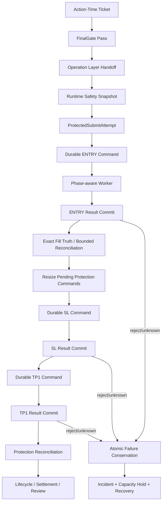

# P0 Ticket 创建后 Durable Submit 与 Protection Barrier 收敛设计

## 0. Status Transition — 2026-07-22

本文件保留 **R11** 的问题登记、设计取舍和已完成组件范围。R11 后续审查发现
ENTRY effect 跨 Ticket TTL、exact-source drain 与 absolute deadline 的缺口；其纠偏已在
**R12** 完成并合入 `dev@4debdc00`。因此 R11 的“本地认证后等待部署”不再是当前
项目状态。

当前权威状态、剩余部署步骤与自然事件验收边界以
`P0_ENTRY_EFFECT_PROTECTION_AUTHORITY_AND_DEADLINE_REMEDIATION_DESIGN.md` 为准。
Tokyo 的 `8c61a208` / schema `143` 仅为最后留存快照，不得代替部署前实时核验。

## 0. 决策摘要

### 0.1 核心结论

当前 **Ticket → FinalGate → Operation Layer handoff → durable Exchange Command**
身份方向正确，但 **Ticket 创建后的真实交易链不能认定为 production-safe**。

本设计采用以下收敛方向：

```text
一个 ProtectedSubmitAttempt 聚合
-> 一组 durable Exchange Commands
-> 一个 phase-aware worker
-> 每次 exchange I/O 前后独立短事务
-> Entry authoritative result 后立即进入 Initial Stop barrier
-> partial fill 使用 exact fill truth 重算保护数量
-> 任一失败/unknown 原子守恒到 Attempt/Ticket/Lifecycle/Incident
-> protection + reconciliation matched 后才进入 open_protected
```

本设计不新增第二个 command batch、packet、bridge 或 submit authority。
`brc_ticket_bound_protected_submit_attempts` 继续是提交聚合，
`brc_ticket_bound_exchange_commands` 继续是唯一 exchange-write 命令权威，
`Ticket` 继续是唯一交易业务生命周期身份。

### 0.2 已知客观事实

| 事实 | 当前证据 | 设计含义 |
| --- | --- | --- |
| **当前部署** | Tokyo `app/current=8c61a208`，PG schema `143` | 审查对象与当前生产版本一致 |
| **当前库存** | 当前 PG `tickets=[]`、`commands=[]`；Attempt 仅有历史 `blocked=3`、`submit_failed=5`，未绑定当前 active source | 当前没有存量中间态事故；历史失败保留 provenance，缺陷会影响下一次自然信号 |
| **命令调度** | worker 每次最多派发一个命令；lifecycle timer 每 30 秒运行一次 | Entry、SL、TP1 至少跨三个调度轮次 |
| **Lease/timeout** | command lease 默认 15 秒；生命周期全局 deadline 为 28 秒，dispatch timeout 可接近 remaining deadline；完成阶段复用 I/O 前时间戳 | 合法网络请求可能在返回前失去 lease，且 result time/expiry 判断使用陈旧时间 |
| **部分成交** | durable worker 不保存 `filled_qty` / `average_exec_price`，也不调用已有 protection resize | partial fill 后保护数量可继续使用原始 request qty |
| **失败守恒** | source completion 在看到任何 `prepared/dispatching` 时先返回 | ENTRY/SL 先失败时，后续 sibling command 可永久 `prepared` |
| **领取规则** | 同 NettingDomain 的 rejected/unknown/hard-stopped command 阻止后续 prepared command | 失败后 source aggregate 可能永久无法 terminal |
| **监控与 lifecycle 启动** | monitor 关注 dispatching/unknown/hard-stopped，但不把 confirmed ENTRY + pending/failed SL 直接归为 protection incident；Attempt 要等全部命令聚合才置 `exchange_write_called=true`，first reconciliation 也随之延后 | 真实保护缺口可能显示为普通处理中，Entry 已产生 effect 时 lifecycle/reconciliation 仍未及时接管 |
| **Hot path** | `read_action_time_control_state()` 每次遍历 47 张 control-state 表；instrumented 单次 SQLite 调用为 767 statements（251 SELECT、516 PRAGMA） | FinalGate、SubmitMode、Attempt preparation 重复付出宽读与 reflection 成本；该数字是结构证据，不冒充 PG latency 测量 |
| **遗留路径** | Console direct-submit 函数在 unconditional raise 后保留约 190 行不可达实现，且正确 resize 仅被旧路径调用 | 已退役路径与 durable worker 出现语义漂移 |
| **可读性** | `runtime_signal_watcher_resume_dispatcher.py` 3125 行、`protected_submit_attempt.py` 2106 行、`post_submit_closure.py` 1316 行、`finalgate_preflight.py` 1050 行，并存在跨层 `dict[str, Any]` 与重复 helper | 状态和 identity 规则难以局部验证，重构必须按职责拆分而非继续追加分支 |
| **静态质量** | Ruff 当前有 F401：`run_server_product_state_refresh_sequence.py` 未使用 `SYSTEM_ACTION_TIME_BUDGET_MS`；E402：`runtime_signal_watcher_resume_dispatcher.py` import order | 当前分支不是 merge-ready，修复必须把 lint 恢复为零 |
| **验证状态** | 定向 lifecycle 测试 101 项通过；Exchange Command materialization 有 1 个 canonical instrument 断言失败 | 当前测试门不是全绿，且缺少关键 worker failure/partial-fill 场景 |

来源：当前 tracked code、2026-07-21 本地 deterministic reproduction、Tokyo PG 只读检查。

### 0.3 Blocker 分类

```text
chain_position: ticket_created_to_open_protected
stage_reached: durable commands prepared and worker enabled
first_blocker_class: hard_safety_stop
first_blocker_detail: durable_protected_submit_does_not_conserve_early_failure_fill_truth_or_initial_stop_latency
blocker_owner: engineering
owner_action_required: false
authority_change_required: false
```

该问题不是策略信号条件、Owner policy、资本授权或 live profile 缺失。
它是 **现有已授权范围内的工程安全缺陷**。

### 0.4 2026-07-21 R11 本地实现闭合记录（历史）

以下是当前分支的 **本地工程事实**，不等同于 Tokyo 已部署或自然真实订单验收：

| 问题组 | 本地闭合结果 |
| --- | --- |
| `TPS-P0-01` | terminal command 会终态化未派发 sibling，并投影 Attempt 结果，避免 source 永久 `submit_prepared` |
| `TPS-P0-02` | migration `144` 持久化 typed result；partial/full/zero/missing/overfill 都有 worker 测试；zero fill 不派发保护并进入 readonly reconciliation |
| `TPS-P0-03`、`TPS-P1-01` | protected-submit invocation 可连续 drain Initial Stop；lease、timeout、commit margin 与 completion timestamp 已统一 |
| `TPS-P1-02`、`TPS-P1-03` | Action-Time 改为 exact ticket bundle；Entry effect 后立即进入 lifecycle/reconciliation，monitor 区分 pending 与无保护 incident |
| `TPS-P2-01`、`TPS-P2-03` | Console direct submit 已删除；canonical instrument 断言改为验证 Ticket 冻结 identity；Ruff 清零 |

R11 本地验收曾记录定向 **268 项**通过（其中 265 项主回归加 3 项 materialization），
`audit_production_runtime_file_io.py` 为 `suspicious_runtime_file_authority=0`、
`frequent_report_write=0`，Alembic head 为 `144`。R12 后续复现证明这组 green checks 未覆盖
Entry 跨 TTL、exact-source drain 与 absolute deadline；当前本地认证和部署边界以 R12 文档为准。

## 1. 完整问题登记

| ID | 优先级 | 问题 | 失败模式 | 本设计关闭方式 |
| --- | --- | --- | --- | --- |
| `TPS-P0-01` | **P0** | 前序命令失败不终态化 sibling commands | Attempt 永久 `submit_prepared`；容量/hold 不释放；SL 失败可留下无保护仓位 | source-level terminalization + sibling reconciliation + aggregate projection |
| `TPS-P0-02` | **P0** | durable worker 丢失 Entry fill truth | partial fill 后 SL/TP1 仍按 requested qty 提交 | typed exchange result + exact fill reconciliation + pre-dispatch resize |
| `TPS-P0-03` | **P0** | 单命令/30 秒 cadence 延迟 Initial Stop | Entry 成交后至少一个 timer interval 无保护 | phase-aware in-process protection drain；每个 I/O 仍独立短事务 |
| `TPS-P1-01` | **P1** | 15 秒 lease 小于可能的 dispatch timeout | 合法请求在返回前被标记 unknown；结果提交丢失 | lease/timeout/commit-margin 统一预算 + fresh completion time |
| `TPS-P1-02` | **P1** | Action-Time hot path 宽读 47 张表 | 信号 TTL 被 reflection/重复读取消耗 | exact execution bundle repository + 单次 bundle 复用 |
| `TPS-P1-03` | **P1** | Current Truth/Monitor 看不见 Entry accepted + SL missing，Attempt/lifecycle/reconciliation 接管过晚 | 无保护状态被压缩成普通 processing；first reconciliation 未在首个 Entry effect 后开始 | command-derived protection barrier projection + immediate Entry-effect lifecycle handoff + P0 notification |
| `TPS-P2-01` | **P2** | unconditional raise 后保留旧 submit 实现 | 两条路径语义漂移，正确 resize 只留在死代码 | 删除旧路径；把不变量迁入唯一 worker |
| `TPS-P2-02` | **P2** | 超大模块与跨层 `dict[str, Any]` | 审查困难，identity/状态字段易遗漏 | typed models + bounded module split |
| `TPS-P2-03` | **P2** | canonical instrument fixture 漂移与 Ruff 错误 | 回归门不全绿，静态噪声掩盖真实缺陷 | canonical builder fixture + zero lint error |

### 1.1 代码定位与确定性复现

| Finding | 当前代码证据 | 确定性结果 |
| --- | --- | --- |
| `TPS-P0-01` | `lifecycle_exchange_command_completion.py:58` 在处理 `BLOCKED` 前遇 `UNRESOLVED` 直接跳过；`exchange_command.py:369-381` 又让同 NettingDomain 的 rejected/unknown/hard-stopped 行阻止 prepared sibling | `ENTRY=confirmed_rejected, SL=prepared, TP1=prepared` 后，Attempt 仍为 `submit_prepared`、`blockers=[]`，下一次 worker 为 `no_prepared_command` |
| `TPS-P0-02` | `exchange_command_worker.py:209,420-434` 的 `_placement_result_facts` 只复制 leverage；`exchange_command.py:231` 的 resize helper 未被 durable worker 调用 | request `0.010`、actual fill `0.005` 后，当前 worker 可继续派发 `SL=0.010`；Entry `exchange_result` 不含 fill qty/avg price |
| `TPS-P0-03` | `exchange_command_worker.py:35-49` 明确一次最多 dispatch 一条；`deploy/systemd/brc-ticket-lifecycle-maintenance.timer:6` 为 `OnUnitActiveSec=30s` | ENTRY、SL、TP1 至少分属不同 timer cycle，Initial Stop 的额外等待约为一个 cadence，队列存在旧 command 时更长 |
| `TPS-P1-01` | `exchange_command.py:333`、`exchange_command_worker.py:40` 默认 lease `15_000ms`；worker 在 I/O 前生成 `now_ms` 并在结果提交时复用 | dispatch timeout 可超过 lease，返回结果使用陈旧 completion time；存在 premature unknown/lease-loss race |
| `TPS-P1-02` | `runtime_control_state_repository.py:39,378-380,1107-1109` 枚举整个 table map | instrumented SQLite 单次调用 767 statements；SubmitMode 与 Attempt preparation 在同一 transaction 仍分别读取 state |
| `TPS-P1-03` | `post_submit_reconciliation_tick.py:68-70,169-176` 要求 Attempt `exchange_write_called=true`，而当前 aggregate completion 延迟该字段 | 已有 Entry effect、SL 尚未建立时，first reconciliation/monitor 可能尚未把它识别成 current protection incident |
| `TPS-P2-01` | `api_trading_console.py:2693-2703` unconditional raise 后仍保留 direct gateway body；旧 helper 在 `2814-2865` 调用 protection resize | 正确 partial-fill 语义只存在于不可达旧路径，唯一 durable worker 反而缺失 |
| `TPS-P2-02` | 四个关键模块分别为 3125、2106、1316、1050 行，并存在重复 `_rows/_as_dict/_dedupe` 与 autoload helper | 规则散落、测试难以建立单一状态机覆盖，继续局部补丁会增加 semantic drift |
| `TPS-P2-03` | 定向 101 lifecycle tests 通过，但 materialization 测试有 1 个 legacy instrument literal failure；Ruff 有 F401/E402 | 当前分支只能说明既有 happy path 基本稳定，不能声明 merge-ready |

以上行号固定于审查基线 `8c61a208062520a5c426e2151e4692e256fec5dd`；实现后行号可变化，
但 Finding ID、失败输入和期望不变量不得变化。

## 2. 目标与非目标

### 2.1 目标

1. **失败守恒**：任一 command rejection、hard stop、unknown 都必须形成一个可查询的
   Attempt/Ticket/Lifecycle/Incident 结果，不得留下无 owner 的 `prepared` sibling。
2. **实际成交量保护**：SL 和 TP1 只能从 exact Entry fill truth 计算，不能从请求数量猜测。
3. **Initial Stop 低延迟**：Entry authoritative acceptance 后立即进入止损 barrier，
   不等待下一次 30 秒 timer。
4. **Exactly-once**：command intent 先提交、网络 I/O 后提交结果；unknown 必须对账后才能
   产生新 generation。
5. **Current Truth 一致**：Ticket、Attempt、Command、Lifecycle、Monitor 对同一事实给出同一
   stage 和 first blocker。
6. **性能可预算**：Ticket 后路径使用 exact-ID bounded query，不扫描无关 monitor/history/readmodel。
7. **单路径**：删除 Console direct real-submit 旧实现和不可达 helper orchestration。

### 2.2 非目标

- 不改变 StrategyGroup、symbol、side、notional、leverage、loss unit、attempt cap 或 max positions；
- 不新增 live profile、credential、withdrawal、transfer 或账户模式变更；
- 不绕过 FinalGate、Operation Layer、Runtime Safety State；
- 不优化策略收益、TP1 比例或 exit-policy 参数；
- 不以 JSON/MD 文件作为 runtime authority；
- 不在本设计中执行部署或真实订单。

## 3. 不可违反的业务不变量

### 3.1 身份不变量

每个 exchange write 必须绑定：

```text
ticket_id
+ protected_submit_attempt_id
+ finalgate_pass_id
+ operation_layer_handoff_id
+ operation_submit_command_id
+ exchange_command_id
+ account_id
+ exchange_instrument_id
+ exposure_episode_id
+ netting_domain_key
```

任一字段不一致，命令必须在网络 I/O 前 `hard_stopped`。

### 3.2 Entry 与生命周期不变量

- Entry 被 authoritative accepted 后，Ticket 必须立即进入 `submitted`；
- 同时创建或更新 lifecycle 至 `entry_submit_sent` / `entry_fill_pending` / `entry_filled`；
- 不得等 SL、TP1 全部完成后才承认 exchange exposure 已存在；
- `protected_submit_attempt.exchange_write_called` 必须在第一个真实 exchange call 后变为 true；
- budget、capacity slot、ExposureEpisode 和 NettingDomain hold 从 Entry 可能产生 effect 起持续占用。

### 3.3 Fill Truth 不变量

```text
Entry accepted
-> exact exchange order status
-> exact cumulative filled_qty
-> exact average_exec_price when filled_qty > 0
-> protection quantity normalization
-> SL/TP1 command fingerprint replacement under same command identity before dispatch
```

- `filled_qty` 缺失不是 `0`；它是 unknown；
- partial fill 必须使用 current cumulative fill；
- `filled_qty > requested_qty` 是 contradictory truth；
- `filled_qty == 0` 时不得派发基于数量的 SL/TP1；原始 `prepared` SL/TP1 必须记录为
  `reconciled_absent`，但 Entry 与 Attempt 保持非终态并由 readonly reconciliation 继续确认
  后续成交或 flat truth，禁止把这个已知零值误写成 missing truth、失败或容量释放；
- 新增 fill 后，尚未 dispatch 的保护命令可单调增量调整；已 dispatch 的保护命令必须通过
  versioned replacement/recovery command 调整，不能原地改写历史请求。

### 3.4 Protection Barrier 不变量

```text
entry effect possible
-> Initial Stop accepted for exact current position qty
-> TP1 accepted when policy requires
-> exchange reconciliation matched
-> open_protected
```

- **SL 优先级高于 TP1、runner、archive、monitor 和普通 lifecycle work**；
- Entry accepted 但 SL 未 accepted 时必须打开 `hard_safety_stop` 与 new-entry fence；
- TP1 失败但 SL 有效时属于 `protection_degraded`，不能谎报 `open_protected`，也不能撤销有效 SL；
- SL/TP1 failure 的自动恢复使用新 command generation 和原 Ticket，不得创建新 Ticket 或重复 Entry。

### 3.5 Failure Conservation 不变量

| 首个终态 | Exposure 可能性 | Sibling command 处理 | Attempt/Ticket 处理 | Capacity/hold |
| --- | --- | --- | --- | --- |
| ENTRY authoritative rejection | 无 effect 已证明 | 未 dispatch sibling → `reconciled_absent` | Attempt `submit_failed`；Ticket terminal pre-submit | absence reconciliation 后释放 |
| ENTRY outcome unknown | effect 未知 | sibling 保持不可派发 | Attempt `submit_outcome_unknown`；Ticket 保持 current | 全部保持 |
| ENTRY accepted，SL rejection | exposure 存在 | TP1 暂停或 `reconciled_absent` | Ticket `submitted`；Attempt `hard_stopped`；lifecycle blocked | 全部保持并启动 protection recovery |
| ENTRY accepted，SL unknown | exposure 存在、保护未知 | TP1 不得派发 | current incident + unknown reconciliation | 全部保持 |
| SL accepted，TP1 rejection | position 有硬止损 | 未 dispatch sibling terminalize | protection degraded；自动 TP1 recovery | capacity 保持 |
| 全部 accepted | exposure 与保护已建立 | 无 sibling | Attempt `submitted`，进入 reconciliation | 直到 terminal closure 保持 |

“释放容量”必须以 exchange/PG absence、flatness、无 live protection 残留和 reconciliation matched
为前提，不能由进程失败或 Ticket 过期触发。

## 4. 方案比较与架构决策

| 方案 | 说明 | 优点 | 缺点 | 决策 |
| --- | --- | --- | --- | --- |
| A：局部补丁 | 在 worker 前调用 resize，并调整一个 if 顺序 | 改动最小 | 仍保留 30 秒保护间隔、宽读、死代码和脆弱聚合 | **拒绝** |
| B：独立 Protection Worker | Entry worker 后异步触发第二个保护 worker | 职责表面清晰 | 新增第二 command owner、触发丢失与顺序协调问题 | **拒绝** |
| C：Phase-aware Durable Worker | 一个 Attempt 聚合、一个 command authority；Entry 后同 invocation 继续 drain Initial Stop | 保留 durable exactly-once，同时关闭保护时延和失败守恒 | 需要重构 worker、状态投影和测试 | **采用** |
| D：交易所批量原子下单 | Entry/SL/TP1 作为 venue-native 原子 batch | 理论延迟最低 | venue/asset-class 不通用，不能假设原子语义 | **不作为 core contract** |

### 4.1 Architecture Decision

采用 **方案 C**。核心抽象不是“每个 timer 派发一条命令”，而是：

```text
ProtectedSubmitAttempt owns the submit aggregate.
ExchangeCommand owns one durable side effect.
ProtectionBarrier coordinates phase progression without owning a second authority.
```

## 5. 目标架构



### 5.1 Phase-aware Worker

一次 worker invocation 的最大范围：

1. claim 一个 source aggregate 的下一 command；
2. commit claim；
3. 执行一个 bounded exchange I/O；
4. 使用新的 wall-clock time commit result；
5. project Attempt/Ticket/Lifecycle/Incident；
6. 若刚完成 ENTRY 且 remaining deadline 足够，立即继续 exact fill read 与 SL；
7. 若 SL confirmed 且 remaining deadline 足够，继续 TP1；
8. 任一 unknown、rejection、hard stop 或 deadline exhaustion 立即停止 drain。

每个网络调用保持独立 PG transaction。worker loop 不持有 DB connection 跨越网络 I/O。

### 5.2 Command 选择顺序

全局排序必须从“created time first”改为“安全 phase first”：

```text
current unprotected ENTRY source: SL
-> current protected source: TP1
-> protection recovery
-> runner/exit mutation
-> new ENTRY
-> archive/cleanup
```

新 ENTRY 不能越过任何 current `entry_effect_possible + initial_stop_not_confirmed` source。

### 5.3 Source-level Terminalization

新增 application service：

```text
conserve_ticket_bound_exchange_source_outcome(
    source_command_id,
    terminal_command_id,
    terminal_state,
    now_ms,
)
```

它必须在一个事务内：

- lock 同 source 的 command rows；
- 校验 source identity 唯一；
- 对从未 dispatch 的 sibling 写 `reconciled_absent`；
- 保留 dispatching/unknown command，不伪造 absence；
- 投影 ProtectedSubmitAttempt；
- 更新 Ticket 与 lifecycle；
- 打开或更新 runtime incident / scope freeze；
- 返回一个 first blocker 和一个 next action。

### 5.4 Exact Fill Reconciliation

Gateway placement result 必须保存：

```text
exchange_order_id
exchange_order_status
executed_qty
average_exec_price
exchange_observed_at_ms
result_facts_complete
```

如果 placement response 不完整，worker 必须使用稳定 `client_order_id` / `exchange_order_id`
执行 bounded order query；必要时再读取 exact position bucket。禁止把缺失 `filled_qty` 当成零。

### 5.5 Current Truth 与 Owner 状态

| 内部事实 | Developer state | Owner state | 通知 |
| --- | --- | --- | --- |
| ENTRY 未派发 | `submit_prepared` | `处理中` | quiet |
| ENTRY accepted，SL pending | `initial_protection_pending` | `处理中` | 立即内部 P0；超过 SLA 通知 |
| ENTRY accepted，SL failed/unknown | `submitted_position_unprotected` | `需要介入` | 立即通知 |
| SL accepted，TP1 pending | `protection_degraded` | `处理中` | 系统自动恢复；超 SLA 通知 |
| SL + TP1 accepted，未 reconcile | `protection_reconciliation_pending` | `处理中` | quiet |
| protection matched | `open_protected` | `持仓正常 / 保护正常` | 状态变化通知 |
| ENTRY rejected 且 absence matched | `submit_failed_terminal` | `运行中` 或 `等待机会` | 简短结果通知 |

Monitor 必须直接消费 PG command/attempt/lifecycle current truth；不得依赖 JSON cache。

## 6. Schema Truth 设计

### 6.1 需要 migration 的原因

当前 `exchange_result` JSON 可以保存调试信息，但不能以数据库约束保证 fill 数量、均价、
订单状态和 observation time。它不足以承担保护数量计算的核心事实。

因此实现前进入一次 bounded **Schema Truth Gate**。若当前 Alembic head 仍为 `143`，计划使用
revision `144`；实际 revision 必须在实现时从 Alembic graph 读取，文档编号不是长期权威。

### 6.2 `brc_ticket_bound_exchange_commands` 扩展

新增或等价 typed columns：

| Column | Type | Rule |
| --- | --- | --- |
| `exchange_order_status` | `String(64)` nullable | authoritative venue status |
| `executed_qty` | `Numeric(36,18)` nullable | cumulative executed quantity |
| `average_exec_price` | `Numeric(36,18)` nullable | positive only when executed qty > 0 |
| `exchange_observed_at_ms` | `BIGINT` nullable | exchange fact observation time |
| `result_facts_complete` | `Boolean` not null default false | typed result passed validation |

约束：

- `executed_qty >= 0 AND executed_qty <= amount`；
- `average_exec_price IS NULL OR average_exec_price > 0`；
- `result_facts_complete=true` 要求 exchange status 与 observation time；
- `executed_qty>0` 要求 average price；
- 历史行可 backfill；无法证明的旧行保持 `result_facts_complete=false`；
- current nonterminal protected-submit command 若结果事实不完整，必须 fail closed 并进入 reconciliation。

### 6.3 不新增第二聚合表

不新增 `command_batch` 或 `protection_packet` 表。现有 Attempt、Command、Lifecycle、Incident、
Scope Freeze 已能表达 ownership；缺口在状态机与 typed result，而不是缺一张 glue table。

## 7. Deadline、Lease 与性能预算

### 7.1 Timeout/Lease 公式

```text
dispatch_timeout_ms = min(configured_command_timeout_ms, remaining_deadline_ms - commit_margin_ms)
lease_ms >= dispatch_timeout_ms + commit_margin_ms
commit_margin_ms >= 5_000
```

- worker 在 claim、network return、result commit、source projection 各阶段重新获取 `now_ms`；
- lease 不能通过固定 15 秒覆盖一个更长的网络 timeout；
- deadline exhaustion 不伪造 rejection，调用已发生则进入 unknown/reconciliation。

### 7.2 Protection SLA

| 指标 | 目标 | Hard stop |
| --- | ---: | ---: |
| Entry result commit | exchange return 后 `<=1s` | `>3s` |
| Entry accepted → exact fill truth | p95 `<=3s` | `>8s` |
| Entry effect possible → SL accepted | p95 `<=8s` | `>15s` |
| SL accepted → TP1 accepted | p95 `<=10s` | `>30s` |
| Source terminalization | terminal result 后 `<=1s` | `>3s` |

外部 exchange latency 单独记录；系统不能通过延长 stale facts 或 signal TTL 达标。

### 7.3 Action-Time Hot Path

新增 typed `ActionTimeExecutionBundle`，只读取 exact Ticket lineage：

```text
Ticket
+ lane/signal/event
+ exact public/action/account/mode facts
+ budget/capacity claim
+ protection/execution policy
+ runtime scope/instrument
+ FinalGate/handoff/safety refs
+ exact attempt/commands
```

性能约束：

- 不遍历全部 47 张 control-state 表；
- 不读取 monitor runs、notification history、Daily Table、Goal Status、readmodel snapshots；
- 单次 bundle SQL statement budget `<=25`；
- 不在每次调用重新 reflection 全 schema；
- SubmitMode Decision 与 Attempt preparation 共享同一 bundle/version watermark；
- exchange write 前执行一次 exact lightweight revalidation，不重新装载全局 control state。

### 7.4 File I/O 与运行成本

| 维度 | 设计约束 |
| --- | --- |
| Cadence | signal-triggered / command-triggered；no-signal 不进入 heavy path |
| JSON/MD writes | 每个 no-signal tick **0**；每个 submit 也不创建 runtime report 文件 |
| PG writes | 每个 command 有 bounded claim/result/transition rows；current projection 单 owner update |
| CPU | 不运行 broad report builder；typed bundle 只按 exact IDs |
| Disk | 仅 PG rows；无 JSONL sidecar、动态 evidence 文件 |
| Timeout | 所有 exchange/API/subprocess 有 remaining-deadline 派生 timeout |
| Retention | 历史 command/event 按 PG retention/归档政策；无 per-run 文件清理任务 |

## 8. 代码边界与可读性设计

### 8.1 目标模块

| 模块 | 单一职责 |
| --- | --- |
| `protected_submit_aggregate.py` | 纯状态机、failure conservation、next phase decision |
| `exchange_command_repository.py` | exact command/source lock、claim、transition、typed result persistence |
| `protection_barrier.py` | Entry fill → SL/TP1 quantity 与 barrier decision |
| `exchange_command_worker.py` | 短事务与 bounded I/O 编排 |
| `protected_submit_attempt.py` | Attempt materialization/result projection；不直接做 gateway I/O |
| `ticket_execution_bundle_repository.py` | exact Ticket hot-path read bundle |
| `server monitor/current reducer` | 只读 current truth 与 Owner projection |

### 8.2 删除清单

- 删除 `api_trading_console.py` 中 unconditional raise 后的 direct real-submit 实现；
- 删除 `_execute_one_ticket_bound_exchange_command` 旧 worker；
- 删除旧路径专属 imports、DTO、tests；
- `runtime_signal_watcher_resume_dispatcher.py` 不再持有 protected-submit HTTP orchestration；
- 删除重复 `_dict/_list/_dedupe/identity blocker` glue，迁入 typed models/shared pure helpers；
- 不保留 “legacy fallback” feature flag。

### 8.3 Typed Model 约束

核心边界禁止新增裸 `dict[str, Any]`：

```text
ExchangePlacementFacts
ProtectedSubmitAggregateState
ProtectionBarrierDecision
CommandSourceTerminalizationResult
ActionTimeExecutionBundle
```

JSONB 仅作为序列化/审计载体，业务判断消费 typed model。

## 9. 测试与认证设计

### 9.1 必须新增的 RED 场景

1. ENTRY authoritative rejection + SL/TP1 prepared；
2. ENTRY unknown + sibling commands；
3. ENTRY accepted + SL rejection + TP1 prepared；
4. ENTRY accepted + SL unknown；
5. SL accepted + TP1 rejection；
6. partial Entry fill 后 SL/TP1 exact resize；
7. placement response 缺 fill facts，bounded reconciliation 补齐；
8. fill truth 仍 unknown 时禁止保护 dispatch；
9. lease 小于 timeout 的配置被拒绝；
10. two workers、kill-before-I/O、kill-after-I/O-before-result；
11. Entry accepted 到 SL accepted 的 SLA；
12. current monitor 识别 confirmed Entry + missing/failed SL；
13. canonical asset-neutral instrument identity；
14. PostgreSQL Numeric、row lock、SKIP LOCKED 与 partial unique/index 行为。

### 9.2 认证层级

| 层级 | 验证 |
| --- | --- |
| Unit | pure state machine、quantity normalization、timeout/lease formula |
| SQLite application | deterministic source transition 与 API shape；不作为 concurrency 证明 |
| PostgreSQL integration | locks、claim、two-worker、migration、exact typed results |
| Fake exchange full chain | Entry/SL/TP1 success/failure/partial/unknown matrix |
| Systemd-equivalent harness | timer、deadline、worker drain、restart/crash |
| Tokyo no-write canary | schema、services、PG current、no exchange write |
| Natural event | distinct live Signal 进入真实 terminal 或 exact blocker |

## 10. 发布、回滚与安全边界

### 10.1 发布前状态

在修复部署前，生产应保持 **new-entry fail-closed**；现有持仓的 lifecycle/protection/reconciliation
不得因新-entry fence 停止。该状态变更属于实施阶段的运维动作，不由本文档自动执行。

### 10.2 部署顺序

```text
verify no active unsafe command/ticket
-> engage new-entry fence
-> preserve lifecycle maintenance for existing positions
-> apply Alembic migration
-> deploy exact SHA
-> no-write canary
-> PostgreSQL command-state certification
-> disabled-smoke full chain
-> Owner confirms production deploy/fence release
-> natural-event acceptance
```

### 10.3 回滚

- schema forward；不恢复旧 direct-submit 路径；
- 代码失败时保持 new-entry fence；
- 已产生 exchange effect 时只允许 forward reconciliation/recovery；
- 不将 `prepared` sibling 重新解释为安全；
- 不通过回退 JSON、旧 Console API 或人工重放 Entry 恢复。

## 11. 完成定义

本设计完成只有在以下全部成立时：

- 所有 `TPS-P0-*`、`TPS-P1-*`、`TPS-P2-*` 有实现和测试闭环；
- 任一 command terminal result 都能在一次事务中守恒 source aggregate；
- partial fill worker 证明 SL/TP1 使用 exact fill qty；
- Entry effect possible 到 SL accepted 满足 SLA 或产生明确 P0 incident；
- 没有不可达 direct-submit 旧路径；
- hot path 不再宽读 47 表，SQL budget 有 PostgreSQL 证据；
- targeted/full regression、Ruff、file-I/O audit 全绿；
- Tokyo PG 无 unknown/rejected+prepared orphan source；
- 自然事件到达 `open_protected` 或一个未被 monitor 掩盖的 exact terminal blocker。

## 12. Chain Position

```text
chain_position: ticket_created_to_open_protected
live_enablement_state_before: durable_dispatch_deployed_but_post_ticket_safety_not_certified
live_enablement_state_after: ticket_post_creation_pre_live_certified
blocker_removed_or_reclassified: hard_safety_stop:durable_protected_submit_failure_fill_and_latency_gap
capability_unlocked: exact_fill_bound_immediate_initial_stop_and_terminal_failure_conservation
next_engineering_bottleneck: bounded_tokyo_deploy_and_distinct_natural_event_acceptance
stop_condition: all command outcomes are conserved and every possible entry effect is protected_or_incident
owner_action_required: false_for_engineering; true_only_for_separate_production_deploy_confirmation
authority_boundary: no policy/profile/sizing/scope expansion and no FinalGate/Operation Layer bypass
```
