# P0 Ticket 创建后 Durable Submit 与 Protection Barrier 执行计划

## 0. Status Transition — 2026-07-22

本计划的 R11-T00～T09 是历史执行分解，不再定义当前 first blocker。R12 已补齐
EntryEffect 原子投影、Protection Authority、exact-source Initial Stop、absolute deadline、
recovery/current truth 和 PG full-chain certification，并合入 `dev@4debdc00`。

当前状态为 **本地工程已认证、Tokyo 未部署、自然交易尚未验收**。受控部署、fence 与
natural-event acceptance 只以
`P0_ENTRY_EFFECT_PROTECTION_AUTHORITY_AND_DEADLINE_REMEDIATION_DESIGN.md` 为准；本文件中
“Owner-confirmed deploy”措辞是 R11 历史计划，不构成当前授权模型。

## 0. 执行目标

将当前链路：

```text
Ticket
-> FinalGate
-> Operation Layer handoff
-> ProtectedSubmitAttempt
-> ENTRY / SL / TP1 durable commands
-> 每 30 秒处理一条
-> 聚合完成后才进入 lifecycle
```

替换为：

```text
Ticket
-> exact ActionTimeExecutionBundle
-> FinalGate / handoff / Runtime Safety
-> ProtectedSubmitAttempt aggregate
-> ENTRY durable command
-> authoritative Entry result + exact fill truth
-> immediate Initial Stop barrier
-> TP1 policy command
-> protection reconciliation
-> lifecycle / settlement / review
```

每个 command 继续保持 **commit-before-I/O**、稳定 client order identity、短事务和
unknown reconciliation。修复不得恢复 Console direct-submit，也不得扩大任何真实资金权限。

## 1. R11 历史执行基线与判断

### 1.1 R11 计划时已知状态

| 项目 | 当前状态 |
| --- | --- |
| Branch | `codex/budget-model-review-20260714` |
| Local/remote head | `8c61a208062520a5c426e2151e4692e256fec5dd` |
| Tokyo runtime | `8c61a208` |
| PG schema | `143` |
| Current Ticket | `0` |
| Current risky Exchange Command | `0` |
| Historical Attempt provenance | `blocked=3`、`submit_failed=5`；不作为 current in-flight aggregate |
| Current position/open order evidence | 最近检查为空；实施/部署前必须重新读取 |
| File-I/O audit | `performance_risk.status=clear`，`frequent_report_write=0` |
| Known regression | legacy instrument literal 已替换为 Ticket frozen identity 断言；materialization 3 项通过 |

### 1.2 Live Enablement 状态

```text
before:
  Ticket creation and durable dispatch are deployed
  -> post-Ticket safety is not certified
  -> next natural live signal may enter unsafe protection/failure paths

after:
  every possible Entry effect
  -> exact fill truth
  -> immediate Initial Stop or explicit P0 incident
  -> deterministic aggregate terminalization
  -> bounded reconciliation/lifecycle
```

### 1.3 R11 计划时 First Blocker（已被 R12 替代）

```text
r11_branch_engineering_state: T00~T08 local implementation and certification complete
r11_tokyo_runtime_snapshot: 8c61a208 / schema 143
r11_first_blocker: deployment decision after local R11 review
r11_status: superseded by R12 expiry/source/deadline correction
current_authority: P0_ENTRY_EFFECT_PROTECTION_AUTHORITY_AND_DEADLINE_REMEDIATION_DESIGN.md
```

### 1.4 R11 本地执行记录（历史）

| 执行面 | 验收证据 | 状态 |
| --- | --- | --- |
| R11-T00~T08 | typed result migration `144`、sibling terminalization、exact fill protection binding、Initial Stop drain、lease budget、exact bundle、monitor、legacy removal | **完成并已本地审查** |
| Regression | 主回归 265 项 + materialization 3 项 | **268 项通过** |
| Static / runtime-cadence boundary | `git diff --check`、Ruff、file-I/O audit、output artifact scope、Alembic head | **通过** |
| R11-T09 | Tokyo exact SHA/schema deployment、no-write canary、runtime health、natural-event acceptance | **未执行；由 R12 controlled deploy stage 替代** |

## 2. 全局执行约束

### 2.1 Global Authority Model

```text
Owner controls policy.
System executes process.
Tradeability Decision answers can-trade.
Runtime Safety State answers live-submit safety.
Ticket owns trade lifecycle.
ExchangeCommand owns one exchange side effect.
Review updates strategy governance.
```

### 2.2 全任务禁止项

- 不修改 StrategyGroup、symbol、side、notional、leverage、loss unit、attempt cap；
- 不修改 credential、runtime account、live profile、position mode 或 margin mode；
- 不绕过 FinalGate、Operation Layer、Runtime Safety；
- 不创建第二 submit path、第二 command authority、JSON/MD runtime fallback；
- 不把 replay/synthetic/fake exchange 结果写成 live outcome；
- 不在测试中调用真实 exchange write；
- 不把旧 Console direct submit 保留为 compatibility fallback；
- 不在 `output/**`、report dir 或 repo 内写运行证据。

### 2.3 Core File 所有权

以下变更由 **Codex** 串行完成或逐提交审查：

```text
src/application/action_time/exchange_command.py
src/application/action_time/exchange_command_worker.py
src/application/action_time/lifecycle_exchange_command_completion.py
src/application/action_time/protected_submit_attempt.py
src/application/action_time/post_submit_reconciliation_tick.py
src/application/action_time/lifecycle_maintenance_scheduler.py
src/application/current_truth_reducer.py
src/infrastructure/runtime_control_state_repository.py
src/interfaces/api_trading_console.py
```

不得让多个并行 worker 同时修改上述共享状态机文件。

## 3. 串行执行顺序

```mermaid
flowchart LR
  T00["T00 Containment + RED"] --> T01["T01 Schema + Typed Facts"]
  T01 --> T02["T02 Failure Conservation"]
  T02 --> T03["T03 Exact Fill + Protection Barrier"]
  T03 --> T04["T04 Phase-aware Worker + Deadline"]
  T04 --> T05["T05 Current Truth + Monitor"]
  T05 --> T06["T06 Hot-path Performance"]
  T06 --> T07["T07 Legacy Removal + Refactor"]
  T07 --> T08["T08 Full Certification + Review"]
  T08 --> T09["T09 Owner-confirmed Deploy + Natural Acceptance"]
```



T01-T04 修改同一 execution state machine，必须串行。T05-T07 可以准备独立测试，
但最终实现合并必须按图中顺序。

### 3.1 审查问题到执行任务追踪

| Finding ID | 问题 | 主修复任务 | 认证任务 |
| --- | --- | --- | --- |
| `TPS-P0-01` | early failure 不终态化 sibling，Attempt/capacity 可永久卡住 | T02 | T08 |
| `TPS-P0-02` | durable worker 丢失 exact fill，保护数量可错误 | T01、T03 | T08 |
| `TPS-P0-03` | 单命令/30 秒 cadence 延迟 Initial Stop | T04 | T08、T09 |
| `TPS-P1-01` | lease 小于 dispatch timeout，完成时间戳陈旧 | T04 | T08 |
| `TPS-P1-02` | 47-table Action-Time 宽读与重复读取 | T06 | T08 |
| `TPS-P1-03` | Entry effect 后 Attempt/lifecycle/reconciliation/monitor 接管过晚 | T05 | T08、T09 |
| `TPS-P2-01` | unconditional raise 后保留 dead direct-submit path | T07 | T08 |
| `TPS-P2-02` | 超大模块、裸字典与重复 helper | T07 | T08 |
| `TPS-P2-03` | canonical instrument fixture 与 Ruff 门不全绿 | T07 | T08 |

## 4. R11-T00 — Production Containment 与 Production-shaped RED

### Task Packet

**Task ID:** `P0-ACH-R11-T00`

**Goal:** 在修改实现前，固定所有已发现失败场景，并确认生产没有 active unsafe source。

**Why:** 当前 happy path 测试掩盖了 early rejection、partial fill 和 protection latency。

**Allowed files:**

- `tests/unit/test_ticket_bound_exchange_command_worker.py`；
- 新的 focused state-machine tests；
- `tests/integration/test_runtime_causal_integrity_postgres.py`；
- test-only fake exchange/harness；
- 本执行文档的 completion record。

**Forbidden files/actions:** production implementation、migration apply、Tokyo write、restart、deploy、exchange write。

**Global Authority Model:** Owner controls policy；system executes process；Tradeability Decision 不授予 exchange-write authority；Runtime Safety State、FinalGate 与 Operation Layer 不得绕过。

**Requirements:**

1. RED：ENTRY rejected，SL/TP1 prepared，Attempt 不得继续 `submit_prepared + blockers=[]`；
2. RED：ENTRY accepted，SL rejected，TP1 prepared；
3. RED：ENTRY accepted partial fill，worker 必须暴露当前错误的原始 SL qty；
4. RED：Entry→SL 使用 systemd-equivalent 30 秒 cadence 的延迟；
5. RED：lease 15 秒、dispatch timeout 更长的并发场景；
6. RED：monitor 对 confirmed Entry + missing/failed SL 的漏报；
7. PG read-only 检查 current Ticket/Attempt/Command/position/order/hold；
8. 如果生产出现 active unsafe source，立即停止普通实施并进入 incident recovery。

**Chain Position:** `ticket_created_to_exchange_command_execution`。

**Live Enablement State Before:** 缺陷由人工 reproduction 证明，尚无 committed RED matrix。

**Live Enablement State After:** 所有 `TPS-P0-*` 都有 deterministic failing test。

**Blocker Removed Or Reclassified:** “潜在风险”重分类为 machine-reproducible safety defect。

**Per-Symbol / Per-Fact Acceptance:** fixture 至少覆盖 long/short、one-way bucket、canonical instrument；
不需要改变实际 StrategyGroup scope。

**Stop Condition:** 发现生产 position/open order/unknown command 或重复 client order identity。

**Capability Unlocked:** safe implementation baseline。

**Next Engineering Bottleneck:** typed exchange result schema。

**Rehearsal/Simulation Boundary:** fake exchange only；`exchange_write_called=false`。

**Tests:** 新 RED 必须先失败；既有 happy path 不得修改为假绿。

**Done When:** 至少 6 个 RED 精确命中当前代码断点，Tokyo read-only inventory 已记录在 stdout。

**Hard Stop:** active unprotected position、unknown exchange outcome、duplicate effect。

## 5. R11-T01 — Schema Truth 与 Typed Exchange Result

### Task Packet

**Task ID:** `P0-ACH-R11-T01`

**Goal:** 让 command-level exchange order status、executed qty、average price 和 observation time
成为 typed PG truth。

**Why:** `exchange_result` JSON 不能约束 partial fill 与保护数量不变量。

**Allowed files:**

- 当前 Alembic head 后的新 migration；
- `src/domain/ticket_bound_exchange_command.py`；
- 新 typed placement facts model；
- `src/application/action_time/exchange_command.py`；
- migration/domain/repository tests。

**Forbidden files:** Owner policy、runtime profile、strategy parameters、unrelated tables。

**Global Authority Model:** Owner controls policy；system executes process；typed schema 只保存事实，不升级 submit authority；FinalGate 与 Operation Layer 不得绕过。

**Requirements:**

1. 实施时先验证 Alembic current head；不得盲写 revision `144`；
2. 添加 `exchange_order_status`、`executed_qty`、`average_exec_price`、
   `exchange_observed_at_ms`、`result_facts_complete` 或等价字段；
3. 使用 `Numeric(36,18)`；禁止 float；
4. 添加非负、qty<=amount、fill>0 requires avg price 等约束；
5. 从 historical `exchange_result` 仅 backfill 可证明字段；其余标记不完整，不猜测；
6. 新写入必须同时维护 JSON audit payload 与 typed columns，typed columns 是业务真相；
7. migration downgrade 不得删除已经产生的新 runtime truth；生产回滚使用 forward-fix。

**Chain Position:** `exchange_command_result_commit`。

**Live Enablement State Before:** command accepted/rejected identity 存在，但 fill truth 不完整。

**Live Enablement State After:** exact command result 可被 PG constraint 和 typed model验证。

**Blocker Removed Or Reclassified:** `entry_fill_truth_not_persisted` removed。

**Per-Symbol / Per-Fact Acceptance:** qty step、min qty、long/short、canonical instrument 独立验证。

**Stop Condition:** schema graph 分叉、现有 current row 无法无损迁移、Numeric 精度不足。

**Capability Unlocked:** exact fill-bound protection calculation。

**Next Engineering Bottleneck:** source failure conservation。

**Rehearsal/Simulation Boundary:** migration tests 使用 disposable PostgreSQL；无 production apply。

**Tests:** migration upgrade/backfill/idempotency/constraint negative tests。

**Done When:** new command result cannot mark facts complete with invalid qty/price/status/time。

**Hard Stop:** destructive migration、historical unknown 被伪造为 zero fill。

## 6. R11-T02 — Source Failure Conservation 与 Sibling Terminalization

### Task Packet

**Task ID:** `P0-ACH-R11-T02`

**Goal:** 任一 command terminal failure 都在同一事务中守恒 source aggregate。

**Why:** 当前 `UNRESOLVED` 早返回会让 rejected command 与 prepared siblings 永久共存。

**Allowed files:**

- `src/application/action_time/lifecycle_exchange_command_completion.py`；
- `src/application/action_time/exchange_command.py`；
- 新 `protected_submit_aggregate.py`；
- `src/application/action_time/protected_submit_attempt.py`；
- `src/application/action_time/budget_reservation_transition.py`；
- focused tests。

**Forbidden files:** gateway、Owner policy、sizing、strategy detector。

**Global Authority Model:** Owner controls policy；system executes process；aggregate terminalization 只守恒既有 Ticket 权限，不创建新 Entry 或新 exchange-write authority。

**Requirements:**

1. lock 同 source command rows；
2. 先识别 blocked/unknown，再处理 unresolved siblings；不得以 unresolved 掩盖 terminal；
3. 从未 dispatch 的 sibling → `reconciled_absent`；
4. dispatching/unknown sibling 保持，禁止伪造 absence；
5. ENTRY rejected → Attempt `submit_failed`，Ticket pre-submit terminal，等待 absence reconciliation 后释放；
6. ENTRY accepted + SL failed → Ticket submitted、Attempt hard-stopped、lifecycle blocked、hold 保持；
7. SL accepted + TP1 failed → 保留 SL，标记 protection degraded，创建 bounded recovery next action；
8. 每次只保留一个 first blocker；完整 blocker list 保留 audit；
9. terminalization idempotent；duplicate delivery 不创建第二事件或重复释放容量；
10. current process outcome 与 incident 同步更新。

**Chain Position:** `durable_exchange_command_to_attempt_terminal_projection`。

**Live Enablement State Before:** early terminal command 可留下永久 prepared siblings。

**Live Enablement State After:** 每个 source 都是 progressing、unknown、failed 或 complete 之一。

**Blocker Removed Or Reclassified:** `protected_submit_source_terminalization_missing` removed。

**Per-Symbol / Per-Fact Acceptance:** same NettingDomain 与 different instrument 两组；ENTRY/SL/TP1 每个 role。

**Stop Condition:** 无法证明 sibling 未 dispatch、同 source identity 不唯一、发现 competing exposure owner。

**Capability Unlocked:** failed-submit capacity conservation and deterministic recovery。

**Next Engineering Bottleneck:** exact fill-bound Initial Stop。

**Rehearsal/Simulation Boundary:** fake exchange terminal results；不调用真实 gateway。

**Tests:** ENTRY reject、SL reject、TP1 reject、hard stop、unknown、duplicate projection、restart。

**Done When:** 不再存在 `terminal command + unclaimable prepared sibling + nonterminal Attempt`。

**Hard Stop:** 自动释放可能存在 exposure 的 Ticket。

## 7. R11-T03 — Exact Fill 与 Initial Protection Barrier

### Task Packet

**Task ID:** `P0-ACH-R11-T03`

**Goal:** 将 Entry authoritative result、exact fill reconciliation 和 SL/TP1 quantity binding
接入唯一 durable worker。

**Why:** 当前 helper 正确语义只在退役 Console 路径中使用，新 worker 会按 requested qty 保护 partial fill。

**Allowed files:**

- `src/application/action_time/exchange_command_worker.py`；
- `src/application/action_time/exchange_command.py`；
- 新 `protection_barrier.py`；
- exchange read/reconciliation adapter；
- lifecycle/attempt projection；
- focused tests。

**Forbidden files:** execution policy values、TP1 比例、strategy protection reference semantics。

**Global Authority Model:** Owner controls policy；system executes process；exact fill 只约束保护数量，不改变已授权 sizing、profile、symbol 或 side。

**Requirements:**

1. placement result 保存 typed fill facts；
2. response 不完整时，用 stable client/exchange order identity 做 bounded GET；
3. 缺失 fill 不是零；unknown 时停止保护 dispatch 并保持 hold；
4. SL qty = current exact protected position qty，按 quantity step 规范化；
5. TP1 qty = policy ratio × exact current fill，按 step 向下取整；
6. pending protection command 只可在 dispatch 前重算 fingerprint；
7. 已 dispatch protection quantity 变化时创建 generation+1 replacement/recovery command；
8. Entry accepted 后立即将 Ticket 标为 submitted、Attempt exchange_write_called=true、
   lifecycle 进入 entry state；
9. Entry fill 增长时保护只能单调覆盖，不得短暂减少 current SL coverage；
10. long/short、one-way/hedge bucket 使用 exact scope，不从 symbol 推断。

**Chain Position:** `entry_result_to_initial_stop`。

**Live Enablement State Before:** partial fill protection qty 可错误。

**Live Enablement State After:** every known fill is exactly protected or explicitly incident/unknown。

**Blocker Removed Or Reclassified:** `partial_fill_protection_quantity_unbound` removed。

**Per-Symbol / Per-Fact Acceptance:** quantity step、fill qty、avg price、position bucket、SL side、TP1 qty。

**Stop Condition:** fill contradiction、position qty 与 order fill 冲突、instrument rule stale。

**Capability Unlocked:** exact-fill Initial Stop materialization。

**Next Engineering Bottleneck:** protection latency and worker drain。

**Rehearsal/Simulation Boundary:** fake placement + fake signed GET；no exchange write。

**Tests:** zero/partial/full/multi-update fill、missing fill、overfill、step underflow、long/short；其中
exact zero fill 必须证明 SL/TP1 均未发往 gateway、均以 `reconciled_absent` 留存，Attempt 仍进入
readonly reconciliation 而不是 terminal failure。

**Done When:** worker-level test证明 Entry 0.005 fill 不会派发 0.010 SL。

**Hard Stop:** 用 requested qty、available balance 或 local order guess 代替 exchange fill/position truth。

## 8. R11-T04 — Phase-aware Worker、Protection SLA 与 Lease/Deadline

### Task Packet

**Task ID:** `P0-ACH-R11-T04`

**Goal:** 在一个 bounded worker invocation 内完成 Entry→fill→SL，并在预算允许时继续 TP1。

**Why:** 当前 one-command-per-30s 使真实仓位在 timer interval 内缺少初始止损。

**Allowed files:**

- `src/application/action_time/exchange_command_worker.py`；
- `scripts/run_ticket_bound_lifecycle_maintenance_once.py`；
- lifecycle systemd service/timer only if required；
- deadline/telemetry typed helpers；
- tests。

**Forbidden files:** gateway bypass、长事务跨 I/O、无限 retry、缩短 strategy signal TTL。

**Global Authority Model:** Owner controls policy；system executes process；worker 只能消费已通过官方边界的 durable command，不能跳过 FinalGate、Operation Layer 或 stable command identity。

**Requirements:**

1. worker loop 以 source/phase 为单位，不以全局 created time 为唯一排序；
2. Entry accepted 后同 invocation 优先 fill read 和 SL；
3. 每个 command claim/result 独立 commit；
4. 任一 unknown/rejection/hard stop 立即结束 loop；
5. `dispatch_timeout <= remaining deadline - commit margin`；
6. `lease >= dispatch timeout + 5s`；非法配置启动即失败；
7. network return 后重新取 `now_ms`；
8. SL 优先于 TP1、runner、cleanup 和新 ENTRY；
9. 单 invocation 设置明确 `max_commands`，仅当前 source Initial Protection 可连续 drain；
10. telemetry 记录 Entry result、fill truth、SL result、TP1 result 与 SLA。

**Chain Position:** `durable_worker_protection_barrier`。

**Live Enablement State Before:** Initial Stop 依赖下一次 30 秒 timer。

**Live Enablement State After:** Entry effect 到 Initial Stop 在同一 bounded invocation 内推进。

**Blocker Removed Or Reclassified:** `initial_stop_timer_latency_gap` removed。

**Per-Symbol / Per-Fact Acceptance:** 15m/1h event 不改变 protection cadence；不同 instrument 独立。

**Stop Condition:** remaining deadline 不足、gateway unavailable、unknown outcome、lease loss。

**Capability Unlocked:** low-latency durable protection barrier。

**Next Engineering Bottleneck:** current truth/monitor consistency。

**Rehearsal/Simulation Boundary:** fake exchange latency/failure injection；no live credential。

**Tests:** SLA、timeout±1ms、lease race、kill after exchange before result、two-worker、source priority。

**Done When:** systemd-equivalent harness 不再需要第二个 timer tick 才提交 SL。

**Hard Stop:** 为追求速度而跳过 result commit、fill reconciliation 或 FinalGate lineage。

## 9. R11-T05 — Current Truth、Monitor、Capacity 与 Recovery

### Task Packet

**Task ID:** `P0-ACH-R11-T05`

**Goal:** 让 current reducer、server monitor、capacity、reconciliation 对保护 barrier 使用同一事实。

**Why:** 当前 monitor 可忽略 confirmed Entry + pending/failed SL，Attempt 也可能仍显示无 blocker。

**Allowed files:**

- `src/application/current_truth_reducer.py`；
- `src/application/readmodels/strategygroup_runtime_goal_status.py`；
- `scripts/run_tokyo_runtime_server_monitor.py`；
- `src/application/action_time/post_submit_reconciliation_tick.py`；
- incident/scope-freeze/recovery services；
- tests。

**Forbidden files:** Owner policy mutation、JSON cache、通知作为 submit authority。

**Global Authority Model:** Owner controls policy；system executes process；monitor/readmodel 只投影 current truth，不能创建、恢复或扩大 submit authority。

**Requirements:**

1. command-derived barrier states：entry pending、initial stop pending、unprotected、degraded、matched；
2. 第一个 real exchange effect 持久化后立即设置 Attempt `exchange_write_called=true`，不得等待全部 commands aggregate complete；
3. first reconciliation selection 在第一个 real exchange effect 后生效，不等全部 commands aggregate complete；
4. ENTRY accepted + SL pending 超 SLA → `submitted_position_unprotected`；
5. SL failed/unknown → immediate hard safety incident + new-entry fence；
6. TP1 failed + SL valid → protection degraded + automatic recovery；
7. Attempt/Ticket/Lifecycle/Incident first blocker 一致；
8. capacity hold 直到 flat/absence + no live protection + reconciliation matched；
9. notification 只在 material transition / intervention；PG dedupe；
10. Owner 主界面使用“处理中/需要介入/保护正常”，内部 refs 留 audit；
11. later recovery success 关闭 current incident，保留 audit history。

**Chain Position:** `protection_barrier_to_owner_current_truth`。

**Live Enablement State Before:** unsafe intermediate state 可被压缩成普通 processing。

**Live Enablement State After:** every entry effect has visible protection state and one owner action flag。

**Blocker Removed Or Reclassified:** `current_truth_protection_gap_hidden` removed。

**Per-Symbol / Per-Fact Acceptance:** ticket_id、instrument、side、exposure episode、SL order truth、position qty。

**Stop Condition:** competing position owner、reconciliation contradiction、notification dedupe collision。

**Capability Unlocked:** Owner-supervisable protection recovery。

**Next Engineering Bottleneck:** Action-Time query cost。

**Rehearsal/Simulation Boundary:** notification adapter stub；不发送真实 Owner message unless production incident。

**Tests:** state matrix、dedupe、recovery clear、capacity hold/release、historical rows ignored only when terminal。

**Done When:** monitor 不再把 confirmed Entry + missing SL 报告为普通 healthy processing。

**Hard Stop:** 通过隐藏 command row 或修改时间窗口制造假健康。

## 10. R11-T06 — Exact Hot-path Repository 与性能收敛

### Task Packet

**Task ID:** `P0-ACH-R11-T06`

**Goal:** 用一次 `ActionTimeExecutionBundle` 替换每阶段 47-table control-state 宽读。

**Why:** 重复 reflection/宽读消耗 signal/Ticket deadline，并放大 PG 压力。

**Measured baseline:** instrumented 单次 SQLite 调用为 **767 statements**，其中
**251 SELECT**、**516 PRAGMA**。该值只作为 47-table/reflection 结构证据；实际验收必须
使用 PostgreSQL statement counter 与 EXPLAIN，不能把 SQLite 数字冒充生产延迟。

**Allowed files:**

- 新 `ticket_execution_bundle_repository.py`；
- `src/infrastructure/runtime_control_state_repository.py` 的 Action-Time profile；
- FinalGate/handoff/Runtime Safety/SubmitMode/Attempt ports；
- performance tests。

**Forbidden files:** monitor full-read profile 行为、全局 cache、stale bundle reuse。

**Global Authority Model:** Owner controls policy；system executes process；hot-path bundle 只能收窄事实读取，不能缓存、补造或升级 action-time authority。

**Requirements:**

1. exact Ticket IDs 查询，不读取 monitor/history/readmodel tables；
2. SQL statement budget `<=25`；
3. 使用 mapped/cached table metadata，不逐调用 reflection 47 表；
4. FinalGate、handoff、Runtime Safety、SubmitMode、Attempt 共享 bundle watermark；
5. authority/capability/account conflict 在 exchange write 前 lightweight revalidate；
6. stale bundle fail closed，不延长 TTL；
7. index 使用通过 PostgreSQL EXPLAIN/statement counter 证明；
8. no-signal tick 不调用 bundle；
9. 每个 signal/Ticket PG row growth bounded；
10. file-I/O growth remains zero。

**Chain Position:** `ticket_hot_path_read_model`。

**Live Enablement State Before:** correct but wide Action-Time reads。

**Live Enablement State After:** bounded exact lineage reads within deadline。

**Blocker Removed Or Reclassified:** `action_time_hot_path_wide_read` removed。

**Per-Symbol / Per-Fact Acceptance:** exact fact ID set，不依赖 symbol-only lookup。

**Stop Condition:** statement budget exceeded、query plan sequential scans unbounded history、bundle stale。

**Capability Unlocked:** predictable Action-Time latency。

**Next Engineering Bottleneck:** legacy path and module debt。

**Rehearsal/Simulation Boundary:** disposable PostgreSQL benchmark；结果 stdout only。

**Tests:** query count、bounded rows、exact terminal lineage retention、missing index negative。

**Done When:** PostgreSQL evidence证明 hot path 不再读取全部 47 表。

**Hard Stop:** 以 process-global stale cache 代替 PG current truth。

## 11. R11-T07 — Legacy Path 删除、模块拆分与质量门

### Task Packet

**Task ID:** `P0-ACH-R11-T07`

**Goal:** 删除退役 real-submit 路径，收敛超大模块和静态检查问题。

**Why:** dead code 已造成 partial-fill 语义只存在于旧路径；继续保留会再次分叉。

**Allowed files:**

- `src/interfaces/api_trading_console.py`；
- `scripts/runtime_signal_watcher_resume_dispatcher.py`；
- `protected_submit_attempt.py`、`exchange_command.py` 的 mechanical split；
- imports、tests、docs refs；
- `scripts/run_server_product_state_refresh_sequence.py` Ruff cleanup。

**Forbidden files:** 新 compatibility adapter、行为重写、live policy/profile/sizing。

**Global Authority Model:** Owner controls policy；system executes process；删除旧路径必须保留唯一官方 FinalGate→Operation Layer→durable command authority，不得引入替代 submit 入口。

**Requirements:**

1. 删除 unconditional raise 后不可达 direct-submit body；
2. 删除 `_execute_one_ticket_bound_exchange_command` 旧 worker；
3. Console real-submit endpoint 保持 fail-closed 或删除 real mode，不执行 gateway；
4. dispatcher 不再通过 HTTP/session 物化 protected submit；
5. pure aggregate、repository、barrier、worker、projection 分模块；
6. 核心边界使用 typed models；
7. 删除重复 helper 与 unused import；
8. 修复 E402/F401；
9. canonical instrument fixture 使用 builder/seed authority，不硬编码 legacy ID；
10. 每个拆分 commit 行为等价测试先绿，不混入新业务逻辑。

**Chain Position:** `single_submit_authority_code_boundary`。

**Live Enablement State Before:** new worker 与 dead old path 并存。

**Live Enablement State After:** one reachable submit worker and one semantic implementation。

**Blocker Removed Or Reclassified:** `retired_submit_path_reachability_and_semantic_drift` removed。

**Per-Symbol / Per-Fact Acceptance:** canonical instrument ID 由 authority builder 生成。

**Stop Condition:** 删除路径仍有 production caller、拆分引入 circular import、API contract 被误扩展。

**Capability Unlocked:** reviewable single-path implementation。

**Next Engineering Bottleneck:** full certification。

**Rehearsal/Simulation Boundary:** pure refactor；no external call。

**Tests:** import graph、route negative、single gateway caller audit、Ruff zero errors。

**Done When:** `rg` 证明无 direct real-submit gateway branch，所有 relevant lint/test 绿。

**Hard Stop:** 用 feature flag 保留旧 gateway submit fallback。

## 12. R11-T08 — Full-chain、Chaos、性能与审查认证

### Task Packet

**Task ID:** `P0-ACH-R11-T08`

**Goal:** 在提交与部署前证明所有业务、安全、并发、性能和架构边界。

**Why:** 单个 happy path 或 SQLite 通过不能证明 production-safe。

**Allowed files:** tests、validators、当前设计/执行文档 completion records；仅在发现 task-caused defect
时回到对应 T01-T07 文件修复。

**Forbidden actions:** deploy、live exchange write、放宽断言、跳过失败测试。

**Global Authority Model:** Owner controls policy；system executes process；认证证明能力但不授予 live submit，所有 fake/rehearsal 结果保持非权威。

**Requirements:**

1. focused unit 全绿；
2. disposable PostgreSQL integration 全绿；
3. fake exchange success/reject/partial/unknown matrix 全绿；
4. two-worker/kill/restart/lease/deadline chaos 全绿；
5. systemd-equivalent Entry→SL SLA 全绿；
6. account capacity/dual-position/same-domain regression 全绿；
7. lifecycle/runner/reconciliation/settlement/review regression 全绿；
8. `ruff check` relevant paths 0 error；
9. `audit_production_runtime_file_io.py` 为 clear/zero frequent writes；
10. `validate_output_artifact_scope.py --git-status --git-tracked` 通过；
11. review findings 0 P0/P1 open；
12. branch diff 不包含 policy/profile/sizing/credential 或用户 `.agents/skills/skill-creator/`。

**Chain Position:** `ticket_post_creation_predeploy_certification`。

**Live Enablement State Before:** implementation complete but not certified。

**Live Enablement State After:** `ticket_post_creation_pre_live_certified`。

**Blocker Removed Or Reclassified:** all `TPS-P0/P1/P2` closed or explicit no-go。

**Per-Symbol / Per-Fact Acceptance:** active six Event Specs 的 Ticket 后通用链；不要求制造真实 signal。

**Stop Condition:** 任一 P0/P1、flaky concurrency、performance budget fail、schema drift。

**Capability Unlocked:** merge readiness and bounded deploy proposal。

**Next Engineering Bottleneck:** Owner-confirmed Tokyo deploy。

**Rehearsal/Simulation Boundary:** exchange write count 0。

**Tests:** 本节 1-10 全部作为 Evidence Packet。

**Done When:** review decision 为 GO，commit/push 完成，但未部署。

**Hard Stop:** 用“自然信号尚未出现”替代非 live 工程认证。

## 13. R11-T09 — Owner-confirmed Tokyo Deploy 与 Natural-event Acceptance

### Task Packet

**Task ID:** `P0-ACH-R11-T09`

**Goal:** 经 Owner 单独确认后部署 exact SHA，并用下一个 distinct natural signal 验收。

**Why:** 当前请求授权设计文档，不自动授权本轮新修复部署。

**Allowed actions after confirmation:** bounded Tokyo deploy、Alembic apply、affected unit restart、read-only
exchange/PG checks、official in-boundary action after all gates pass。

**Allowed files:** 不允许在部署步骤临时修改 source；只能部署 T08 已认证的 exact immutable commit，
并使用已审查的 migration、systemd unit 与 deploy tooling。

**Forbidden actions:** destructive migration、credential/profile/sizing/scope change、人工制造 live signal、重复 Entry。

**Global Authority Model:** Owner controls policy；system executes process；Owner 只确认 bounded deploy/fence release，单笔交易仍由 Runtime Safety State、FinalGate 与 Operation Layer 自动裁决。

**Requirements:**

1. 部署前重新读取 positions、regular/algo orders、PG tickets/commands/incidents；
2. engage new-entry fence；existing lifecycle writers 继续保护现有仓位；
3. exact-SHA stage、migration、pointer switch、service restart；
4. no-write canary 与 capability certification；
5. PG 验证不存在 rejected/unknown + prepared orphan source；
6. disabled-smoke full chain；
7. Owner 确认后 deliberate release new-entry fence；
8. natural event 记录 Signal→Ticket→commands→protection→reconciliation；
9. Entry effect 后 SL 超 SLA 立即重新 fence 并进入 incident；
10. 完成后记录 deploy/current/live acceptance 三个独立状态。

**Chain Position:** `tokyo_ticket_post_creation_natural_acceptance`。

**Live Enablement State Before:** local certified, production old behavior fenced。

**Live Enablement State After:** deployed natural-event terminal acceptance。

**Blocker Removed Or Reclassified:** `deployment_pending_owner_confirmation` → natural acceptance result。

**Per-Symbol / Per-Fact Acceptance:** 使用自然出现的 in-scope lane；不得指定或伪造 symbol。

**Stop Condition:** active unsafe inventory、migration mismatch、unit failure、unknown command、protection SLA fail。

**Capability Unlocked:** production Ticket-to-open-protected trading capability。

**Next Engineering Bottleneck:** R1B real lifecycle calibration or exact observed blocker。

**Rehearsal/Simulation Boundary:** canary/smoke 无 exchange write；natural event 仅 official path。

**Tests:** postdeploy verifier、PG lineage、runtime forensics、protection reconciliation。

**Done When:** 一个 distinct natural event 到达 `open_protected`/terminal closure，或留下 exact、安全、
未被 monitor 掩盖的真实 blocker。

**Hard Stop:** unprotected position、duplicate command/effect、unknown exchange outcome、wrong account/instrument。

## 14. 详细测试矩阵

| Surface | Success | Failure | Concurrency/Recovery | Performance |
| --- | --- | --- | --- | --- |
| ENTRY | full fill、partial fill、accepted zero fill | rejection、invalid response | crash before/after I/O、duplicate worker | result commit SLA |
| SL | exact qty、long/short、step normalization | reject、unknown、stale fill | recovery generation、competing hold | Entry→SL SLA |
| TP1 | exact ratio、GTC、no market fallback | reject、post-only/price invalid | retain valid SL、recovery | SL→TP1 SLA |
| Aggregate | all commands confirmed | early role terminalization | duplicate projection/restart | transaction count |
| Capacity | release after proven absence/flat | hold on unknown/unprotected | double projection | bounded PG writes |
| Monitor | processing→protected | unprotected/degraded | dedupe/recovery clear | no heavy builder |
| Hot path | exact bundle | missing/stale/duplicate row | same Ticket two readers | SQL <=25 |
| Schema | typed valid facts | overfill/negative/invalid avg | migration replay | indexed exact lookup |

## 15. 性能与文件 I/O 验收

| 维度 | 验收标准 |
| --- | --- |
| No-signal cadence | 0 Action-Time calls，0 JSON/MD writes |
| Signal/Ticket hot path | exact bundle，SQL `<=25`，无 47-table loop |
| Protection latency | Entry effect→SL p95 `<=8s`，hard max `15s` |
| Network timeout | bounded by remaining deadline |
| Lease | always >= network timeout + 5s commit margin |
| PG growth | bounded command/event/current projection rows；无 report payload table 滥用 |
| CPU | no broad readmodel/report builder in protection path |
| Disk | no per-run files/JSONL/MD；PG only |
| Retention | existing PG retention；manual archive-only，不进入 cadence |

## 16. Commit、审查与分支管理

### 16.1 分支

继续使用 focused branch：

```text
codex/budget-model-review-20260714
```

核心文件串行修改。若需要独立 worktree，只允许 test/performance harness，不允许并发修改
exchange command、worker、aggregate 或 lifecycle core。

### 16.2 建议提交序列

```text
test: reproduce protected submit failure and fill gaps
feat: persist typed exchange command execution facts
fix: conserve terminal command sources and sibling outcomes
fix: bind initial protection to exact entry fills
refactor: drain initial protection through one durable worker
fix: project protection barrier into current truth and monitor
perf: bound ticket execution reads to exact lineage
refactor: delete retired direct submit path
test: certify ticket post-creation full chain
docs: record R11 certification and deploy gate
```

每个 commit 必须独立可测。不得把 migration、状态机、监控、性能重构压成一个不可审查提交。

### 16.3 Merge Readiness

只有以下全部成立才可提交 merge/deploy 建议：

- P0/P1 findings 为 0；
- migration graph 单头；
- focused + PostgreSQL + chaos + lifecycle regression 全绿；
- Ruff/file-I/O/output-scope 全绿；
- dead direct-submit path 已删除；
- current Tokyo read-only inventory 无 unsafe state；
- deploy 仍停在 Owner confirmation gate 前。

## 17. Rollback 与 Forward-fix

| 阶段 | 允许动作 | 禁止动作 |
| --- | --- | --- |
| Local | revert 单个 code commit；保持 tests | 删除用户改动、重置 worktree |
| Migration staged | 修 migration/test，尚不 apply | 绕过 Alembic、runtime create_all |
| Tokyo schema applied | 保持 schema forward，回退 app pointer only if compatible | downgrade 丢 typed fill truth |
| Exchange effect 已发生 | fence new entry、reconcile、recover protection | 重发 Entry、恢复旧 API submit |
| Unknown outcome | stable identity query、hold capacity/domain | retry same effect before absence proof |
| Protection failure | preserve valid orders、issue recovery generation | cancel valid SL、释放 capacity |

## 18. Program Stop Conditions

出现任一条件立即停止当前阶段：

- active unprotected position；
- confirmed/reconciled Entry 与 protection quantity 不一致；
- rejected/unknown command 与 prepared sibling 无 terminal owner；
- duplicate client order ID 或 duplicate exchange effect；
- lease 可早于 network timeout；
- current monitor 把 unsafe barrier 报为 healthy wait；
- hot path 仍扫描无界历史/全 control state；
- schema migration 无法证明历史数据处理；
- 测试通过依赖放宽真实安全断言；
- Owner policy/profile/sizing/scope/credential 出现未授权变化；
- 文件 authority、JSON fallback 或旧 direct-submit 被重新引入。

## 19. 完成证据包

最终 Evidence Packet 必须包含：

```text
target commit and branch
migration head and schema diff
RED-before / GREEN-after scenario matrix
PostgreSQL concurrency and chaos results
Entry-to-SL latency distribution
SQL statement/query-plan evidence
Ruff and file-I/O audit results
output artifact scope validation
single reachable gateway caller audit
Tokyo predeploy read-only inventory
deploy confirmation state
postdeploy exact SHA/schema/systemd/PG evidence
natural-event lineage or exact terminal blocker
```

Evidence 输出使用 stdout/PG audit；不得创建 routine repo JSON/MD report。

## 20. R11 Historical Chain Position

```text
chain_position: ticket_created_to_open_protected
program: P0-ACH-R11
r11_live_enablement_state_before: deployed_durable_dispatch_with_unclosed_post_ticket_safety_defects
r11_claimed_state_after: ticket_post_creation_pre_live_certified_then_deploy
r11_blocker_removed_or_reclassified: hard_safety_stop:durable_protected_submit_failure_fill_and_latency_gap
per_symbol_per_fact_acceptance: exact ticket instrument side fill qty avg price protection qty command outcome and reconciliation
stop_condition: every possible entry effect is immediately protected or represented by an exact current incident
capability_unlocked: durable_exact_fill_immediate_protection_and_terminal_failure_conservation
superseded_by: P0-ACH-R12 EntryEffect/ProtectionAuthority/deadline correction
current_next_engineering_bottleneck: controlled Tokyo deployment and postdeploy current-truth verification
rehearsal_boundary: no real exchange write before controlled deploy and official natural-event gates
```
