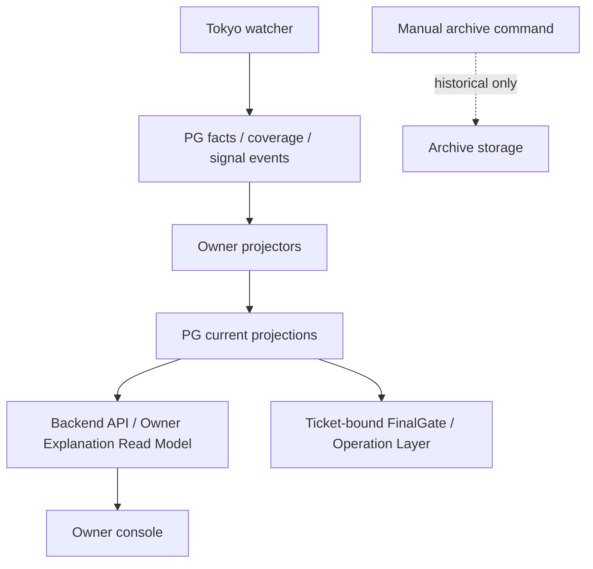

# Production Runtime File I/O Elimination Design

## Purpose

This document defines the executable plan to eliminate runtime JSON/Markdown
file dependency and recurring report-file production from the trading system.

The target is stricter than documenting file I/O:

```text
runtime and trading decisions do not read repo/output/report MD/JSON;
Owner-facing explanation does not read old artifacts;
recurring production services do not generate JSON/MD report state;
valuable historical material is archived only;
everything else is deleted.
```

This design does not authorize FinalGate bypass, Operation Layer bypass,
exchange write, live profile mutation, order-sizing mutation, or destructive
production cleanup.

## Owner Decision

Current Owner direction:

```text
Prefer deletion.
If deletion is not safe yet, migrate to PG.
If historical value remains, archive only for provenance.
Do not keep a "documented file path" as a normal runtime or Owner-facing path.
Do not treat export-only as a permanent steady state.
```

## Problem Statement

The current system has already moved important trading authority toward PG:

```text
PG current state
-> live signal
-> promotion candidate
-> action-time lane
-> Action-Time Ticket
-> ticket-bound FinalGate / Operation Layer handoff
```

However, file I/O remains across scripts, watcher reports, Owner console
readmodels, local diagnostics, and control snapshots. That creates four
failures.

| Failure | Concrete risk |
| --- | --- |
| **Runtime file authority returns** | A stale latest JSON can become an input again through a new or legacy reader |
| **Owner explanation drift** | The frontend/readmodel can explain from old report files instead of PG current state |
| **Recurring report growth** | Watcher tick or monitor cadence can fill disk and burn CPU on report generation |
| **Review blind spot** | Existing validators check selected drop-ins, not the full production chain file budget |

## Evidence

The current machine inventory is generated without writing repo `output/**`
by default:

```text
python3 scripts/audit_production_runtime_file_io.py
```

When a machine-readable inventory is needed, it must be printed to stdout:

```text
python3 scripts/audit_production_runtime_file_io.py --json
```

As of the current 2026-07-07 audit after removing production watcher report
writers, product-refresh JSON/MD cadence, dispatcher JSON output,
server-monitor report output, tracked output snapshots, the retired local
monitor sequence chain, Strategy Capture Gap report family, the retired
four-candidate replay/live parity file-builder family, Owner-facing historical
source-ref path strings from the BNB readiness explanation model, and the old
StrategyGroup governance file-builder family
(`build_strategygroup_registry_baseline`, `quality_wave`, `tier_review`,
`owner_policy_package`, `opportunity_review_work_loop`, and
`trial_grade_signal_gate_audit`) plus the old StrategyGroup combination report
family (`pre_live_rehearsal_readiness`, `quality_closure_wave`,
`three_strategy_live_trial_portfolio`, `portfolio_board`,
`handoff_boundary_closure`, `regime_role_coverage_map`, and
`capital_trial_envelope_projection`), the old BTPC/L2 research-governance
file chain, local daily-check cache modes, Runtime Safety default latest-file
inputs, default latest-file exports from PG-backed control readmodel
builders, archive-deploy report/backup defaults, the legacy
`signal-input-json` next-attempt prepare path, the current file-backed runtime
control-state repository, artifact-file candidate-universe validator,
post-submit JSON fixture dry-run CLI, project-local skill-creator tool copy,
core logger file rotation/cleanup, and ops manifest/archive file-output
options, dynamic evidence JSON file writers, YAML config import/export file
interfaces, JSONL trace/observe sidecars, and test-layer legacy JSON fixture
writers, the production/runtime/config scan reports:

| Metric | Count |
| --- | ---: |
| **Total file-related occurrences** | **167** |
| **Strict production blocking cleanup flags** | **0** |
| **Generated export/report readers** | **0** |
| **Repo machine config / seed references** | **0** |
| **Recurring report-write risk flags** | **0** |
| **Owner explanation file-source risk flags** | **0** |
| **Runtime file-read risk flags** | **0** |
| **Runtime file-write risk flags** | **0** |
| **Legacy dry-run artifact references** | **0** |
| **Generated-file write risk flags** | **0** |
| **Current-script legacy artifact file-I/O flags** | **0** |
| **Current-script file artifact CLI interface flags** | **0** |
| **Bounded destructive file mutation flags** | **3 production-classified one-shot ops mutations** |
| **Unbounded destructive file mutation risk flags** | **0** |

The full-system mode scans production, config, migrations, agent constraints,
tests, and current docs:

```text
python3 scripts/audit_production_runtime_file_io.py --all
```

The current full-system run reports:

| Metric | Count |
| --- | ---: |
| **Total file-related occurrences** | **1392** |
| **Generated export/report readers** | **20 test-rejection guard occurrences; 0 production-risk** |
| **Repo machine config / seed references** | **0** |
| **Recurring report-write risk flags** | **0** |
| **Owner explanation file-source risk flags** | **0** |
| **Runtime file-read risk flags** | **0** |
| **Runtime file-write risk flags** | **0** |
| **Legacy dry-run artifact references** | **0 production-risk** |
| **Generated-file write risk flags** | **0** |
| **Legacy artifact file-I/O flags** | **0** |
| **File artifact CLI interface flags** | **0** |
| **Test fixture file write flags** | **0** |
| **Manual agent tool file write flags** | **0** |
| **Governance file reference flags** | **0** |
| **Bounded destructive file mutation flags** | **3 full-system one-shot ops mutations** |
| **Unbounded destructive file mutation flags** | **0** |

The counts are intentionally conservative. They are used to drive
deletion/migration work, not to prove that every occurrence is production
authority. **Production P0 recurring report-write risk and strict production
blockers are now closed at zero**. Runtime file-read and runtime file-write
risk are also closed at zero in both production and full-system scans.
Full-system recurring report-write risk is
also zero after the audit learned to distinguish JSON/MD report-state writes
from ordinary test-local environment fixtures. Remaining cleanup debt is now
limited to one-shot ops mutation bounding. Current legacy
artifact/proof/evidence script file I/O, current file artifact CLI interfaces,
runtime file-read/write flags, test fixture file-write flags, and manual agent
tool write flags are closed at zero.

The inventory now contains these machine-readable sections:

| Section | Purpose |
| --- | --- |
| **file_summary** | Per-file operation counts, risk flags, cleanup decision, and recommended action |
| **read_inventory** | All detected file read surfaces |
| **write_inventory** | All detected file write / directory-write / copy / move surfaces |
| **mutation_inventory** | Delete, move, copy, and tree-delete surfaces |
| **performance_risk** | Recurring report-write and cadence-heavy file-growth risks |
| **cleanup_plan** | P0/P1/P2 grouped execution plan |

### Current Inventory Snapshot

The machine inventory is the full list. This section summarizes the current
shape so reviewers can see whether a change is shrinking or expanding the
surface.

Production/runtime/config scan:

| Operation | Count | Meaning |
| --- | ---: | --- |
| **read** | **35** | File reads that are not classified as production runtime authority; any runtime file-read risk fails the strict gate |
| **write** | **0** | Direct file writes are closed in the production scan |
| **directory_write** | **16** | Directory creation that is not a JSON/MD/runtime file writer; generated/runtime file-write risk is **0** |
| **move** | **0** | String `.replace()` is no longer counted as file move; true lifecycle mutation remains explicit |
| **delete / delete_tree** | **3** | Destructive mutation candidates; retained only for one-shot ops cleanup |
| **process_spawn** | **5** | systemd/process launch surfaces |
| **current-script cleanup flags** | **0** | legacy artifact file-I/O, file artifact CLI, runtime file-read, and runtime file-write flags are closed |

Full-system scan:

| Operation | Count | Meaning |
| --- | ---: | --- |
| **read** | **70** | Includes tests/docs/tools; generated export/report readers are test-rejection guards only |
| **write** | **48** | Includes test-local repo scaffolding and explicit diagnostics; runtime file-write risk remains zero |
| **directory_write** | **56** | Mostly tests, tooling, archive/ops scaffolding |
| **move** | **0** | String normalization is no longer misclassified as file lifecycle movement |
| **delete / delete_tree** | **3** | P2 one-shot ops cleanup only |
| **path_literal** | **1204** | Path-shaped literals in docs/tests/code; not all are file authority but all remain visible in inventory |
| **legacy artifact file-I/O** | **0** | Current scripts no longer preserve old artifact/proof/evidence file read/write semantics |
| **file artifact CLI interface** | **0** | Current scripts and docs no longer normalize file-based artifact interfaces |
| **runtime file read/write** | **0** | Current runtime/config file readers and writers are closed |

Read/write closure decisions:

| Class | Current disposition |
| --- | --- |
| **Production repo/output/report read** | Forbidden; delete or migrate to PG/current services |
| **Production generated JSON/MD write** | Forbidden; strict production gate requires **0** |
| **Runtime/config file read** | Forbidden; current semantics must come from PG/current services |
| **Runtime/config file write** | Forbidden; current semantics must persist to PG/current services or be deleted |
| **Full-system test fixture write** | Explicit JSON/MD fixture write risk is closed at **0**; future artifact-shaped fixtures must be in-memory or PG fixtures |
| **Archive write** | Manual only, retention-bounded, never production cadence |
| **Ops delete/prune** | One-shot, dry-run guarded, never watcher/monitor cadence |

The audit prints separate explicit inventories to stdout when requested:

| Scope | Output |
| --- | --- |
| **Production/runtime/config** | stdout JSON via machine-readable mode |
| **Full system with tests/docs/agents/migrations** | stdout JSON via machine-readable mode |

The current production cleanup plan groups as:

| Phase | Occurrences | Files | Meaning |
| --- | ---: | ---: | --- |
| **P1 import seed files then delete runtime readers** | **0** | **0** | production seed readers are closed |
| **P1 delete generated export readers** | **0** | **0** | production generated export readers are closed |
| **P0 delete current runtime file readers** | **0** | **0** | production runtime file readers are closed |
| **P0 delete current runtime file writers** | **0** | **0** | production runtime file writers are closed |
| **P1 archive legacy dry-run artifacts** | **0** | **0** | production dry-run current references are closed |
| **P2 bound ops file mutations** | **3** | **3** | destructive file operations must stay one-shot, dry-run guarded ops tools |

The current full-system cleanup plan groups as:

| Phase | Occurrences | Files | Meaning |
| --- | ---: | ---: | --- |
| **P0 delete current legacy artifact file I/O** | **0** | **0** | closed |
| **P0 delete file artifact CLI interfaces** | **0** | **0** | closed |
| **P0 delete current runtime file readers** | **0** | **0** | closed |
| **P0 delete current runtime file writers** | **0** | **0** | closed |
| **P1 import seed files then delete runtime readers** | **0** | **0** | Full-system seed readers are closed outside archive material |
| **P2 bound ops file mutations** | **3** | **3** | Cleanup/prune mutations must stay dry-run, one-shot, and manually invoked |

## Systemwide Remaining Debt Closure Plan

The remaining work must be closed by **families**, not by isolated string
edits. A single old script can be referenced by tests, docs, skills, validators,
and downstream builders. Deleting one file while preserving its vocabulary in
tests or docs leaves the old path alive.

Default disposition:

```text
delete first;
if current semantics are still needed, import/migrate them to PG;
if only historical value remains, move to archive-only provenance;
do not keep export-only, compatibility, fallback, or downgraded runtime paths.
```

### Remaining Family Map

| Family | Current evidence | Read/write issue | Default closure | Acceptance |
| --- | ---: | --- | --- | --- |
| **StrategyGroup registry / quality seed JSON** | **0 full-system seed occurrences** | production/current docs/tests no longer read old strategy seed families as source | useful semantics belong in PG strategy registry / policy / version tables; remaining historical files are archive-only | no production or current docs/tests require repo strategy JSON as current source |
| **Generated export readers** | **20 full-system generated-output reader occurrences** | remaining occurrences are test-rejection guards | keep only tests that prove old latest-file paths are blocked; delete any production/current-doc recurrence | full-system audit shows generated export readers only in test-rejection material, then trends to zero |
| **Generated file writers** | **0 full-system generated-file write risk flags** | old output/report writer risk has been separated from test fixtures, manual agent tool outputs, and governance examples | production and full-system generated-file risk gate is zero | any future generated JSON/MD writer in production fails the strict gate; any full-system generated output writer must be archive-only or rejected |
| **Legacy artifact file-I/O scripts** | **0** | closed | keep at zero; useful semantics now belong in PG projection/API | `legacy_artifact_file_io=0` in full-system audit |
| **File artifact CLI interfaces** | **0** | closed | keep current file input/output CLI interfaces deleted; use PG/current services, API/readmodel, or stdout summaries | `file_artifact_cli_interface=0` in full-system audit |
| **Test fixture file writes** | **0 full-system test fixture write flags** | explicit artifact-shaped fixture file-write risk is closed | future tests must use in-memory source scans, PG fixtures, or typed object fixtures for JSON/MD semantics | no artifact-shaped test file writes appear in full-system audit risk flags |
| **Manual agent tool writes** | **0 full-system manual agent tool write flags** | project-local `skill-creator` copy was deleted | skill development tooling belongs outside the trading repo unless explicitly admitted as archive-only tooling | no project-local agent benchmark/transcript/result writer remains in full-system audit risk flags |
| **Governance file references** | **0 full-system governance reference flags** | current docs no longer carry concrete retired JSON filename examples as current-path text | keep this at zero; use semantic descriptions instead of retired file paths | current docs must not normalize `latest-*.json` as an active path |
| **Local monitor / goal-progress old chain** | retired from current code | local sequence used to model report files as a control surface | **closed**: delete production-adjacent script/test path; keep old evidence only under archive provenance | no runtime/Owner explanation/skill uses local monitor files as status source |
| **Strategy Capture Gap old report family** | **closed** | old generated capture-gap report fed strategy governance surfaces | deleted current generator and CLI file-read consumers; useful conclusions must be represented as PG strategy-review rows | no current code/test/doc path requires the retired fixed report artifact |
| **Four-candidate replay/live parity file-builder family** | **closed in current path** | old replay JSON and parity audit exports could feed runtime activation or task-packet scope | deleted current builders/tests and replaced current task scope with PG-backed Tradeability / Candidate Pool projections; useful parity concepts must be represented as PG diagnostic/read-model rows | no current code/test/doc path requires the retired four-candidate replay or replay parity builder as source |
| **Server monitor baseline JSON** | **closed** | old docs JSON encoded monitor command, expected head, and quiet cadence | deleted current file, removed daily-check baseline reader, removed tests that required the file | production monitor ownership is systemd timer plus PG-backed monitor rows; daily check accepts explicit expected head only |
| **Validator default latest-file inputs** | **closed** | validators defaulted to generated latest-file paths and could preserve generated exports as normal inputs | removed default file paths and current JSON artifact CLIs; validators are in-memory or PG-projection checks | validators must not become current-source readers |
| **Old StrategyGroup governance file-builder family** | **closed for current path** | registry baseline, quality wave, tier review, owner policy package, opportunity review loop, and trial-grade gate scripts consumed repo seed JSON and generated output artifacts | deleted scripts and their self-referential tests; current strategy governance must be represented as PG strategy registry/policy/review rows | no current code/test path references the deleted builders; historical mentions remain only under archive provenance |
| **Old StrategyGroup combination report family** | **closed for current path** | pre-live readiness, quality closure wave, three-strategy portfolio, portfolio board, handoff boundary, regime role coverage, and capital trial envelope scripts packaged old JSON/doc/output chains | deleted scripts and self-referential tests; BRF2 evidence strings were rewritten away from the deleted three-strategy artifact | no current code/test path references the deleted builders; strategy portfolio/readiness semantics must come from PG projections |
| **Legacy signal-input JSON prepare path** | **closed for current path** | old next-attempt prepare wrapper accepted `--signal-input-json`, and the official first-submit flow could create a shadow candidate from a local JSON file | deleted the wrapper and tests, removed local signal-file loading from first-submit flow, and changed dispatcher `ready_for_non_executing_prepare` to fail closed toward PG promotion / Action-Time Ticket materialization | no active code/test/runtime path references `runtime_next_attempt_prepare_api_flow`, `--signal-input-json`, or local signal-input file loading |
| **Current file-backed runtime control repository** | **closed for current path** | `FileBackedRuntimeControlStateRepository` exposed a reusable JSON-file control-state reader under `src/infrastructure` | deleted the class and its tests; current repository boundary is PG-backed only | no current code/test path imports `FileBackedRuntimeControlStateRepository` |
| **Dynamic evidence JSON writers** | **closed for current path** | manual scripts could write Owner close / runtime profile seed evidence JSON through env-configured paths | deleted evidence-path env writers; commands may print stdout summaries, while current state is PG and history is archive-only outside runtime | no current script writes dynamic evidence JSON files |
| **YAML config import/export interfaces** | **closed for current path** | config repository and config manager preserved YAML file import/export as a configuration path | deleted YAML import/export methods and file parser entrypoints; current config changes must use PG/config services | no current config class exposes YAML file read/write as runtime/config authority |
| **JSONL trace/observe sidecars** | **closed for current path** | decision trace and StrategySignalV2 observe wrote runtime facts to local JSONL logs | deleted file-backed sink modules and disabled file-backed observe bootstrap; tests use in-memory sinks | no current runtime imports JSONL file sinks or writes trace/observe sidecar files |
| **Test-layer legacy JSON fixture writers** | **closed for current path** | readmodel and validator tests still created legacy report JSON files to prove they were ignored | rewritten tests to use PG projections, in-memory audit source, nonexistent legacy paths, or in-memory capture sinks | full-system runtime file-write and generated-file write risk flags are zero |
| **Artifact-file candidate-universe validator** | **closed for current path** | standalone validator consumed an artifact JSON file to validate runtime universe coverage | deleted the script and tests; coverage validation belongs to PG watcher coverage / Candidate Pool projection checks | no current server refresh sequence or test imports `validate_runtime_candidate_universe_coverage.py` |
| **Post-submit JSON fixture dry-run CLI** | **closed for current path** | post-submit finalize dry-run accepted `--fixture` JSON and emitted a generated payload | deleted the script; tests call domain/service code directly | no current code/test path references `runtime_post_submit_finalize_dry_run.py` |
| **Core logger file rotation / cleanup** | **closed for current path** | application logger created log files and performed compression/deletion on startup | logger is stdout-only; log retention belongs to system logging or explicit ops tools | no core logger file handler, compression, or deletion remains |
| **Old BTPC/L2 research-governance file chain** | **closed for current path** | BTPC classifier/proxy/replay and L2 dry-run/diagnostic/rehearsal scripts consumed handoff/replay JSON and emitted generated review reports | deleted scripts and self-referential tests; useful strategy-learning facts must be reintroduced only as PG strategy-review rows | no current code/test path references the deleted BTPC/L2 builders; historical mentions remain archive-only |
| **Dry-run audit chain vocabulary** | **closed in production path** | old names remain only as deletion protection, cleanup blacklist, or archive instruction | keep as rejection tests / cleanup targets only | production audit reports zero suspicious runtime file authority |
| **Output control snapshots** | manifest deleted; tracked output snapshots removed | output files no longer have a commit/control whitelist | reject all routine `output/**` changes; use PG projection validators and archive-only commands | routine commits do not include generated runtime `output/**` state |
| **Current artifact/proof/evidence script file I/O** | **0** | closed | keep useful semantics in PG projectors/API/readmodels, not file interfaces | full-system audit has `legacy_artifact_file_io=0` |
| **Current file artifact CLI interfaces** | **0** | closed | keep current file input/output CLI parameters deleted | full-system audit has `file_artifact_cli_interface=0` |
| **Ops cleanup tools** | **3 full-system destructive mutation occurrences** | three deletion helpers remain for report, backup, and release cleanup | keep only one-shot, dry-run guarded, explicitly invoked ops tools; no manifest file output, archive tar output, systemd timer, watcher, monitor, or runtime cadence | true file deletions are outside production timers and have explicit delete budgets / scope guards |

### Phase Sequence

| Phase | Target family | Required action | Why this order |
| --- | --- | --- | --- |
| **P1-1** | **Output control snapshots** | **closed**: deleted manifest, removed tracked output snapshots, changed output validator to reject all routine `output/**` | removes the commit-time path that keeps generated output socially alive |
| **P1-2** | **Local monitor / goal-progress old chain** | **closed**: deleted current script/test path and moved historical audit material to archive-only provenance | largest generated reader cluster and no longer production source |
| **P1-3** | **Strategy Capture Gap old report family** | **closed**: deleted current generator, old fixed-report CLI inputs, and artifact-path tests | closes both generated readers and writers in one family |
| **P1-4** | **Dry-run audit chain vocabulary** | **closed**: removed current proof-chain scripts, tests, product-state refresh hooks, snapshot/daily-check consumers, and Goal Status fields | prevents old rehearsal artifact from being mistaken for live-enablement authority |
| **P1-5** | **Current artifact/proof/evidence script file I/O** | **closed**: deleted or rewired current legacy scripts; useful live semantics now go through PG/current projections, API, or stdout summaries | removes the largest route for old documentized chain to re-enter current work |
| **P1-6** | **Current file artifact CLI interfaces** | **closed**: removed current file input/output CLI parameters and tests/docs that required them | closes the command surface that kept JSON/MD artifacts alive |
| **P1-6A** | **Legacy signal-input JSON prepare path** | **closed**: deleted `runtime_next_attempt_prepare_api_flow`, removed `--signal-input-json` from the official first-submit flow, and converted observation guidance to PG promotion / Action-Time Ticket materialization | prevents a fresh signal from being turned back into a local JSON file authority before candidate/FinalGate |
| **P1-6B** | **Current file-backed repository / artifact validators / dry-run fixture CLIs** | **closed**: deleted current file-backed repository, candidate-universe artifact validator, post-submit JSON fixture CLI, project-local skill-creator copy, and core logger file cleanup | removes reusable abstractions that could normalize file authority as a non-production fallback |
| **P1-7** | **StrategyGroup seed JSON** | import current registry/policy/quality semantics to PG, then archive/delete active JSON seeds | bigger semantic move; should happen after generated-output consumers are removed |
| **P2** | **Ops destructive file tools** | dry-run guard, explicit command-only, no systemd/timer wiring | safety cleanup after authority paths are closed |

### Per-Occurrence Decision Rule

Every read occurrence must answer:

| Question | Required outcome |
| --- | --- |
| **What is being read?** | current state, seed/config, historical evidence, test fixture, archive |
| **Can it be deleted?** | yes by default unless an active PG import target is named |
| **If not deleted, what PG table/readmodel owns it?** | named table, projector, owner, uniqueness/current constraint |
| **Who may read it after migration?** | runtime, Owner readmodel, manual archive tool, or test only |
| **What proves closure?** | failing old path test removed/replaced, audit count drops, PG validator passes |

Every write occurrence must answer:

| Question | Required outcome |
| --- | --- |
| **Why is this file generated?** | status view, audit evidence, debug export, archive, fixture |
| **Is it recurring?** | recurring JSON/MD output is forbidden |
| **Can it be deleted?** | yes by default |
| **If retained, why archive-only?** | explicit manual command, owner, retention, no runtime reader |
| **What replaces it?** | PG row/current projection/API readmodel/stdout summary |

### Full-System Exit Criteria

Full-system cleanup is complete only when:

```text
python3 scripts/audit_production_runtime_file_io.py --all \
  --max-blocking-cleanup-required 0 \
  --max-frequent-report-write 0 \
  --max-owner-explanation-file-source 0 \
  --max-legacy-artifact-file-io 0 \
  --max-file-artifact-cli-interface 0 \
  --max-generated-file-write 0 \
  --max-runtime-file-read 0 \
  --max-runtime-file-write 0 \
  --max-test-fixture-file-write 0 \
  --max-manual-agent-tool-file-write 0 \
  --max-unbounded-destructive-file-mutation 0
```

passes and the remaining inventory contains no current-path:

```text
generated_export_or_report_reader
generated_export_or_report_writer
repo_machine_config_or_seed
legacy_dry_run_artifact
legacy_artifact_file_io
file_artifact_cli_interface
latest_file_read
```

except explicitly named archive-only or test-rejection fixtures.

The only accepted full-system destructive file mutations are the three
one-shot ops helpers under `scripts/ops/`:

```text
cleanup_tokyo_runtime_reports_once.py
prune_tokyo_backups_latest_only.py
prune_tokyo_releases_once.py
```

They must remain manually invoked, dry-run by default, scope-guarded, and
outside systemd timer / watcher / monitor / runtime cadence. They must not add
manifest file outputs or archive file outputs.

## Classification Rules

### Runtime Reads

Any production or Owner-facing read from these classes is forbidden:

```text
repo structured JSON used as runtime authority
generated JSON exports
generated Markdown exports
server report JSON exports
server report Markdown exports
local cache files
retired dry-run audit exports
retired resume-pack exports
```

Required action:

| Case | Required action |
| --- | --- |
| Current runtime needs the data | Move the data to PG and replace the reader |
| Owner explanation needs the data | Read PG Owner Explanation Read Model |
| Only historical/debug value remains | Move to archive-only tooling |
| No active value remains | Delete reader and file producer |

### Runtime Writes

Recurring production services must not write JSON/MD report state as a normal
side effect.

Required action:

| Case | Required action |
| --- | --- |
| Current state needs to persist | Write PG rows or PG current projection |
| Operator needs a status view | Serve from API/readmodel, not report file |
| Historical evidence is useful | Write only through explicit manual archive command |
| No active value remains | Delete writer |

### Archives

Archives are allowed only when:

- they are not read by runtime, Owner explanation, FinalGate, Operation Layer,
  monitor decisioning, or deployment readiness;
- they are created by explicit manual or ops command;
- they are not produced by watcher tick, server monitor tick, or deploy hot
  path;
- they have an owner, retention period, and restore procedure.

## Current High-Risk Surfaces

### Recurring Watcher Tick Writers

Current status: **production P0 closed**.

```text
runtime_signal_watcher_tick.py
-> in-memory active monitor
-> PG watcher coverage
-> in-memory operator/wakeup evidence
-> stdout summary
```

Removed from production cadence:

```text
supervisor-artifact.json
status-artifact.json
latest-status.json
operator-evidence.json
wakeup-evidence.json
watcher-tick.json
notification-state.json
runtime-signal-watcher report-directory CLI argument
```

Remaining follow-up:

```text
cross-process Feishu dedupe should be PG-backed rather than process-local.
```

This is a notification-quality follow-up, not a JSON/MD report-growth blocker.

### Product-State Refresh Writers

Current status: **production P0 closed**.

The recurring refresh sequence now keeps only:

```text
watcher_tick_summary -> publish_runtime_control_current_projections
action_time_if_needed -> PG trigger counts -> action-time PG materializers only when needed
closure -> ticket-bound PG post-submit closure materializer
```

Removed from recurring cadence:

```text
Candidate Pool JSON/MD export
Daily Table JSON/MD export
Single Lane Packet JSON/MD export
Goal Status JSON export
action-time boundary JSON/MD export
MI/BRF2 diagnostic JSON/MD export
server-product-state-refresh-sequence.json
server-action-time-refresh-sequence.json
diagnostic_full
control_refresh
```

Manual diagnostics may remain only under explicit archive-only commands outside
production cadence.

### Owner Console Readmodel File Reads

`src/application/readmodels/trading_console.py` no longer has an Owner-facing
generic JSON file reader after the first cleanup pass. The remaining risk is
regression: future readmodel work must not restore report-dir JSON fallback.

Current requirement:

```text
Owner-facing product state must come from PG Owner Explanation Read Model.
Legacy file reads must remain absent from the main readmodel.
```

Owner-facing explanation models must also avoid path-shaped source refs. A
model that does not read `reports/**` can still mislead the product surface if
it emits `reports/...`, `docs/ops/...`, `src/...`, or `*.py` as the authority
for a decision. Current explanations must emit semantic authority refs such as
`pg_strategy_group_observation_case_queue_readmodel`,
`pg_owner_strategy_policy_decision_current`, or
`archive_only_testnet_rehearsal_history`.

Current local closure:

```text
src/application/mi001_bnb_trial_readiness_gap.py
-> no Owner-facing report/doc/code-path source refs
-> gap authority fields use current_authority_ref
-> execution boundary fields use authority_ref
-> API regression test rejects reports/, docs/ops/, src/, and .py in payload
```

### Output Control Snapshots

Current status: **closed for routine commits**.

```text
config/output_control_snapshots.json deleted;
tracked generated latest-file snapshots deleted;
validate_output_artifact_scope.py rejects routine output/** changes.
```

## Target Architecture



Forbidden target:

```text
watcher tick
-> report JSON
-> readmodel / monitor / dispatcher / gate
```

## Implementation Plan

### P0-A: Freeze Expansion

Goal:

```text
no new runtime file reads/writes enter production paths.
```

Actions:

1. Add `scripts/audit_production_runtime_file_io.py` to deployment review.
2. Run it on every runtime/deploy/readmodel change.
3. Reject new `blocking_cleanup_required` occurrences.
4. Reject new recurring JSON/MD writes in watcher, monitor, product refresh,
   dispatcher, FinalGate, Operation Layer, and Owner readmodel paths.

Done when:

```text
audit passes with no new blocking occurrences compared with the accepted
baseline.
```

Task card:

| Field | Value |
| --- | --- |
| **Task ID** | `P0-RUNTIME-FILE-IO-FREEZE-GATE` |
| **Allowed files** | `scripts/audit_production_runtime_file_io.py`, validator tests, deploy acceptance docs |
| **Forbidden files** | FinalGate, Operation Layer, exchange gateway, live profiles, sizing defaults |
| **Acceptance** | production strict zero gate passes for `blocking_cleanup_required`, `frequent_report_write`, `owner_explanation_file_source`, `generated_file_write`, `runtime_file_read`, `runtime_file_write`, `file_artifact_cli_interface`, `legacy_artifact_file_io`, and `unbounded_destructive_file_mutation` |
| **Performance** | audit production mode completes in under 10 seconds on the local repo |

### P0-A2: Production Cadence Transitive Audit

Goal:

```text
audit the scripts actually reached by systemd timer cadence, not only the
top-level service and orchestrator files.
```

Current production cadence script set includes:

| Group | Examples | Why included |
| --- | --- | --- |
| **watcher tick chain** | `runtime_signal_watcher_tick.py` | Called directly by `brc-runtime-signal-watcher.service`; active observation now runs in memory instead of supervisor/loop JSON files |
| **dispatcher chain** | `runtime_signal_watcher_resume_dispatcher.py` | Current systemd post-step consumes PG ticket identity and emits stdout only |
| **product refresh chain** | `run_server_product_state_refresh_sequence.py`, PG fact/materializer scripts, current projection publisher | Called by watcher post-step modes without generated JSON/MD exports |
| **action-time chain** | PG promotion lane, Action-Time Ticket, FinalGate preflight materializer, Operation Layer handoff materializer, runtime safety, post-submit closure | Called by action-time refresh mode |
| **server monitor chain** | `run_tokyo_runtime_server_monitor.py` | Called by `brc-runtime-monitor.timer` |

Done when:

```text
file_summary and performance_risk list every cadence-reachable file writer and
reader; no production cadence subscript escapes P0 cleanup classification.
```

This is why the production P0 report-write count is now allowed to be strict
zero. The audit no longer accepts a top-level clean drop-in while a
cadence-reachable child script still writes reports.

### P0-A3: P0 Cleanup Batches

The original P0 occurrences collapsed into five cleanup batches:

| Batch | Target | Required outcome |
| --- | --- | --- |
| **B1 systemd cadence cleanup** | Remove report-directory and file-output CLI arguments plus report `ReadWritePaths` from production timers where not needed | **Closed for production P0** |
| **B2 watcher PG-only tick** | Replace watcher report files with PG watcher coverage / facts / signal / monitor rows | **Closed for production P0**; notification dedupe PG hardening remains follow-up |
| **B3 PG projection refresh** | Replace Candidate Pool / Daily Table / Single Lane / Goal Status file publication in recurring refresh with PG current projection writes | **Closed for production P0** |
| **B4 validator PG-source conversion** | Replace validators/tests/docs that normalize `latest-*.json` with PG projection or in-memory checks | **Remaining full-system P1/P2 cleanup** |
| **B5 action-time export isolation** | Ticket / preflight / handoff / safety materializers write PG events/current rows; JSON artifacts become manual archive-only if retained | **Closed for current production action-time materializers** |

Current B1/B2/B3/B5 production completion:

| Removed production summary writer | New authority |
| --- | --- |
| `run_tokyo_runtime_server_monitor.py` JSON monitor export | PG `brc_server_monitor_runs` and `brc_server_monitor_notifications` |
| `brc-runtime-monitor.service` report-dir `ReadWritePaths` | No report-dir write permission for the monitor timer |
| `run_server_product_state_refresh_sequence.py` product-state JSON sequence export | In-process return value and stdout summary only |
| `run_server_product_state_refresh_sequence.py` action-time JSON sequence export | In-process return value and stdout summary only |
| `publish_runtime_control_current_projections.py` Candidate Pool / Daily Table / Goal Status export paths | PG `brc_control_read_model_snapshots`, `brc_pretrade_readiness_rows`, and `brc_goal_status_current` |
| `materialize_pg_promotion_action_time_lane.py` action-time lane report | PG promotion candidate, action-time lane, budget reservation, and protection reference rows |
| `materialize_action_time_ticket.py` ticket materialization report | PG Action-Time Ticket and ticket lifecycle event rows |
| `materialize_action_time_finalgate_preflight.py` preflight report | PG ticket lifecycle event rows |
| `materialize_action_time_operation_layer_handoff.py` handoff report | PG operation-layer handoff rows |
| `materialize_ticket_bound_runtime_safety_state.py` runtime safety report | PG runtime safety state snapshot rows |
| `materialize_ticket_bound_post_submit_closure.py` post-submit closure report | PG ticket-bound post-submit closure rows |
| `fetch_binance_usdm_public_facts.py` public facts JSON/MD report | PG pretrade public fact snapshot rows |
| `build_runtime_account_safe_facts.py` account safe JSON report | PG account-safe and account-mode fact snapshot rows |
| `runtime_signal_watcher_tick.py` watcher/status/operator/wakeup JSON reports | in-memory active monitor/operator/wakeup evidence, PG watcher coverage, stdout summary |
| `runtime_signal_watcher_resume_dispatcher.py` dispatch JSON export | PG ticket identity and stdout dispatch summary |
| `runtime_next_attempt_prepare_api_flow.py` local signal JSON prepare wrapper | deleted; PG promotion / Action-Time Ticket materializers own fresh-signal promotion |
| `runtime_first_real_submit_api_flow.py --signal-input-json` local signal-file path | deleted; official prepare requires DB candidate/authorization identity |
| `brc-runtime-signal-watcher.service` report-directory CLI argument | no report directory parameter in production watcher service |

The remaining file-I/O work is **not production P0 recurring report growth**.
It is P1/P2 cleanup: seed/config import to PG, generated export readers moved
to archive-only diagnostics, full-system tests/docs updated away from legacy
latest-file semantics, and ops file mutations kept as dry-run one-shot tools.

### P0-B: Remove Owner Explanation File Reads

Goal:

```text
Owner console and Owner Explanation Read Model never read report JSON as the
main source.
```

Actions:

1. Replace watcher/report JSON reads in `trading_console.py` with PG readmodel
   methods.
2. Delete retired dry-run, report-dir goal-status, and deploy/probe JSON readers
   from Owner-facing status assembly.
3. Move any remaining historical view to a developer archive endpoint or remove
   it entirely.

Done when:

```text
trading_console.py has no production `_read_json_file` path for Owner-facing
state.
```

Current local status:

```text
owner_explanation_file_source=0
Owner readmodel source refs report legacy_report_files_read=false
legacy_json_fallback=false
old watcher/status/dry-run/deploy JSON files are ignored in tests
```

Task card:

| Field | Value |
| --- | --- |
| **Task ID** | `P0-OWNER-EXPLANATION-PG-ONLY` |
| **Allowed files** | `src/application/readmodels/trading_console.py`, PG readmodel repository, owner explanation tests |
| **Forbidden files** | Runtime execution core, FinalGate, Operation Layer, exchange gateway |
| **Acceptance** | Owner-facing readmodel obtains watcher/status/no-trade explanation from PG-backed readmodel; audit reports `owner_explanation_file_source=0` |
| **Performance** | one Owner console status request must not scan report directories or parse arbitrary JSON files |

### P0-C: Remove Recurring Watcher Report Writers

Goal:

```text
watcher tick writes PG rows and does not emit JSON/MD report state by default.
```

Actions:

1. Move watcher tick state to PG watcher coverage / monitor run tables.
2. Delete `supervisor-artifact.json`, `status-artifact.json`,
   `operator-evidence.json`, `wakeup-evidence.json`, and `watcher-tick.json`
   writes from the recurring path.
3. Keep manual archive command only if historical reproduction is needed.
4. Remove report directory creation from the normal watcher service.

Done when:

```text
one no-signal watcher tick creates zero JSON/MD report files.
```

Task card:

| Field | Value |
| --- | --- |
| **Task ID** | `P0-WATCHER-TICK-ZERO-FILE-WRITE` |
| **Allowed files** | `scripts/runtime_signal_watcher_tick.py`, watcher PG writer/repository, watcher systemd unit, watcher tests |
| **Forbidden files** | Strategy parameters, live profiles, sizing defaults, FinalGate bypass, Operation Layer bypass |
| **Acceptance** | no-signal watcher tick writes bounded PG rows only; no `watcher-tick.json`, `status-artifact.json`, `operator-evidence.json`, or `wakeup-evidence.json` are created |
| **Performance** | no-signal tick has bounded runtime and creates zero JSON/MD files |

### P0-D: Remove Product-State Refresh JSON/MD Cadence

Goal:

```text
product-state refresh writes PG projections, not file exports, during normal
server cadence.
```

Actions:

1. Replace recurring file-output and Owner-progress file-output parameters
   with PG projector writes.
2. Delete Candidate Pool / Daily Table / Single Lane Packet latest-file
   generation from recurring server path.
3. Make any human-readable export a manual archive command.
4. Remove `output_control_snapshots` from routine git/change flow.

Done when:

```text
normal refresh cadence creates no JSON/MD artifacts and validators inspect PG
projection rows.
```

Task card:

| Field | Value |
| --- | --- |
| **Task ID** | `P0-PRODUCT-STATE-REFRESH-PG-ONLY` |
| **Allowed files** | `scripts/run_server_product_state_refresh_sequence.py`, PG projectors, current projection validators, systemd drop-ins, tests |
| **Forbidden files** | FinalGate bypass, Operation Layer bypass, exchange write path, live profile/sizing defaults |
| **Acceptance** | recurring `watcher_tick_summary` and `action_time_if_needed` do not write Candidate Pool, Daily Table, Single Lane Packet, Goal Status, or action-time JSON/MD files; validators read PG projections |
| **Performance** | no-signal refresh skips heavy builders and creates zero JSON/MD files |

### P0-E: Delete Legacy Bridges

Goal:

```text
old report chains cannot influence runtime, explanation, or review.
```

Actions:

1. Delete production references to retired dry-run audit exports.
2. Delete production references to retired resume-pack exports.
3. Delete legacy file-backed current projection paths.
4. Archive handoff/seed files only after PG import proof exists.

Done when:

```text
runtime grep shows legacy bridge names only in archive docs or tests that prove
they are rejected.
```

Task card:

| Field | Value |
| --- | --- |
| **Task ID** | `P0-LEGACY-FILE-BRIDGE-DELETION` |
| **Allowed files** | legacy bridge scripts, rejection validators, tests, archive tooling |
| **Forbidden files** | Any code that reintroduces JSON/MD runtime fallback |
| **Acceptance** | Retired dry-run, resume-pack, and latest-file bridges are absent from production paths; remaining references are archive/test-rejection only |
| **Performance** | no recurring service runs legacy dry-run or archive writers |

## Validator Redesign

The historical `validate_no_runtime_file_authority.py` was too narrow because
it checked only selected systemd drop-ins. It could miss invoked scripts,
readmodels, tests/skills that normalize file authority, recurring report
writers, and performance regressions where a no-signal tick keeps rebuilding
JSON/MD output.

Current local status:

```text
validate_no_runtime_file_authority.py
-> checks production systemd drop-in tokens
-> runs transitive production file I/O audit in memory
-> fails on blocking_cleanup_required
-> fails on frequent_report_write
-> fails on generated_file_write
-> fails on file_artifact_cli_interface
-> fails on legacy_artifact_file_io
-> fails on owner_explanation_file_source
-> fails on suspicious_runtime_file_authority
-> fails on unbounded_destructive_file_mutation
```

This means a clean drop-in is no longer enough. A cadence-reachable child script
that reintroduces `watcher-tick.json`, `latest-*.json`, report-dir reads, or an
Owner explanation file fallback fails the validator.

Required validator set:

| Validator | Purpose |
| --- | --- |
| `audit_production_runtime_file_io.py --fail-on-risk` | Detect production file reads, recurring file writes, Owner explanation file sources, and generated JSON/MD writes |
| `audit_production_runtime_file_io.py --all` | Generate full-system inventory across production/config/migrations/agents/tests/docs |
| `validate_no_runtime_file_authority.py` | Keep drop-in production authority closed and run transitive production file I/O audit |
| `validate_pg_current_projection_lineage.py` | Prove current projections are PG-backed |
| `validate_current_projection_ownership.py` | Prove one owner projector per current state |
| `validate_export_matches_pg_projection.py` | Prove any remaining explicit export matches PG projection instead of becoming authority |

No separate Owner-explanation file-source validator is currently needed because
`audit_production_runtime_file_io.py` classifies Owner console readmodel file
reads as `owner_explanation_file_source` and `validate_no_runtime_file_authority.py`
runs that transitive production audit.

Deployment review must use the strict production gate:

```text
python3 scripts/audit_production_runtime_file_io.py \
  --max-blocking-cleanup-required 0 \
  --max-frequent-report-write 0 \
  --max-owner-explanation-file-source 0 \
  --max-generated-file-write 0 \
  --max-runtime-file-read 0 \
  --max-runtime-file-write 0 \
  --max-file-artifact-cli-interface 0 \
  --max-legacy-artifact-file-io 0 \
  --max-unbounded-destructive-file-mutation 0
```

Full-system review must run as an enforced regression surface:

```text
python3 scripts/audit_production_runtime_file_io.py --all \
  --max-blocking-cleanup-required 0 \
  --max-owner-explanation-file-source 0 \
  --max-frequent-report-write 0 \
  --max-generated-file-write 0 \
  --max-runtime-file-read 0 \
  --max-runtime-file-write 0 \
  --max-file-artifact-cli-interface 0 \
  --max-legacy-artifact-file-io 0 \
  --max-test-fixture-file-write 0 \
  --max-manual-agent-tool-file-write 0 \
  --max-unbounded-destructive-file-mutation 0
```

The production completion gate is also:

```text
python3 scripts/audit_production_runtime_file_io.py \
  --max-blocking-cleanup-required 0 \
  --max-frequent-report-write 0 \
  --max-owner-explanation-file-source 0 \
  --max-generated-file-write 0 \
  --max-runtime-file-read 0 \
  --max-runtime-file-write 0 \
  --max-file-artifact-cli-interface 0 \
  --max-legacy-artifact-file-io 0 \
  --max-unbounded-destructive-file-mutation 0
```

or equivalently:

```text
python3 scripts/audit_production_runtime_file_io.py --fail-on-risk
```

The full-system gate is now enforced:

```text
python3 scripts/audit_production_runtime_file_io.py --all \
  --max-blocking-cleanup-required 0 \
  --max-frequent-report-write 0 \
  --max-owner-explanation-file-source 0 \
  --max-generated-file-write 0 \
  --max-runtime-file-read 0 \
  --max-runtime-file-write 0 \
  --max-file-artifact-cli-interface 0 \
  --max-legacy-artifact-file-io 0 \
  --max-test-fixture-file-write 0 \
  --max-manual-agent-tool-file-write 0 \
  --max-unbounded-destructive-file-mutation 0
```

## Performance Constraints

Performance is now an architecture and review requirement.

Every runtime/deploy/readmodel change must answer:

| Question | Required answer |
| --- | --- |
| **Cadence** | Is this per tick, per signal, per deploy, manual, or archive-only? |
| **File writes** | How many files can one no-signal tick create? Target: **0** |
| **PG writes** | How many PG rows can one no-signal tick create? Must be bounded |
| **CPU** | Does the path run heavy builders only on PG trigger? |
| **Disk** | Does the path create append-only or per-run files? Normal cadence must not |
| **Network/API** | Does the path call external services only when necessary? |
| **Timeout** | Is every subprocess/API call bounded? |
| **Retention** | If archive output exists, who cleans it and when? |

Deployment acceptance must include:

```text
one no-signal watcher tick
-> zero JSON/MD report growth
-> bounded PG row count
-> bounded runtime
-> no diagnostic_full
-> no archive write
```

## Review Rules

Reviewers must not accept:

- new `read_text` / `json.load` production reads from repo/output/report state;
- new `write_text` / `json.dump` recurring production writes;
- new file-output CLI parameters in systemd cadence;
- Owner readmodels that load report files;
- validators that only inspect drop-ins while ignoring invoked scripts;
- performance claims without cadence and file/PG write budget.

## Completion Criteria

This initiative is complete only when all are true:

| Requirement | Completion evidence |
| --- | --- |
| **Inventory** | Machine audit lists all runtime file I/O surfaces in production paths |
| **Runtime reads removed** | Production runtime code reads PG/current services, not repo/output/report files |
| **Runtime file authority closed** | Strict full-system audit reports `runtime_file_read=0` and `runtime_file_write=0` |
| **Owner reads removed** | Owner explanation and console readmodels read PG only |
| **Recurring writes removed** | Watcher/monitor/product refresh create no JSON/MD files during normal cadence |
| **Legacy bridges deleted** | Resume pack, dry-run audit, and latest JSON bridges are absent from production paths |
| **Archives isolated** | Historical material is accessible only through explicit archive tooling |
| **Validators expanded** | Deployment/review gates fail on new production file reads/writes |
| **Performance bounded** | No-signal tick has measured file-growth and runtime budget evidence |

## Chain Position

```text
chain_position: runtime_file_io_elimination
strategy_group_id: active StrategyGroups
symbol: active candidate universe
stage: pg_current_projection_hardening
first_blocker: no active production/runtime file-authority blocker; only bounded one-shot ops cleanup mutations remain
next_action: keep strict production and full-system audit gates in deploy/review; do not reintroduce file-backed current paths
stop_condition: full-system audit remains zero for runtime_file_read/write, generated_file_write, file_artifact_cli_interface, legacy_artifact_file_io, and recurring report-write risks
owner_action_required: no
authority_boundary: no FinalGate bypass, no Operation Layer bypass, no exchange write, no live profile or sizing mutation
```
