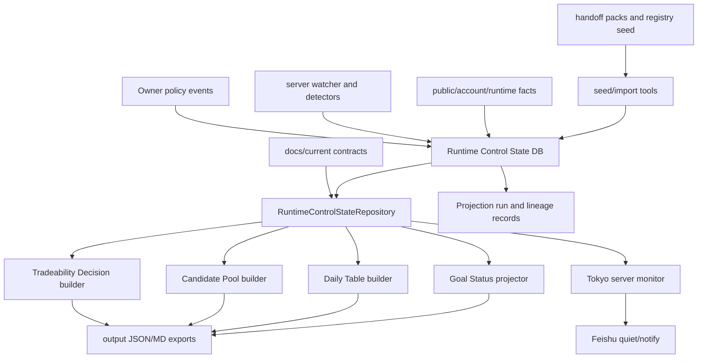

# Runtime Control State DB Architecture

## Purpose

This document defines the target DB-backed information architecture for the
StrategyGroup pre-trade runtime.

The goal is not to delete every JSON or Markdown file. The goal is to stop
using files as conflicting runtime sources of truth.

The target split is:

```text
Docs explain contracts.
DB stores current policy, registry, runtime, and control state.
Generated JSON/MD exports summarize DB-backed read models.
Archives preserve provenance.
```

This design supports the current V0 runtime target:

```text
five active StrategyGroups
-> multiple candidate symbols per StrategyGroup
-> per-symbol readiness and first blocker
-> fresh-signal promotion
-> at most one action-time lane input
-> official FinalGate and Operation Layer only after action-time gates pass
```

The detailed mainline MD/JSON read/write inventory is maintained in:

```text
docs/current/RUNTIME_CONTROL_STATE_MAINLINE_FILE_IO_MAP.md
```

## Decision

Dynamic live-enablement state should move behind a DB-backed
`RuntimeControlStateRepository`.

The repository is the only allowed read boundary for these dynamic domains:

- StrategyGroup registry state that is consumed by runtime builders;
- Owner policy and scoped authorization;
- candidate universe and symbol/side scope;
- watcher/runtime coverage;
- RequiredFacts computation snapshots;
- pre-trade readiness rows;
- promotion candidates;
- action-time lane inputs;
- runtime safety state;
- server monitor quiet/notify state;
- generated control read-model snapshots.

During migration, a file-backed repository may read the current JSON files for
compatibility. Runtime scripts should still call the repository, not raw file
paths. After DB-backed implementation is accepted, file-backed reads become
seed/export compatibility only.

## Known Current Facts

These are current repo facts as of 2026-07-03.

| Fact | Current evidence |
| --- | --- |
| Current information contract already says dynamic state should move to runtime or policy stores | `docs/current/PROJECT_INFORMATION_ARCHITECTURE.md` |
| `docs/current` contains many mixed-purpose JSON/MD files | 66 JSON/MD files under `docs/current` |
| `output` contains many generated or volatile JSON/MD files | 68 JSON/MD files under `output` |
| Candidate Pool reads many raw files directly | `scripts/build_strategy_live_candidate_pool.py` reads Daily Table, Tradeability, Replay/Live Parity, Action-Time Boundary, runtime active monitor, detector facts, and Owner authorization JSON |
| Daily Table reads generated output files directly | `scripts/build_daily_live_enablement_table.py` reads Tradeability, Replay/Live Parity, Action-Time Boundary, MI admission, runtime safety, and optional Candidate Pool JSON |
| Server monitor still reads generated JSON snapshots as primary inputs | `scripts/run_tokyo_runtime_server_monitor.py` reads Daily Table, Candidate Pool, public facts, account-safe facts, watcher status, and deploy health JSON |
| Strategy semantics already have PG-style tables | `src/infrastructure/pg_models.py` includes `brc_strategy_families`, `brc_strategy_family_versions`, `brc_strategy_family_registry`, and `brc_strategy_family_playbooks` |
| Runtime lifecycle already has PG-style tables | `strategy_runtime_instances`, `strategy_runtime_events`, `signal_evaluations`, `order_candidates`, and many `runtime_execution_*` tables exist |
| Owner/policy records already partially exist | `brc_owner_risk_acknowledgements`, `brc_owner_risk_acceptances`, bounded trial authorization tables, and budget authorization tables exist |
| Runtime profile is already modeled | `runtime_profiles` exists |
| Candidate universe is still partly hard-coded | `DEFAULT_CANDIDATE_UNIVERSE` appears in runtime builders and monitor scripts |
| Owner pre-trade authorization is currently a docs JSON input | `docs/current/strategy-group-handoffs/owner-pretrade-runtime-authorization-v0.json` |

## Problem

The current system has five information roles mixed across JSON, Markdown,
output files, and code constants.

| Role | Current problem | Runtime impact |
| --- | --- | --- |
| Strategy semantics | Registry baseline, handoff packs, and code constants can disagree | A strategy may be treated differently by intake, Tradeability, and Candidate Pool |
| Owner policy | Authorization JSON, tier policy JSON, runtime profile, and deployed runtime scope can drift | `live_submit_allowed` can mean different things in different links |
| Runtime facts | Watcher status, public facts, active monitor, and runtime safety are separate files | A fresh signal may not promote because the chain reads a stale source |
| Read models | Daily Table and Candidate Pool are generated, but other scripts then treat them as inputs | Generated views become second-order sources of truth |
| Output governance | Some output files are valid snapshots and others are volatile runtime noise | Git and runtime can accidentally preserve stale facts |

The main architectural failure mode is:

```text
source A says scoped
source B says not attached
source C says market wait
builder D picks one based on file availability
```

That is not a strategy problem. It is a source-of-truth problem.

## Current Mainline File I/O Map

The current live-enablement chain still has several JSON/MD files acting as
runtime sources. The target is not to copy these files into PG. The target is
to replace them with typed events, facts, and current projections, then export
JSON/MD only for compatibility.

| Mainline node | Current reads | Current writes | Current risk | PG target |
| --- | --- | --- | --- | --- |
| Watcher tick / active monitor | systemd runtime, exchange/public inputs, Candidate Pool export as candidate universe, runtime scope files | server report JSON such as `latest-status.json`, local `latest-runtime-active-observation-status.json` | Watcher coverage becomes a file-presence interpretation and a generated view can drive the observer universe | `brc_strategy_group_candidate_scope`, `brc_watcher_runtime_coverage`, plus fact/event rows |
| Public/account fact collectors | exchange APIs, fallback JSON, live-facts report JSON | `latest-binance-usdm-public-facts.json`, `latest-account-safe-facts.json` | Freshness and fallback source can drift across builders | `brc_runtime_fact_snapshots` with observed/valid-until timestamps |
| Strategy detector builders | public facts JSON, strategy constants, local artifacts | detector fact JSON/MD such as SOR/MI/BRF2/MPG outputs | Detector output becomes a downstream file authority | `brc_live_signal_events` and fact snapshots |
| Tradeability Decision | registry baseline JSON, tier policy JSON, runtime safety, replay/live parity, action-time boundary, admission/scope outputs | `latest-strategygroup-tradeability-decision.json/md` | Broad generated read model can become an upstream source for later builders | DB-backed Tradeability read model over current projections |
| Replay/Live Parity Audit | replay JSON, CPM/MPG/SOR detector or watcher outputs | `latest-replay-live-parity-audit.json/md` | Historical parity diagnostics can be confused with current live coverage | diagnostic/read-model rows separate from watcher coverage |
| Candidate Pool | Daily Table, Tradeability, replay/live parity, action-time boundary, detector facts, runtime active monitor, Owner auth JSON | `latest-strategy-live-candidate-pool.json/md` | Generated view recomputes source priority and may become authority | `brc_pretrade_readiness_rows`, `brc_promotion_candidates`, `brc_action_time_lane_inputs` |
| Daily Table | Candidate Pool plus generated fact/readiness outputs | `latest-daily-live-enablement-table.json/md` | Management table can inherit stale generated inputs | DB-backed read-model export from current projections |
| Single Lane Packet | Daily Table JSON | `latest-single-lane-task-packet.json/md` | Market waits can be accidentally wrapped as closure tasks | Task export only, not runtime authority |
| Goal Status | report-dir artifacts, optional Candidate Pool JSON, release manifest, legacy pilot status | `strategygroup-runtime-goal-status.json` | Multiple writers and optional Candidate Pool can let legacy scope mismatch overrule new control state | `brc_goal_status_current` single-owner projection |
| Server monitor | Daily Table, Candidate Pool, public/account facts, watcher/systemd/deploy health JSON, dedupe JSON | server monitor JSON and Feishu dedupe state | Production monitor can become a file aggregator instead of the runtime fact owner | `brc_server_monitor_runs`, `brc_server_monitor_notifications`, current projections |

## Current Conflict Cases

These cases define why the migration must introduce current projection
ownership, not just a DB table for every existing artifact.

| Conflict | Concrete shape | Why it matters | Target rule |
| --- | --- | --- | --- |
| Multiple writers for one current file | `strategygroup-runtime-goal-status.json` can be written by more than one post-step path | Last writer wins even if it used older inputs | One current projection has exactly one owner projector |
| Optional control source | Goal Status can run with or without `--candidate-pool-json` | Same command can produce different authority conclusions | Candidate Pool/current projection is required once it becomes the control-plane source |
| Legacy diagnostic promoted to blocker | `pilot_status.watcher_scope_alignment` can still emit scope mismatch after Candidate Pool proves coverage | Old status can hide real waiting/fresh-signal state | Legacy artifacts may write diagnostics only |
| Watcher universe from generated view | watcher tick reads Candidate Pool export as `--candidate-universe-json` | A previous-cycle read model can define the current observation universe | Watcher reads DB candidate scope/runtime bindings |
| Generated view consumed as source | Candidate Pool, Daily Table, Packet, Goal Status read each other's JSON outputs | Read models become second-order truth | Builders read repository/current projections; JSON is export |
| No shared lineage | Candidate Pool and Goal Status do not share a required `projection_run_id` and input watermark | It is hard to prove they describe the same watcher tick | Every projection records run ID, input watermark, source priority, and owner projector |
| Hard-coded scope | Candidate universes and primary symbols appear in code constants and docs JSON | Owner scope and runtime scope can diverge silently | Candidate scope and runtime bindings are DB current projections |

### Goal Status Case Study

The recent Candidate Pool / Goal Status mismatch is the canonical example.

The intended control order is:

```text
watcher/facts
-> Candidate Pool current projection
-> Daily Table export
-> Single Lane Packet export
-> Goal Status current projection
```

The unsafe transitional shape is:

```text
legacy pilot/status artifacts
plus optional Candidate Pool JSON
plus multiple systemd post-step writers
-> strategygroup-runtime-goal-status.json
```

This can report `runtime_scope_mismatch` or
`selected_strategygroup_scope_mismatch` even after Candidate Pool has proven
server-backed 5x18 coverage. The fix is not to add another packet. The fix is
to make Goal Status Current a single-owner projection that depends on the
Candidate Pool/current readiness projection when that projection is available.
Legacy scope alignment can remain as `legacy_diagnostics`, but it must not set
the main current blocker.

## Alternatives Considered

| Option | Description | Pros | Cons | Decision |
| --- | --- | --- | --- | --- |
| File-only cleanup | Keep JSON/MD as machine sources, tighten validators and gitignore rules | Smallest implementation change | Does not remove semantic drift across policy, runtime, output, and code constants | Reject as long-term architecture |
| Big-bang DB migration | Move all dynamic JSON, output snapshots, strategy registry, policy, facts, and monitor state directly into DB | Clean target state quickly if it works | High blast radius; easy to break live-enablement builders and deployment at once | Reject for first implementation |
| Repository-first phased migration | Add `RuntimeControlStateRepository`, start file-backed, then migrate policy/candidate scope/runtime coverage to DB | Compresses read boundary early; allows DB migration without breaking every builder at once | Requires temporary compatibility layer and tests against direct file reads | Recommended |
| Generic JSONB document store | Store current JSON payloads in one or two generic tables | Fast to import existing artifacts | Preserves ambiguous schemas and makes DB another artifact bucket | Reject except for read-model snapshot history |

The recommended path is repository-first phased migration. It removes the
highest-risk source-selection problem before it changes the physical storage
for every domain.

## Design Principles

### One Dynamic Source Boundary

Runtime builders must consume dynamic state through one repository boundary:

```text
RuntimeControlStateRepository
```

They must not independently decide whether to read:

- `docs/current/**/*.json`;
- `output/runtime-monitor/latest-*.json`;
- server report JSON;
- code constants;
- local cache files.

### One Current Projection Owner

Every `current_*` state must have exactly one owner projector.

Allowed writers:

- fact collectors write fact snapshots or events;
- detector builders write signal/fact events;
- diagnostic tools write diagnostics;
- one named projector writes each current projection.

Forbidden writers:

- a product-state refresh script must not write the same current state as a
  final post-step builder;
- legacy status artifacts must not overwrite current readiness, scope,
  promotion, action-time, or goal-status projections;
- generated export writers must not make independent blocker decisions.

The required flow is:

```text
facts/events/diagnostics
-> owner projector
-> current projection
-> JSON/MD export
```

The forbidden flow is:

```text
facts/events
-> many scripts
-> many current-like JSON files
-> later script chooses one
```

### Projection Lineage Is Required

Every current projection must record:

- `projection_run_id`;
- `owner_projector`;
- `input_watermark`;
- `source_priority`;
- code version or release head;
- source fact/event IDs where available;
- whether legacy diagnostics were read;
- whether legacy diagnostics affected the current blocker.

For production current projections, legacy diagnostics must not affect the main
blocker when a fresher DB-backed projection exists.

### DB Stores Facts, Not Reports

DB tables should store normalized facts, policy, state, and lineage.

Generated JSON/MD files remain useful, but only as exports:

```text
DB facts -> read model builder -> output JSON/MD
```

This must not become:

```text
output JSON -> runtime source -> another output JSON
```

### Append Events, Project Current State

Owner policy, runtime state changes, monitor runs, and promotion decisions
should be append-only where possible, with explicit current projections.

The write model should preserve provenance. The read model should answer the
current question quickly.

### Strategy Semantics Are Versioned

A StrategyGroup's model semantics are mostly stable, but not timeless.

The DB should represent:

- stable identity;
- versioned thesis and trade logic;
- RequiredFacts contract;
- supported symbol/side/timeframe scope;
- risk envelope;
- promotion, downshift, park, and kill rules.

It should not store large replay corpora or long research documents as primary
runtime facts.

### Owner Policy Is Not Runtime Submit Authority

Owner policy may authorize scope, tier, capital profile, candidate universe,
and trial eligibility.

It must not grant:

- FinalGate bypass;
- Operation Layer bypass;
- exchange write;
- stale-fact execution;
- missing-protection execution;
- duplicate submit;
- live profile mutation;
- order-sizing mutation.

### Generated Views Stay Commit-Bounded

`output/**` remains governed by `config/output_control_snapshots.json`.

DB-backed exports may still write these files for agent compatibility, but the
files are read-model snapshots, not the authority source.

## Target Source Model

| Information class | Target source | Current transitional source | Export/read model |
| --- | --- | --- | --- |
| Governance contract | `docs/current/*.md` | same | none |
| StrategyGroup identity and semantics | DB strategy registry tables | registry baseline JSON and handoff packs | registry export JSON/MD |
| RequiredFacts contract | DB versioned fact contract tables | handoff packs and mapping docs | fact contract export |
| Owner scope and policy | DB owner policy event tables and current projection | Owner explicit decisions plus policy JSON | policy export JSON |
| Candidate universe | DB scoped symbol/side rows | code constants and authorization JSON | Candidate Pool read model |
| Runtime profile and scope binding | DB runtime profile and scope binding tables | `runtime_profiles` plus JSON policy | Runtime Safety State and Candidate Pool |
| Watcher/server coverage | DB coverage snapshots | active monitor JSON and server reports | server monitor export |
| Public/account facts | DB fact snapshots or snapshot refs | output facts JSON | runtime fact export |
| Per-symbol readiness | DB read-model table or materialized projection | Candidate Pool JSON | Candidate Pool JSON/MD |
| Fresh signal and promotion | DB signal/promotion tables | generated detector files | Candidate Pool and action-time lane export |
| Action-time lane input | DB lane input table | generated action-time boundary JSON | action-time export |
| Runtime safety state | DB safety snapshot table | runtime safety JSON | Runtime Safety State JSON/MD |
| Goal Status current | DB goal-status current projection | report-dir goal-status JSON | goal-status JSON export |
| Daily table | DB-backed generated read model | Daily Table JSON | Daily Table JSON/MD |
| Server monitor notification | DB monitor run and notification tables | dedupe JSON and server monitor JSON | server monitor JSON |
| Deploy evidence | deploy reports and archive path | same | not a runtime source |
| Replay corpus and fixtures | repo fixture files | same | replay read model only |

## RuntimeControlStateRepository

### Required Interface

The repository should expose typed methods rather than raw JSON paths:

```text
get_active_strategy_groups()
get_strategy_group_registry(strategy_group_id)
get_strategy_group_version(strategy_group_id)
get_required_fact_contract(strategy_group_id, version_id)
get_owner_policy_current(strategy_group_id)
get_candidate_universe(strategy_group_id)
get_runtime_scope_binding(strategy_group_id, symbol, side)
get_runtime_profile(profile_id)
get_watcher_coverage(strategy_group_id, symbol, side)
get_latest_public_fact_snapshot(strategy_group_id, symbol, side)
get_latest_account_safe_fact_snapshot(profile_id)
get_tradeability_decision(strategy_group_id)
get_pretrade_readiness_rows(strategy_group_id=None)
get_promotion_candidates(status=None)
get_action_time_lane_inputs(status=None)
get_runtime_safety_state(strategy_group_id, symbol=None)
get_goal_status_current()
get_server_monitor_state()
start_projection_run(model_type, owner_projector, input_watermark)
write_control_read_model_snapshot(model_type, payload, source_watermark)
write_goal_status_current(payload, projection_run_id)
```

### Implementation Stages

| Stage | Implementation | Purpose |
| --- | --- | --- |
| `file_backed` | Reads existing JSON files and constants behind one interface | Stop direct file-source drift before schema migration |
| `hybrid` | Reads policy/registry/candidate scope from DB, runtime facts from files | First production-safe migration cut |
| `db_backed` | Reads dynamic state from DB and writes exports only as read models | Final target |

The important early win is not the DB itself. The important early win is that
builders stop owning their own file-source decisions.

## Target Flow



## Domain Boundaries

### Strategy Registry Boundary

The registry defines strategy assets. It does not decide current actionability.

The DB should hold:

- StrategyGroup identity;
- current version;
- edge thesis;
- supported symbols/sides/timeframes;
- RequiredFacts contract;
- risk envelope;
- promotion/downshift/park/kill rules;
- lifecycle stage.

Tradeability and runtime safety remain read models over registry, policy, and
runtime facts.

### Owner Policy Boundary

Owner policy records scoped authorization and governance state.

It should hold:

- enabled/paused/parked/killed state;
- tier and stage decisions;
- symbol/side scope;
- runtime profile selection;
- notional/leverage/loss-unit/attempt-cap scope;
- pre-trade candidate authorization;
- action-time rehearsal allowance;
- live-submit scope state.

It must not call execution gates or create order authority.

### Runtime Fact Boundary

Runtime facts are current operational facts observed by the system.

They include:

- watcher liveness;
- server-backed runtime coverage;
- detector outputs;
- public market facts;
- account-safe facts;
- active position and open-order facts;
- protection readiness;
- FinalGate and Operation Layer readiness references.

Facts need source, observed timestamp, freshness window, and expiry.

### Read Model Boundary

Tradeability Decision, Candidate Pool, Daily Table, Runtime Safety State, and
Owner Console state are read models.

They may be stored in DB for audit and exported to JSON/MD for agent
compatibility. They must not become hand-edited authority.

## File Treatment

| File class | DB migration treatment |
| --- | --- |
| `docs/current/*.md` contracts | Stay in repo as human/agent authority |
| Strategy handoff JSON | Become seed/import inputs and provenance refs |
| Owner policy JSON | Migrate into owner policy events and current projection |
| Runtime tier policy JSON | Migrate into policy/tier tables or seed config |
| Candidate universe constants | Migrate into scoped candidate universe rows |
| Output control snapshots | Stay generated exports; DB is source |
| Volatile output facts | Move to DB snapshots or stay untracked diagnostic exports |
| Replay fixtures | Stay as repo fixtures, not DB current state |
| Deploy/session reports | Stay deploy evidence, not runtime source |
| Systemd/deploy config | Stay files; not DB runtime control state |

## Migration Plan

### Phase 0: Source Audit And Guardrails

Produce a file-source audit for the current live-enablement chain:

```text
path
source class
writer
reader
authority role
DB target
migration priority
```

Add tests or validators that fail if new runtime builders read critical JSON
paths directly instead of using the repository.

### Phase 1: Repository Port With File-Backed Implementation

Add `RuntimeControlStateRepository` as an application/infrastructure boundary.

Initial scope:

- active StrategyGroups;
- candidate universe;
- Owner pre-trade authorization;
- runtime tier policy;
- runtime active monitor coverage;
- tradeability decision;
- candidate pool write snapshot;
- daily table write snapshot.

No DB migration is required in this phase. The goal is to compress file reads
behind one interface.

### Phase 2: Owner Policy And Candidate Universe To DB

Migrate these first because they cause the most semantic drift:

- `owner-pretrade-runtime-authorization-v0.json`;
- `main-control-runtime-tier-policy.json`;
- hard-coded `DEFAULT_CANDIDATE_UNIVERSE`;
- live-submit scope and conditional hard-gated scope.

Keep JSON exports for visibility, but make DB the source.

### Phase 3: StrategyGroup Registry To DB

Use existing strategy family tables where they fit, then add StrategyGroup
overlay tables for runtime-facing identifiers such as `MPG-001` and
`CPM-RO-001`.

Seed/import current registry baseline and handoff summaries.

### Phase 4: Runtime Coverage And Fact Snapshots To DB

Move server-backed runtime coverage, watcher liveness, public facts, and
account-safe facts into runtime fact tables.

At this point, `server_runtime_coverage = {}` should no longer be a file-missing
ambiguity. It should be a DB-backed current state:

```text
covered
not_covered
stale
missing
```

with row-level reason and timestamp.

### Phase 5: Candidate Pool And Daily Table DB-Backed Read Models

Update builders so Candidate Pool and Daily Table are generated from the
repository. Store read-model snapshots in DB, then export the controlled JSON
paths listed in `config/output_control_snapshots.json`.

### Phase 6: Server Monitor DB-Backed Production Path

The Tokyo server-side monitor should read DB-backed runtime/control state and
write monitor runs plus deduped notification records.

Local output files remain optional development exports, not production monitor
inputs or fallback.

### Phase 7: Remove Direct Runtime File Reads

After DB-backed reads are accepted, remove or fail closed on direct reads of:

- Owner policy JSON as runtime source;
- candidate universe constants as runtime source;
- generated output files as authority inputs;
- local monitor cache as production source.

## Priority Order

| Priority | Migration item | Reason |
| --- | --- | --- |
| P0 | Repository boundary | Removes source-selection drift before schema work |
| P0 | Owner policy and candidate universe | Directly controls multi-symbol pre-trade scope |
| P0 | Runtime scope binding and coverage | Required for server-backed promotion to action-time |
| P1 | StrategyGroup registry overlay | Removes semantic drift between handoff, registry, and runtime |
| P1 | RequiredFacts contract tables | Makes per-symbol readiness and action-time facts deterministic |
| P1 | Candidate readiness and promotion tables | Makes fresh-signal promotion replayable and inspectable |
| P1 | Server monitor run and notification tables | Removes local-cache production dependency |
| P2 | Generic read-model snapshot table | Useful after core sources are stable |
| P2 | Historical artifact import | Provenance only; not needed for first closure |

## Acceptance Criteria

DB migration design is accepted only when all of these are true:

| Requirement | Done when |
| --- | --- |
| Source boundary | Runtime builders consume `RuntimeControlStateRepository`, not raw dynamic JSON paths |
| Policy source | Owner authorization and candidate universe are DB-backed or repository-backed with one current projection |
| Runtime source | Watcher coverage and fact freshness are DB-backed or repository-backed with timestamps |
| Read model status | Daily Table and Candidate Pool are exports from repository state |
| Output governance | `output/**` remains export-only and validated by output-scope rules |
| Multi-symbol readiness | Five active StrategyGroups can carry candidate symbol rows without code constants redefining scope |
| Promotion safety | Fresh satisfied symbols can become promotion candidates without exchange-write authority |
| Action-time narrowing | At most one action-time lane input is active for real submit |
| Safety boundary | No FinalGate bypass, Operation Layer bypass, exchange write bypass, live profile mutation, or sizing mutation |
| Rollback | DB-backed repository can be disabled back to file-backed compatibility during migration without changing trading authority |

## Rollback Strategy

Migration should keep a feature flag or configuration switch:

```text
RUNTIME_CONTROL_STATE_SOURCE=file
RUNTIME_CONTROL_STATE_SOURCE=hybrid
RUNTIME_CONTROL_STATE_SOURCE=db
```

Rollback from `db` to `hybrid` or `file` may restore read compatibility, but it
must not loosen safety. On rollback, real-submit readiness should fail closed
unless current scope, facts, and runtime safety are still proven by the
selected source.

## Explicit Non-Goals

This design does not:

- optimize strategy parameters;
- change leverage, notional, or live profile defaults;
- authorize real orders;
- replace FinalGate;
- replace Operation Layer;
- turn Owner policy into submit authority;
- require moving Markdown contracts into DB;
- require moving replay corpora into DB;
- require deleting output exports immediately.

## Authority Boundary

This architecture does not authorize:

- FinalGate bypass;
- Operation Layer bypass;
- exchange write;
- order creation;
- withdrawal or transfer;
- credential mutation;
- live profile mutation;
- order-sizing mutation;
- stale-fact execution;
- missing-protection execution;
- duplicate submit;
- conflicting active position or open-order submit.

It defines where runtime control state should live and how generated views
should consume it.

## Chain Position

```text
chain_position: runtime_control_state_source_of_truth
strategy_group_id: active WIP StrategyGroups
symbol: active candidate universe
stage: db_backed_control_state_design
first_blocker: dynamic runtime and policy state are still split across JSON files, output snapshots, and code constants
next_action: implement RuntimeControlStateRepository and migrate Owner policy plus candidate universe first
stop_condition: Candidate Pool, Daily Table, and server monitor read one repository boundary and export JSON only as generated read models
owner_action_required: no
authority_boundary: DB migration remains non-executing and must not call FinalGate, Operation Layer, or exchange write
```
