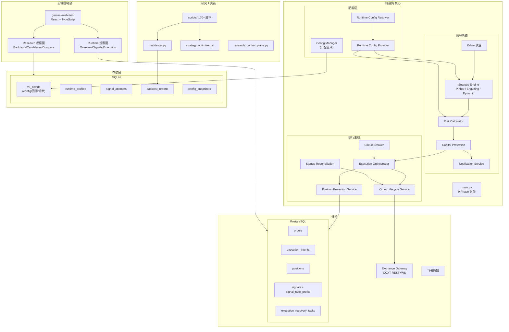
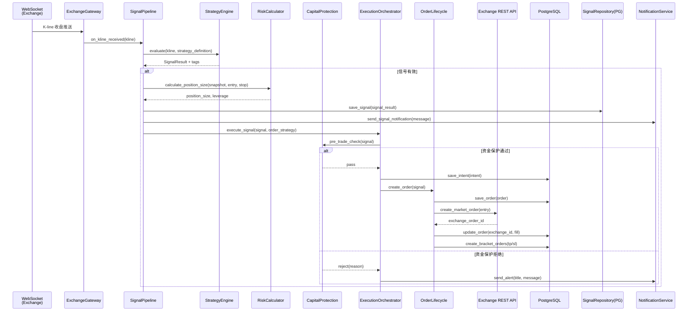
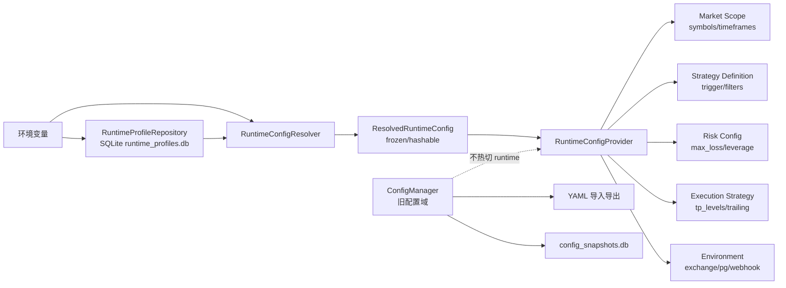

# 项目架构图文档

> **最后更新**: 2026-04-29
> **状态**: 未运行测试（仅基于代码静态分析）
> **依据**: 当前代码库（dev 分支，commit b02f959）

---

## 1. 结论摘要

**当前系统类型判断：C — 介于两者之间的"研究 + 执行混合平台"**

证据：
- **执行主线已接近生产级**：Signal Pipeline -> Execution Orchestrator -> Order Lifecycle -> Exchange Gateway 全链路已跑通，核心持久化已迁移到 PostgreSQL，有启动对账、熔断机制、资本保护、优雅关停。
- **研究工具链体量远超执行链**：`scripts/` 目录有 170+ 个独立脚本（约 5 万行），覆盖参数扫描、回测对比、诊断验证、Optuna 调参，是典型的量化研究工作台。
- **存储双轨并存**：执行链核心（Orders/Intents/Positions/Signals）已迁至 PG；但配置域（Config Profiles/Entries/Snapshots）、回测全链路、信号诊断（Attempts）、Runtime Profiles 仍在 SQLite。
- **前端是只读观察台**：`gemimi-web-front` 提供 Runtime（Overview/Signals/Execution/Events/Health/Portfolio）和 Research（Backtests/Candidates/Compare/Jobs）只读页面，无交易操作界面。
- **处于 Sim-1 观察期**：系统正在 testnet 自然运行，验证策略有效性，尚未进入实盘。

---

## 2. 顶层目录树

```
final/
├── src/                              # 核心 Python 源码（Clean Architecture 四层）
│   ├── main.py                       # 启动入口（9 Phase 编排）
│   ├── api_server.py                 # 独立 API 服务器入口
│   ├── domain/                       # 领域核心层（纯逻辑，无 I/O）
│   │   ├── models.py                 # Pydantic 数据模型 SSOT
│   │   ├── exceptions.py             # 统一异常体系（F/C/W 错误码）
│   │   ├── indicators.py             # EMA 等指标流式计算
│   │   ├── filter_factory.py         # 动态过滤器工厂
│   │   ├── strategy_engine.py        # 策略引擎（Pinbar/Dynamic）
│   │   ├── strategies/               # 具体策略实现
│   │   │   └── engulfing_strategy.py # 吞没形态策略
│   │   ├── risk_calculator.py        # 风控试算（Decimal）
│   │   ├── risk_manager.py           # 动态风控管理器
│   │   ├── order_manager.py          # 订单管理（领域逻辑）
│   │   ├── order_state_machine.py    # 订单状态机
│   │   ├── matching_engine.py        # 撮合引擎（Mock/实盘）
│   │   ├── execution_intent.py       # 执行意图模型
│   │   ├── recursive_engine.py       # 递归策略引擎
│   │   ├── logic_tree.py             # 逻辑树（Trigger/Filter 配置）
│   │   ├── research_models.py        # 研究域模型
│   │   ├── dca_strategy.py           # DCA 策略
│   │   ├── timeframe_utils.py        # 周期工具
│   │   └── validators.py             # 配置校验器
│   │
│   ├── application/                  # 应用服务层（编排 + 状态管理）
│   │   ├── signal_pipeline.py        # 核心：K线 -> 策略 -> 风控 -> 通知 -> 持久化
│   │   ├── execution_orchestrator.py # 核心：信号 -> 意图 -> 订单 -> 交易所
│   │   ├── order_lifecycle_service.py # 订单生命周期（状态推进 + 超时）
│   │   ├── position_projection_service.py # 持仓投影
│   │   ├── capital_protection.py     # 资金安全限制
│   │   ├── backtester.py             # 回测沙箱引擎
│   │   ├── backtest_config.py        # 回测配置
│   │   ├── runtime_config.py         # RuntimeConfigResolver + ResolvedRuntimeConfig
│   │   ├── config_manager.py         # 旧配置域加载（config_profiles/entries）
│   │   ├── config/                   # 配置 Provider 体系
│   │   │   ├── config_parser.py
│   │   │   ├── config_repository.py
│   │   │   ├── models.py
│   │   │   └── providers/            # Provider 注册模式
│   │   │       ├── base.py
│   │   │       ├── cached_provider.py
│   │   │       ├── core_provider.py
│   │   │       ├── registry.py
│   │   │       ├── risk_provider.py
│   │   │       └── user_provider.py
│   │   ├── readmodels/               # 只读查询模型（16 个文件）
│   │   │   ├── runtime_overview.py
│   │   │   ├── runtime_signals.py
│   │   │   ├── runtime_orders.py
│   │   │   ├── runtime_positions.py
│   │   │   ├── runtime_execution_intents.py
│   │   │   ├── runtime_events.py
│   │   │   ├── runtime_health.py
│   │   │   ├── runtime_portfolio.py
│   │   │   ├── runtime_backtests.py
│   │   │   ├── runtime_attempts.py
│   │   │   ├── runtime_config_snapshot.py
│   │   │   ├── candidate_service.py
│   │   │   ├── compare_readmodel.py
│   │   │   └── console_models.py
│   │   ├── research_control_plane.py # 研究控制平面
│   │   ├── research_specs.py         # 研究规格定义
│   │   ├── research_artifacts.py     # 研究产物管理
│   │   ├── reconciliation.py         # 对账服务
│   │   ├── reconciliation_lock.py
│   │   ├── startup_reconciliation_service.py # 启动对账
│   │   ├── strategy_optimizer.py     # 策略优化器（Optuna 集成）
│   │   ├── signal_tracker.py         # 信号状态追踪
│   │   ├── account_service.py        # 账户服务
│   │   ├── position_manager.py       # 持仓管理
│   │   ├── performance_tracker.py    # 性能追踪
│   │   ├── volatility_detector.py    # 波动率检测
│   │   ├── attribution_engine.py     # 归因引擎
│   │   ├── attribution_analyzer.py   # 归因分析
│   │   ├── order_audit_logger.py     # 订单审计日志
│   │   └── recovery_retry_policy.py  # 恢复重试策略
│   │
│   ├── infrastructure/               # 基础设施层（所有 I/O）
│   │   ├── exchange_gateway.py       # 交易所网关（CCXT REST+WS）
│   │   ├── notifier.py               # 通知推送（飞书/微信/Telegram）
│   │   ├── notifier_feishu.py        # 飞书通知实现
│   │   ├── logger.py                 # 统一日志（脱敏）
│   │   ├── database.py               # 数据库引擎管理（PG + SQLite）
│   │   ├── connection_pool.py        # 连接池管理
│   │   ├── v3_orm.py                 # SQLite ORM 模型
│   │   ├── pg_models.py              # PostgreSQL ORM 模型
│   │   ├── core_repository_factory.py # 核心仓储工厂（PG/SQLite 选择器）
│   │   ├── repository_ports.py       # 仓储端口（抽象接口）
│   │   ├── pg_order_repository.py    # PG 订单仓储
│   │   ├── pg_execution_intent_repository.py # PG 执行意图仓储
│   │   ├── pg_position_repository.py # PG 持仓仓储
│   │   ├── pg_signal_repository.py   # PG 信号仓储
│   │   ├── pg_execution_recovery_repository.py # PG 恢复任务仓储
│   │   ├── hybrid_signal_repository.py # 信号混合路由（live→PG, legacy→SQLite）
│   │   ├── order_repository.py       # SQLite 订单仓储（旧）
│   │   ├── signal_repository.py      # SQLite 信号仓储（attempts/回测）
│   │   ├── runtime_profile_repository.py # Runtime Profiles（SQLite，启动期读取）
│   │   ├── backtest_repository.py    # 回测报告仓储
│   │   ├── historical_data_repository.py # 历史数据仓储
│   │   ├── research_repository.py    # 研究产物仓储
│   │   ├── config_entry_repository.py # Config KV 仓储
│   │   ├── config_profile_repository.py # Config Profile 仓储
│   │   ├── config_snapshot_repository.py # Config Snapshot 仓储
│   │   ├── order_audit_repository.py # 订单审计仓储
│   │   ├── reconciliation_repository.py # 对账仓储
│   │   ├── repositories/             # 统一仓储包
│   │   │   └── config_repositories.py
│   │   ├── db/                       # SQL DDL
│   │   │   └── config_tables.sql
│   │   └── migrations/               # PG 迁移脚本
│   │       ├── 003_add_attempt_report_fields.sql
│   │       └── 004_create_order_audit_logs.sql
│   │
│   └── interfaces/                   # REST API 端点
│       ├── api.py                    # FastAPI 主路由（信号/回测/策略/配置）
│       ├── api_console_runtime.py    # Runtime 观察端点（Overview/Signals/Orders...）
│       ├── api_console_research.py   # Research 观察端点（Backtests/Candidates...）
│       ├── api_v1_config.py          # 配置 CRUD API
│       ├── api_research_jobs.py      # 研究任务 API
│       ├── api_profile_endpoints.py  # Legacy Profile 端点
│       └── api_config_globals.py     # 配置全局状态
│
├── scripts/                          # 研究/验证/运维脚本（170+ 个，~5 万行）
│   ├── run_*.py                      # 参数扫描/回测运行脚本
│   ├── validate_*.py                 # 回测结果验证脚本
│   ├── verify_*.py                   # 系统行为验证脚本
│   ├── diagnose_*.py                 # 诊断分析脚本
│   ├── analyze_*.py                  # 深度分析脚本
│   ├── import_*.py                   # 历史数据导入
│   ├── etl/                          # ETL 管道
│   │   ├── binance_downloader.py
│   │   ├── etl_converter.py
│   │   └── import_all_klines.py
│   ├── deploy/                       # 部署脚本
│   │   ├── deploy.sh
│   │   ├── start.sh
│   │   └── stop.sh
│   ├── tools/                        # 工具脚本
│   │   ├── fix_filenames.py
│   │   └── read_markdown.py
│   ├── seed_sim1_runtime_profile.py  # Sim-1 Runtime Profile 种子数据
│   ├── init_config_db.py            # 配置数据库初始化
│   └── migrate_config_to_db.py      # 配置迁移工具
│
├── tests/                            # 测试套件
│   ├── unit/                         # 单元测试（100+ 个文件）
│   │   ├── application/              # 应用层测试
│   │   │   ├── config/providers/     # Provider 注册模式测试（8 个）
│   │   │   └── test_order_audit_logger.py
│   │   ├── infrastructure/           # 基础设施测试
│   │   │   ├── test_config_entry_repository.py
│   │   │   ├── test_order_audit_repository.py
│   │   │   └── test_order_repository_unit.py
│   │   ├── test_backtester_*.py      # 回测引擎测试（8 个）
│   │   ├── test_strategy_*.py        # 策略测试
│   │   ├── test_risk_*.py            # 风控测试
│   │   ├── test_signal_*.py          # 信号测试
│   │   ├── test_order_*.py           # 订单测试
│   │   ├── test_v3_*.py              # v3 ORM/API 测试
│   │   └── test_pg_*.py              # PG 相关测试
│   ├── integration/                  # 集成测试（40+ 个文件）
│   │   ├── test_pg_*_repo.py         # PG 仓储集成测试
│   │   ├── test_v3_*_integration.py  # v3 链路集成测试
│   │   ├── test_backtest_*.py        # 回测集成测试
│   │   └── test_phase5_*.py          # Phase 5 集成测试
│   ├── e2e/                          # 端到端测试
│   │   ├── test_phase5_*.py          # Phase 5 窗口测试
│   │   ├── test_phasek_*.py          # Phase K 动态规则测试
│   │   └── test_api_*.py             # API 端到端测试
│   ├── concurrent/                   # 并发测试
│   └── smoke/                        # 冒烟测试
│       └── test_sim_trading_readiness.py
│
├── gemimi-web-front/                 # 前端控制台（React + TypeScript + Vite）
│   ├── src/
│   │   ├── pages/
│   │   │   ├── runtime/              # Runtime 只读观察面
│   │   │   │   ├── Overview.tsx      # 总览
│   │   │   │   ├── Signals.tsx       # 信号
│   │   │   │   ├── Execution.tsx     # 执行链
│   │   │   │   ├── Events.tsx        # 事件流
│   │   │   │   ├── Health.tsx        # 健康度
│   │   │   │   └── Portfolio.tsx     # 组合
│   │   │   ├── research/             # Research 只读观察面
│   │   │   │   ├── Backtests.tsx     # 回测报告
│   │   │   │   ├── Candidates.tsx    # 候选参数
│   │   │   │   ├── CandidateDetail.tsx
│   │   │   │   ├── Compare.tsx       # 对比
│   │   │   │   ├── NewBacktest.tsx   # 新建回测
│   │   │   │   ├── ResearchJobs.tsx  # 研究任务
│   │   │   │   ├── RunDetail.tsx     # 运行详情
│   │   │   │   ├── Replay.tsx        # 重放
│   │   │   │   └── ReviewSummary.tsx # 审查摘要
│   │   │   └── config/
│   │   │       └── Snapshot.tsx       # 配置快照
│   │   ├── components/               # 布局 + UI 组件
│   │   ├── services/api.ts           # API 客户端
│   │   ├── lib/                      # 格式化工具
│   │   └── types/index.ts            # TypeScript 类型
│   ├── Dockerfile                    # 前端 Docker 构建
│   └── nginx.default.conf            # Nginx 配置
│
├── docker/                           # Docker 部署
│   ├── docker-compose.yml            # 主编排（PG + Backend）
│   ├── docker-compose.frontend.yml   # 前端编排
│   ├── Dockerfile.backend
│   ├── Dockerfile.frontend
│   └── nginx.conf
│
├── data/                             # 运行时数据（SQLite DB 文件）
│   ├── v3_dev.db                     # 主数据库（198MB，SQLite）
│   ├── config.db                     # 旧配置数据库
│   ├── config_snapshots.db           # 配置快照
│   ├── config_entries.db             # 配置 KV
│   ├── signals.db                    # 信号诊断（attempts）
│   ├── orders.db                     # SQLite 订单（旧，已被 PG 替代）
│   ├── optimization_history.db       # Optuna 优化历史
│   ├── research_control_plane.db     # 研究控制平面
│   ├── runtime_profiles.db           # Runtime Profiles
│   ├── backtest.db                   # 回测报告
│   └── backups/                      # 数据库备份
│
├── reports/                          # 研究报告/候选
│   ├── research/                     # 研究报告（26 个 JSON）
│   ├── optuna_candidates/            # Optuna 候选参数（3 个）
│   └── research_runs/                # 研究运行记录（6 个目录）
│
├── logs/                             # 运行日志
│   ├── dingdingbot.log               # 主日志（305MB，持续增长）
│   └── *.log.gz                      # 归档日志
│
├── db_scripts/                       # PG DDL
│   └── 2026-04-22-pg-core-baseline.sql
│
├── migrations/                       # Alembic 迁移
│   └── versions/                     # 迁移版本
│
├── docs/                             # 文档体系
│   ├── active/                       # 活跃文档（36 个）
│   ├── arch/                         # 架构规范
│   ├── adr/                          # 架构决策记录
│   ├── planning/                     # 任务规划 + 研究发现（99 个）
│   ├── gpt/                          # GPT 产出文档
│   ├── v3/                           # v3 迁移文档
│   ├── constraints/                  # 约束文档（88 个）
│   ├── analysis/                     # 分析报告
│   └── reports/                      # 综合报告
│
├── config/                           # 配置文件（已不存在，迁移到 SQLite）
├── CLAUDE.md                         # 项目开发指南
├── AGENTS.md                         # Agent 团队定义
├── requirements.txt                  # Python 依赖
├── start.sh / stop.sh               # 服务启停
├── docker-compose.pg.yml            # PG 独立部署
└── pytest.ini                        # 测试配置
```

---

## 3. 分层架构说明

### 3.1 Clean Architecture 四层分工

```
┌─────────────────────────────────────────────────────────┐
│                    interfaces/                           │
│              REST API 端点（FastAPI）                     │
│  api.py / api_console_runtime.py / api_console_research  │
│  api_v1_config.py / api_research_jobs.py                │
└────────────────────────┬────────────────────────────────┘
                         │ 依赖注入
┌────────────────────────▼────────────────────────────────┐
│                   application/                          │
│           应用服务层（编排 + 状态管理）                    │
│  signal_pipeline.py  execution_orchestrator.py           │
│  order_lifecycle_service.py  position_projection_service │
│  capital_protection.py  backtester.py  runtime_config.py │
│  readmodels/（16 个只读查询模型）                         │
└────────────────────────┬────────────────────────────────┘
                         │ 依赖
┌────────────────────────▼────────────────────────────────┐
│                    domain/                              │
│           领域核心层（纯业务逻辑，无 I/O）                 │
│  models.py  strategy_engine.py  risk_calculator.py       │
│  order_manager.py  matching_engine.py  indicators.py     │
│  filter_factory.py  logic_tree.py  validators.py        │
└─────────────────────────────────────────────────────────┘
                         ▲
                         │ 实现
┌────────────────────────┴────────────────────────────────┐
│                  infrastructure/                         │
│              基础设施层（所有 I/O）                        │
│  exchange_gateway.py  pg_*.py  hybrid_signal_repository  │
│  notifier.py  logger.py  database.py  connection_pool.py │
└─────────────────────────────────────────────────────────┘
```

### 3.2 目录职责分类

| 分类 | 目录 | 职责 |
|------|------|------|
| **Runtime / Live Execution** | `src/application/signal_pipeline.py` | 核心信号处理管道 |
| | `src/application/execution_orchestrator.py` | 信号->意图->订单->交易所 |
| | `src/application/order_lifecycle_service.py` | 订单状态推进 |
| | `src/application/position_projection_service.py` | 持仓投影 |
| | `src/application/capital_protection.py` | 资金安全限制 |
| | `src/application/startup_reconciliation_service.py` | 启动对账 |
| | `src/infrastructure/exchange_gateway.py` | 交易所网关 |
| | `src/infrastructure/pg_*.py` | PG 持久化 |
| | `src/main.py` | 9 Phase 启动编排 |
| **Research / Backtest** | `src/application/backtester.py` | 回测沙箱引擎 |
| | `src/application/strategy_optimizer.py` | Optuna 优化器 |
| | `src/application/research_control_plane.py` | 研究控制平面 |
| | `src/application/research_specs.py` | 研究规格 |
| | `scripts/run_*.py` (100+) | 参数扫描/回测运行 |
| | `scripts/validate_*.py` (20+) | 结果验证 |
| | `scripts/diagnose_*.py` (10+) | 诊断分析 |
| | `reports/research/` | 研究报告 JSON |
| | `reports/optuna_candidates/` | Optuna 候选 |
| **Config / Profile** | `src/application/config_manager.py` | 旧配置域（SQLite） |
| | `src/application/runtime_config.py` | Runtime Profile 解析 |
| | `src/application/config/` | Provider 注册模式 |
| | `src/infrastructure/runtime_profile_repository.py` | Runtime Profiles 表 |
| | `src/infrastructure/config_*.py` | Config 持久化 |
| **Deployment** | `docker/` | Docker 编排 |
| | `scripts/deploy/` | 部署脚本 |
| | `start.sh` / `stop.sh` | 服务启停 |
| **Observability** | `gemimi-web-front/` | 前端只读控制台 |
| | `src/interfaces/api_console_runtime.py` | Runtime 观察 API |
| | `src/interfaces/api_console_research.py` | Research 观察 API |
| | `logs/` | 运行日志 |
| | `src/application/readmodels/` | 16 个只读查询模型 |

---

## 4. 核心架构图

### 4.1 系统整体架构（Mermaid）



### 4.2 信号处理 + 执行主线流程



### 4.3 配置解析链路



---

## 5. 数据与存储分层

### 5.1 存储对象矩阵

| 存储后端 | 对象 | 状态 | 说明 |
|----------|------|------|------|
| **PostgreSQL** | orders | **真源** | 核心执行链，`create_runtime_order_repository()` 硬编码 PG |
| | execution_intents | **真源** | 核心执行意图 |
| | positions | **真源** | 持仓投影结果 |
| | signals + signal_take_profits | **真源** | 实时信号 + 止盈级别 |
| | execution_recovery_tasks | **真源** | 执行恢复任务 |
| **SQLite (v3_dev.db)** | config_snapshots | 真源 | 配置快照版本化 |
| | config_entries (KV) | 真源 | 策略参数 KV 存储 |
| | signal_attempts | 诊断/可观测性 | 信号尝试记录（不可观测性） |
| | backtest_reports | 真源 | 回测报告存储 |
| | optimization_history | 真源 | Optuna 优化历史 |
| | research_control_plane | 真源 | 研究控制平面 |
| **SQLite (runtime_profiles.db)** | runtime_profiles | 启动期读取，冻结后不再访问 | 启动期解析为 `ResolvedRuntimeConfig` |
| **Runtime 内存态** | ResolvedRuntimeConfig | 启动期冻结 | 一旦解析完成，整个生命周期不可变 |
| | AccountSnapshot | 轮询更新 | 通过 WebSocket 资产推送/REST 轮询 |
| | EMA 计算缓存 | 运行时 | 指标计算缓存 |
| | Circuit Breaker 状态 | 运行时 | 熔断器内存态，从 PG recovery 重建 |
| | Signal Status Tracker | 运行时 | 信号状态追踪缓存 |

### 5.2 为什么会形成当前这种形态

**核心原因：渐进式迁移 + 双轨并存策略**

1. **v3.0 迁移已完成执行主线 PG 闭环**（2026-04-26 确认）。核心执行链（Orders/Intents/Positions/Signals/Recovery）已从 SQLite 迁移到 PG，通过 `core_repository_factory.py` 硬编码 PG 实现。

2. **配置域仍在 SQLite 的原因**：
   - `ConfigManager` 管理的是旧配置域（config_profiles/entries/strategies/risk_configs），这些是"下次启动或显式 reload"才生效的配置，不是 runtime 真源。
   - Runtime 真源已迁移到 `RuntimeProfileRepository`（SQLite runtime_profiles.db），启动期解析后冻结为 `ResolvedRuntimeConfig`。
   - 配置域的 PG 迁移优先级低于执行主线。

3. **回测全链路仍在 SQLite 的原因**：
   - 回测是纯计算 + 诊断，不涉及并发持久化需求。
   - 回测报告通过 `BacktestRepository` 存储在 SQLite。
   - 迁移到 PG 的 ROI 低于执行主线。

4. **Signal Attempts 仍在 SQLite 的原因**：
   - 通过 `HybridSignalRepository` 路由：live signals → PG，attempts → SQLite。
   - Attempts 是诊断/可观测性数据，不是执行链真源。

5. **Runtime Profiles 在 SQLite 的原因**：
   - 启动期一次性读取，解析后冻结为内存态 `ResolvedRuntimeConfig`。
   - 不需要 PG 的并发/持久化能力。

---

## 6. 系统类型判断

### 判断：C — 介于两者之间的"研究 + 执行混合平台"

### 证据矩阵

| 维度 | 评分 | 说明 |
|------|------|------|
| **架构分层** | 8/10 | Clean Architecture 四层清晰，domain 层纯净，依赖方向正确 |
| **核心执行链** | 7/10 | Signal→Execution→Order→Exchange 全链路已跑通，有对账/熔断/资本保护 |
| **持久化** | 6/10 | 核心链路 PG，但配置/回测/诊断仍在 SQLite，双轨并存 |
| **测试覆盖** | 7/10 | 100+ 单元测试 + 40+ 集成测试 + E2E + 并发测试 + 冒烟测试 |
| **研究工具链** | 9/10 | 170+ 脚本覆盖参数扫描/诊断/验证/ETL/Optuna，研究文档 60+ 篇 |
| **前端成熟度** | 5/10 | 只读观察台，无交易操作界面，Runtime + Research 双面 |
| **部署能力** | 6/10 | Docker Compose 编排（PG + Backend），前端独立 Nginx |
| **配置管理** | 6/10 | Runtime Profile 已冻结，但旧配置域与新配置域并存 |

### 最像生产系统的模块

| 模块 | 生产级特征 |
|------|-----------|
| `ExecutionOrchestrator` | 资金保护前检 + 熔断机制 + 待恢复记录 + 告警通知 |
| `OrderLifecycleService` | 订单状态机 + 超时推进 + 持久化 + 对账 |
| `StartupReconciliationService` | 启动对账 + PG Recovery 重建 + Circuit Breaker |
| `CapitalProtectionManager` | 单笔限制 + 每日回撤 + 仓位限制 |
| `HybridSignalRepository` | PG/SQLite 混合路由，live/legacy 分流 |
| `RuntimeConfigResolver` | 冻结配置 + Hash 校验 + 不可变 |
| `ExchangeGateway` | CCXT REST+WS + 自动重连 + 指数退避 |
| `main.py` 9 Phase 启动 | 逐步初始化 + 优雅关停 + 降级模式 |

### 仍像研究工具链的模块

| 模块 | 研究工具特征 |
|------|-------------|
| `scripts/` 170+ 脚本 | 典型量化研究工作台，参数扫描/诊断/验证 |
| `backtester.py` | 纯计算沙箱，无持久化事务 |
| `strategy_optimizer.py` | Optuna 集成，实验性质 |
| `research_control_plane.py` | 研究任务调度，非生产调度 |
| `reports/` | JSON 报告文件，非结构化存储 |
| `ConfigManager` | 旧配置域，YAML 导入导出，非实时热切 |

### 总结

这个项目**已经不是一个研究脚本集合**——它有清晰的 Clean Architecture 分层、PG 持久化、完整的执行主线、启动对账、熔断机制、资金保护。但它**也不是一个成熟的生产级交易系统**——研究工具链体量超过执行链，存储双轨并存，前端只有只读观察面，配置管理存在新旧两套并行。

**准确的定位是：从研究工具链向生产级系统演进中的混合平台**，正处于 Sim-1 观察期（testnet 自然模拟盘），核心执行链已闭环，但研究/配置/回测等辅助域尚未完成 PG 迁移。

---

## 7. 文档与代码不一致项

| 项目 | CLAUDE.md 描述 | 代码实际 | 差异说明 |
|------|---------------|---------|---------|
| `config/` 目录 | 提及 `config/core.yaml` 和 `config/user.yaml` | 目录已不存在 | YAML 配置已迁移到 SQLite DB |
| `strategies/` 目录 | 提及 `pinbar.py` 和 `engulfing.py` | 仅存 `engulfing_strategy.py`，Pinbar 在 `strategy_engine.py` 中 | Pinbar 实现在 engine 内部，非独立文件 |
| 数据库架构 | 未明确说明 PG/SQLite 双轨并存 | PG 承载执行主线，SQLite 承载配置/回测/诊断 | CLAUDE.md 未充分反映双轨现状 |
| Runtime Profiles | 未详细说明启动期冻结机制 | `RuntimeProfileRepository` → `RuntimeConfigResolver` → `ResolvedRuntimeConfig` (frozen) | 冻结机制是关键架构特征 |
| `scripts/` 规模 | 未量化 | 170+ 个 Python 脚本，~5 万行 | 研究工具链体量巨大 |
| 前端页面 | 未详细列出 | Runtime 7 页面 + Research 9 页面 + Config 1 页面 | 前端观察面已相当完整 |

---

*本文档基于 2026-04-29 代码静态分析生成，未运行测试。*
