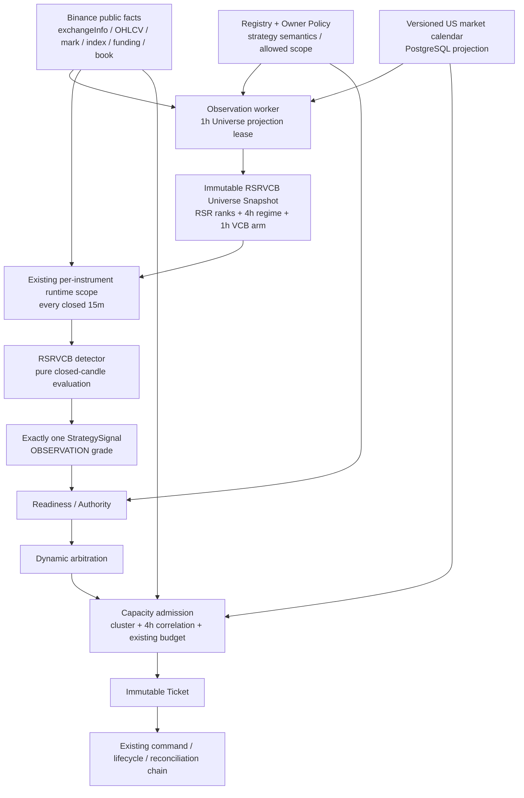
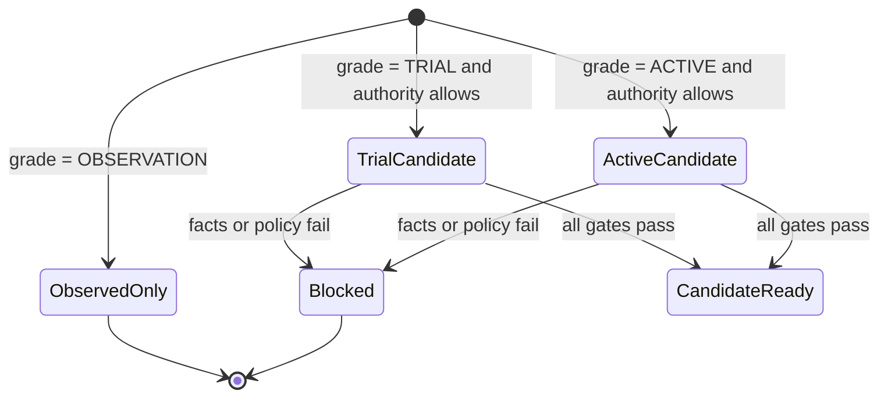

# 美股合约 RSR + VCB + 15m 全量触发详细设计

**状态：** `PROPOSED_FOR_OWNER_REVIEW`

**日期：** 2026-07-27

**设计对象：** Binance USDⓈ-M 美股/ETF 永续合约

**拟议 StrategyGroup：** `RSRVCB-001`

**拟议 Event：** `RSRVCB-LONG-15M`

**默认运行等级：** `OBSERVE_ONLY`

**生产变更授权：** 无；本文不授权扩展实盘标的、资金、杠杆、持仓数或交易时段

## 1. 执行摘要

### 1.1 核心结论

本设计选择一条单链组合策略：

```text
1h RSR Universe Selection + 4h Market Regime
-> per-instrument 1h VCB Armed Structure
-> full closed-15m Breakout Trigger
-> exactly one StrategySignal
-> existing Readiness / Authority / Capacity / Ticket chain
```

**RSR 不是单独下单策略，VCB 也不是单独下单策略。** 两者共同定义一个
`RSRVCB-LONG-15M` Event，最终只允许产生一个可执行事件语义和一个
`StrategySignal`。系统不得增加 RSR Ticket producer、VCB Ticket producer、
信号合并器、策略协调器或第二条执行链。

### 1.2 对当前代码兼容性的判断

**现有 Trading Kernel 的执行主干可复用，策略接入层需要中到大型纵向改造。**
它不是重写，也不是“新增一个 detector 文件”即可完成。

可直接保留的主干包括：

1. `Observation -> StrategySignal` 的策略边界；
2. `Readiness/Authority -> CapacityClaim -> Ticket` 的准入链；
3. durable Exchange Command、Lifecycle、Reconciliation、Settlement、Review；
4. 独立多空 position side、Netting Domain、ENTRY 全局串行化；
5. Binance USDⓈ-M 适配器的基本订单、mark、funding 和 instrument rules 能力。

必须扩展的部分包括：

1. Registry 的通用版本和多周期市场数据契约；
2. 共享 Universe Projection；
3. `OBSERVE_ONLY` Signal 的端到端等级隔离；
4. 动态排名仲裁；
5. 美股合约产品、交易时段、mark/index、流动性事实；
6. 组合相关性和风险集群准入；
7. VCB 失败回落与分阶段时限退出；
8. 固定 `22` 个 scope 的 seed 假设。

### 1.3 默认安全姿态

`RSRVCB-001 v1` 只能产生 **观察级信号**：

```text
signal_grade = OBSERVATION
required_execution_mode = OBSERVE_ONLY
readiness_state = observed_only
candidate_ready = false
CapacityClaim = forbidden
Ticket = forbidden
Exchange Command = forbidden
```

任何未来 bounded live trial 都必须创建新的不可变 StrategyGroup/Event
版本，并经过独立的 Owner scope、资金、相关性、时段和执行质量批准。

## 2. 权威边界与事实分层

### 2.1 当前代码与项目权威事实

以下是当前仓库直接事实：

1. 当前唯一合法交易链为：

   ```text
   Observation
   -> StrategySignal
   -> Readiness/Authority
   -> CapacityClaim
   -> immutable Ticket
   -> durable Exchange Command
   -> protected lifecycle
   -> reconciliation
   -> settlement
   -> review
   ```

2. 策略代码必须终止于 `StrategySignal`，策略逻辑不得进入 Ticket、
   Operation 或 venue adapter。
3. 当前 `MarketSnapshot` 已表达 `15m`、`1h`、`4h` closed candle。
4. 当前 Registry 的 Event timeframe 只允许 `15m | 1h`，并把
   StrategyGroupVersion/EventSpec identity 强制为 `v2`。
5. 当前 detector routing 和 observation market loading 以 Event ID
   硬编码分支。
6. 当前任何有效 `StrategySignal` 都会进入 `candidate_ready`，没有
   `OBSERVE_ONLY` 的安全终态。
7. 当前仲裁只有 Owner priority、静态 scope priority、时间和 ID，
   没有 RSR 动态 rank/score。
8. 当前 Capacity 能处理 stop risk、margin、leverage 和 liquidation，
   但没有组合相关性、风险集群或因子暴露。
9. 当前 runtime seed 假设生产恰好存在 `22` 个 scope。
10. 当前 ExitPolicy 已有 TP1、break-even、结构化 ATR runner，但没有
    VCB 失败回落退出和 TP1 前后不同的时间上限。

来源：当前 `src/trading_kernel/**`、`migrations/trading_kernel/**` 与
`docs/current/**`。

### 2.2 Binance 产品事实

截至本设计的只读检查快照：

1. Binance USDⓈ-M `exchangeInfo` 可识别
   `contractType=TRADIFI_PERPETUAL`、`underlyingType=EQUITY` 的产品；
2. `QQQUSDT`、`SPYUSDT`、`AAPLUSDT`、`MSFTUSDT`、`NVDAUSDT`、
   `MSTRUSDT`、`COINUSDT` 在检查时均可由该官方接口发现；
3. 产品以 USDT 结算、24/7 交易，底层美股本身仍存在常规交易时段、
   休市和假日；
4. Binance 官方说明美股永续使用 Orderbook EWMA 处理底层开盘、
   休市和低流动性时段的价格连续性；
5. mark-price 接口提供 `markPrice`、`indexPrice`、`lastFundingRate`
   和 `nextFundingTime`。

这些是**易变化的产品快照**，不能写死为 Registry 或运行时权威。每次
Ticket 准入仍须读取 action-time `exchangeInfo`、mark/index、funding、
order book 和账户事实。

官方来源：

- [Binance Academy: How to Trade Stock Perpetual Contracts on Binance](https://academy.binance.com/ur-PK/articles/how-to-trade-stock-perpetual-contracts-on-binance)
- [Binance Academy: ETF Contracts You Can Trade on Binance Futures](https://academy.binance.com/ur-PK/articles/etf-contracts-you-can-trade-on-binance-futures)
- [Binance USDⓈ-M Futures API Introduction](https://developers.binance.com/en/docs/products/derivatives-trading-usds-futures/Introduction)
- [Binance Developer Catalog](https://developers.binance.com/en/docs/catalog)

### 2.3 研究事实与新设计假设

| 语义 | 来源 | 当前证据结论 | 本设计允许用途 |
| --- | --- | --- | --- |
| RSR `72h strict_top2` | 研究分支回放 | 有右尾窗口，但 second-half 仍为负；不可直接推广 | 作为 `v1 OBSERVE_ONLY` 选择器 |
| QQQ/SPY `index_confirmed` | RSR decay classifier 回放 | 比 baseline 更干净，但仍非 promotion-grade | 作为 RSR 观察过滤器 |
| VCB 1h BB 压缩与 72h 前高 | VCB 回放 | 能标识少量真突破结构，但 broad breakout 全曲线为负 | 作为 1h armed structure |
| VCB `pre_entry_volume_compression` | VCB classifier 回放 | 最佳窗口有右尾，全曲线仍显著为负 | 仅保留压缩阈值作为观察假设 |
| 15m 首次越界 + 15m 相对成交量 | 本设计新增 | 尚无既有回放证明 | 新的、独立版本化的观察语义 |
| 4h QQQ/SPY EMA regime | 本设计新增 | 尚无既有回放证明 | 上下文过滤和归因，不得声称继承证据 |

研究来源位于独立 research worktree，属于 provenance，不是 runtime
authority：

```text
/Users/jiangwei/Documents/final-strategy-research/
```

## 3. 目标与非目标

### 3.1 目标

1. 接入 Binance 美股/ETF 永续产品，同时保持一条 Trading Kernel 主链。
2. 用共享 RSR Universe Projection 避免每个 instrument 重复计算全市场排名。
3. 用 1h VCB 结构预先 armed，再对每个闭合 15m candle 执行完整触发。
4. 在进入 Ticket 前约束同一风险集群和高相关持仓。
5. 把产品时段、mark/index、funding、spread/depth 变成显式事实。
6. 让所有慢周期、快周期和准入事实都可重放、可冻结、可审计。
7. 保持 v1 observe-only，收集全量信号、时段和失败路径证据。

### 3.2 非目标

1. 不在本设计中批准任何新增实盘 symbol。
2. 不改变当前资金、planned stop risk、margin utilization、杠杆或持仓数。
3. 不新增 short Event；未来 short 必须是独立 Event 及独立证据。
4. 不允许加仓；一个 Exposure Episode 仍只拥有一个 Ticket。
5. 不把 QQQ/SPY 参考序列自动变成候选交易标的。
6. 不把 post-entry `true_breakout` 标签反向用于 entry。
7. 不引入 ML model、外部文件信号、Markdown/JSON 运行时权威。
8. 不增加 timer service、第二个 watcher 或独立策略执行服务。

## 4. 方案比较与选择

| 方案 | 数据流 | 优点 | 主要问题 | 结论 |
| --- | --- | --- | --- | --- |
| A. 单 detector 即时拉全市场 | 每个 15m scope 自己计算 RSR + VCB | 文件少、原型快 | 重复网络读取、排名快照不一致、无法冻结共同 universe | 拒绝 |
| B. 共享 Universe Projection + 单 Event | 1h 共享选择，15m instrument trigger | 一致、可审计、性能有界、保留单链 | 需要 Registry、Projection 和 Signal 扩展 | **采用** |
| C. RSR/VCB 各自发 Signal 后合并 | 两个 producer + combiner | 表面模块化 | 产生并行策略链、竞态、重复 Ticket 语义 | 拒绝 |

**采用方案 B。** 共享 projection 是 Observation 的数据准备能力，不是
新的策略执行层；唯一 Ticket-producing identity 始终是
`RSRVCB-LONG-15M`。

## 5. 总体架构



### 5.1 服务边界

| 能力 | 所属服务 | 是否新增服务 | 写入权威 |
| --- | --- | ---: | --- |
| Product discovery / Universe / 15m trigger | Observation | 否 | PG projection、facts、signal |
| Signal grade / readiness / arbitration / capacity | Entry | 否 | readiness、claim、Ticket |
| VCB failure / TP1 / runner / time exit | Lifecycle | 否 | durable exit commands |
| 外部持仓与订单核对 | Reconciliation | 否 | reconciliation / settlement |

### 5.2 周期语义

| 周期 | 作用 | 计算时点 | 冻结结果 |
| --- | --- | --- | --- |
| `4h` | QQQ/SPY 大盘 regime；组合相关性样本 | 1h projection 读取最新闭合 4h；Capacity action-time 读取 | regime watermark；risk snapshot |
| `1h` | RSR 排名、VCB 压缩与 breakout boundary | 每个闭合 1h 后 | immutable Universe Snapshot |
| `15m` | 首次越界、相对成交量、Trigger | 每个闭合 15m 后 | immutable StrategySignal |

`4h` 是输入周期，不需要新增 `4h Event`。Event 的发生时间权威是
**触发 15m candle 的 close time**。

## 6. StrategyGroup 与 Event 身份

### 6.1 v1 身份

```text
strategy_group_id       = RSRVCB-001
strategy_version_id     = sgv:RSRVCB-001:v1
event_id                = RSRVCB-LONG-15M
event_spec_id           = event_spec:RSRVCB-001:RSRVCB-LONG-15M:v1
position_side           = long
timeframe               = 15m
event_time_authority    = closed_candle_close
freshness_window_ms     = 300000
signal_grade            = OBSERVATION
required_execution_mode = OBSERVE_ONLY
```

### 6.2 Registry 必须修正的通用约束

1. Strategy version 不再强制 `v2`，而是验证 identity 中的整数版本与
   `version` 字段一致。
2. Event ID 是稳定语义名，EventSpec ID 才携带版本。
3. 数据库取消 `event_id` 全局唯一，改为不可变 EventSpec identity 唯一，
   并对 `(strategy_version_id, event_id)` 建唯一约束。
4. 每个 EventSpec 声明：

   - `trigger_timeframe`；
   - `required_market_timeframes`；
   - `shared_projection_requirements`；
   - `signal_grade`；
   - `required_execution_mode`；
   - `arbitration_semantics_version`；
   - `exit_policy_id`。

5. 未来 promotion 必须创建 `v2`，不能原地把 v1 从 observation 改成 trial。

### 6.3 单事件不变量

```text
RSR selection facts
+ VCB armed facts
+ 15m trigger facts
+ exactly one protection reference
+ no satisfied disable fact
= one RSRVCB-LONG-15M StrategySignal
```

RSR 排名变化和 VCB trigger 不得分别写入可执行 Signal。它们可写 projection
和 current facts，但只有组合 detector 能写 `brc_signal_events`。

## 7. 产品 Universe 与 Instrument Profile

### 7.1 Product discovery

Observation 可发现产品，但不能自行扩展 scope。产品必须同时满足：

1. `venue_id = binance-usdm`；
2. action-time `contractType = TRADIFI_PERPETUAL`；
3. action-time `underlyingType = EQUITY`；
4. `marginAsset = USDT`；
5. exchange status 允许读取；Ticket 时必须为可交易状态；
6. PostgreSQL 中存在 active `InstrumentProfile`；
7. Owner Policy 的 versioned scope 明确包含该 instrument；
8. StrategyGroup candidate allowlist 包含该 instrument。

发现新产品只更新 discovery/eligibility 事实，**不得隐式创建 active scope**。

### 7.2 InstrumentProfile

新增冻结 Pydantic 模型 `InstrumentProfile`，由 Registry/受控 seed 写入
PostgreSQL，不从 Markdown 读取。至少包含：

| 字段 | 含义 | 缺失行为 |
| --- | --- | --- |
| `exchange_instrument_id` | Kernel 内部精确标的 ID | 不创建 scope |
| `underlying_kind` | `US_EQUITY` 或 `US_ETF` | product ineligible |
| `primary_calendar_id` | 底层主要交易日历 | Ticket fail-closed |
| `reference_role` | `CANDIDATE`、`QQQ_REFERENCE`、`SPY_REFERENCE` | universe invalid |
| `risk_cluster_id` | 主风险集群 | Capacity fail-closed |
| `sector_id` | 行业归因 | observation 可继续，trial 阻断 |
| `profile_version` | 元数据版本 | digest 不一致则阻断 |
| `semantic_hash` | 全字段摘要 | 摘要不合法则拒绝载入 |

`QQQUSDT` 和 `SPYUSDT` 在 v1 是 reference-only。把它们作为交易候选必须
创建新的策略版本和新的相关性证据。

### 7.3 Universe 上限

v1 Registry 对候选 allowlist 设置 **最多 32 个非参考 instrument** 的
结构性上限。该上限是单 CPU、分页读取和一致性校验的性能边界，不是
实盘 scope 授权。超出上限的 Registry 版本不得加载。

## 8. 美股时段与 24/7 合约语义

### 8.1 时段分类

底层美股和 Binance 合约使用不同时间语义。每个观测点必须记录：

| `session_bucket` | 定义 | v1 观察 | v1 Ticket |
| --- | --- | ---: | ---: |
| `US_REGULAR` | 对应 primary calendar 当日 regular open-close 内 | 允许 | 未授权 |
| `WEEKDAY_OFFHOURS` | 非假日工作日但底层 regular session 已关闭/未开 | 允许 | 禁止 |
| `WEEKEND_HOLIDAY` | 周末或 primary calendar 休市日 | 允许 | 禁止 |
| `UNKNOWN` | 日历缺失、过期或冲突 | 记录 invalid | 禁止 |

本设计要求**所有时段持续观察 15m trigger**，但这不等于所有时段可生成
Ticket。未来 bounded trial 的第一版只允许 Owner 明确授权的
`US_REGULAR`，扩展 off-hours/weekend 必须新增 EventSpec/Policy 版本。

### 8.2 Calendar authority

新增 `MarketSessionProvider` port 和 PostgreSQL calendar projection：

```text
official primary-listing calendar source
-> controlled calendar ingestion
-> normalized brc_market_calendar_sessions
-> typed EquitySessionState
```

每条 session row 至少包含 calendar ID、session date、open/close epoch、
holiday/early-close state、source version、observed time、valid-until 和
semantic digest。日历网络读取不得位于交易数据库事务中。

Calendar 缺失时：

1. Observation 仍保存 `session_bucket=UNKNOWN`；
2. Signal 可保存为 invalid/suppressed observation；
3. Readiness 不得进入 candidate；
4. Capacity/Ticket 必须 fail-closed。

日历导入的机构来源包括：

- [NYSE Holidays & Trading Hours](https://www.nyse.com/trade/hours-calendars)
- [Nasdaq U.S. Stock Market Holiday Schedule and Trading Hours](https://www.nasdaq.com/market-activity/stock-market-holiday-schedule)

NYSE/Nasdaq 官方日历包含假日和提前收盘，说明不能用简单 weekday 或固定
UTC 时段替代 versioned calendar projection。

## 9. 1h Shared Universe Projection

### 9.1 调度

Observation worker 增加一个 PG-backed、可租约的 Universe projection job，
但不增加服务：

```text
brc_strategy_universe_jobs_current
key = strategy_version_id + runtime_profile_id + universe_policy_version
cadence = each closed 1h
single writer lease = Observation worker
```

网络读取在事务外完成。纯计算完成后，header、member rows 和 current pointer
在一个短事务中原子提交。

### 9.2 输入一致性

每次 projection 必须：

1. 从 active Registry + Owner Policy 解析精确 allowlist；
2. 加入 QQQ/SPY reference；
3. 对每个 instrument 获取同一 watermark 的闭合 `1h` candles；
4. 获取 QQQ/SPY 最新闭合 `4h` candles；
5. 校验缺失、重复、未闭合、错位和价格/成交量非正值；
6. 任一 reference 无效时，整个 snapshot 为 invalid；
7. 单个 candidate 无效时，该 member ineligible，不拖垮其余有效 member；
8. 排名只在通过基础数据完整性校验的 member 中进行；
9. snapshot 保存完整 universe size、eligible size、invalid member 原因。

### 9.3 分页与边界

RSR 的 quote-volume 语义需要最多 30 个先前 24h 窗口。实现必须通过
有界分页读取 **至少 744 个闭合 1h bars**，不得把当前 port 的单次
`limit <= 500` 误当成足够历史。

每个 1h projection 的请求上限为：

```text
1h kline pages <= 2 * (candidate_count + 2 references)
4h kline pages <= 2 references
candidate_count <= 32
```

同一 projection cycle 内，RSR 和 VCB 必须复用同一 instrument candle
数组，不得重复网络请求。

### 9.4 存储模型

新增：

```text
brc_strategy_universe_snapshots
brc_strategy_universe_members
brc_strategy_universe_current
brc_strategy_universe_jobs_current
```

| 表 | 语义 | 写入模式 | 关键约束 |
| --- | --- | --- | --- |
| `...snapshots` | 一次完整 1h universe 头 | append-only | snapshot ID、版本、watermark、digest 唯一 |
| `...members` | 每个 instrument 的 RSR/VCB 事实 | append-only | `(snapshot_id, instrument_id)` 唯一 |
| `...current` | 每策略/运行 profile 当前指针 | compare-and-swap | 只能指向完整已提交 snapshot |
| `...jobs_current` | 1h due time 与 lease | mutable current | 单 writer、过期 lease 可恢复 |

运行时查询只读 current pointer 或 exact snapshot ID，不扫描全历史。

## 10. RSR v1 精确语义

### 10.1 继承来源

v1 采用研究候选：

```text
teq_rsr_72h_strict_top2_hold72__index_confirmed
```

这是 observe-only hypothesis，不代表已满足实盘 promotion。

### 10.2 每个 candidate 的闭合 1h 指标

设最新闭合 1h bar index 为 `t`：

```text
return_72h_pct
  = (close[t] / close[t-72] - 1) * 100

return_24h_pct
  = (close[t] / close[t-24] - 1) * 100

qqq_return_72h_pct
  = (QQQ_close[t] / QQQ_close[t-72] - 1) * 100

spy_return_72h_pct
  = (SPY_close[t] / SPY_close[t-72] - 1) * 100

relative_to_qqq_pct
  = return_72h_pct - qqq_return_72h_pct

relative_to_spy_pct
  = return_72h_pct - spy_return_72h_pct
```

`quote_volume_ratio` 定义为：

```text
latest closed 24h quote-volume sum
/
median(previous non-overlapping closed 24h quote-volume sums, up to 30 windows)
```

所有金融值使用 `Decimal`。EMA 使用 `adjust=False` 递推，达到完整窗口后
才有效。

### 10.3 RSR 基础合格条件

candidate 同时满足：

1. `return_72h_pct >= 7.5`；
2. `relative_to_qqq_pct >= 3.5`；
3. `return_24h_pct >= 2.0`；
4. `quote_volume_ratio >= 0.50`；
5. `close_1h > EMA20_1h > EMA50_1h`；
6. `qqq_return_72h_pct >= 0`；
7. `spy_return_72h_pct >= 0`；
8. trigger occurrence 不是 UTC Saturday/Sunday；
9. product/profile/session facts可解释。

第 8 项继承 `index_confirmed` research classifier。假日和 off-hours 的差异
继续作为 session fact 记录，不以“非周末”等同于可交易。

### 10.4 排名分数

```text
rank_score =
    return_72h_pct
  + relative_to_qqq_pct
  + max(return_24h_pct, 0) * 0.5
  + quote_volume_ratio * 0.25
```

按以下稳定顺序排序：

1. `rank_score` 降序；
2. `relative_to_qqq_pct` 降序；
3. `return_72h_pct` 降序；
4. `exchange_instrument_id` 升序。

只有前 **2** 名写入 `rsr_selected=true`。snapshot 冻结 rank、score 和
完整输入，不因后续价格变化而重写。

### 10.5 4h regime

`market_regime_confirmed` 是本设计新增的观察假设：

```text
QQQ latest closed 4h close > QQQ EMA20_4h
AND SPY latest closed 4h close > SPY EMA20_4h
AND qqq_return_72h_pct >= 0
AND spy_return_72h_pct >= 0
```

未通过时仍保存 RSR ranking，但 `rsr_trigger_eligible=false`。该 4h filter
必须在后续回放中单独归因，不得把结果归功于既有 RSR research。

## 11. 1h VCB Armed Structure

### 11.1 继承与替换

VCB v1 继承：

1. `BB_WINDOW = 20`；
2. `BB_STD = 2.0`；
3. `COMPRESSION_LOOKBACK = 240`；
4. compression threshold 为过去窗口 `35%` quantile，并 `shift(1)`；
5. `PRIOR_HIGH_BARS = 72`，并 `shift(1)`；
6. compression ratio 上限 `0.90`；
7. trend filter `close_1h > EMA50_1h`。

原 crypto research 中的 `BTC trend up` 被以下美股上下文替换：

```text
RSR selected
+ QQQ/SPY index confirmed
+ 4h market regime confirmed
```

这是明确的语义替换，不声称两者具有相同证据。

### 11.2 精确计算

对每个 candidate：

```text
bb_mid[t]   = mean(close[t-19:t])
bb_std[t]   = sample_stddev(close[t-19:t], denominator = 19)
bb_upper[t] = bb_mid[t] + 2 * bb_std[t]
bb_lower[t] = bb_mid[t] - 2 * bb_std[t]

bb_width_pct[t]
  = (bb_upper[t] - bb_lower[t]) / bb_mid[t] * 100

compression_threshold_pct[t]
  = linear_interpolated_quantile(
        prior 240 valid bb_width_pct values excluding t,
        q = 0.35
    )

compression_ratio[t]
  = bb_width_pct[t] / compression_threshold_pct[t]

breakout_boundary[t]
  = max(high[t-72:t-1])
```

quantile 的 linear interpolation 必须与 research pandas 语义建立 fixture
parity；production domain 仍使用 `Decimal`。

### 11.3 Armed 条件

`vcb_armed=true` 当且仅当：

1. `rsr_selected=true`；
2. `market_regime_confirmed=true`；
3. `compression_ratio <= 0.90`；
4. `close_1h <= breakout_boundary`，即尚未使用 1h 收盘后的突破信息；
5. `close_1h > EMA50_1h`；
6. 所有输入 candle 已闭合、对齐且有效。

`vcb_armed` 是共享、与账户状态无关的结构事实。24h event episode cooldown
在 15m trigger 时判断；Netting Domain occupancy 只在 Readiness/Capacity
判断。两者都不得反向改变共享 Universe Snapshot。

### 11.4 Armed 有效窗口

snapshot watermark 为 1h close `H` 时：

```text
armed_from_exclusive = H
armed_until_inclusive = H + 1h
```

`H+15m`、`H+30m`、`H+45m`、`H+60m` 的闭合 15m candle 均可使用该
snapshot。对 `H+60m` 的边界竞态，15m trigger 必须先绑定在该 candle
闭合之前已存在的旧 snapshot；同一时点新生成的 1h snapshot 只能服务
下一组 15m candles。实现以 snapshot `observed_at_ms < trigger
observed_at_ms` 和 watermark 范围校验，而不是依赖 worker 执行速度。

## 12. 15m 全量 Trigger

### 12.1 “全量”的定义

**全量 15m Trigger** 表示：

1. 每个已关闭的 15m candle 都有唯一 occurrence；
2. 所有 `session_bucket` 都进行观察和分类；
3. 不是“先只做 1h 信号，再补 15m 入场”；
4. trigger 使用该 15m candle 自身的 OHLCV；
5. 缺失、重复、迟到、错位 candle 都有显式 invalid/suppressed 结果；
6. 不用未闭合 15m candle，不用下一根 candle，不用 post-entry path。

它不表示每个 universe member 都要产生网络请求。只有 frozen snapshot
中 `rsr_selected && vcb_armed` 的最多两个 instrument 需要拉取 15m bars；
其余 scope 读取 snapshot 后立即得到 `not_triggered`。

### 12.2 15m 新增指标

对 trigger candle `c[t]`：

```text
volume_ratio_15m
  = quote_volume[c[t]]
    / median(quote_volume of previous 20 closed 15m candles)

breakout_strength_pct
  = (close[c[t]] / frozen_breakout_boundary - 1) * 100
```

`volume_ratio_15m` 与其阈值是本设计的新观察假设，不继承 1h VCB
classifier 的实证结论。

### 12.3 Trigger 条件

`RSRVCB-LONG-15M` 在以下条件全部满足时触发：

1. frozen snapshot 的 `rsr_selected=true`；
2. frozen snapshot 的 `market_regime_confirmed=true`；
3. frozen snapshot 的 `vcb_armed=true`；
4. previous closed 15m close `<= frozen_breakout_boundary`；
5. current closed 15m close `> frozen_breakout_boundary`；
6. current 15m close `> current 15m open`；
7. `volume_ratio_15m >= 1.80`；
8. session state 不是 `UNKNOWN`；
9. snapshot、15m candle 和 instrument profile 均在有效期内；
10. 24h event episode cooldown 未占用；
11. 所有 observation-owned disable facts 均为 false。

`breakout_strength_pct` 被记录，但 v1 不设置额外最小值；严格的
`close > boundary` 已提供正突破。v1 也不设置最大突破距离，过度扩张
由 sizing、stop distance、spread/depth 和 action-time capacity 事实
量化并阻断，而不是在 detector 中隐藏。

同一 Netting Domain 是否已有 Ticket、position、order 或 hold 不属于
detector。Signal 形成后，Readiness/Capacity 必须按当前主链再次
fail-closed 检查。

### 12.4 Initial protection reference

v1 计算：

```text
armed_window_floor
  = min(low of latest 20 closed 1h candles at snapshot watermark)

atr14_1h
  = Wilder ATR over closed 1h candles

initial_protection_reference
  = max(
        armed_window_floor,
        frozen_breakout_boundary - atr14_1h
    )
```

该 reference 必须：

1. 严格小于 trigger close；
2. price-tick 可量化；
3. 与 snapshot digest 一起冻结；
4. action-time 若 stop distance、liquidation distance 或 min notional
   不满足现有 Capacity 规则，则不得创建 Ticket。

### 12.5 发生时间、幂等与过期

```text
occurred_at_ms = trigger 15m candle close time
observed_at_ms = detector observation time
expires_at_ms  = occurred_at_ms + 5 minutes
```

幂等 occurrence key：

```text
sha256(
  event_spec_id
  + exchange_instrument_id
  + position_side
  + trigger_candle_close_ms
  + universe_snapshot_id
)
```

重复 worker、lease 恢复或 API 重试只能返回同一个 Signal identity。

## 13. RequiredFacts 与 StrategySignal 契约

### 13.1 FactValueType 扩展

当前 `boolean | decimal` 不足以表达 rank、snapshot identity、session
和 grade。扩展为冻结 union：

```text
boolean
decimal
integer
text_enum
timestamp_ms
digest
```

每个 FactDefinition 必须声明精确 value type、validation、freshness 和
role。禁止使用无 schema 的任意 JSON fact 逃逸类型校验。

### 13.2 v1 facts

| Fact | 类型 | Role | 满足条件/值 |
| --- | --- | --- | --- |
| `rsr_selected` | boolean | condition | rank `<= 2` |
| `rsr_rank` | integer | condition evidence | `1..eligible_size` |
| `rsr_rank_score` | decimal | condition evidence | 精确冻结分数 |
| `rsr_return_72h_pct` | decimal | condition evidence | `>= 7.5` |
| `rsr_relative_to_qqq_pct` | decimal | condition evidence | `>= 3.5` |
| `rsr_return_24h_pct` | decimal | condition evidence | `>= 2.0` |
| `rsr_quote_volume_ratio` | decimal | condition evidence | `>= 0.50` |
| `index_confirmed` | boolean | condition | QQQ/SPY 72h 非负 |
| `market_regime_confirmed` | boolean | condition | 4h 条件全真 |
| `vcb_compression_confirmed` | boolean | condition | ratio `<= 0.90` |
| `vcb_breakout_boundary` | decimal | condition evidence | frozen prior 72h high |
| `vcb_armed` | boolean | condition | 1h armed 条件全真 |
| `trigger_first_cross_confirmed` | boolean | condition | previous `<=` boundary，current `>` |
| `trigger_bullish_close_confirmed` | boolean | condition | close `>` open |
| `trigger_volume_confirmed` | boolean | condition | ratio `>= 1.80` |
| `equity_session_state` | text_enum | condition evidence | 四种 bucket 之一 |
| `instrument_profile_digest` | digest | condition evidence | exact profile |
| `universe_snapshot_digest` | digest | condition evidence | exact shared snapshot |
| `initial_protection_reference` | decimal | protection_reference | 第 12.4 节公式 |
| `event_episode_cooldown_active` | boolean | disable | true 时禁止 |
| `source_alignment_invalid` | boolean | disable | true 时禁止 |
| `session_unknown` | boolean | disable | true 时禁止 |

“condition evidence”在数据库 role 仍归入 `condition`，但其 satisfied
状态由对应布尔条件定义，不能把任意 decimal 的存在误认为条件满足。
实现应允许一个 typed condition model 引用其 evidence facts。
Netting Domain occupancy、账户、持仓和订单事实不进入 StrategySignal
fact bundle，只进入 Readiness/Capacity 的 action-time decision。

### 13.3 StrategySignal 一等字段

在现有不可变 Signal envelope 中增加：

```text
signal_grade
required_execution_mode
arbitration_score
universe_rank
upstream_snapshot_id
upstream_snapshot_digest
market_watermarks
```

校验不变量：

1. `arbitration_score == rsr_rank_score fact value`；
2. `universe_rank == rsr_rank fact value`；
3. snapshot ID/digest 必须与 fact snapshot 一致；
4. `market_watermarks` 同时绑定 `4h`、`1h`、`15m`；
5. semantic hash 包含所有新增字段；
6. grade 和 required mode 只能由 EventSpec 决定，detector 不得上调；
7. `OBSERVATION` Signal 永远不能被 ingress 解释为 candidate-ready。

## 14. Readiness、Authority 与仲裁

### 14.1 Signal ingress 状态机



`ObservedOnly` 是明确终态，不进入 Entry lane，也不创建 shadow Ticket。
需要 shadow admission 时，另写 observation evaluation record，不能复用
真实 `CapacityClaim`/Ticket 表伪造交易。

### 14.2 动态仲裁

Owner Policy priority 仍是最高级。候选稳定排序改为：

1. Owner policy `priority_rank`；
2. Event execution grade；
3. `arbitration_score` 降序；
4. `universe_rank` 升序；
5. candidate scope static priority；
6. `occurred_at_ms`；
7. `observed_at_ms`；
8. `signal_event_id`。

只有声明 `dynamic_arbitration=true` 的 Event 使用第 3、4 项；现有六个
Event 的排序保持回归等价。动态 score 不得越过 Owner priority、authority、
Netting Domain 或 Capacity gate。

## 15. 相关性与组合准入

### 15.1 所属边界

**相关性是 Capacity admission 问题，不是 detector 条件。**

RSR/VCB 负责回答“该 instrument 是否出现组合策略事件”；Capacity 负责
回答“当前组合是否还能接纳这个风险”。因此：

1. detector 不读取账户余额或 active Ticket；
2. Signal 不因组合变化而重写；
3. Entry action-time 基于当前 exposure 重新计算 admission；
4. CapacityClaim 冻结相关性事实和 policy version。

### 15.2 RiskCluster

InstrumentProfile 必须有一个 primary `risk_cluster_id`。Registry 支持的
受控枚举初始为：

| Cluster | 典型风险含义 | 用途 |
| --- | --- | --- |
| `BROAD_US_INDEX` | 大盘 Beta | 参考/ETF 集中度 |
| `MEGA_CAP_TECH` | 大型科技共同因子 | 防止多只同向科技股 |
| `SEMICONDUCTOR` | 半导体周期与 AI Beta | 行业集中度 |
| `CRYPTO_BETA_EQUITY` | 加密资产代理公司 | 防止与 crypto 永续叠加 |
| `HIGH_GROWTH` | 高久期、高波动成长 | 因子集中度 |
| `CYCLICAL` | 周期性行业 | 宏观敏感集中度 |
| `DEFENSIVE` | 防御行业 | 归因与容量 |
| `IDIOSYNCRATIC` | 暂无稳定主集群 | 仍需实测相关性 |

具体 instrument mapping 是 versioned Registry 数据，不由 symbol 字符串
猜测。一个 primary cluster 不替代实测相关性。

### 15.3 4h 实测相关性

对 candidate 与每个 active exposure：

1. 获取相同 close watermark 的 `360` 个闭合 `4h` bars；
2. 计算相邻 close 的 log return；
3. 只保留时间对齐的 pair；
4. 有效 pair 少于 `240` 时状态为 insufficient；
5. 计算 Pearson correlation；
6. 保存最大绝对 pair correlation、对应 instrument 和完整 digest。

选择 `360 x 4h` 是约 60 个自然日且低于单次 `500` bar 边界。计算使用
纯 domain code 和 `Decimal`；网络读取在事务外。

### 15.4 Policy 字段与 fail-closed

未来 trial Owner Policy 必须显式提供：

```text
max_active_per_risk_cluster
max_pairwise_abs_correlation
max_us_equity_factor_slots
max_strategy_group_stop_risk
max_strategy_group_margin_utilization
allowed_session_buckets
```

本设计**不为这些实盘参数设置隐式默认值**。字段缺失的唯一行为是：

```text
portfolio_admission_state = POLICY_MISSING
CapacityClaim = denied
Ticket = forbidden
```

这不是未完成项，而是刻意的 Owner authority 边界。v1 observe-only 可以
计算并记录 `would_reject` 结果，但不能生成真实 Claim。

### 15.5 Capacity rejection vocabulary

新增稳定原因：

```text
RISK_CLUSTER_OCCUPIED
PAIR_CORRELATION_LIMIT
US_EQUITY_FACTOR_SLOT_LIMIT
PORTFOLIO_MARKET_FACTS_STALE
PORTFOLIO_MARKET_FACTS_INSUFFICIENT
PORTFOLIO_POLICY_MISSING
PRODUCT_SESSION_INELIGIBLE
PRODUCT_MARK_INDEX_INVALID
PRODUCT_LIQUIDITY_INVALID
```

CapacityClaim 增加：

```text
portfolio_admission_snapshot_digest
risk_cluster_id
max_observed_pair_correlation
correlated_instrument_id
portfolio_policy_version
```

## 16. Action-time 产品准入

### 16.1 必须重新读取的事实

即使 Signal 仍在 5 分钟有效期内，Entry 也必须在网络事务外并行读取：

1. exchange instrument status、filters、order types；
2. mark price、index price、funding rate、next funding time；
3. best bid/ask、spread 和配置深度带内的可成交深度；
4. account balance、positions、orders、leverage、margin mode；
5. current session/calendar；
6. candidate 与 active exposures 的 4h correlation bars。

### 16.2 阈值所有权

mark/index deviation、spread、depth、funding window 的精确阈值由
**versioned Owner Policy / ProductEligibilityPolicy** 拥有，不属于策略
detector。缺少阈值或事实时，trial admission fail-closed。

Binance 官方 EWMA 机制降低但不消除 underlying open、off-hours 和低
流动性跳变风险，因此不能用“24/7 可交易”替代 action-time 流动性判断。

## 17. ExitPolicy

### 17.1 所属边界

策略在 Signal 之后不得执行退出逻辑。所有退出语义必须冻结为
Registry-owned `ExitPolicy`，由通用 Lifecycle worker 解释并生成 durable
Exchange Command。

### 17.2 拟议 trial ExitPolicy

v1 observe-only 不创建 Ticket，但为完整设计定义未来 trial 候选语义：

| 阶段 | 规则 | 目的 |
| --- | --- | --- |
| Entry protection | 第 12.4 节 initial protection | 入场前即有止损 |
| Fast failure | 任一入场后闭合 15m close 回到 frozen boundary 下方 | 控制 false breakout |
| TP1 | `1R` 平 `50%` | 回收初始风险 |
| Break-even | TP1 后移动到 cost-adjusted break-even | 防止已实现右尾回吐为亏损 |
| Runner | 复用结构化 ATR runner | 保留右尾 |
| Pre-TP1 time stop | 入场后 `24` 个闭合 1h bars 未到 TP1 | 淘汰无跟随突破 |
| Post-TP1 max horizon | 入场后最多 `72` 个闭合 1h bars | 对齐 RSR 72h 持有假设 |

Fast failure 必须使用 Ticket 冻结的 breakout boundary，不读取当前
Universe rank 作为退出权威。入场后的 RSR rank decay 只作为 Review/
runner 归因事实，不直接强平，避免把 selection 逻辑渗透到 Lifecycle。

### 17.3 ExitPolicy 模型扩展

新增通用规则：

```text
BreakoutFailureRule(
  timeframe = 15m,
  comparison = close_below_frozen_reference,
  reference_fact = vcb_breakout_boundary
)

PhaseTimeStopRule(
  pre_tp1_max_bars = 24,
  post_entry_max_bars = 72,
  timeframe = 1h
)
```

规则版本和 semantic hash 必须绑定 Ticket。已有 Ticket 永远继续使用其
冻结版本，Registry 更新不能改变在途 exposure。

## 18. 领域接口改造

### 18.1 当前接口清晰度与缺口

| 接口/模块 | 当前清晰部分 | 对本策略的缺口 | 改造级别 |
| --- | --- | --- | --- |
| `RegisteredStrategyContract` | identity、facts、protection、exit 基础清楚 | 强制 v2；缺多周期/projection/grade | 中 |
| `MarketSnapshot` | 已有 15m/1h/4h | comparative member 太薄；无 session/product lineage | 中 |
| `StrategyDetector` | pure evaluate 边界清楚 | routing 按 Event ID 硬编码 | 中 |
| `StrategySignal` | immutable、fact digest、时间窗口清楚 | 无 grade、动态 score、upstream snapshot | 中 |
| `ingest_signal` | readiness 写入路径清楚 | valid 即 candidate-ready，不能安全 observe-only | 高 |
| `arbitration` | Owner priority 和稳定 tie-break 清楚 | 无策略动态 rank | 中 |
| `capacity` | sizing、margin、leverage、liquidation 清楚 | 无 cluster/correlation/product liquidity | 高 |
| `exit_policy` | TP1/BE/runner 清楚 | 无 breakout failure、phase time stop | 中 |
| `runtime_authority_seed` | exact scope seed 有安全意图 | 固定 `22` 阻碍合法扩展 | 中 |
| Binance venue adapter | USDⓈ-M 基础能力可复用 | TradFi session/settlement 和 book eligibility 未类型化 | 中 |

### 18.2 新/扩展的 frozen domain models

```text
InstrumentProfile
MarketSessionState
StrategyUniverseSnapshot
StrategyUniverseMember
UniverseProjectionDecision
RSRSelectionFacts
VCBArmedFacts
RSRVCBTriggerFacts
SignalExecutionEligibility
PortfolioCorrelationSnapshot
PortfolioAdmissionDecision
BreakoutFailureRule
PhaseTimeStopRule
```

所有模型使用 frozen named Pydantic model。金融值使用 `Decimal`。Domain
不得依赖 SQLAlchemy、venue client、filesystem、subprocess 或 web
framework。

### 18.3 Detector routing

把硬编码 `if event_id == ...` 改为由 Registry contract 解析的 detector
registry：

```text
DetectorKey(strategy_group_id, event_id, strategy_version)
-> concrete pure detector
```

未知 key 启动失败，不允许 fallback。已有六个 detector 必须通过回归测试
证明行为和 semantic hash 未改变。

## 19. 数据库与事务设计

### 19.1 Schema 变化

| 对象 | 变化 | 兼容策略 |
| --- | --- | --- |
| EventSpec/StrategyVersion | 通用 version、grade、多周期/projection 字段 | 对现有六组 deterministic backfill |
| Signal events | grade、mode、score、rank、snapshot lineage | legacy dynamic 字段可空；grade 不可 permissive default |
| Universe projection | 新增四张 normalized 表 | 无旧表双写 |
| Instrument profiles | 新增 typed current/version authority | 现有 crypto profile 受控回填 |
| Market calendars | 新增 normalized session 表 | 缺失即 fail-closed |
| Capacity claims | 新增 portfolio admission lineage | legacy claim 保持可读 |
| Runtime seed | expected identity set 替代固定 count | 仍拒绝 missing/unexpected scope |

### 19.2 Migration 选择

实现时采用 **forward-only `0002` migration**，不对已重建生产库执行再次
破坏性 baseline rebuild：

```text
migrations/trading_kernel/versions/
  0001_initial.py
  0002_us_equity_perpetual_strategy_support.py
```

引入 `0002` 的同一变更必须更新 current architecture authority 与 schema
identity 测试。未来只有在系统 flat、服务停止且 Owner 明确批准新的 clean
baseline consolidation 时，才可把历史 migration 折叠成新 baseline。

禁止：

1. 修改生产表而不更新 schema revision；
2. 为兼容旧代码做 dual write；
3. 新旧 worker 同时具有 exchange mutation 能力；
4. 用 destructive rebuild 绕过正常 migration；
5. 为新列设置可把旧 Signal 自动升级为可执行的默认值。

### 19.3 Universe transaction

```text
short tx: claim due job
-> commit
network: fetch paged closed candles
pure domain: validate / compute / rank / digest
short tx:
  re-read job version
  insert snapshot header
  insert all members
  compare-and-swap current pointer
  advance due time
-> commit
```

如果 lease/version 已变化，计算结果丢弃或按相同 digest 幂等读取，不能覆盖
较新的 snapshot。

### 19.4 15m observation transaction

```text
short read: claim exact runtime scope
-> commit
network: fetch bounded closed 15m bars only when selected+armed
pure domain: evaluate exact frozen universe snapshot
short tx:
  revalidate scope version
  revalidate snapshot identity/validity
  upsert facts_current
  insert idempotent signal + fact snapshots if triggered
  advance scope due time
-> commit
```

### 19.5 Entry transaction

```text
short read: select signal
-> commit
parallel network: product/account/position/book/correlation facts
pure domain: readiness + arbitration + capacity decision
single serialized tx:
  revalidate signal/policy/runtime fence/netting domain
  insert CapacityClaim
  insert immutable Ticket
  bind lane
  persist durable ENTRY command
-> commit
dispatch only after durable command exists
```

v1 observation Signal 在第一步即进入 `ObservedOnly`，不执行后续网络准入。

## 20. Runtime 调度与性能

### 20.1 调度顺序

每个 Observation loop：

1. 恢复过期 Universe job lease；
2. 领取并计算到期 1h snapshot；
3. 领取到期 instrument scopes；
4. 对 selected+armed scope 拉取闭合 15m；
5. 对其余 scope 以 projection 事实完成 `not_triggered`；
6. 写入 next due time；
7. 无 Signal 时不生成任何文件。

在 1h 与 15m 同时闭合的边界，trigger 必须选择该 15m candle 形成过程中
已经存在且覆盖该窗口的 snapshot，不能使用刚由同一 close 生成的新
snapshot。

### 20.2 请求和计算上限

在 `candidate_count <= 32`、RSR top2 下：

| Cadence | 最大主要读取 | 计算规模 | 文件写入 |
| --- | --- | --- | ---: |
| 每 1h | `2 * 34` 个 1h page + 2 个 reference 4h request | 34 members 排名、VCB 指标 | `0` |
| 每 15m | 最多 2 个 instrument 的 15m request | 2 个 trigger | `0` |
| 每次 trial admission | candidate + active exposures 的 4h bars | bounded pair correlations | `0` |

实际 request weight 必须从 action-time exchange rules/headers 监控，不能把
设计时 Binance 限额写成永久常量。

### 20.3 退化策略

1. API timeout：保存 exact observation failure，按 bounded backoff 重试；
2. request budget 接近阈值：停止新 public-data fetch，本轮无 Signal；
3. PG slow：不持有 DB 事务等待网络，lease 到期后可恢复；
4. snapshot stale：instrument scope 不自行重算 universe；
5. selected member 缺 15m：仅该 member invalid；
6. reference 缺数据：整个 snapshot invalid；
7. 内存压力：按 instrument 流式分页，cycle cache 在提交后释放。

## 21. 失败模式与恢复

| 失败 | Observation 行为 | Entry/Ticket 行为 | 恢复 |
| --- | --- | --- | --- |
| Universe snapshot 缺失/过期 | invalid/no signal | 禁止 | 下一 1h job 重建 |
| QQQ/SPY 错位 | snapshot invalid | 禁止 | 新对齐 watermark |
| candidate bars 不足 | member ineligible | 禁止该标的 | 补足历史后自然恢复 |
| 15m candle 重复 | 同 occurrence 幂等 | 不重复 | 返回既有 Signal |
| 15m candle 迟到 | 在 freshness 内评估，否则 stale | stale 禁止 | 下一个 candle |
| Calendar 缺失 | session unknown | 禁止 | calendar projection 补齐 |
| Instrument status 变化 | observation 标记 | action-time 拒绝 | status 恢复且 scope 仍授权 |
| Mark/index 异常 | 继续 observation | `PRODUCT_MARK_INDEX_INVALID` | 新鲜事实重试 |
| Spread/depth 异常 | 继续 observation | `PRODUCT_LIQUIDITY_INVALID` | 新鲜事实重试 |
| Funding 临界 | 记录事实 | 按 ProductPolicy 拒绝 | 跨过窗口后重评 |
| Correlation 样本不足 | 记录 insufficient | fail-closed | 数据充足后重评 |
| Universe 在 Signal 后更新 | Signal 保持旧 lineage | Capacity 重验当前产品/组合事实 | 不重写 Signal |
| 标的从 allowlist 删除 | 不建新 Signal | 禁止新 Ticket | 现有 Ticket 继续 lifecycle |
| Worker commit/schema 不同 | Runtime Fence | 零 exchange mutation | 部署一致后恢复 |

## 22. 发布、切换与回滚

### 22.1 分阶段发布

| 阶段 | 能力 | Signal/交易状态 | Owner authority |
| --- | --- | --- | --- |
| R0 | 本详细设计 | 无 runtime 变化 | 审阅设计 |
| R1 | Schema、通用接口、现有六组回归 | 新能力 disabled | 不扩 scope |
| R2 | Product discovery、Universe、全量 15m observation | `OBSERVATION` only | 允许收集 PG 证据 |
| R3 | Shadow readiness/correlation/product admission | `would_reject` only，无 Claim/Ticket | 不扩实盘 |
| R4 | 新 v2 bounded trial Event | 仅明确 allowlist/session/capital | 需要 Owner 明确批准 |
| R5 | 证据评估或继续/停止 | 由评估合同决定 | 需要新决策 |

### 22.2 Cutover

1. R1 部署前现有 runtime identity 与 schema 必须 refresh。
2. migration 完成、seed 校验、certification 通过后才切 worker。
3. 新 scope 在 R2 单独启用，Event grade 固定 observation。
4. 新旧 worker 不得同时运行。
5. 现有 active Tickets 不受新 Registry/ExitPolicy 影响。

### 22.3 回滚

采用 forward-fix，不执行 schema downgrade：

1. 禁用 `RSRVCB-001` 新 scopes；
2. 保留已写 snapshot/signal 作为 append-only evidence；
3. Observation 继续处理现有六组；
4. Entry/Lifecycle/Reconciliation 保持原链；
5. 若代码故障，部署最后 certified commit；
6. 任何已有 Ticket 继续 protection、exit、reconciliation、settlement。

## 23. 测试与认证

### 23.1 Domain tests

1. RSR 72h/24h/relative/quote-volume/EMA 精确 fixture；
2. stable top2 tie-break；
3. QQQ/SPY 缺失、错位和非负 filter；
4. 4h EMA regime；
5. BB20/sample std/linear 35% quantile/shift1；
6. 72h prior-high shift1；
7. VCB armed validity window；
8. 15m first-cross 和 volume ratio；
9. initial protection reference；
10. Signal grade、digest、watermark、snapshot lineage；
11. correlation Decimal 和 insufficient sample；
12. breakout failure 与 phase time stop。

### 23.2 Prefix-safety/property tests

1. 改变 trigger 之后的 candle 不得改变 Signal；
2. 改变 post-entry true/false label 不得改变 Signal；
3. 未闭合 candle 永远不进入 snapshot；
4. 新 1h snapshot 不得反向用于同一 close 已完成的 15m candle；
5. member 输入顺序变化不得改变 rank/digest；
6. 重复 evaluation 产生相同 occurrence ID；
7. 任何 missing policy 都不能产生 CapacityClaim；
8. OBSERVATION grade 永远不能进入 candidate-ready。

### 23.3 Research parity

1. RSR 指标和 strict-top2 selection 对固定历史 fixture 与 research script
   建立逐事件 parity；
2. VCB 1h BB width、threshold、prior high 与 research script 建立 parity；
3. 15m volume/first-cross 单独标记为 redesigned semantics，不要求与 1h
   research event count 相等；
4. session、4h regime、相关性分别输出消融结果；
5. full curve、half split、rolling windows、cost/M2M、mark/index、funding、
   spread/depth 必须分别评估。

### 23.4 Integration tests

1. Universe lease claim/recovery/CAS；
2. paged candle fetch、dedup、alignment；
3. snapshot header/member/current pointer 原子性；
4. instrument scope 读取 exact snapshot；
5. signal/fact snapshot 原子写入；
6. observe-only ingress 终止；
7. dynamic arbitration 不越过 Owner priority；
8. capacity correlation rejection；
9. action-time instrument delist/session unknown；
10. Ticket 与 ExitPolicy version 冻结；
11. forward migration 与 deterministic backfill；
12. existing six StrategyGroups 全回归。

### 23.5 Architecture and negative tests

1. production code 仍只位于 `src/trading_kernel/**`；
2. migration 只位于 `migrations/trading_kernel/**`；
3. docs/current allowlist 不被 proposal 污染；
4. runtime 不读取 research worktree；
5. no-signal cadence 文件写入为 `0`；
6. 没有 RSR/VCB 第二 producer；
7. 没有 timer service；
8. detector/domain 无 venue、SQLAlchemy、filesystem 依赖；
9. 网络 I/O 不在 DB transaction；
10. durable command 先于 exchange write；
11. Runtime Fence mismatch 时 exchange write 为 `0`。

### 23.6 性能认证

1. 32-member worst-case hourly cycle 在 Observation cadence 内完成；
2. 15m selected top2 cycle 不积压；
3. PG current queries 使用 bounded key/index；
4. 内存峰值在 Tokyo 当前资源边界内；
5. API request weight 有监控和 fail-closed；
6. worker restart 能恢复 lease，不重复 Signal；
7. 连续无信号 24h 不产生 repository output 文件。

## 24. 工作包与改造量

| 工作包 | 主要内容 | 风险级别 | 是否改执行主干 |
| --- | --- | ---: | ---: |
| Registry 泛化 | 通用 version、多周期、grade、detector registry | 中 | 否 |
| Product/session | InstrumentProfile、calendar、TradFi eligibility | 高 | 准入扩展 |
| Universe projection | job、snapshot、member、paging、RSR/VCB 1h | 高 | 否 |
| 15m detector | full trigger、facts、protection、idempotency | 中 | 否 |
| Signal/readiness | grade/mode/lineage、observed-only 终态 | 高 | 入口扩展 |
| Arbitration/capacity | dynamic rank、cluster、4h correlation | 高 | 准入扩展 |
| ExitPolicy | failure rule、phase time stop | 中 | lifecycle 通用扩展 |
| Migration/seed | `0002`、profile/calendar、expected set | 高 | 部署边界 |
| Tests/certification | parity、negative、performance、six-group regression | 高 | 否 |

整体判断为 **中到大型纵向改造**。核心成本集中在共享 projection、
observe-only authority closure、产品/组合准入和 migration；Binance 下单
主链本身不需要重写。

## 25. 设计决策与 Owner 确认边界

### 25.1 本设计已经做出的决定

1. 采用共享 projection + 单 Event；
2. StrategyGroup 为 `RSRVCB-001`；
3. long-only，Event timeframe 为 15m；
4. 1h RSR/VCB、4h context、full closed-15m trigger；
5. v1 永久 observe-only；
6. QQQ/SPY v1 reference-only；
7. correlation 属于 Capacity；
8. 所有 session 观察，off-hours/weekend 不进入 Ticket；
9. forward-only migration，不破坏性重建；
10. 不新增服务、不新增执行链。

### 25.2 本设计刻意不授权的事项

以下事项在 R0-R3 不阻塞设计和 observe-only 实现，但在任何 R4 trial 前
必须由 Owner 明确批准：

1. 精确 live instrument allowlist；
2. max active per risk cluster；
3. pairwise correlation 阈值；
4. 美股策略 stop-risk/margin budget；
5. leverage；
6. concurrent capacity；
7. live allowed session buckets；
8. mark/index、spread、depth、funding 阈值；
9. trial Event v2 的 promotion evidence。

缺少批准时系统的确定行为是 fail-closed，而不是采用默认值。

### 25.3 需要中途暂停通知的变化

后续工作若出现以下任一情况，必须停止并通知 Owner：

1. 需要改变 `RSRVCB-001` 单 Event 身份；
2. 需要让 QQQ/SPY 成为 v1 候选；
3. 需要新增 short 或 off-hours/weekend live Event；
4. 需要改变现有资金、杠杆、持仓或 margin-mode 安全边界；
5. 需要在 v1 observe-only 中创建真实 Claim/Ticket；
6. 需要增加第二条 strategy/execution chain；
7. 需要破坏性重建当前生产数据库；
8. 需要在 current production acceptance 完成前扩展 live scope。

## 26. 验收标准

本设计进入 implementation planning 前必须满足：

1. Owner 接受 `RSRVCB-001`、单 Event 和 observe-only v1；
2. Owner 接受 RSR 继承语义与 15m 新假设的证据分离；
3. Owner 接受全 session 观察、仅未来显式 regular-session trial 的边界；
4. Owner 接受相关性由 Capacity 管理且无 live 默认阈值；
5. Owner 接受 forward-only `0002` migration 方向；
6. 文档无占位内容、无隐藏实盘扩展、无并行执行链；
7. current document authority tests 与 `git diff --check` 通过。

## 27. 结论

**RSR + VCB + 15m Trigger 与当前 Trading Kernel 架构兼容，但必须按一条
纵向能力链完整建设。** 最关键的不是 detector 公式，而是：

1. 共享并冻结 Universe selection；
2. 把 15m 新假设与既有 research evidence 分开；
3. 补齐 observe-only authority closure；
4. 在 Capacity 中加入相关性和美股产品准入；
5. 用 versioned ExitPolicy 管理 false breakout；
6. 保持所有 live 参数与 scope 由 Owner 明确授权。

这样可以先获得全量、prefix-safe、可审计的美股合约信号证据，同时不让
尚未证明的 VCB classifier 或美股 off-hours 行为偷偷进入真实交易链。
